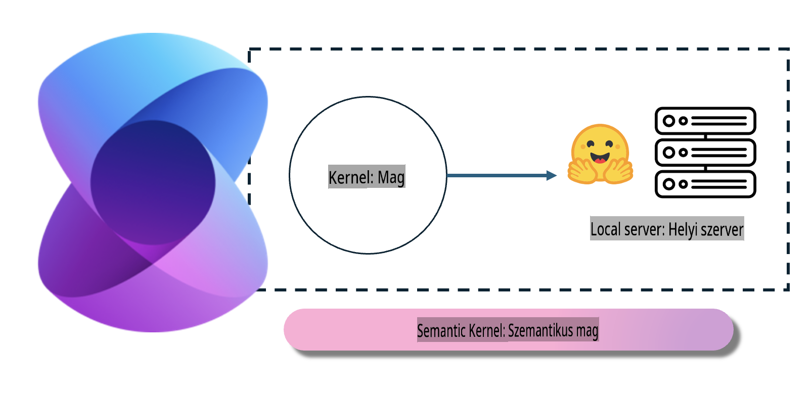
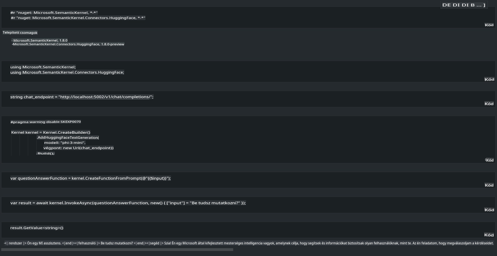

# **Phi-3 Inference egy helyi szerveren**

A Phi-3-at telepíthetjük egy helyi szerverre. A felhasználók választhatják az [Ollama](https://ollama.com) vagy az [LM Studio](https://llamaedge.com) megoldásokat, illetve írhatnak saját kódot is. A Phi-3 helyi szolgáltatásaihoz a [Semantic Kernel](https://github.com/microsoft/semantic-kernel?WT.mc_id=aiml-138114-kinfeylo) vagy a [Langchain](https://www.langchain.com/) segítségével csatlakozhatunk, hogy Copilot alkalmazásokat hozzunk létre.

## **A Phi-3-mini elérése a Semantic Kernel segítségével**

A Copilot alkalmazásban a Semantic Kernel / LangChain használatával készítünk alkalmazásokat. Ez a fajta alkalmazáskeretrendszer általában kompatibilis az Azure OpenAI Service / OpenAI modellekkel, és támogatja a Hugging Face nyílt forráskódú modelleket, valamint a helyi modelleket is. Mit tegyünk, ha a Semantic Kernel segítségével szeretnénk elérni a Phi-3-mini-t? A .NET-et példaként véve kombinálhatjuk azt a Semantic Kernel Hugging Face Connectorával. Alapértelmezetten a Hugging Face-en található modellek azonosítójához kapcsolódik (első használatkor a modellt a rendszer letölti a Hugging Face-ről, ami hosszabb időt vesz igénybe). Csatlakozhatunk a helyben létrehozott szolgáltatáshoz is. A kettő közül az utóbbit javasoljuk, mivel nagyobb önállóságot biztosít, különösen vállalati alkalmazások esetén.

A képen látható, hogy a Semantic Kernel segítségével könnyedén csatlakozhatunk a saját Phi-3-mini modell szerverünkhöz. Íme a futtatási eredmény:

***Minta kód*** https://github.com/kinfey/Phi3MiniSamples/tree/main/semantickernel

**Jogi nyilatkozat**:  
Ez a dokumentum gépi AI fordítószolgáltatások segítségével lett lefordítva. Bár törekszünk a pontosságra, kérjük, vegye figyelembe, hogy az automatikus fordítások hibákat vagy pontatlanságokat tartalmazhatnak. Az eredeti dokumentum az eredeti nyelvén tekintendő hiteles forrásnak. Fontos információk esetén javasolt a professzionális, emberi fordítás igénybevétele. Nem vállalunk felelősséget az ebből a fordításból eredő félreértésekért vagy téves értelmezésekért.