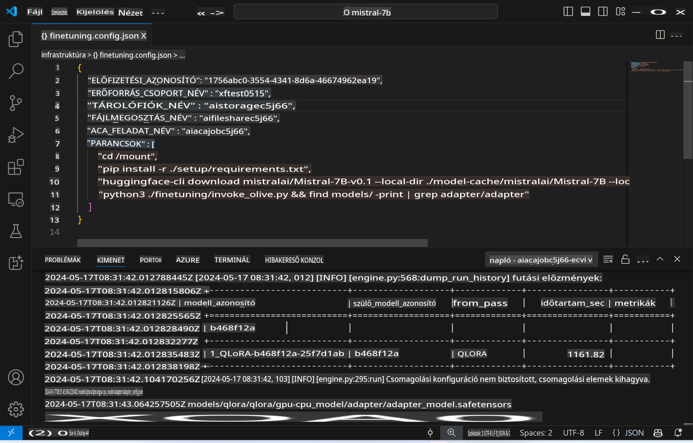
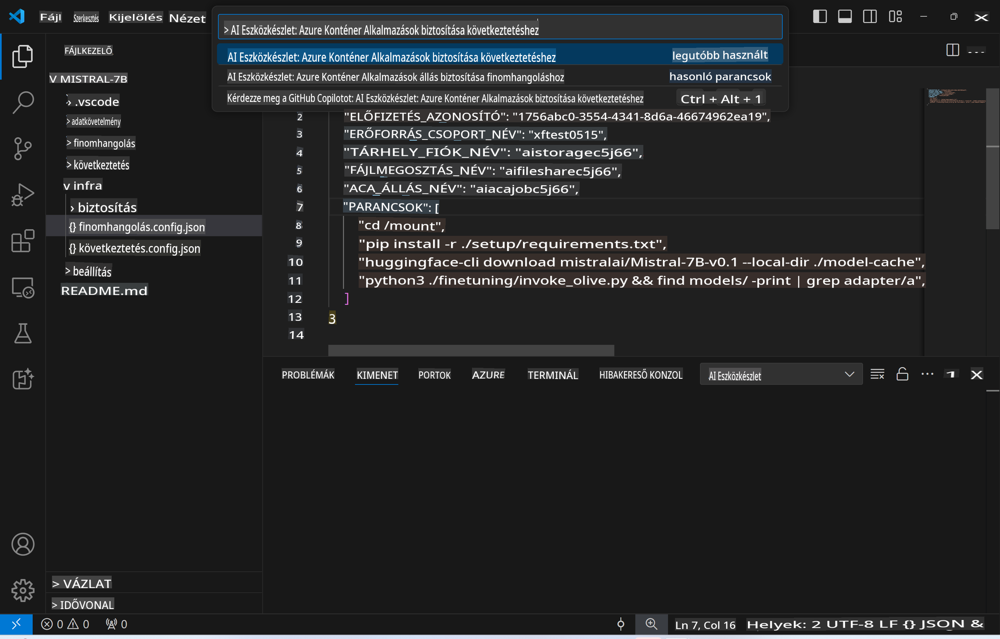
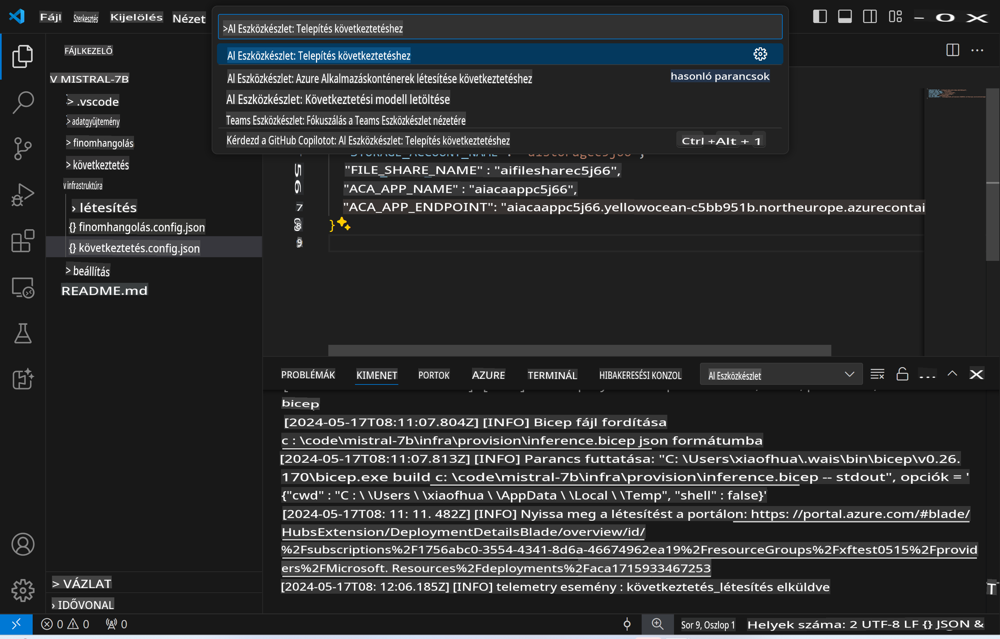
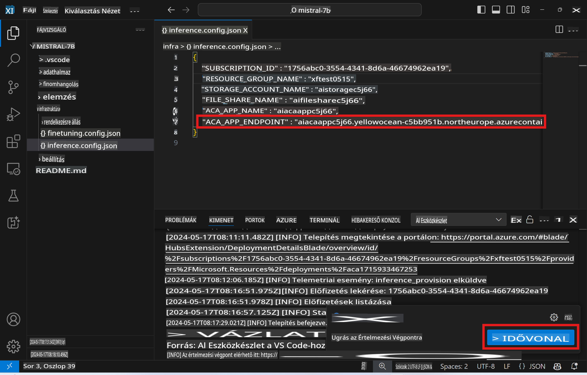

# Távoli Következtetés a finomhangolt modellel

Miután az adapterek a távoli környezetben lettek betanítva, egy egyszerű Gradio alkalmazással léphetsz interakcióba a modellel.



### Azure-erőforrások biztosítása
Az Azure-erőforrások beállításához a távoli következtetéshez hajtsd végre a `AI Toolkit: Provision Azure Container Apps for inference` parancsot a parancspalettáról. A beállítás során ki kell választanod az Azure-előfizetésedet és az erőforráscsoportodat.  


Alapértelmezés szerint a következtetéshez használt előfizetésnek és erőforráscsoportnak meg kell egyeznie a finomhangolás során használtakkal. A következtetés ugyanazt az Azure Container App Environment-et fogja használni, és hozzáfér a finomhangolási lépés során az Azure Files-ban tárolt modellhez és modelladapterhez.

## AI Toolkit használata

### Telepítés következtetéshez  
Ha módosítani szeretnéd a következtetési kódot, vagy újratöltenéd a következtetési modellt, hajtsd végre a `AI Toolkit: Deploy for inference` parancsot. Ez szinkronizálja a legújabb kódodat az ACA-val és újraindítja a replikát.



A telepítés sikeres befejezése után a modell mostantól készen áll az értékelésre ezen az endpointon keresztül.

### A következtetési API elérése

A következtetési API-t elérheted a "*Go to Inference Endpoint*" gombra kattintva, amely a VSCode értesítésben jelenik meg. Alternatívaként a webes API endpoint megtalálható a `ACA_APP_ENDPOINT` alatt, a `./infra/inference.config.json`-ban és a kimeneti panelen.



> **Megjegyzés:** A következtetési végpont teljes működőképessége néhány percet is igénybe vehet.

## A sablonhoz tartozó következtetési komponensek

| Mappa | Tartalom |
| ------ |--------- |
| `infra` | Tartalmazza az összes szükséges konfigurációt a távoli műveletekhez. |
| `infra/provision/inference.parameters.json` | A bicep sablonok paramétereit tartalmazza, amelyeket az Azure-erőforrások biztosításához használnak a következtetéshez. |
| `infra/provision/inference.bicep` | Az Azure-erőforrások biztosítására szolgáló sablonokat tartalmazza a következtetéshez. |
| `infra/inference.config.json` | A `AI Toolkit: Provision Azure Container Apps for inference` parancs által generált konfigurációs fájl. Bemenetként szolgál más távoli parancspalettákhoz. |

### AI Toolkit használata az Azure-erőforrások biztosításának konfigurálásához
Konfiguráld az [AI Toolkit](https://marketplace.visualstudio.com/items?itemName=ms-windows-ai-studio.windows-ai-studio) eszközt.

Azure Container Apps biztosítása következtetéshez ` command.

You can find configuration parameters in `./infra/provision/inference.parameters.json` file. Here are the details:
| Parameter | Description |
| --------- |------------ |
| `defaultCommands` | This is the commands to initiate a web API. |
| `maximumInstanceCount` | This parameter sets the maximum capacity of GPU instances. |
| `location` | This is the location where Azure resources are provisioned. The default value is the same as the chosen resource group's location. |
| `storageAccountName`, `fileShareName` `acaEnvironmentName`, `acaEnvironmentStorageName`, `acaAppName`,  `acaLogAnalyticsName` | These parameters are used to name the Azure resources for provision. By default, they will be same to the fine-tuning resource name. You can input a new, unused resource name to create your own custom-named resources, or you can input the name of an already existing Azure resource if you'd prefer to use that. For details, refer to the section [Using existing Azure Resources](../../../../../md/01.Introduction/03). |

### Using Existing Azure Resources

By default, the inference provision use the same Azure Container App Environment, Storage Account, Azure File Share, and Azure Log Analytics that were used for fine-tuning. A separate Azure Container App is created solely for the inference API. 

If you have customized the Azure resources during the fine-tuning step or want to use your own existing Azure resources for inference, specify their names in the `./infra/inference.parameters.json fájlban. Ezután futtasd a `AI Toolkit: Provision Azure Container Apps for inference` parancsot a parancspalettáról. Ez frissíti a megadott erőforrásokat és létrehozza a hiányzókat.

Például, ha már rendelkezel egy meglévő Azure konténer környezettel, a `./infra/finetuning.parameters.json` fájlodnak így kell kinéznie:

```json
{
    "$schema": "https://schema.management.azure.com/schemas/2019-04-01/deploymentParameters.json#",
    "contentVersion": "1.0.0.0",
    "parameters": {
      ...
      "acaEnvironmentName": {
        "value": "<your-aca-env-name>"
      },
      "acaEnvironmentStorageName": {
        "value": null
      },
      ...
    }
  }
```

### Manuális biztosítás  
Ha inkább manuálisan konfigurálnád az Azure-erőforrásokat, használhatod a `./infra/provision` folders. If you have already set up and configured all the Azure resources without using the AI Toolkit command palette, you can simply enter the resource names in the `inference.config.json` fájlban található bicep fájlokat.

Például:

```json
{
  "SUBSCRIPTION_ID": "<your-subscription-id>",
  "RESOURCE_GROUP_NAME": "<your-resource-group-name>",
  "STORAGE_ACCOUNT_NAME": "<your-storage-account-name>",
  "FILE_SHARE_NAME": "<your-file-share-name>",
  "ACA_APP_NAME": "<your-aca-name>",
  "ACA_APP_ENDPOINT": "<your-aca-endpoint>"
}
```

**Felelősségkizárás**:  
Ez a dokumentum gépi AI fordítási szolgáltatásokkal lett lefordítva. Bár igyekszünk pontosságra törekedni, kérjük, vegye figyelembe, hogy az automatikus fordítások hibákat vagy pontatlanságokat tartalmazhatnak. Az eredeti dokumentum az eredeti nyelvén tekinthető hiteles forrásnak. Kritikus információk esetén javasolt professzionális, emberi fordítást igénybe venni. Nem vállalunk felelősséget az ebből a fordításból eredő félreértésekért vagy téves értelmezésekért.