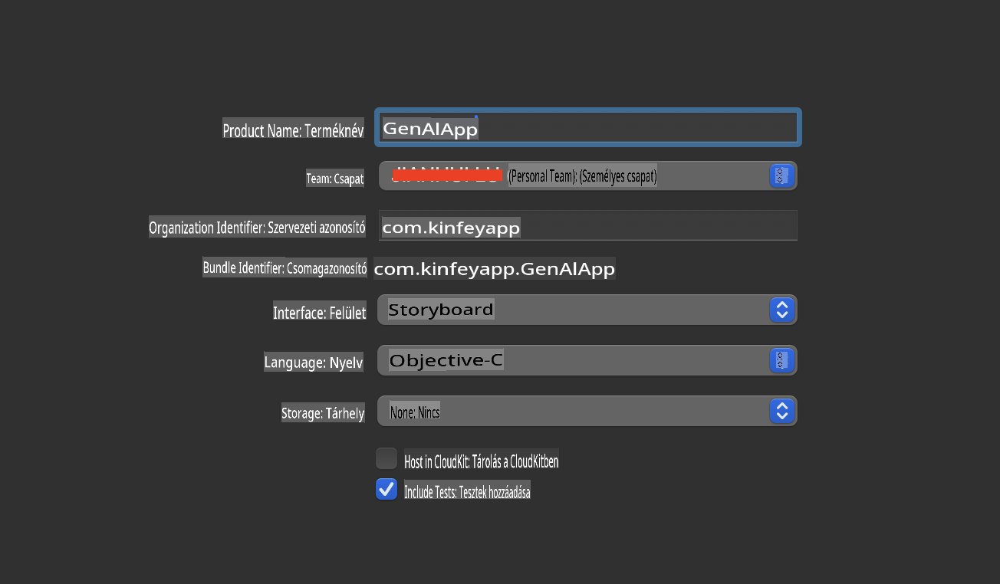
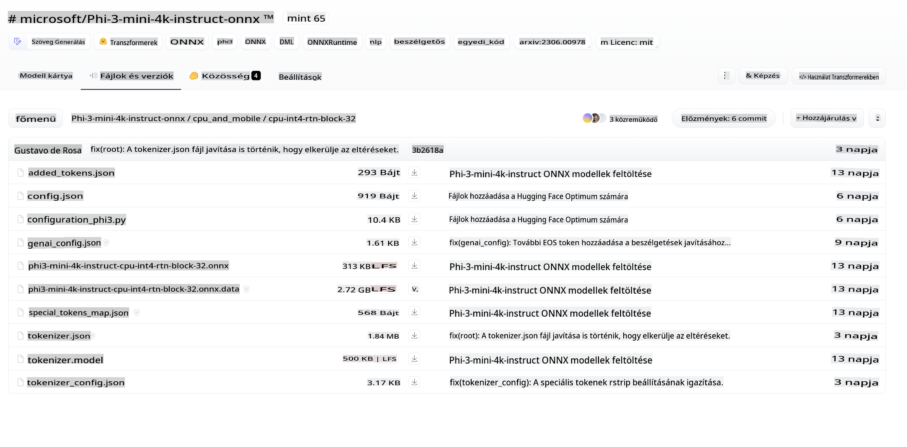
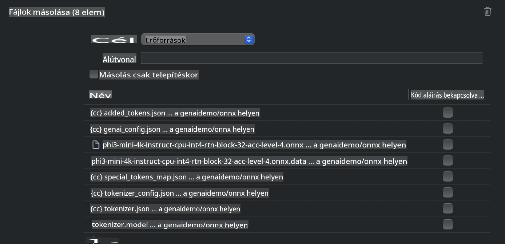
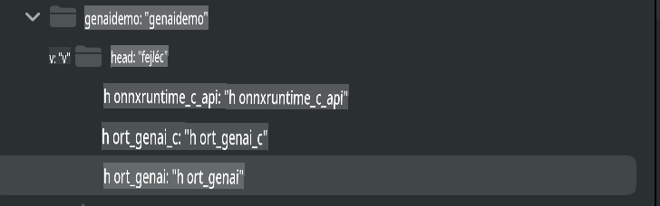
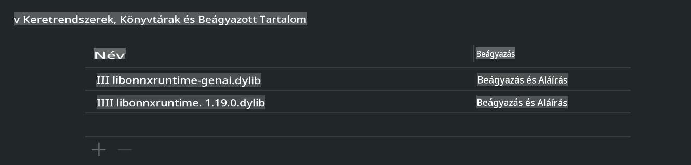
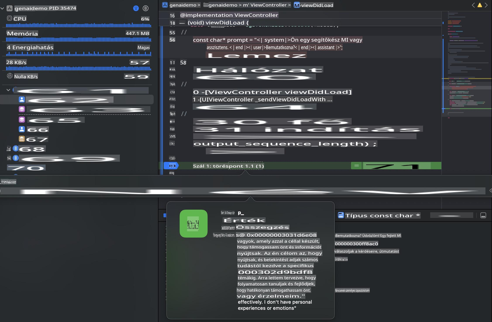

# **Phi-3 inferencia iOS-en**

A Phi-3-mini a Microsoft új modelljeinek sorozata, amely lehetővé teszi Nagy Nyelvi Modellek (LLM-ek) futtatását edge eszközökön és IoT eszközökön. A Phi-3-mini elérhető iOS, Android és edge eszközökön történő telepítéshez, lehetővé téve generatív MI használatát BYOD környezetekben. Az alábbi példa bemutatja, hogyan telepíthető a Phi-3-mini iOS-en.

## **1. Előkészületek**

- **a.** macOS 14 vagy újabb
- **b.** Xcode 15 vagy újabb
- **c.** iOS SDK 17.x (iPhone 14 A16 vagy újabb)
- **d.** Telepítsd a Python 3.10+ verzióját (ajánlott a Conda)
- **e.** Telepítsd a Python könyvtárat: `python-flatbuffers`
- **f.** Telepítsd a CMake-et

### Semantic Kernel és inferencia

A Semantic Kernel egy alkalmazáskeretrendszer, amely lehetővé teszi olyan alkalmazások létrehozását, amelyek kompatibilisek az Azure OpenAI Service-szel, az OpenAI modellekkel és akár helyi modellekkel is. A Semantic Kernel segítségével könnyen integrálhatod a saját üzemeltetésű Phi-3-mini modell szerveredet.

### Kvantált modellek hívása Ollama-val vagy LlamaEdge-dzsel

Sok felhasználó előnyben részesíti a kvantált modellek használatát a modellek helyi futtatásához. Az [Ollama](https://ollama.com) és a [LlamaEdge](https://llamaedge.com) lehetővé teszi különböző kvantált modellek hívását:

#### **Ollama**

Futtathatod közvetlenül az `ollama run phi3` parancsot, vagy konfigurálhatod offline módban. Hozz létre egy Modelfile-t, amely tartalmazza az `gguf` fájl elérési útját. Példa kód a Phi-3-mini kvantált modell futtatásához:

```gguf
FROM {Add your gguf file path}
TEMPLATE \"\"\"<|user|> .Prompt<|end|> <|assistant|>\"\"\"
PARAMETER stop <|end|>
PARAMETER num_ctx 4096
```

#### **LlamaEdge**

Ha szeretnéd az `gguf`-t egyszerre felhőben és edge eszközökön használni, a LlamaEdge kiváló választás.

## **2. ONNX Runtime fordítása iOS-re**

```bash

git clone https://github.com/microsoft/onnxruntime.git

cd onnxruntime

./build.sh --build_shared_lib --ios --skip_tests --parallel --build_dir ./build_ios --ios --apple_sysroot iphoneos --osx_arch arm64 --apple_deploy_target 17.5 --cmake_generator Xcode --config Release

cd ../

```

### **Megjegyzés**

- **a.** Fordítás előtt győződj meg róla, hogy az Xcode megfelelően van konfigurálva, és állítsd be aktív fejlesztői könyvtárként a terminálban:

    ```bash
    sudo xcode-select -switch /Applications/Xcode.app/Contents/Developer
    ```

- **b.** Az ONNX Runtime-ot különböző platformokra kell fordítani. iOS esetében fordítsd `arm64` or `x86_64` platformokra.

- **c.** Ajánlott a legújabb iOS SDK használata a fordításhoz. Ugyanakkor, ha kompatibilitásra van szükség régebbi SDK-kkal, használhatsz régebbi verziókat is.

## **3. Generatív MI fordítása ONNX Runtime-mal iOS-re**

> **Megjegyzés:** Mivel a Generatív MI ONNX Runtime-mal előzetes verzióban érhető el, előfordulhatnak változások.

```bash

git clone https://github.com/microsoft/onnxruntime-genai
 
cd onnxruntime-genai
 
mkdir ort
 
cd ort
 
mkdir include
 
mkdir lib
 
cd ../
 
cp ../onnxruntime/include/onnxruntime/core/session/onnxruntime_c_api.h ort/include
 
cp ../onnxruntime/build_ios/Release/Release-iphoneos/libonnxruntime*.dylib* ort/lib
 
export OPENCV_SKIP_XCODEBUILD_FORCE_TRYCOMPILE_DEBUG=1
 
python3 build.py --parallel --build_dir ./build_ios --ios --ios_sysroot iphoneos --ios_arch arm64 --ios_deployment_target 17.5 --cmake_generator Xcode --cmake_extra_defines CMAKE_XCODE_ATTRIBUTE_CODE_SIGNING_ALLOWED=NO

```

## **4. App alkalmazás létrehozása Xcode-ban**

Az Objective-C-t választottam az alkalmazás fejlesztési módszerének, mivel a Generatív MI ONNX Runtime C++ API-jával az Objective-C jobban kompatibilis. Természetesen a kapcsolódó hívásokat Swift bridging segítségével is megvalósíthatod.



## **5. Az ONNX kvantált INT4 modell másolása az App projektbe**

Be kell importálnunk az ONNX formátumú INT4 kvantálási modellt, amelyet először le kell tölteni.



Letöltés után hozzá kell adni az Xcode projekt Resources könyvtárához.



## **6. A C++ API hozzáadása a ViewController-ekhez**

> **Megjegyzés:**

- **a.** Add hozzá a megfelelő C++ fejlécfájlokat a projekthez.

  

- **b.** Tartalmazd az `onnxruntime-genai` dynamic library in Xcode.

  

- **c.** Use the C Samples code for testing. You can also add additional features like ChatUI for more functionality.

- **d.** Since you need to use C++ in your project, rename `ViewController.m` to `ViewController.mm` fájlokat az Objective-C++ támogatás engedélyezéséhez.

```objc

    NSString *llmPath = [[NSBundle mainBundle] resourcePath];
    char const *modelPath = llmPath.cString;

    auto model =  OgaModel::Create(modelPath);

    auto tokenizer = OgaTokenizer::Create(*model);

    const char* prompt = "<|system|>You are a helpful AI assistant.<|end|><|user|>Can you introduce yourself?<|end|><|assistant|>";

    auto sequences = OgaSequences::Create();
    tokenizer->Encode(prompt, *sequences);

    auto params = OgaGeneratorParams::Create(*model);
    params->SetSearchOption("max_length", 100);
    params->SetInputSequences(*sequences);

    auto output_sequences = model->Generate(*params);
    const auto output_sequence_length = output_sequences->SequenceCount(0);
    const auto* output_sequence_data = output_sequences->SequenceData(0);
    auto out_string = tokenizer->Decode(output_sequence_data, output_sequence_length);
    
    auto tmp = out_string;

```

## **7. Az alkalmazás futtatása**

A beállítások elvégzése után futtathatod az alkalmazást, hogy megtekintsd a Phi-3-mini modell inferencia eredményeit.



További példakódokért és részletes utasításokért látogass el a [Phi-3 Mini Samples repository](https://github.com/Azure-Samples/Phi-3MiniSamples/tree/main/ios) oldalára.

**Felelősségkizárás**:  
Ez a dokumentum gépi AI fordítási szolgáltatások segítségével került lefordításra. Bár törekszünk a pontosságra, kérjük, vegye figyelembe, hogy az automatikus fordítások hibákat vagy pontatlanságokat tartalmazhatnak. Az eredeti dokumentum az eredeti nyelvén tekintendő hiteles forrásnak. Fontos információk esetén javasolt professzionális emberi fordítást igénybe venni. Nem vállalunk felelősséget a fordítás használatából eredő félreértésekért vagy téves értelmezésekért.