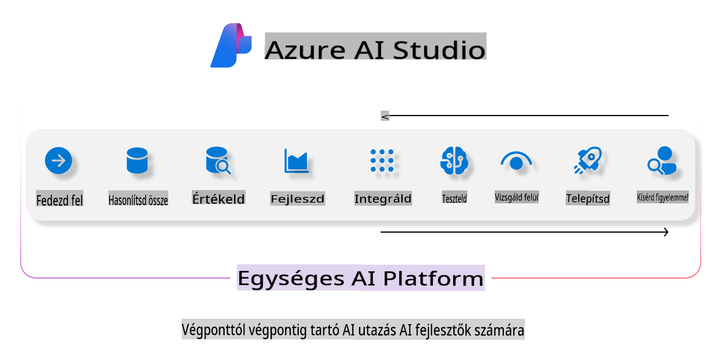

# **Azure AI Foundry használata az értékeléshez**

Hogyan értékelheted a generatív AI alkalmazásodat az [Azure AI Foundry](https://ai.azure.com?WT.mc_id=aiml-138114-kinfeylo) segítségével. Legyen szó akár egyszerű, egyfordulós, akár összetettebb, többlépéses beszélgetésekről, az Azure AI Foundry eszközöket biztosít a modellek teljesítményének és biztonságának értékeléséhez.

## Hogyan értékeljük a generatív AI alkalmazásokat az Azure AI Foundry segítségével
További részletes útmutatást a [Azure AI Foundry dokumentációban](https://learn.microsoft.com/azure/ai-studio/how-to/evaluate-generative-ai-app?WT.mc_id=aiml-138114-kinfeylo) találhatsz.

Az indulás lépései a következők:

## Generatív AI modellek értékelése az Azure AI Foundry-ban

**Előfeltételek**

- Egy tesztadatkészlet CSV vagy JSON formátumban.
- Egy telepített generatív AI modell (például Phi-3, GPT 3.5, GPT 4 vagy Davinci modellek).
- Egy futtatási környezet számítási erőforrással az értékeléshez.

## Beépített értékelési metrikák

Az Azure AI Foundry lehetővé teszi az egyszerű, egyfordulós és az összetettebb, többlépéses beszélgetések értékelését.
Retrieval Augmented Generation (RAG) forgatókönyvek esetében, ahol a modell konkrét adatokra támaszkodik, beépített értékelési metrikák segítségével mérheted a teljesítményt.
Ezenkívül általános, egyfordulós kérdés-válasz forgatókönyveket is értékelhetsz (nem RAG).

## Értékelési futtatás létrehozása

Az Azure AI Foundry felületén navigálj az Evaluate vagy a Prompt Flow oldalra.
Kövesd az értékelési varázslót az értékelési futtatás beállításához. Adj meg egy opcionális nevet az értékelésednek.
Válaszd ki azt a forgatókönyvet, amely a legjobban illeszkedik az alkalmazásod céljaihoz.
Válassz egy vagy több értékelési metrikát a modell kimenetének értékeléséhez.

## Egyedi értékelési folyamat (opcionális)

A nagyobb rugalmasság érdekében létrehozhatsz egy egyedi értékelési folyamatot. Testreszabhatod az értékelési folyamatot a saját igényeid alapján.

## Eredmények megtekintése

Az értékelés futtatása után naplózd, tekintsd meg és elemezd az értékelési metrikák részleteit az Azure AI Foundry-ban. Szerezz betekintést az alkalmazásod képességeibe és korlátaiba.

**Megjegyzés** Az Azure AI Foundry jelenleg nyilvános előzetes verzióban érhető el, ezért kísérleti és fejlesztési célokra használd. Termelési munkaterhelések esetén fontold meg más lehetőségeket. További részletekért és lépésről lépésre szóló útmutatókért tekintsd meg az [AI Foundry hivatalos dokumentációját](https://learn.microsoft.com/azure/ai-studio/?WT.mc_id=aiml-138114-kinfeylo).

**Felelősségkizárás**:  
Ez a dokumentum gépi AI fordítószolgáltatások segítségével került lefordításra. Bár törekszünk a pontosságra, kérjük, vegye figyelembe, hogy az automatikus fordítások hibákat vagy pontatlanságokat tartalmazhatnak. Az eredeti dokumentum az anyanyelvén tekintendő hiteles forrásnak. Fontos információk esetén javasolt professzionális emberi fordítást igénybe venni. Nem vállalunk felelősséget a fordítás használatából eredő félreértésekért vagy téves értelmezésekért.