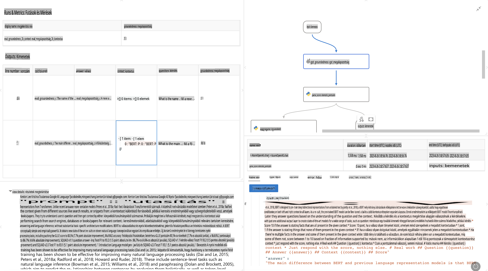

# **Bevezetés a Prompt Flow-ba**

A [Microsoft Prompt Flow](https://microsoft.github.io/promptflow/index.html?WT.mc_id=aiml-138114-kinfeylo) egy vizuális munkafolyamat-automatizálási eszköz, amely lehetővé teszi a felhasználók számára, hogy előre elkészített sablonok és egyéni csatlakozók segítségével automatizált munkafolyamatokat hozzanak létre. Az eszközt arra tervezték, hogy a fejlesztők és üzleti elemzők gyorsan építhessenek automatizált folyamatokat olyan feladatokhoz, mint az adatkezelés, együttműködés és folyamatoptimalizálás. A Prompt Flow segítségével egyszerűen összekapcsolhatók különböző szolgáltatások, alkalmazások és rendszerek, valamint automatizálhatók összetett üzleti folyamatok.

A Microsoft Prompt Flow célja, hogy egyszerűsítse a Nagy Nyelvi Modellek (LLM-ek) által működtetett mesterséges intelligencia alkalmazások fejlesztési ciklusát az elejétől a végéig. Akár ötletelésről, prototípus készítésről, tesztelésről, értékelésről vagy bevezetésről van szó, a Prompt Flow leegyszerűsíti a folyamatot, és lehetővé teszi, hogy gyártási minőségű LLM-alkalmazásokat hozz létre.

## A Microsoft Prompt Flow használatának főbb jellemzői és előnyei:

**Interaktív szerkesztési élmény**

A Prompt Flow vizuális ábrázolást nyújt a munkafolyamat szerkezetéről, megkönnyítve a projektek megértését és navigálását.  
Jegyzetfüzet-szerű kódolási élményt kínál a hatékony fejlesztéshez és hibakereséshez.

**Prompt variációk és finomhangolás**

Hozz létre és hasonlíts össze többféle prompt-variációt az iteratív finomítás érdekében.  
Értékeld a különböző promtok teljesítményét, és válaszd ki a leghatékonyabbakat.

**Beépített értékelési folyamatok**

Értékeld a promtok és munkafolyamatok minőségét és hatékonyságát a beépített értékelési eszközökkel.  
Értsd meg, mennyire jól teljesítenek az LLM-alapú alkalmazásaid.

**Átfogó erőforrások**

A Prompt Flow könyvtárat tartalmaz beépített eszközökkel, példákkal és sablonokkal.  
Ezek az erőforrások kiindulópontként szolgálnak a fejlesztéshez, inspirálják a kreativitást és felgyorsítják a folyamatot.

**Együttműködés és vállalati szintű készenlét**

Támogasd a csapatmunkát azáltal, hogy több felhasználó is együtt dolgozhat a prompt-alkotási projekteken.  
Tartsd fenn a verziókezelést, és oszd meg hatékonyan a tudást.  
Egyszerűsítsd az egész prompt-alkotási folyamatot, a fejlesztéstől és értékeléstől kezdve a bevezetésig és monitorozásig.

## Értékelés a Prompt Flow-ban

A Microsoft Prompt Flow-ban az értékelés kulcsszerepet játszik abban, hogy felmérd, mennyire jól teljesítenek az AI-modelleid. Nézzük meg, hogyan testreszabhatók az értékelési folyamatok és metrikák a Prompt Flow-ban:

**Az értékelés megértése a Prompt Flow-ban**

A Prompt Flow-ban egy munkafolyamat olyan csomópontok sorozatát képviseli, amelyek bemeneteket dolgoznak fel és kimeneteket generálnak. Az értékelési folyamatok olyan speciális munkafolyamatok, amelyek célja, hogy meghatározott kritériumok és célok alapján értékeljék egy futtatás teljesítményét.

**Az értékelési folyamatok kulcsfontosságú jellemzői**

Általában a tesztelt munkafolyamat után futnak, annak kimeneteit felhasználva.  
Pontszámokat vagy metrikákat számítanak ki a tesztelt munkafolyamat teljesítményének mérésére.  
A metrikák lehetnek például pontosság, relevancia pontszámok vagy bármely más releváns mérőszám.

### Értékelési folyamatok testreszabása

**Bemenetek meghatározása**

Az értékelési folyamatoknak be kell fogadniuk a tesztelt futtatás kimeneteit. A bemeneteket a szokásos munkafolyamatokhoz hasonlóan kell meghatározni.  
Például, ha egy QnA munkafolyamatot értékelsz, nevezd el a bemenetet "answer"-nek. Ha egy osztályozási munkafolyamatot értékelsz, nevezd el "category"-nak. Szükség lehet referenciaértékekre is (pl. tényleges címkék).

**Kimenetek és metrikák**

Az értékelési folyamatok olyan eredményeket állítanak elő, amelyek mérik a tesztelt munkafolyamat teljesítményét.  
A metrikák kiszámításához használhatsz Python-t vagy LLM-et (Nagy Nyelvi Modellek).  
Használd a log_metric() függvényt a releváns metrikák naplózására.

**Testreszabott értékelési folyamatok használata**

Fejlessz saját értékelési folyamatot, amely igazodik a konkrét feladataidhoz és céljaidhoz.  
Szabd testre a metrikákat az értékelési céljaid alapján.  
Alkalmazd ezt a testreszabott értékelési folyamatot kötegelt futtatásokra nagyszabású teszteléshez.

## Beépített értékelési módszerek

A Prompt Flow beépített értékelési módszereket is kínál.  
Küldj be kötegelt futtatásokat, és használd ezeket a módszereket annak értékelésére, hogy mennyire jól teljesít a munkafolyamat nagy adathalmazokon.  
Tekintsd meg az értékelési eredményeket, hasonlítsd össze a metrikákat, és iterálj szükség szerint.  
Ne feledd, az értékelés elengedhetetlen ahhoz, hogy az AI-modellek megfeleljenek a kívánt kritériumoknak és céloknak.  
Nézd meg a hivatalos dokumentációt, amely részletes utasításokat nyújt az értékelési folyamatok fejlesztéséhez és használatához a Microsoft Prompt Flow-ban.

Összefoglalva, a Microsoft Prompt Flow lehetőséget ad a fejlesztőknek arra, hogy magas minőségű LLM-alkalmazásokat hozzanak létre azáltal, hogy egyszerűsíti a prompt-alkotást és egy robusztus fejlesztési környezetet biztosít. Ha LLM-ekkel dolgozol, a Prompt Flow egy értékes eszköz, amelyet érdemes felfedezni. Fedezd fel a [Prompt Flow Értékelési Dokumentumokat](https://learn.microsoft.com/azure/machine-learning/prompt-flow/how-to-develop-an-evaluation-flow?view=azureml-api-2?WT.mc_id=aiml-138114-kinfeylo), hogy részletes utasításokat kapj az értékelési folyamatok fejlesztéséről és használatáról a Microsoft Prompt Flow-ban.

**Felelősségkizárás**:  
Ez a dokumentum gépi AI fordítószolgáltatások segítségével készült. Bár törekszünk a pontosságra, kérjük, vegye figyelembe, hogy az automatikus fordítások hibákat vagy pontatlanságokat tartalmazhatnak. Az eredeti dokumentum az eredeti nyelvén tekintendő hiteles forrásnak. Fontos információk esetén javasolt a professzionális emberi fordítás igénybevétele. Nem vállalunk felelősséget az ebből a fordításból eredő félreértésekért vagy téves értelmezésekért.