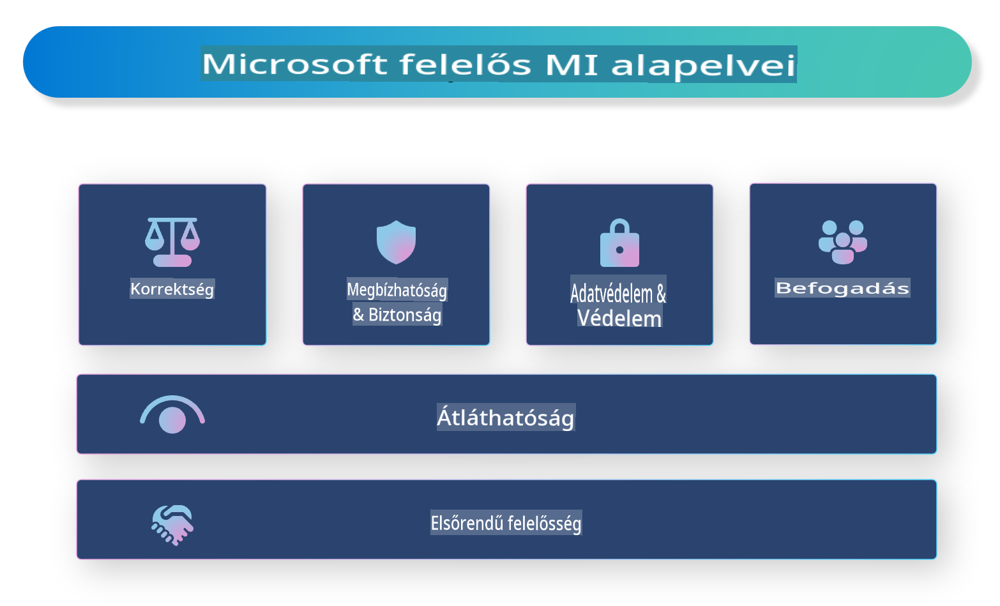

# **Felelős MI bemutatása**

A [Microsoft Felelős MI](https://www.microsoft.com/ai/responsible-ai?WT.mc_id=aiml-138114-kinfeylo) egy olyan kezdeményezés, amelynek célja, hogy segítse a fejlesztőket és szervezeteket átlátható, megbízható és felelősségteljes MI-rendszerek létrehozásában. A kezdeményezés útmutatást és erőforrásokat nyújt olyan felelős MI-megoldások fejlesztéséhez, amelyek etikai alapelvekkel, például adatvédelemmel, méltányossággal és átláthatósággal összhangban állnak. Emellett megvizsgáljuk a felelős MI-rendszerek építésével kapcsolatos kihívásokat és bevált gyakorlatokat is.

## A Microsoft Felelős MI áttekintése

**Etikai alapelvek**

A Microsoft Felelős MI-t olyan etikai alapelvek vezérlik, mint az adatvédelem, méltányosság, átláthatóság, elszámoltathatóság és biztonság. Ezek az alapelvek biztosítják, hogy az MI-rendszerek etikus és felelősségteljes módon kerüljenek kifejlesztésre.

**Átlátható MI**

A Microsoft Felelős MI kiemeli az átláthatóság fontosságát az MI-rendszerekben. Ez magában foglalja az MI-modellek működésének egyértelmű magyarázatát, valamint az adatforrások és algoritmusok nyilvánosságra hozatalát.

**Elszámoltatható MI**

A [Microsoft Felelős MI](https://www.microsoft.com/ai/responsible-ai?WT.mc_id=aiml-138114-kinfeylo) támogatja az elszámoltatható MI-rendszerek fejlesztését, amelyek betekintést nyújtanak abba, hogyan hoznak döntéseket az MI-modellek. Ez segíthet a felhasználóknak megérteni és megbízni az MI-rendszerek eredményeiben.

**Befogadás**

Az MI-rendszereket úgy kell tervezni, hogy mindenki számára előnyösek legyenek. A Microsoft célja olyan befogadó MI létrehozása, amely figyelembe veszi a különböző nézőpontokat, és elkerüli az elfogultságot vagy diszkriminációt.

**Megbízhatóság és biztonság**

Az MI-rendszerek megbízhatóságának és biztonságának biztosítása alapvető fontosságú. A Microsoft a robusztus modellek építésére összpontosít, amelyek következetesen teljesítenek, és elkerülik a káros kimeneteleket.

**Méltányosság az MI-ben**

A Microsoft Felelős MI felismeri, hogy az MI-rendszerek elfogultságot hordozhatnak, ha elfogult adatokon vagy algoritmusokon alapulnak. A kezdeményezés útmutatást nyújt a méltányos MI-rendszerek fejlesztéséhez, amelyek nem diszkriminálnak például faj, nem vagy életkor alapján.

**Adatvédelem és biztonság**

A Microsoft Felelős MI hangsúlyozza a felhasználói adatvédelem és adatbiztonság fontosságát az MI-rendszerekben. Ez magában foglalja az erős adat titkosítást és hozzáférés-vezérlést, valamint az MI-rendszerek rendszeres biztonsági auditját.

**Elszámoltathatóság és felelősség**

A Microsoft Felelős MI előmozdítja az elszámoltathatóságot és felelősséget az MI fejlesztésében és bevezetésében. Ez magában foglalja annak biztosítását, hogy a fejlesztők és szervezetek tisztában legyenek az MI-rendszerekhez kapcsolódó potenciális kockázatokkal, és tegyenek lépéseket azok mérséklésére.

## Bevált gyakorlatok felelős MI-rendszerek építéséhez

**MI-modellek fejlesztése sokszínű adathalmazok felhasználásával**

Az MI-rendszerek elfogultságának elkerülése érdekében fontos, hogy olyan sokszínű adathalmazokat használjunk, amelyek különböző nézőpontokat és tapasztalatokat képviselnek.

**Magyarázható MI-technikák alkalmazása**

A magyarázható MI-technikák segíthetnek a felhasználóknak megérteni, hogyan hoznak döntéseket az MI-modellek, ami növelheti a rendszer iránti bizalmat.

**Az MI-rendszerek rendszeres auditálása a sebezhetőségek szempontjából**

Az MI-rendszerek rendszeres auditálása segíthet azonosítani azokat a potenciális kockázatokat és sebezhetőségeket, amelyeket kezelni kell.

**Erős adat titkosítás és hozzáférés-vezérlés megvalósítása**

Az adat titkosítás és hozzáférés-vezérlés segíthet megvédeni a felhasználói adatokat és biztonságot az MI-rendszerekben.

**Etikai alapelvek követése az MI-fejlesztésben**

Az etikai alapelvek, például a méltányosság, átláthatóság és elszámoltathatóság követése segíthet az MI-rendszerekbe vetett bizalom kiépítésében, és biztosítja, hogy azokat felelősségteljes módon fejlesszék.

## AI Foundry használata a Felelős MI érdekében

[Azure AI Foundry](https://ai.azure.com?WT.mc_id=aiml-138114-kinfeylo) egy erőteljes platform, amely lehetővé teszi a fejlesztők és szervezetek számára, hogy gyorsan hozzanak létre intelligens, innovatív, piacképes és felelősségteljes alkalmazásokat. Az Azure AI Foundry néhány kulcsfontosságú funkciója és képessége:

**Előre elkészített API-k és modellek**

Az Azure AI Foundry előre elkészített és testreszabható API-kat és modelleket biztosít. Ezek széles körű MI-feladatokat fednek le, beleértve a generatív MI-t, a beszélgetések természetes nyelvfeldolgozását, keresést, monitorozást, fordítást, beszédet, látást és döntéshozatalt.

**Prompt Flow**

Az Azure AI Foundry prompt flow funkciója lehetővé teszi beszélgető MI-élmények létrehozását. Ez lehetőséget ad beszélgetési folyamatok tervezésére és kezelésére, megkönnyítve chatbotok, virtuális asszisztensek és más interaktív alkalmazások fejlesztését.

**Retrieval Augmented Generation (RAG)**

A RAG egy olyan technika, amely ötvözi a visszakeresés-alapú és generatív megközelítéseket. Ez javítja a generált válaszok minőségét azáltal, hogy egyszerre használja a meglévő tudást (visszakeresés) és a kreatív generálást (generálás).

**Generatív MI értékelési és monitorozási metrikák**

Az Azure AI Foundry eszközöket biztosít a generatív MI-modellek értékeléséhez és monitorozásához. Értékelheti a teljesítményüket, méltányosságukat és más fontos mutatókat a felelős bevezetés érdekében. Továbbá, ha már létrehozott egy irányítópultot, az Azure Machine Learning Studio kód nélküli felhasználói felületét használhatja a Responsible AI Dashboard és a hozzá tartozó pontozótábla testreszabására és generálására a [Responsible AI Toolbox](https://responsibleaitoolbox.ai/?WT.mc_id=aiml-138114-kinfeylo) Python könyvtárak alapján. Ez a pontozótábla segít megosztani a méltányossággal, jellemzők fontosságával és más felelős bevezetési szempontokkal kapcsolatos kulcsfontosságú betekintéseket technikai és nem technikai érintettekkel egyaránt.

A Felelős MI megvalósításához az AI Foundry használatával az alábbi bevált gyakorlatokat követheti:

**Határozza meg az MI-rendszer problémáját és céljait**

Mielőtt elkezdené a fejlesztési folyamatot, fontos, hogy egyértelműen meghatározza az MI-rendszer által megoldandó problémát vagy célt. Ez segít azonosítani az adatokat, algoritmusokat és erőforrásokat, amelyek szükségesek egy hatékony modell létrehozásához.

**Gyűjtsön és előfeldolgozza a releváns adatokat**

Az MI-rendszerek teljesítményére jelentős hatással van a használt adatok minősége és mennyisége. Ezért fontos releváns adatokat gyűjteni, tisztítani, előfeldolgozni, és biztosítani, hogy azok reprezentálják a megoldandó problémát vagy populációt.

**Válasszon megfelelő értékelési módszert**

Számos értékelési algoritmus érhető el. Fontos, hogy az adatokhoz és a problémához legjobban illeszkedő algoritmust válassza.

**Értékelje és értelmezze a modellt**

Miután létrehozott egy MI-modellt, fontos, hogy megfelelő metrikák segítségével értékelje annak teljesítményét, és átlátható módon értelmezze az eredményeket. Ez segít azonosítani az esetleges elfogultságokat vagy korlátokat a modellben, és javításokat végezni, ahol szükséges.

**Biztosítsa az átláthatóságot és magyarázhatóságot**

Az MI-rendszereknek átláthatónak és magyarázhatónak kell lenniük, hogy a felhasználók megérthessék, hogyan működnek, és hogyan hoznak döntéseket. Ez különösen fontos olyan alkalmazások esetében, amelyek jelentős hatással vannak az emberi életekre, például az egészségügyben, pénzügyekben és jogi rendszerekben.

**Figyelje és frissítse a modellt**

Az MI-rendszereket folyamatosan figyelemmel kell kísérni és frissíteni annak érdekében, hogy idővel is pontosak és hatékonyak maradjanak. Ez folyamatos karbantartást, tesztelést és a modell újratanítását igényli.

Összefoglalva, a Microsoft Felelős MI egy olyan kezdeményezés, amely segíti a fejlesztőket és szervezeteket átlátható, megbízható és elszámoltatható MI-rendszerek létrehozásában. Ne feledje, hogy a felelős MI megvalósítása elengedhetetlen, és az Azure AI Foundry célja, hogy ezt gyakorlati szinten is megvalósíthatóvá tegye a szervezetek számára. Az etikai alapelvek és bevált gyakorlatok követésével biztosíthatjuk, hogy az MI-rendszerek felelősségteljes módon kerüljenek fejlesztésre és bevezetésre, és a társadalom egészének javát szolgálják.

**Felelősségkizárás**:  
Ez a dokumentum gépi AI fordítási szolgáltatásokkal készült. Bár törekszünk a pontosságra, kérjük, vegye figyelembe, hogy az automatikus fordítások hibákat vagy pontatlanságokat tartalmazhatnak. Az eredeti dokumentum az eredeti nyelvén tekintendő hiteles forrásnak. Kritikus információk esetén javasolt professzionális, emberi fordítás igénybevétele. Nem vállalunk felelősséget a fordítás használatából eredő félreértésekért vagy téves értelmezésekért.