# A Phi-3 / Phi-3.5 modell finomhangolásának értékelése az Azure AI Foundry-ban a Microsoft Felelős AI alapelveire összpontosítva

Ez az end-to-end (E2E) példa a "[Phi-3 / 3.5 modellek értékelése az Azure AI Foundry-ban a Microsoft Felelős AI alapelveire összpontosítva](https://techcommunity.microsoft.com/t5/educator-developer-blog/evaluate-fine-tuned-phi-3-3-5-models-in-azure-ai-studio-focusing/ba-p/4227850?WT.mc_id=aiml-137032-kinfeylo)" című útmutatón alapul, amely elérhető a Microsoft Tech Community oldalán.

## Áttekintés

### Hogyan értékelheted a finomhangolt Phi-3 / Phi-3.5 modell biztonságát és teljesítményét az Azure AI Foundry-ban?

A modellek finomhangolása néha nem kívánt vagy nem szándékos válaszokhoz vezethet. Annak érdekében, hogy a modell biztonságos és hatékony maradjon, fontos értékelni a modell képességét káros tartalmak generálására, valamint az általa előállított válaszok pontosságát, relevanciáját és koherenciáját. Ebben az útmutatóban megtanulod, hogyan értékeld a finomhangolt Phi-3 / Phi-3.5 modell biztonságát és teljesítményét, amely integrálva van az Azure AI Foundry Prompt flow funkciójával.

Íme az Azure AI Foundry értékelési folyamata.

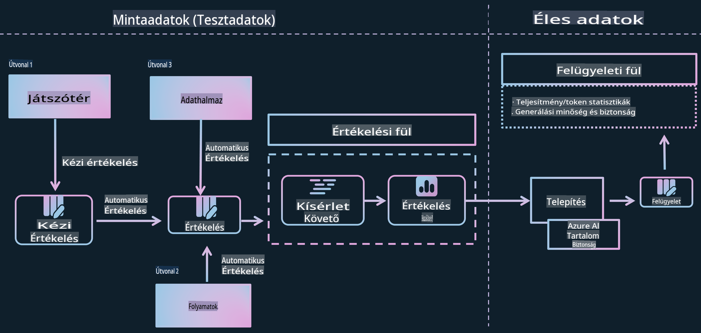

*Kép forrása: [Generatív AI alkalmazások értékelése](https://learn.microsoft.com/azure/ai-studio/concepts/evaluation-approach-gen-ai?wt.mc_id%3Dstudentamb_279723)*

> [!NOTE]
>
> További részletekért és a Phi-3 / Phi-3.5 modellekről szóló kiegészítő forrásokért látogass el a [Phi-3CookBook](https://github.com/microsoft/Phi-3CookBook?wt.mc_id=studentamb_279723) oldalára.

### Előfeltételek

- [Python](https://www.python.org/downloads)
- [Azure-előfizetés](https://azure.microsoft.com/free?wt.mc_id=studentamb_279723)
- [Visual Studio Code](https://code.visualstudio.com)
- Finomhangolt Phi-3 / Phi-3.5 modell

### Tartalomjegyzék

1. [**Forgatókönyv 1: Bevezetés az Azure AI Foundry Prompt flow értékelésébe**](../../../../../../md/02.Application/01.TextAndChat/Phi3)

    - [Bevezetés a biztonsági értékelésbe](../../../../../../md/02.Application/01.TextAndChat/Phi3)
    - [Bevezetés a teljesítményértékelésbe](../../../../../../md/02.Application/01.TextAndChat/Phi3)

1. [**Forgatókönyv 2: A Phi-3 / Phi-3.5 modell értékelése az Azure AI Foundry-ban**](../../../../../../md/02.Application/01.TextAndChat/Phi3)

    - [Kezdés előtt](../../../../../../md/02.Application/01.TextAndChat/Phi3)
    - [Azure OpenAI telepítése a Phi-3 / Phi-3.5 modell értékeléséhez](../../../../../../md/02.Application/01.TextAndChat/Phi3)
    - [A finomhangolt Phi-3 / Phi-3.5 modell értékelése az Azure AI Foundry Prompt flow funkciójával](../../../../../../md/02.Application/01.TextAndChat/Phi3)

1. [Gratulálunk!](../../../../../../md/02.Application/01.TextAndChat/Phi3)

## **Forgatókönyv 1: Bevezetés az Azure AI Foundry Prompt flow értékelésébe**

### Bevezetés a biztonsági értékelésbe

Azért, hogy az AI modelled etikus és biztonságos legyen, elengedhetetlen, hogy azt a Microsoft Felelős AI alapelvei alapján értékeld. Az Azure AI Foundry-ban a biztonsági értékelések lehetővé teszik, hogy a modelledet teszteld a jailbreak támadásokkal szembeni sérülékenységére és káros tartalmak generálásának lehetőségére, ami közvetlenül összhangban áll ezekkel az alapelvekkel.

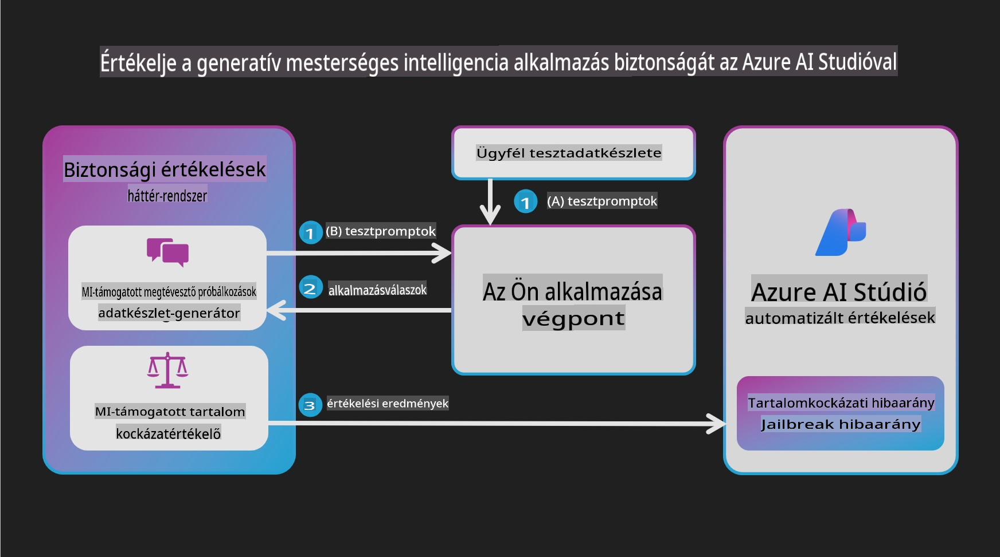

*Kép forrása: [Generatív AI alkalmazások értékelése](https://learn.microsoft.com/azure/ai-studio/concepts/evaluation-approach-gen-ai?wt.mc_id%3Dstudentamb_279723)*

#### A Microsoft Felelős AI alapelvei

Mielőtt elkezdenéd a technikai lépéseket, fontos megérteni a Microsoft Felelős AI alapelveit, amelyek egy etikai keretet biztosítanak az AI rendszerek felelős fejlesztéséhez, telepítéséhez és működtetéséhez. Ezek az alapelvek biztosítják, hogy az AI technológiák igazságosak, átláthatóak és befogadóak legyenek. Ezek az alapelvek képezik az AI modellek biztonságának értékelésének alapját.

A Microsoft Felelős AI alapelvei a következők:

- **Igazságosság és befogadás**: Az AI rendszereknek mindenkivel igazságosan kell bánniuk, és el kell kerülniük, hogy hasonló helyzetben lévő csoportokat eltérően kezeljenek. Például, ha az AI rendszerek orvosi kezelési tanácsokat, hitelkérelmeket vagy állásajánlatokat nyújtanak, ugyanazokat az ajánlásokat kell tenniük mindenkinek, aki hasonló tünetekkel, pénzügyi helyzettel vagy szakmai képesítéssel rendelkezik.

- **Megbízhatóság és biztonság**: A bizalom kiépítése érdekében kulcsfontosságú, hogy az AI rendszerek megbízhatóan, biztonságosan és következetesen működjenek. Ezeknek a rendszereknek képesnek kell lenniük az eredeti tervek szerint működni, biztonságosan reagálni a váratlan helyzetekre, és ellenállni a káros manipulációknak.

- **Átláthatóság**: Amikor az AI rendszerek olyan döntéseket segítenek elő, amelyek nagy hatással vannak az emberek életére, elengedhetetlen, hogy az emberek megértsék, hogyan születtek ezek a döntések. Például egy bank AI rendszert használhat annak eldöntésére, hogy valaki hitelképes-e.

- **Adatvédelem és biztonság**: Az AI elterjedésével az adatvédelem és az információbiztonság egyre fontosabbá és bonyolultabbá válik. Az AI rendszereknek pontos és megalapozott előrejelzések és döntések meghozatalához hozzáférésre van szükségük az adatokhoz, miközben meg kell védeniük a személyes és üzleti információkat.

- **Felelősség**: Az AI rendszereket tervező és telepítő embereknek felelősséget kell vállalniuk a rendszereik működéséért. A szervezeteknek iparági szabványokra kell támaszkodniuk a felelősségi normák kidolgozásához.


*Kép forrása: [Mi a Felelős AI?](https://learn.microsoft.com/azure/machine-learning/concept-responsible-ai?view=azureml-api-2&viewFallbackFrom=azureml-api-2%253fwt.mc_id%3Dstudentamb_279723)*

> [!NOTE]
> További információkért a Microsoft Felelős AI alapelveiről látogass el a [Mi a Felelős AI?](https://learn.microsoft.com/azure/machine-learning/concept-responsible-ai?view=azureml-api-2?wt.mc_id=studentamb_279723) oldalra.

#### Biztonsági mutatók

Ebben az útmutatóban az Azure AI Foundry biztonsági mutatóit fogod használni a finomhangolt Phi-3 modell biztonságának értékeléséhez. Ezek a mutatók segítenek felmérni a modell hajlamát káros tartalmak generálására és a jailbreak támadásokkal szembeni sérülékenységét. A biztonsági mutatók a következők:

- **Önsértéssel kapcsolatos tartalom**: Értékeli, hogy a modell hajlamos-e önsértéssel kapcsolatos tartalmak generálására.
- **Gyűlöletkeltő és igazságtalan tartalom**: Értékeli, hogy a modell hajlamos-e gyűlöletkeltő vagy igazságtalan tartalmak generálására.
- **Erőszakos tartalom**: Értékeli, hogy a modell hajlamos-e erőszakos tartalmak generálására.
- **Szexuális tartalom**: Értékeli, hogy a modell hajlamos-e nem megfelelő szexuális tartalmak generálására.

Ezeknek a szempontoknak az értékelése biztosítja, hogy az AI modell ne generáljon káros vagy sértő tartalmat, ezáltal összhangban legyen a társadalmi értékekkel és szabályozási normákkal.

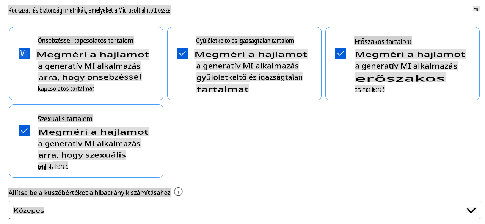

### Bevezetés a teljesítményértékelésbe

Annak érdekében, hogy az AI modelled az elvárásoknak megfelelően működjön, fontos, hogy a teljesítményét teljesítménymutatók alapján értékeld. Az Azure AI Foundry-ban a teljesítményértékelések lehetővé teszik, hogy a modelled hatékonyságát teszteld pontos, releváns és koherens válaszok generálásában.

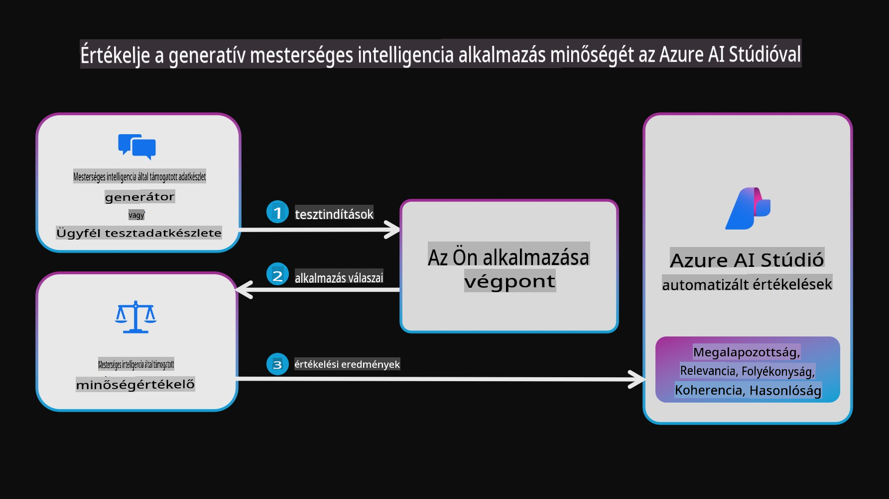

*Kép forrása: [Generatív AI alkalmazások értékelése](https://learn.microsoft.com/azure/ai-studio/concepts/evaluation-approach-gen-ai?wt.mc_id%3Dstudentamb_279723)*

#### Teljesítménymutatók

Ebben az útmutatóban az Azure AI Foundry teljesítménymutatóit fogod használni a finomhangolt Phi-3 / Phi-3.5 modell teljesítményének értékeléséhez. Ezek a mutatók segítenek felmérni a modell hatékonyságát pontos, releváns és koherens válaszok generálásában. A teljesítménymutatók a következők:

- **Forrásalapúság**: Értékeli, hogy a generált válaszok mennyire igazodnak a bemeneti forrás információihoz.
- **Relevancia**: Értékeli, hogy a generált válaszok mennyire kapcsolódnak az adott kérdésekhez.
- **Koherencia**: Értékeli, hogy a generált szöveg mennyire folyékony, természetesen olvasható és emberi nyelvre hasonlít.
- **Folyékonyság**: Értékeli a generált szöveg nyelvi készségét.
- **GPT Hasonlóság**: Összehasonlítja a generált választ az alapigazsággal hasonlóság szempontjából.
- **F1 Pontszám**: Kiszámítja a közös szavak arányát a generált válasz és a forrásadatok között.

Ezek a mutatók segítenek értékelni a modell hatékonyságát pontos, releváns és koherens válaszok generálásában.

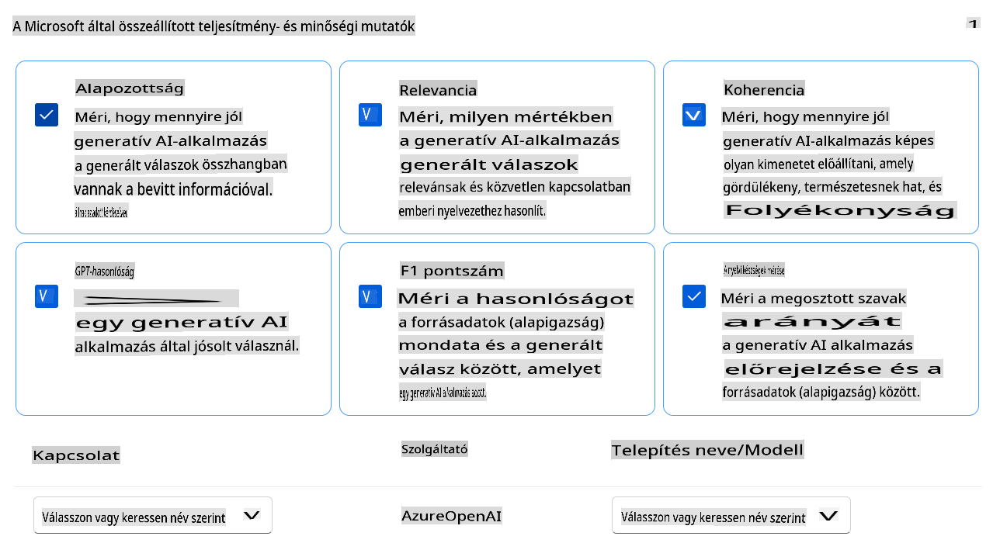

## **Forgatókönyv 2: A Phi-3 / Phi-3.5 modell értékelése az Azure AI Foundry-ban**

### Kezdés előtt

Ez az útmutató a korábbi blogbejegyzések folytatása: "[Egyedi Phi-3 modellek finomhangolása és integrálása Prompt Flow-val: Lépésről lépésre útmutató](https://techcommunity.microsoft.com/t5/educator-developer-blog/fine-tune-and-integrate-custom-phi-3-models-with-prompt-flow/ba-p/4178612?wt.mc_id=studentamb_279723)" és "[Egyedi Phi-3 modellek finomhangolása és integrálása Prompt Flow-val az Azure AI Foundry-ban](https://techcommunity.microsoft.com/t5/educator-developer-blog/fine-tune-and-integrate-custom-phi-3-models-with-prompt-flow-in/ba-p/4191726?wt.mc_id=studentamb_279723)." Ezekben a bejegyzésekben végigmentünk a Phi-3 / Phi-3.5 modell finomhangolásának és az Azure AI Foundry Prompt flow funkciójával való integrálásának folyamatán.

Ebben az útmutatóban egy Azure OpenAI modellt fogsz telepíteni értékelőként az Azure AI Foundry-ban, és ezt használod majd a finomhangolt Phi-3 / Phi-3.5 modell értékeléséhez.

Mielőtt elkezdenéd ezt az útmutatót, győződj meg arról, hogy rendelkezel a következő előfeltételekkel, ahogyan az a korábbi útmutatókban szerepel:

1. Egy előkészített adathalmaz a finomhangolt Phi-3 / Phi-3.5 modell értékeléséhez.
1. Egy Phi-3 / Phi-3.5 modell, amelyet finomhangoltak és telepítettek az Azure Machine Learning-be.
1. Egy Prompt flow, amely integrálva van a finomhangolt Phi-3 / Phi-3.5 modellel az Azure AI Foundry-ban.

> [!NOTE]
> A *test_data.jsonl* fájlt fogod használni, amely az **ULTRACHAT_200k** adathalmaz adatfájl mappájában található, és amelyet a korábbi blogbejegyzésekben töltöttél le, mint a finomhangolt Phi-3 / Phi-3.5 modell értékelésére szolgáló adathalmazt.

#### Az egyedi Phi-3 / Phi-3.5 modell integrálása a Prompt flow-val az Azure AI Foundry-ban (kód alapú megközelítés)

> [!NOTE]
> Ha követted az alacsony kódú megközelítést a "[Egyedi Phi-3 modellek finomhangolása és integrálása Prompt Flow-val az Azure AI Foundry-ban](https://techcommunity.microsoft.com/t5/educator-developer-blog/fine-tune-and-integrate-custom-phi-3-models-with-prompt-flow-in/ba-p/4191726?wt.mc_id=studentamb_279723)" című útmutatóban, akkor kihagyhatod ezt a gyakorlatot, és folytathatod a következővel.
> Ha azonban a kód alapú megközelítést követted a "[Egyedi Phi-3 modellek finomhangolása és integrálása Prompt Flow-val: Lépésről lépésre útmutató](https://techcommunity.microsoft.com/t5/educator-developer-blog/fine-tune-and-integrate-custom-phi-3-models-with-prompt-flow/ba-p/4178612?wt.mc_id=studentamb_279723)" című útmutatóban, akkor a modelled Prompt flow-hoz való csatlakoztatásának folyamata kissé eltérő. Ezt a folyamatot fogod megtanulni ebben a gyakorlatban.

A folytatáshoz integrálnod kell a finomhangolt Phi-3 / Phi-3.5 modellt a Prompt flow-val az Azure AI Foundry-ban.

#### Azure AI Foundry Hub létrehozása

Mielőtt létrehoznád a Projektet, létre kell hoznod egy Hubot. A Hub hasonlóan működik, mint egy Erőforráscsoport, lehetővé téve több Projekt szervezését és kezelését az Azure AI Foundry-ban.

1. Jelentkezz be az [Azure AI Foundry](https://ai.azure.com/?wt.mc_id=studentamb_279723) oldalára.

1. Válaszd ki a **Minden hub** opciót a bal oldali menüből.

1. Válaszd ki a **+ Új hub** lehetőséget a navigációs menüből.

    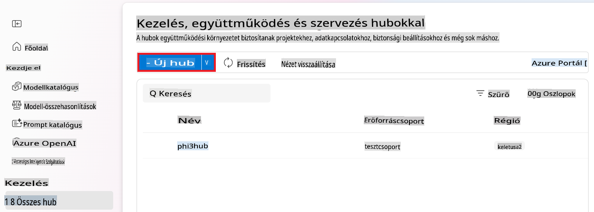

1. Végezd el az alábbi feladatokat:

    - Add meg a **Hub nevét**. Egyedi értéknek kell lennie.
    - Válaszd ki az Azure **Előfizetés
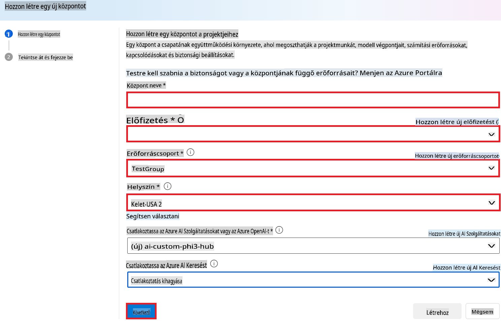

1. Válaszd ki a **Tovább** lehetőséget.

#### Azure AI Foundry projekt létrehozása

1. A létrehozott Hubban válaszd ki a bal oldali menüből az **Összes projekt** opciót.

1. Válaszd ki a navigációs menüből a **+ Új projekt** lehetőséget.

    

1. Add meg a **Projekt nevét**. Egyedi értéknek kell lennie.

    

1. Válaszd ki a **Projekt létrehozása** lehetőséget.

#### Egyedi kapcsolat hozzáadása a finomhangolt Phi-3 / Phi-3.5 modellhez

Ahhoz, hogy integráld az egyedi Phi-3 / Phi-3.5 modellt a Prompt flow-val, el kell mentened a modell végpontját és kulcsát egy egyedi kapcsolatban. Ez a beállítás biztosítja a hozzáférést az egyedi Phi-3 / Phi-3.5 modellhez a Prompt flow-ban.

#### Állítsd be a finomhangolt Phi-3 / Phi-3.5 modell api kulcsát és végpont URI-ját

1. Látogasd meg az [Azure ML Studio](https://ml.azure.com/home?wt.mc_id=studentamb_279723) oldalt.

1. Navigálj a létrehozott Azure Machine Learning munkaterületre.

1. Válaszd ki a bal oldali menüből a **Végpontok** opciót.

    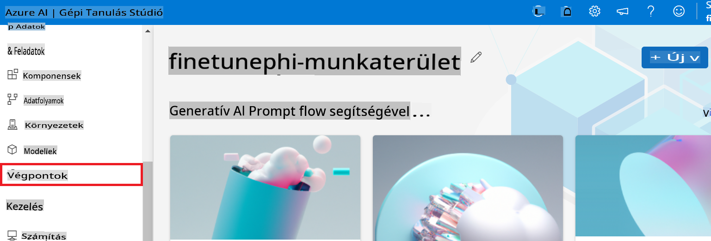

1. Válaszd ki az általad létrehozott végpontot.

    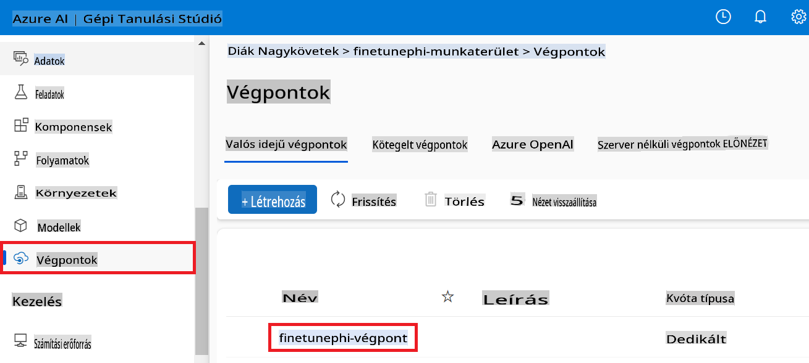

1. Válaszd ki a **Fogyasztás** lehetőséget a navigációs menüből.

1. Másold ki a **REST végpontot** és az **Elsődleges kulcsot**.

    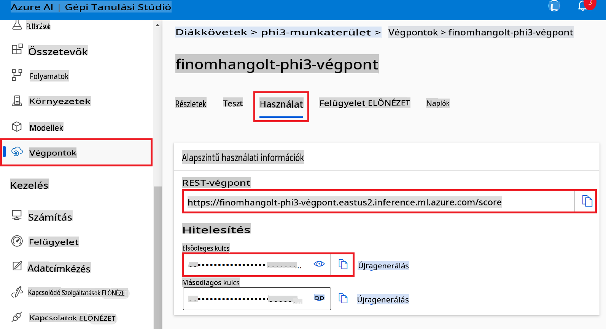

#### Egyedi kapcsolat hozzáadása

1. Látogasd meg az [Azure AI Foundry](https://ai.azure.com/?wt.mc_id=studentamb_279723) oldalt.

1. Navigálj a létrehozott Azure AI Foundry projekthez.

1. A létrehozott projektben válaszd ki a bal oldali menüből a **Beállítások** lehetőséget.

1. Válaszd ki a **+ Új kapcsolat** opciót.

    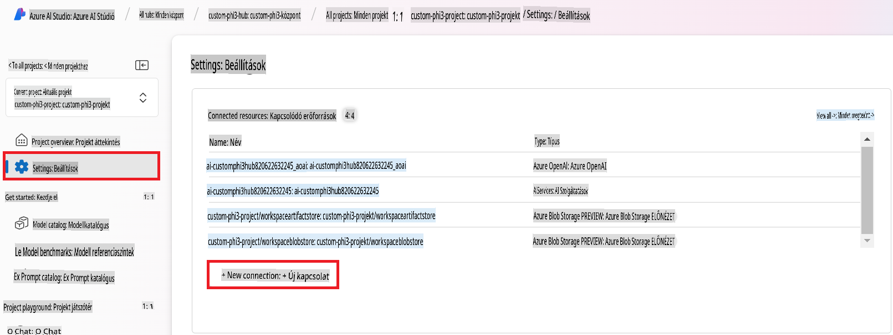

1. Válaszd ki a navigációs menüből az **Egyedi kulcsok** opciót.

    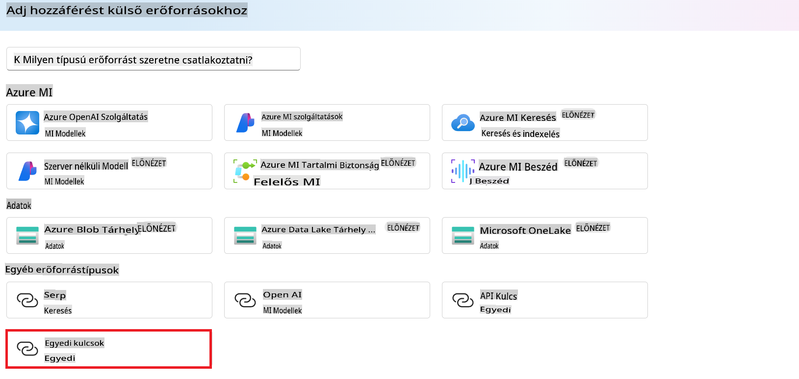

1. Hajtsd végre az alábbi feladatokat:

    - Válaszd ki a **+ Kulcs-érték párok hozzáadása** opciót.
    - A kulcs neveként add meg az **endpoint** értéket, és illeszd be az Azure ML Studio-ból másolt végpontot az érték mezőbe.
    - Válaszd ki ismét a **+ Kulcs-érték párok hozzáadása** opciót.
    - A kulcs neveként add meg a **key** értéket, és illeszd be az Azure ML Studio-ból másolt kulcsot az érték mezőbe.
    - A kulcsok hozzáadása után válaszd ki az **is secret** opciót, hogy a kulcs ne legyen látható.

    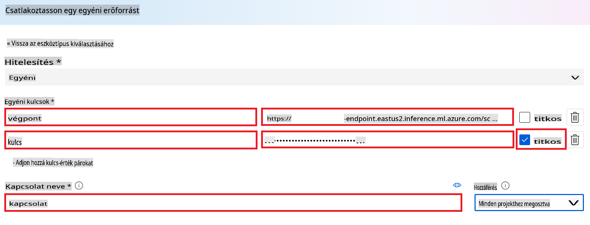

1. Válaszd ki a **Kapcsolat hozzáadása** lehetőséget.

#### Prompt flow létrehozása

Hozzáadtál egy egyedi kapcsolatot az Azure AI Foundry-ben. Most hozzunk létre egy Prompt flow-t az alábbi lépésekkel. Ezután csatlakoztatod ezt a Prompt flow-t az egyedi kapcsolathoz, hogy a finomhangolt modellt használhasd a Prompt flow-ban.

1. Navigálj a létrehozott Azure AI Foundry projekthez.

1. Válaszd ki a bal oldali menüből a **Prompt flow** opciót.

1. Válaszd ki a navigációs menüből a **+ Létrehozás** lehetőséget.

    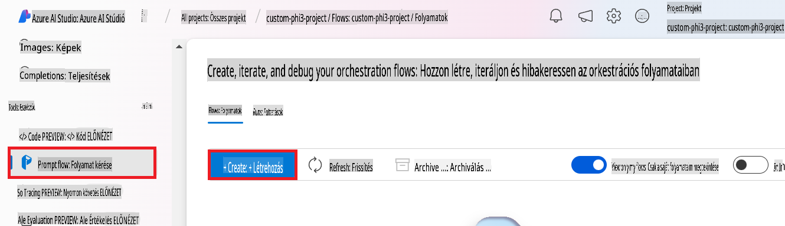

1. Válaszd ki a navigációs menüből a **Chat flow** opciót.

    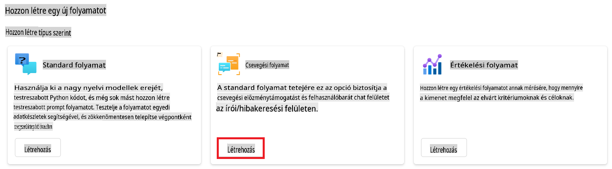

1. Add meg a használni kívánt **Mappa nevét**.

    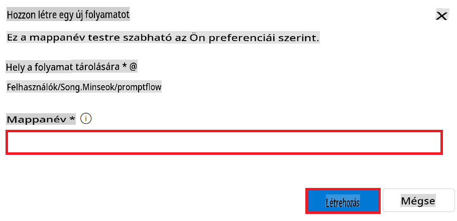

1. Válaszd ki a **Létrehozás** lehetőséget.

#### Prompt flow beállítása az egyedi Phi-3 / Phi-3.5 modellel való csevegéshez

Integrálnod kell a finomhangolt Phi-3 / Phi-3.5 modellt egy Prompt flow-ba. Azonban a meglévő Prompt flow nem alkalmas erre a célra. Ezért újra kell tervezned a Prompt flow-t az egyedi modell integrációjának engedélyezéséhez.

1. A Prompt flow-ban hajtsd végre az alábbi feladatokat a meglévő folyamat újraépítéséhez:

    - Válaszd ki a **Nyers fájl mód** opciót.
    - Töröld az összes meglévő kódot a *flow.dag.yml* fájlból.
    - Add hozzá az alábbi kódot a *flow.dag.yml* fájlhoz.

        ```yml
        inputs:
          input_data:
            type: string
            default: "Who founded Microsoft?"

        outputs:
          answer:
            type: string
            reference: ${integrate_with_promptflow.output}

        nodes:
        - name: integrate_with_promptflow
          type: python
          source:
            type: code
            path: integrate_with_promptflow.py
          inputs:
            input_data: ${inputs.input_data}
        ```

    - Válaszd ki a **Mentés** lehetőséget.

    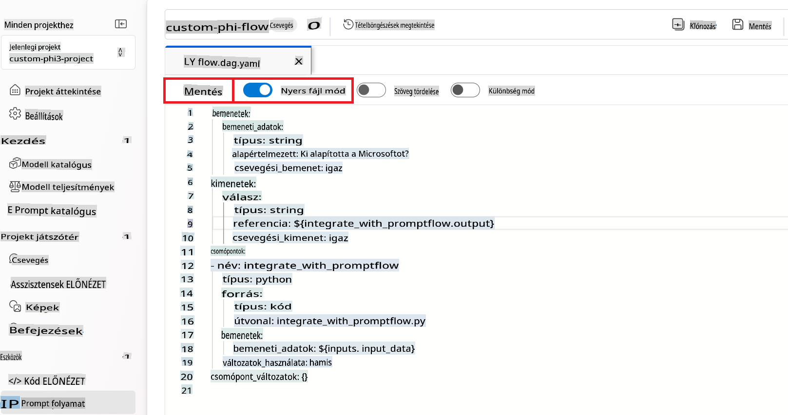

1. Add hozzá az alábbi kódot az *integrate_with_promptflow.py* fájlhoz, hogy az egyedi Phi-3 / Phi-3.5 modellt használd a Prompt flow-ban.

    ```python
    import logging
    import requests
    from promptflow import tool
    from promptflow.connections import CustomConnection

    # Logging setup
    logging.basicConfig(
        format="%(asctime)s - %(levelname)s - %(name)s - %(message)s",
        datefmt="%Y-%m-%d %H:%M:%S",
        level=logging.DEBUG
    )
    logger = logging.getLogger(__name__)

    def query_phi3_model(input_data: str, connection: CustomConnection) -> str:
        """
        Send a request to the Phi-3 / Phi-3.5 model endpoint with the given input data using Custom Connection.
        """

        # "connection" is the name of the Custom Connection, "endpoint", "key" are the keys in the Custom Connection
        endpoint_url = connection.endpoint
        api_key = connection.key

        headers = {
            "Content-Type": "application/json",
            "Authorization": f"Bearer {api_key}"
        }
    data = {
        "input_data": [input_data],
        "params": {
            "temperature": 0.7,
            "max_new_tokens": 128,
            "do_sample": True,
            "return_full_text": True
            }
        }
        try:
            response = requests.post(endpoint_url, json=data, headers=headers)
            response.raise_for_status()
            
            # Log the full JSON response
            logger.debug(f"Full JSON response: {response.json()}")

            result = response.json()["output"]
            logger.info("Successfully received response from Azure ML Endpoint.")
            return result
        except requests.exceptions.RequestException as e:
            logger.error(f"Error querying Azure ML Endpoint: {e}")
            raise

    @tool
    def my_python_tool(input_data: str, connection: CustomConnection) -> str:
        """
        Tool function to process input data and query the Phi-3 / Phi-3.5 model.
        """
        return query_phi3_model(input_data, connection)

    ```

    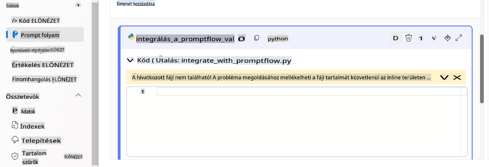

> [!NOTE]
> További részletekért a Prompt flow használatáról az Azure AI Foundry-ben látogasd meg a [Prompt flow az Azure AI Foundry-ben](https://learn.microsoft.com/azure/ai-studio/how-to/prompt-flow) oldalt.

1. Válaszd ki a **Chat input**, **Chat output** lehetőségeket, hogy engedélyezd a modelllel való csevegést.

    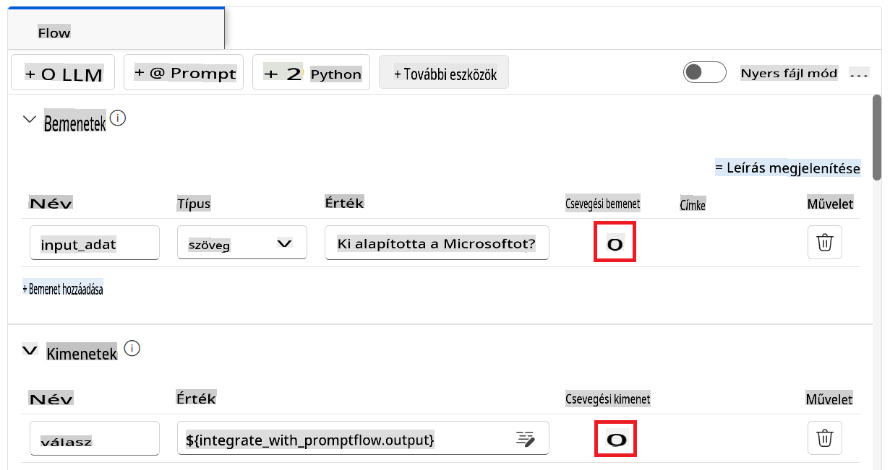

1. Most már készen állsz arra, hogy csevegj az egyedi Phi-3 / Phi-3.5 modellel. A következő gyakorlatban megtanulod, hogyan indítsd el a Prompt flow-t, és hogyan használd a finomhangolt Phi-3 / Phi-3.5 modellel való csevegéshez.

> [!NOTE]
>
> Az újraépített folyamatnak az alábbi képen látható módon kell kinéznie:
>
> 
>

#### Prompt flow indítása

1. Válaszd ki a **Számítási munkamenetek indítása** lehetőséget a Prompt flow elindításához.

    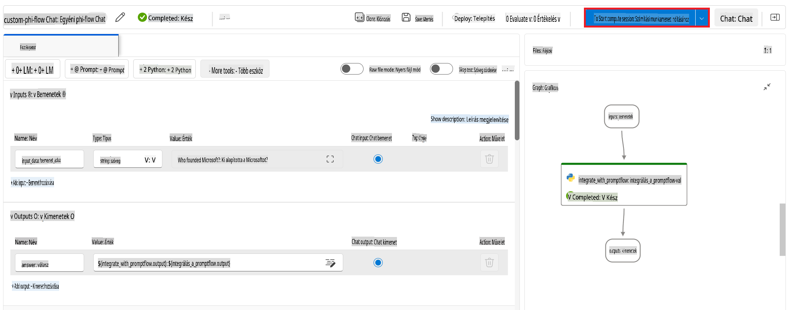

1. Válaszd ki a **Bemenet érvényesítése és feldolgozása** lehetőséget a paraméterek frissítéséhez.

    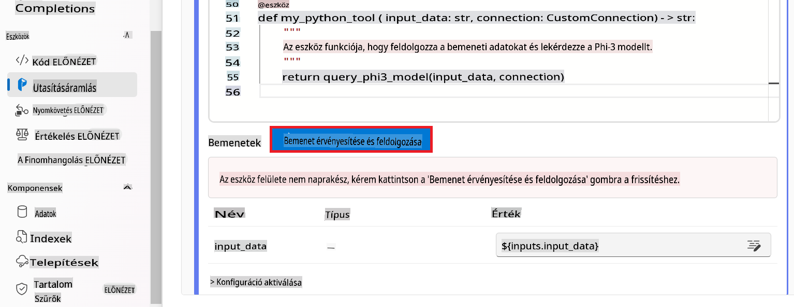

1. Válaszd ki a **Kapcsolat** **Értékét** az általad létrehozott egyedi kapcsolathoz. Például: *connection*.

    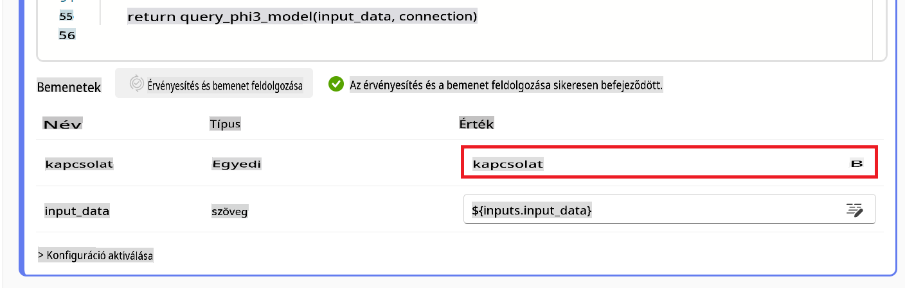

#### Csevegj az egyedi Phi-3 / Phi-3.5 modellel

1. Válaszd ki a **Chat** lehetőséget.

    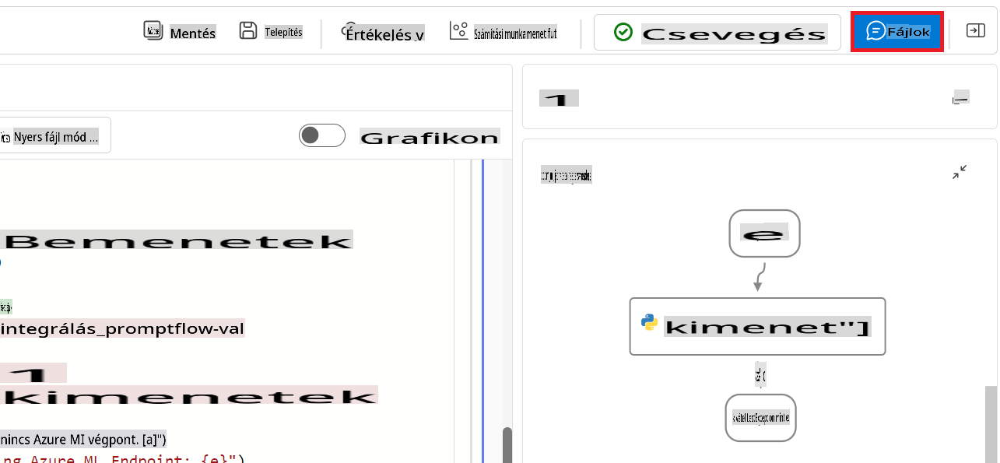

1. Íme egy példa az eredményekre: Most már cseveghetsz az egyedi Phi-3 / Phi-3.5 modellel. Ajánlott olyan kérdéseket feltenni, amelyek az adatfinomításhoz használt adatokon alapulnak.

    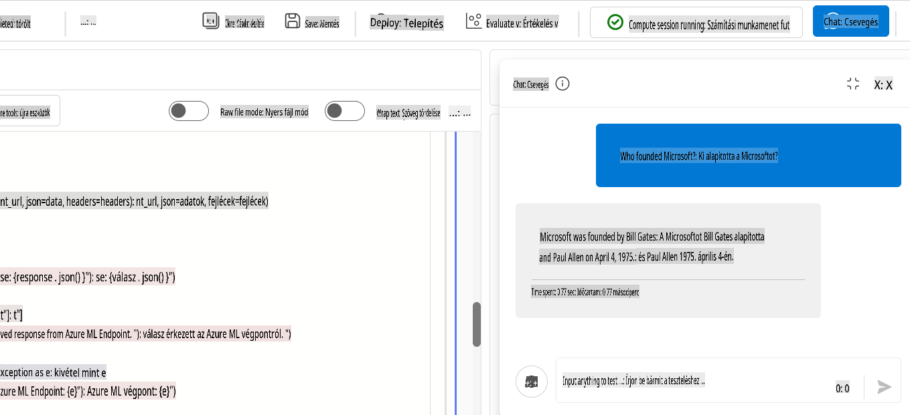

### Azure OpenAI telepítése a Phi-3 / Phi-3.5 modell értékeléséhez

A Phi-3 / Phi-3.5 modell értékeléséhez az Azure AI Foundry-ben telepítened kell egy Azure OpenAI modellt. Ez a modell fogja értékelni a Phi-3 / Phi-3.5 modell teljesítményét.

#### Azure OpenAI telepítése

1. Jelentkezz be az [Azure AI Foundry](https://ai.azure.com/?wt.mc_id=studentamb_279723) oldalra.

1. Navigálj a létrehozott Azure AI Foundry projekthez.

    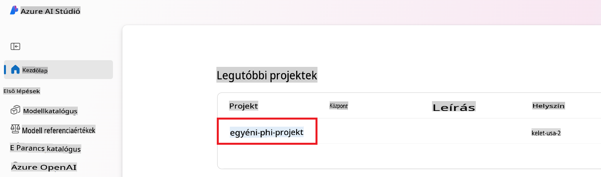

1. A létrehozott projektben válaszd ki a bal oldali menüből a **Telepítések** lehetőséget.

1. Válaszd ki a navigációs menüből a **+ Modell telepítése** opciót.

1. Válaszd ki az **Alapmodell telepítése** lehetőséget.

    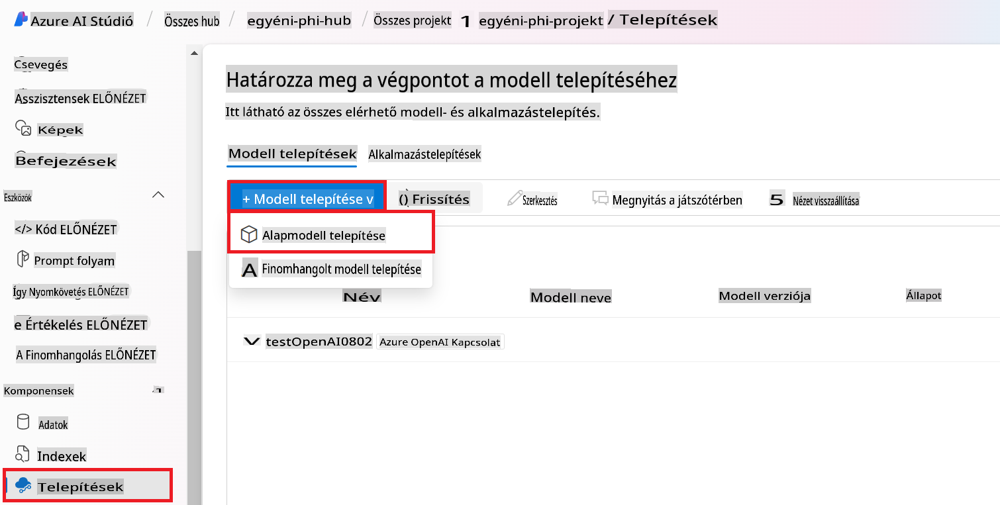

1. Válaszd ki az Azure OpenAI modellt, amelyet használni szeretnél. Például: **gpt-4o**.

    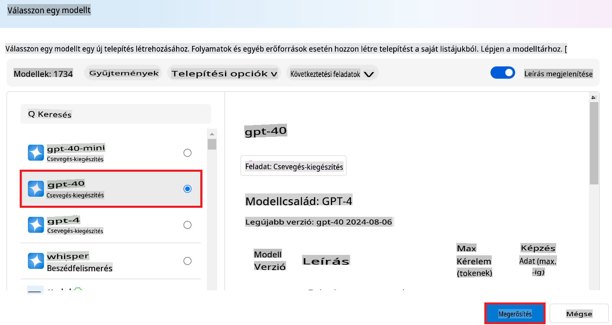

1. Válaszd ki a **Megerősítés** lehetőséget.

### A finomhangolt Phi-3 / Phi-3.5 modell értékelése az Azure AI Foundry Prompt flow értékeléssel

### Új értékelés indítása

1. Látogasd meg az [Azure AI Foundry](https://ai.azure.com/?wt.mc_id=studentamb_279723) oldalt.

1. Navigálj a létrehozott Azure AI Foundry projekthez.

    

1. A létrehozott projektben válaszd ki a bal oldali menüből az **Értékelés** lehetőséget.

1. Válaszd ki a navigációs menüből a **+ Új értékelés** lehetőséget.
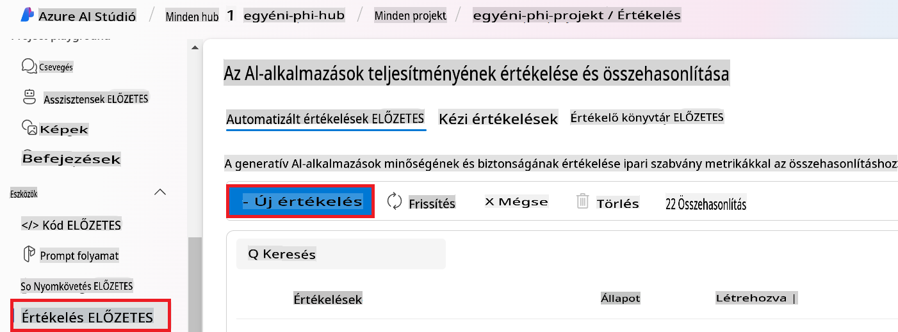

1. Válaszd ki a **Prompt flow** értékelést.

    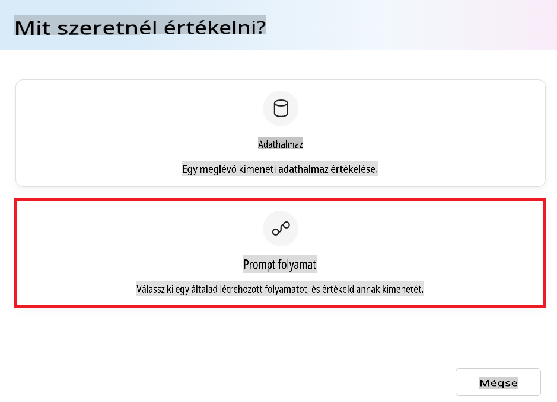

1. Hajtsd végre a következő feladatokat:

    - Add meg az értékelés nevét. Egyedi értéknek kell lennie.
    - Válaszd ki a **Kérdés és válasz kontextus nélkül** feladattípust. Ennek oka, hogy az ebben az útmutatóban használt **ULTRACHAT_200k** adathalmaz nem tartalmaz kontextust.
    - Válaszd ki azt a prompt flow-t, amelyet értékelni szeretnél.

    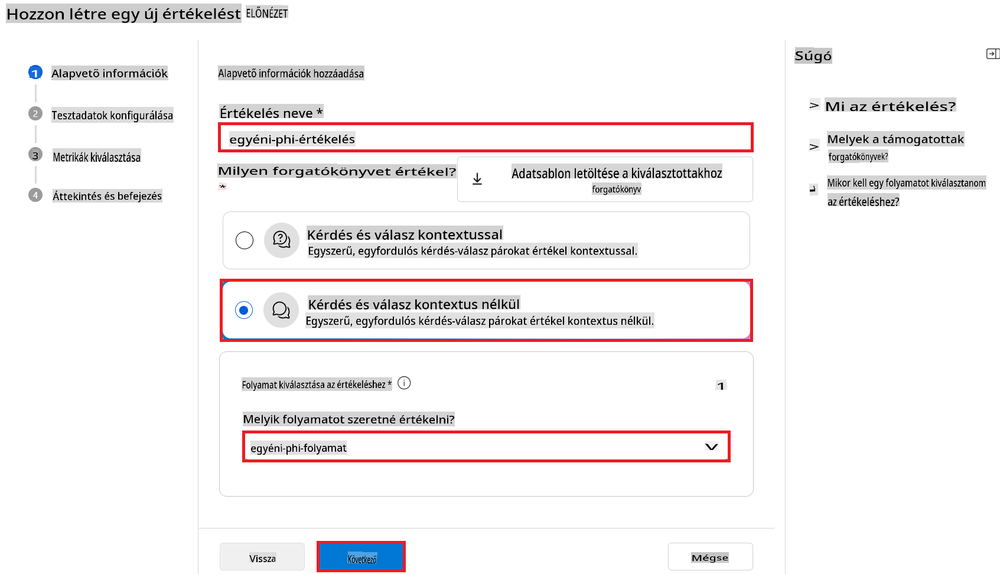

1. Válaszd a **Tovább** lehetőséget.

1. Hajtsd végre a következő feladatokat:

    - Válaszd ki a **Dataset hozzáadása** opciót az adathalmaz feltöltéséhez. Például feltöltheted a teszt adathalmaz fájlt, mint például a *test_data.json1*, amelyet a **ULTRACHAT_200k** adathalmaz letöltésekor kapsz meg.
    - Válaszd ki a megfelelő **Dataset oszlopot**, amely megfelel az adathalmazodnak. Például, ha a **ULTRACHAT_200k** adathalmazt használod, válaszd a **${data.prompt}** oszlopot.

    

1. Válaszd a **Tovább** lehetőséget.

1. Hajtsd végre a következő feladatokat a teljesítmény- és minőségi mutatók konfigurálásához:

    - Válaszd ki azokat a teljesítmény- és minőségi mutatókat, amelyeket használni szeretnél.
    - Válaszd ki azt az Azure OpenAI modellt, amelyet az értékeléshez létrehoztál. Például válaszd a **gpt-4o** modellt.

    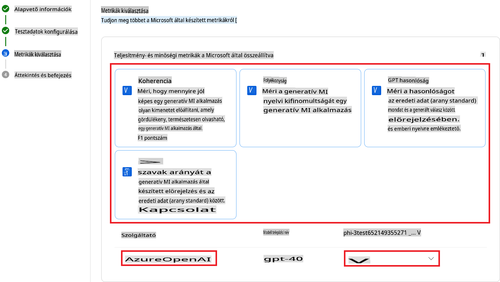

1. Hajtsd végre a következő feladatokat a kockázati és biztonsági mutatók konfigurálásához:

    - Válaszd ki azokat a kockázati és biztonsági mutatókat, amelyeket használni szeretnél.
    - Állítsd be azt a küszöbértéket, amelyet a hibaarány kiszámításához szeretnél használni. Például válaszd a **Közepes** értéket.
    - A **kérdés** esetében válaszd a **Data source** lehetőséget **{$data.prompt}** értékre.
    - A **válasz** esetében válaszd a **Data source** lehetőséget **{$run.outputs.answer}** értékre.
    - A **ground_truth** esetében válaszd a **Data source** lehetőséget **{$data.message}** értékre.

    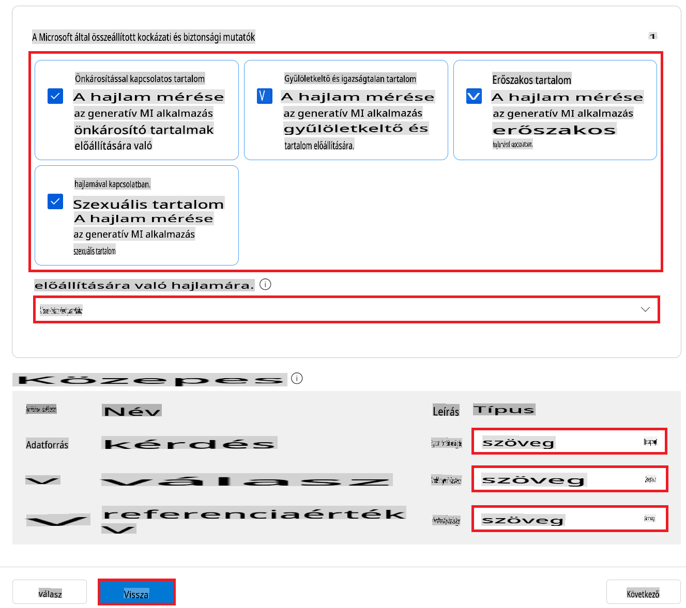

1. Válaszd a **Tovább** lehetőséget.

1. Válaszd a **Beküldés** lehetőséget az értékelés elindításához.

1. Az értékelés befejezése némi időt vehet igénybe. Az előrehaladást az **Értékelés** fülön követheted nyomon.

### Az értékelési eredmények áttekintése

> [!NOTE]
> Az alábbi eredmények az értékelési folyamat illusztrálására szolgálnak. Ebben az útmutatóban egy viszonylag kis adathalmazon finomhangolt modellt használtunk, ami alulteljesítő eredményekhez vezethet. A tényleges eredmények jelentősen eltérhetnek az adathalmaz méretétől, minőségétől és sokféleségétől, valamint a modell specifikus konfigurációjától függően.

Az értékelés befejezése után áttekintheted a teljesítmény- és biztonsági mutatók eredményeit.

1. Teljesítmény- és minőségi mutatók:

    - Értékeld a modell hatékonyságát a koherens, folyékony és releváns válaszok generálásában.

    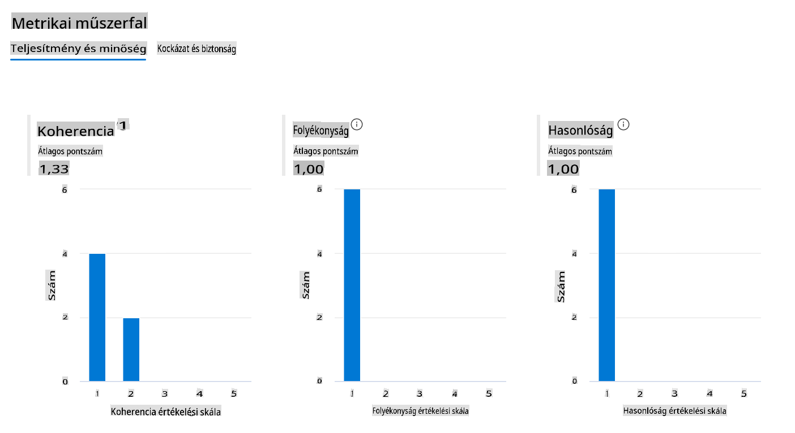

1. Kockázati és biztonsági mutatók:

    - Bizonyosodj meg arról, hogy a modell kimenetei biztonságosak és megfelelnek a Felelős MI alapelveinek, elkerülve a káros vagy sértő tartalmat.

    

1. Görgess le a **Részletes mutatók eredményeinek** megtekintéséhez.

    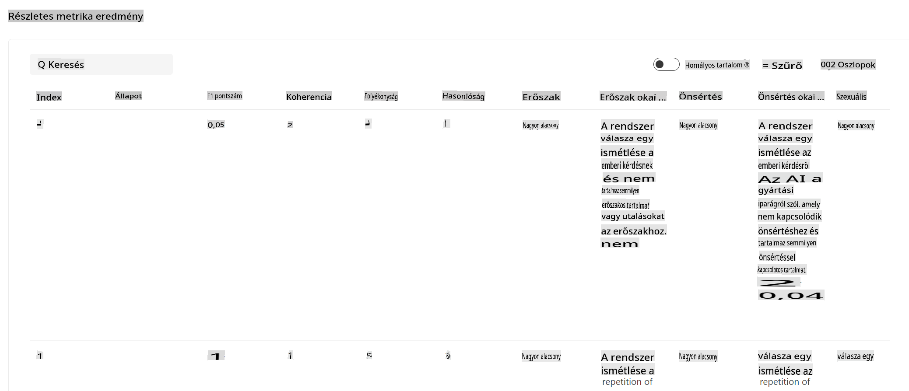

1. A saját Phi-3 / Phi-3.5 modell teljesítmény- és biztonsági mutatók szerinti értékelésével megbizonyosodhatsz arról, hogy a modell nemcsak hatékony, hanem megfelel a felelős MI gyakorlatoknak is, így készen áll a valós környezetben történő bevezetésre.

## Gratulálunk!

### Sikeresen befejezted ezt az útmutatót

Sikeresen értékelted a finomhangolt Phi-3 modellt, amely integrálva van a Prompt flow-val az Azure AI Foundry-ban. Ez egy fontos lépés annak biztosítására, hogy MI modelljeid ne csak jól teljesítsenek, hanem megfeleljenek a Microsoft Felelős MI alapelveinek, így megbízható és megalapozott MI alkalmazásokat építhetsz.


## Azure erőforrások törlése

Töröld az Azure erőforrásokat, hogy elkerüld a további költségeket. Lépj az Azure portálra, és töröld az alábbi erőforrásokat:

- Az Azure Machine Learning erőforrás.
- Az Azure Machine Learning modell végpont.
- Az Azure AI Foundry Projekt erőforrás.
- Az Azure AI Foundry Prompt flow erőforrás.

### Következő lépések

#### Dokumentáció

- [MI rendszerek értékelése a Felelős MI irányítópult használatával](https://learn.microsoft.com/azure/machine-learning/concept-responsible-ai-dashboard?view=azureml-api-2&source=recommendations?wt.mc_id=studentamb_279723)
- [Generatív MI értékelési és monitorozási mutatók](https://learn.microsoft.com/azure/ai-studio/concepts/evaluation-metrics-built-in?tabs=definition?wt.mc_id=studentamb_279723)
- [Azure AI Foundry dokumentáció](https://learn.microsoft.com/azure/ai-studio/?wt.mc_id=studentamb_279723)
- [Prompt flow dokumentáció](https://microsoft.github.io/promptflow/?wt.mc_id=studentamb_279723)

#### Oktatási tartalom

- [Bevezetés a Microsoft Felelős MI megközelítésébe](https://learn.microsoft.com/training/modules/introduction-to-microsofts-responsible-ai-approach/?source=recommendations?wt.mc_id=studentamb_279723)
- [Bevezetés az Azure AI Foundry-ba](https://learn.microsoft.com/training/modules/introduction-to-azure-ai-studio/?wt.mc_id=studentamb_279723)

### Referenciák

- [Mi az a Felelős MI?](https://learn.microsoft.com/azure/machine-learning/concept-responsible-ai?view=azureml-api-2?wt.mc_id=studentamb_279723)
- [Új eszközök bejelentése az Azure AI-ban a biztonságosabb és megbízhatóbb generatív MI alkalmazások építéséhez](https://azure.microsoft.com/blog/announcing-new-tools-in-azure-ai-to-help-you-build-more-secure-and-trustworthy-generative-ai-applications/?wt.mc_id=studentamb_279723)
- [Generatív MI alkalmazások értékelése](https://learn.microsoft.com/azure/ai-studio/concepts/evaluation-approach-gen-ai?wt.mc_id%3Dstudentamb_279723)

**Felelősségkizárás**:  
Ez a dokumentum gépi AI fordítási szolgáltatások segítségével került lefordításra. Bár törekszünk a pontosságra, kérjük, vegye figyelembe, hogy az automatikus fordítások hibákat vagy pontatlanságokat tartalmazhatnak. Az eredeti dokumentum az eredeti nyelvén tekintendő hiteles forrásnak. Kritikus információk esetén javasolt professzionális emberi fordítás igénybevétele. Nem vállalunk felelősséget a fordítás használatából eredő félreértésekért vagy téves értelmezésekért.