# Finomhangolás és egyedi Phi-3 modellek integrálása Prompt flow-val az Azure AI Foundry-ban

Ez az elejétől a végéig (E2E) példa a Microsoft Tech Community "[Fine-Tune and Integrate Custom Phi-3 Models with Prompt Flow in Azure AI Foundry](https://techcommunity.microsoft.com/t5/educator-developer-blog/fine-tune-and-integrate-custom-phi-3-models-with-prompt-flow-in/ba-p/4191726?WT.mc_id=aiml-137032-kinfeylo)" című útmutatóján alapul. Bemutatja az egyedi Phi-3 modellek finomhangolásának, telepítésének és Prompt flow-val való integrációjának folyamatait az Azure AI Foundry-ban. 
Ellentétben az E2E példával, "[Fine-Tune and Integrate Custom Phi-3 Models with Prompt Flow](./E2E_Phi-3-FineTuning_PromptFlow_Integration.md)", amely a kód helyi futtatását igényelte, ez az útmutató kizárólag az Azure AI / ML Studio-n belüli finomhangolásra és integrációra összpontosít.

## Áttekintés

Ebben az E2E példában megtanulhatod, hogyan kell finomhangolni a Phi-3 modellt, és integrálni azt a Prompt flow-val az Azure AI Foundry-ban. Az Azure AI / ML Studio használatával létrehozol egy munkafolyamatot az egyedi AI modellek telepítéséhez és használatához. Ez az E2E példa három forgatókönyvre van osztva:

**Forgatókönyv 1: Azure erőforrások beállítása és előkészítés a finomhangoláshoz**

**Forgatókönyv 2: Phi-3 modell finomhangolása és telepítése az Azure Machine Learning Studio-ban**

**Forgatókönyv 3: Integráció a Prompt flow-val és csevegés az egyedi modelleddel az Azure AI Foundry-ban**

Íme egy áttekintés erről az E2E példáról.


### Tartalomjegyzék

1. **[Forgatókönyv 1: Azure erőforrások beállítása és előkészítés a finomhangoláshoz](../../../../../../md/02.Application/01.TextAndChat/Phi3)**
    - [Azure Machine Learning Workspace létrehozása](../../../../../../md/02.Application/01.TextAndChat/Phi3)
    - [GPU kvóták igénylése az Azure előfizetésben](../../../../../../md/02.Application/01.TextAndChat/Phi3)
    - [Szerepkör-hozzárendelés hozzáadása](../../../../../../md/02.Application/01.TextAndChat/Phi3)
    - [Projekt beállítása](../../../../../../md/02.Application/01.TextAndChat/Phi3)
    - [Adatkészlet előkészítése a finomhangoláshoz](../../../../../../md/02.Application/01.TextAndChat/Phi3)

1. **[Forgatókönyv 2: Phi-3 modell finomhangolása és telepítése az Azure Machine Learning Studio-ban](../../../../../../md/02.Application/01.TextAndChat/Phi3)**
    - [Phi-3 modell finomhangolása](../../../../../../md/02.Application/01.TextAndChat/Phi3)
    - [Finomhangolt Phi-3 modell telepítése](../../../../../../md/02.Application/01.TextAndChat/Phi3)

1. **[Forgatókönyv 3: Integráció a Prompt flow-val és csevegés az egyedi modelleddel az Azure AI Foundry-ban](../../../../../../md/02.Application/01.TextAndChat/Phi3)**
    - [Egyedi Phi-3 modell integrálása a Prompt flow-val](../../../../../../md/02.Application/01.TextAndChat/Phi3)
    - [Csevegés az egyedi Phi-3 modelleddel](../../../../../../md/02.Application/01.TextAndChat/Phi3)

## Forgatókönyv 1: Azure erőforrások beállítása és előkészítés a finomhangoláshoz

### Azure Machine Learning Workspace létrehozása

1. Írd be *azure machine learning*-et a portál oldal tetején található **keresősávba**, és válaszd ki az **Azure Machine Learning** opciót a megjelenő lehetőségek közül.

    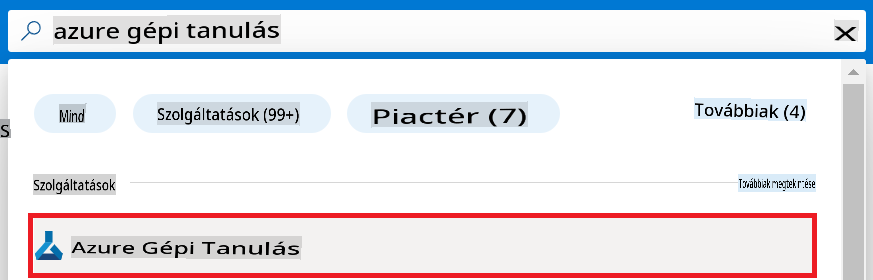

2. Válaszd ki a **+ Létrehozás** opciót a navigációs menüből.

3. Válaszd ki az **Új munkaterület** lehetőséget a navigációs menüből.

    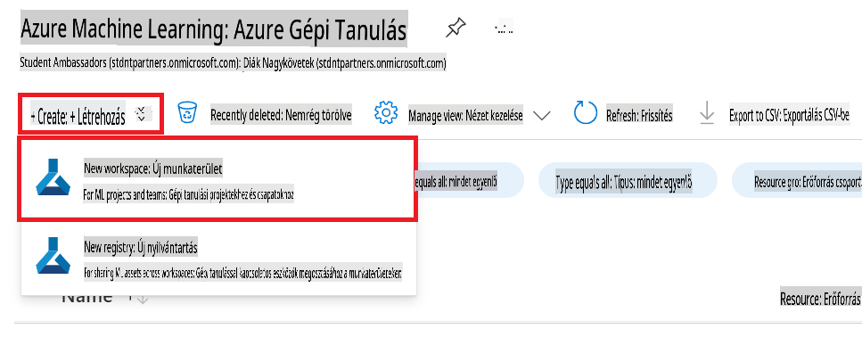

4. Végezze el a következő feladatokat:

    - Válaszd ki az Azure **Előfizetésed**.
    - Válaszd ki a használni kívánt **Erőforráscsoportot** (szükség esetén hozz létre egy újat).
    - Add meg a **Munkaterület nevét**. Egyedi értéknek kell lennie.
    - Válaszd ki a használni kívánt **Régiót**.
    - Válaszd ki a használni kívánt **Tárolófiókot** (szükség esetén hozz létre egy újat).
    - Válaszd ki a használni kívánt **Kulcstárolót** (szükség esetén hozz létre egy újat).
    - Válaszd ki a használni kívánt **Alkalmazásfigyelést** (szükség esetén hozz létre egy újat).
    - Válaszd ki a használni kívánt **Tárolóregisztert** (szükség esetén hozz létre egy újat).

    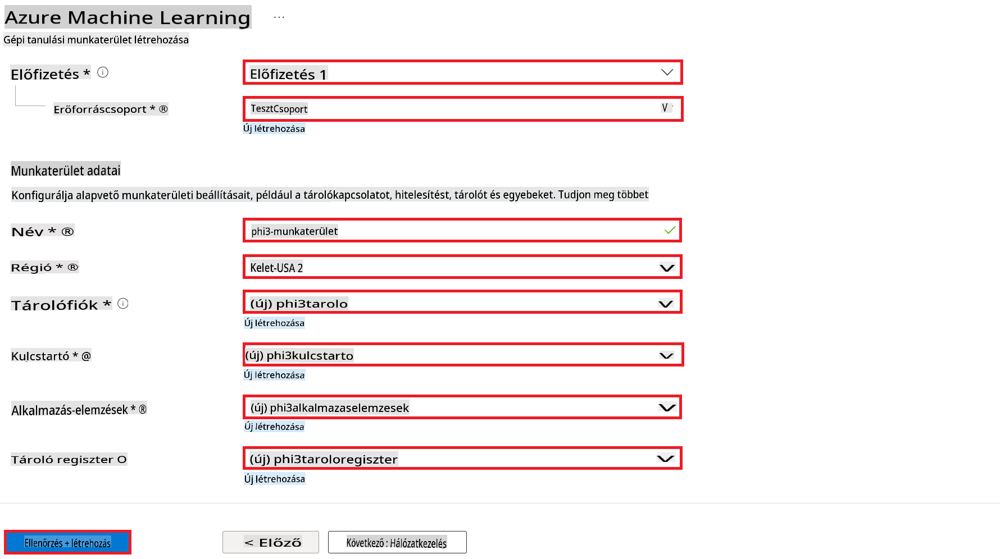

5. Válaszd ki a **Felülvizsgálat + Létrehozás** lehetőséget.

6. Válaszd ki a **Létrehozás** opciót.

### GPU kvóták igénylése az Azure előfizetésben

Ebben az oktatóanyagban megtanulhatod, hogyan kell finomhangolni és telepíteni egy Phi-3 modellt GPU-k használatával. A finomhangoláshoz a *Standard_NC24ads_A100_v4* GPU-t fogod használni, amely kvótakérést igényel. A telepítéshez a *Standard_NC6s_v3* GPU-t fogod használni, amely szintén kvótakérést igényel.

> [!NOTE]
>
> Csak a Pay-As-You-Go előfizetések (az alapértelmezett előfizetési típus) jogosultak GPU-elosztásra; az előnyelőfizetések jelenleg nem támogatottak.
>

1. Látogass el az [Azure ML Studio](https://ml.azure.com/home?wt.mc_id=studentamb_279723) oldalra.

1. Végezd el a következő feladatokat a *Standard NCADSA100v4 Family* kvóta igényléséhez:

    - Válaszd ki a **Kvóta** lehetőséget a bal oldali menüből.
    - Válaszd ki a használni kívánt **Virtuális gépcsaládot**. Például válaszd ki a **Standard NCADSA100v4 Family Cluster Dedicated vCPUs**-t, amely tartalmazza a *Standard_NC24ads_A100_v4* GPU-t.
    - Válaszd ki a **Kvóta igénylése** opciót a navigációs menüből.

        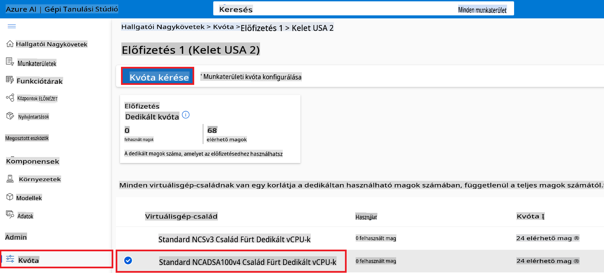

    - A Kvóta igénylése oldalon add meg az **Új magkorlát** értékét, amelyet használni szeretnél. Például 24-et.
    - A Kvóta igénylése oldalon válaszd ki a **Beküldés** opciót a GPU kvóta igényléséhez.

1. Végezd el a következő feladatokat a *Standard NCSv3 Family* kvóta igényléséhez:

    - Válaszd ki a **Kvóta** lehetőséget a bal oldali menüből.
    - Válaszd ki a használni kívánt **Virtuális gépcsaládot**. Például válaszd ki a **Standard NCSv3 Family Cluster Dedicated vCPUs**-t, amely tartalmazza a *Standard_NC6s_v3* GPU-t.
    - Válaszd ki a **Kvóta igénylése** opciót a navigációs menüből.
    - A Kvóta igénylése oldalon add meg az **Új magkorlát** értékét, amelyet használni szeretnél. Például 24-et.
    - A Kvóta igénylése oldalon válaszd ki a **Beküldés** opciót a GPU kvóta igényléséhez.

### Szerepkör-hozzárendelés hozzáadása

Ahhoz, hogy finomhangolhasd és telepíthesd a modelleket, először létre kell hoznod egy Felhasználó által hozzárendelt Kezelt Identitást (UAI), és hozzá kell rendelned a megfelelő jogosultságokat. Ezt a Kezelt Identitást fogod használni az autentikációhoz a telepítés során. 

#### Felhasználó által hozzárendelt Kezelt Identitás létrehozása (UAI)

1. Írd be *kezelt identitások* a portál tetején található **keresősávba**, és válaszd ki a **Kezelt Identitások** opciót a megjelenő lehetőségek közül.

    

1. Válaszd ki a **+ Létrehozás** opciót.

    

1. Végezd el a következő feladatokat:

    - Válaszd ki az Azure **Előfizetésed**.
    - Válaszd ki a használni kívánt **Erőforráscsoportot** (szükség esetén hozz létre egy újat).
    - Válaszd ki a használni kívánt **Régiót**.
    - Add meg az **Identitás nevét**. Egyedi értéknek kell lennie.

    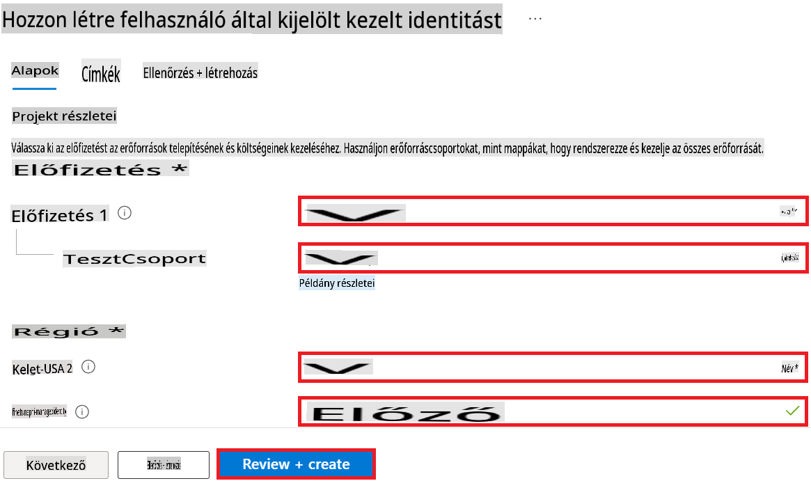

1. Válaszd ki a **Felülvizsgálat + Létrehozás** opciót.

1. Válaszd ki a **Létrehozás** opciót.
1. Látogass el az [Azure ML Studio](https://ml.azure.com/home?wt.mc_id=studentamb_279723) oldalra.

1. Válaszd ki a bal oldali sávból a **Compute** lehetőséget.

1. A navigációs menüben válaszd a **Compute clusters** lehetőséget.

1. Kattints a **+ New** gombra.

    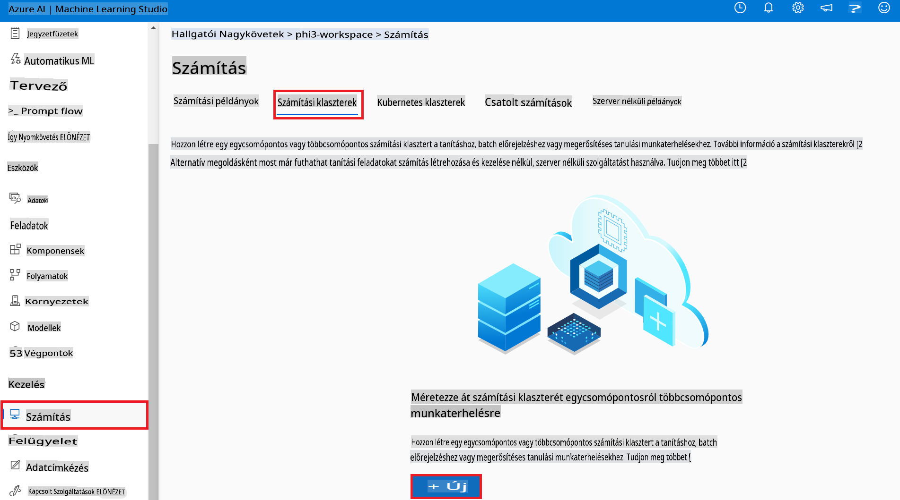

1. Végezze el az alábbi feladatokat:

    - Válaszd ki a használni kívánt **Region**-t.
    - Állítsd a **Virtual machine tier** értékét **Dedicated**-re.
    - Állítsd a **Virtual machine type** értékét **GPU**-ra.
    - A **Virtual machine size** szűrőt állítsd **Select from all options**-ra.
    - Állítsd a **Virtual machine size** értékét **Standard_NC24ads_A100_v4**-re.

    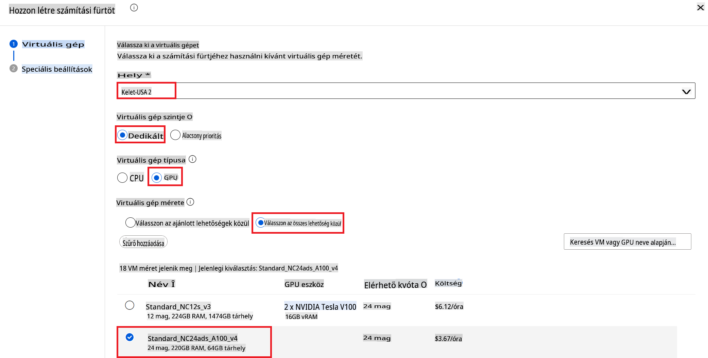

1. Kattints a **Next** gombra.

1. Végezze el az alábbi feladatokat:

    - Add meg a **Compute name**-et. Egyedi értéknek kell lennie.
    - Állítsd a **Minimum number of nodes** értékét **0**-ra.
    - Állítsd a **Maximum number of nodes** értékét **1**-re.
    - Állítsd az **Idle seconds before scale down** értékét **120**-ra.

    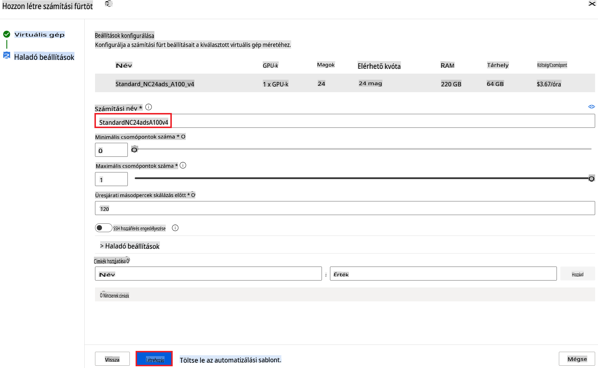

1. Kattints a **Create** gombra.

#### Phi-3 modell finomhangolása

1. Látogass el az [Azure ML Studio](https://ml.azure.com/home?wt.mc_id=studentamb_279723) oldalra.

1. Válaszd ki a létrehozott Azure Machine Learning munkaterületet.

    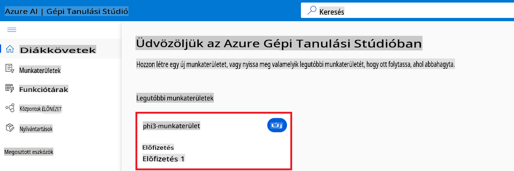

1. Végezze el az alábbi feladatokat:

    - A bal oldali sávban válaszd ki a **Model catalog** lehetőséget.
    - Írd be a **keresősávba**: *phi-3-mini-4k*, majd válaszd ki a megjelenő lehetőségek közül a **Phi-3-mini-4k-instruct** modellt.

    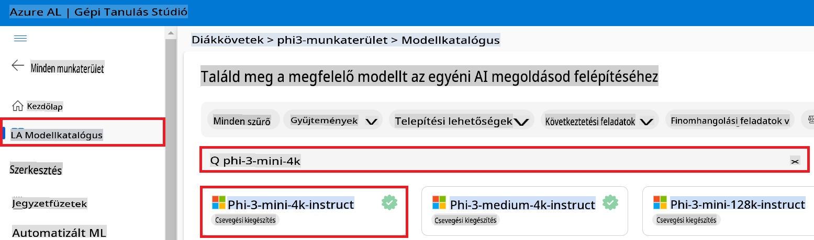

1. Válaszd ki a **Fine-tune** lehetőséget a navigációs menüben.

    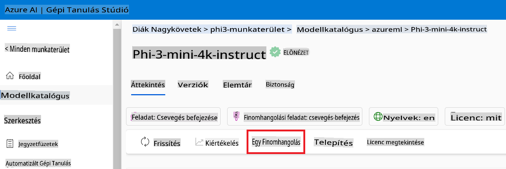

1. Végezze el az alábbi feladatokat:

    - Állítsd a **Select task type** értékét **Chat completion**-re.
    - Kattints a **+ Select data** gombra a **Traning data** feltöltéséhez.
    - Állítsd a Validációs adat feltöltési típusát **Provide different validation data**-ra.
    - Kattints a **+ Select data** gombra a **Validation data** feltöltéséhez.

    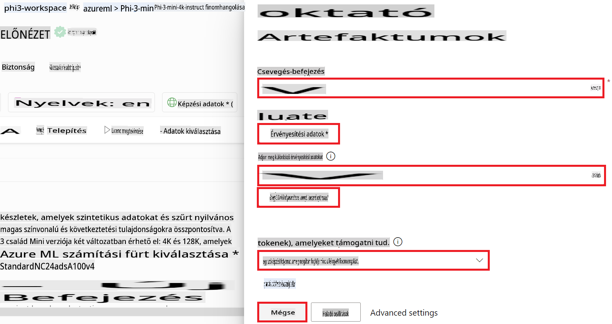

    > [!TIP]
    >
    > A **Advanced settings** lehetőség kiválasztásával testreszabhatod a konfigurációkat, például a **learning_rate** és **lr_scheduler_type** beállításokat, hogy optimalizáld a finomhangolási folyamatot az egyedi igényeidhez.

1. Kattints a **Finish** gombra.

1. Ebben a gyakorlatban sikeresen finomhangoltad a Phi-3 modellt az Azure Machine Learning segítségével. Ne feledd, hogy a finomhangolási folyamat jelentős időt vehet igénybe. A finomhangolási feladat futtatása után várd meg, amíg befejeződik. A finomhangolási feladat állapotát a bal oldali sávban található **Jobs** fülre navigálva követheted nyomon az Azure Machine Learning munkaterületen. A következő sorozatban a finomhangolt modellt telepíted, és integrálod a Prompt flow-val.

    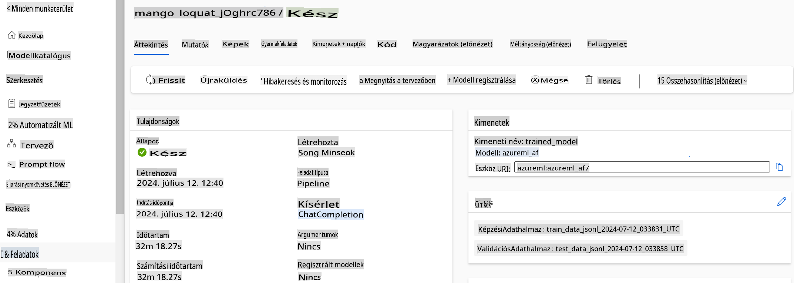

### A finomhangolt Phi-3 modell telepítése

Ahhoz, hogy a finomhangolt Phi-3 modellt integráld a Prompt flow-val, telepíteni kell a modellt, hogy valós idejű előrejelzéshez elérhető legyen. Ez a folyamat magában foglalja a modell regisztrálását, egy online végpont létrehozását és a modell telepítését.

Ebben a gyakorlatban:

- Regisztrálod a finomhangolt modellt az Azure Machine Learning munkaterületen.
- Létrehozol egy online végpontot.
- Telepíted a regisztrált finomhangolt Phi-3 modellt.

#### A finomhangolt modell regisztrálása

1. Látogass el az [Azure ML Studio](https://ml.azure.com/home?wt.mc_id=studentamb_279723) oldalra.

1. Válaszd ki a létrehozott Azure Machine Learning munkaterületet.

    

1. Válaszd ki a bal oldali sávból a **Models** lehetőséget.
1. Kattints a **+ Register** gombra.
1. Válaszd a **From a job output** lehetőséget.

    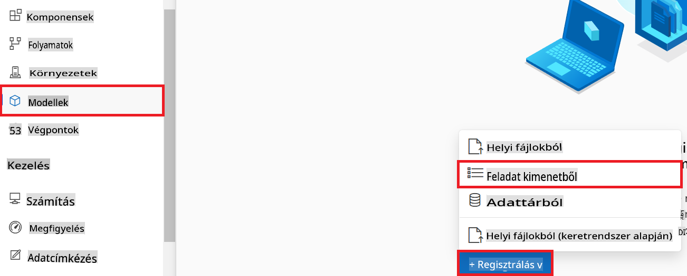

1. Válaszd ki a létrehozott feladatot.

    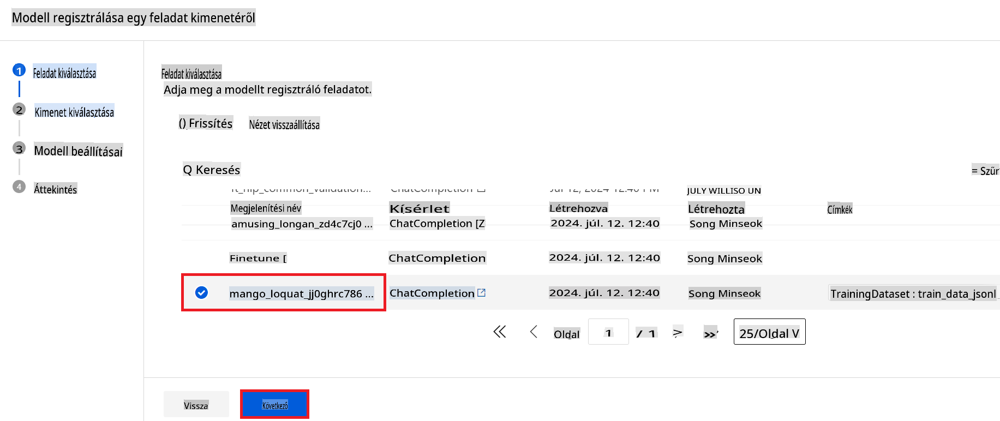

1. Kattints a **Next** gombra.

1. Állítsd a **Model type** értékét **MLflow**-ra.

1. Győződj meg arról, hogy a **Job output** ki van választva; ez automatikusan ki kell legyen választva.

    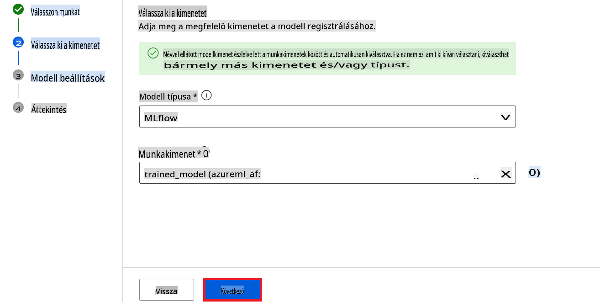

2. Kattints a **Next** gombra.

3. Kattints a **Register** gombra.

    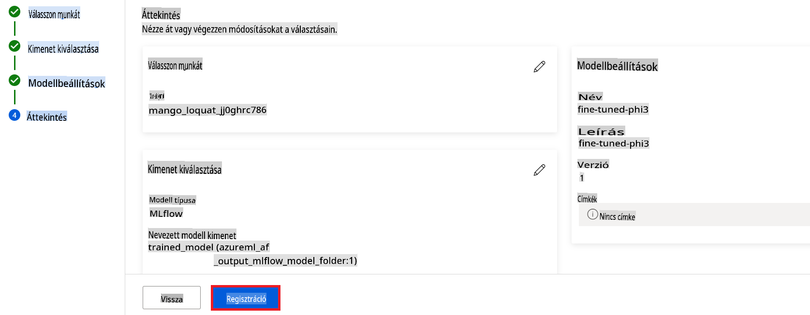

4. A regisztrált modellt a bal oldali sáv **Models** menüjében tekintheted meg.

    

#### A finomhangolt modell telepítése

1. Navigálj a létrehozott Azure Machine Learning munkaterületre.

1. Válaszd ki a bal oldali sávból az **Endpoints** lehetőséget.

1. A navigációs menüben válaszd a **Real-time endpoints** lehetőséget.

    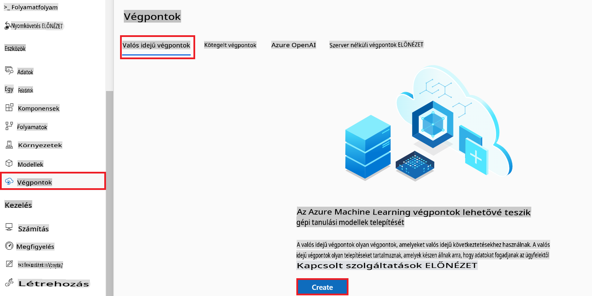

1. Kattints a **Create** gombra.

1. Válaszd ki a létrehozott regisztrált modellt.

    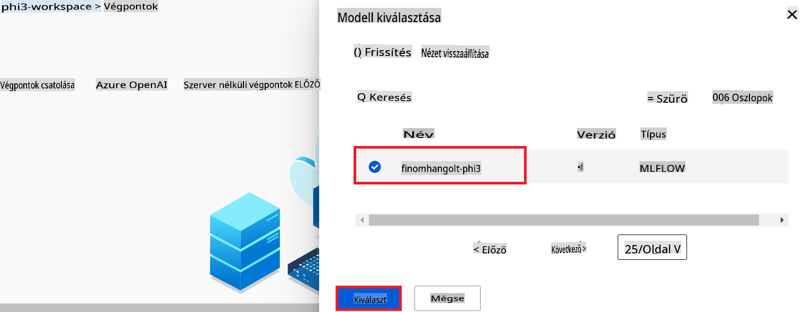

1. Kattints a **Select** gombra.

1. Végezze el az alábbi feladatokat:

    - Állítsd a **Virtual machine** értékét *Standard_NC6s_v3*-ra.
    - Állítsd be a használni kívánt **Instance count** értékét. Például: *1*.
    - Állítsd az **Endpoint** értékét **New**-re, hogy új végpontot hozz létre.
    - Add meg az **Endpoint name**-et. Egyedi értéknek kell lennie.
    - Add meg a **Deployment name**-et. Egyedi értéknek kell lennie.

    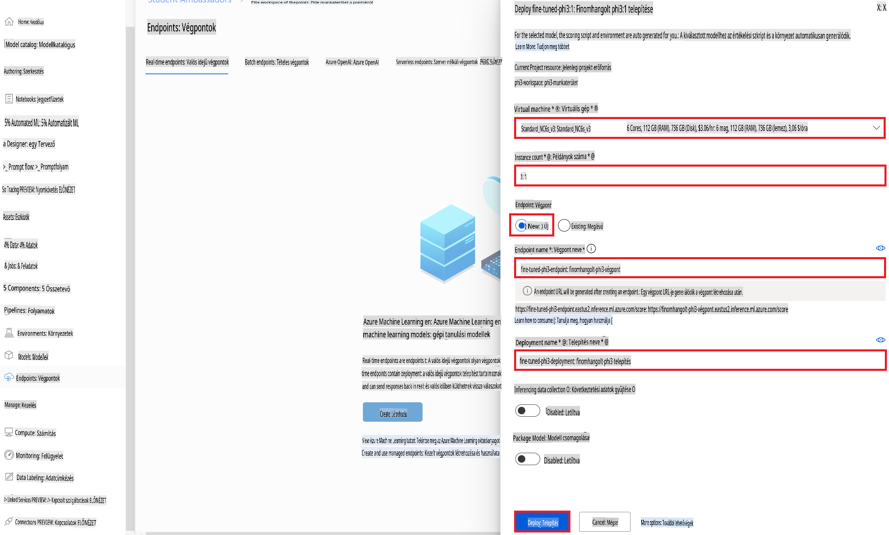

1. Kattints a **Deploy** gombra.

> [!WARNING]
> A további költségek elkerülése érdekében győződj meg arról, hogy törlöd a létrehozott végpontot az Azure Machine Learning munkaterületen.
>

#### A telepítési állapot ellenőrzése az Azure Machine Learning munkaterületen

1. Navigálj a létrehozott Azure Machine Learning munkaterületre.

1. Válaszd ki a bal oldali sávból az **Endpoints** lehetőséget.

1. Válaszd ki a létrehozott végpontot.

    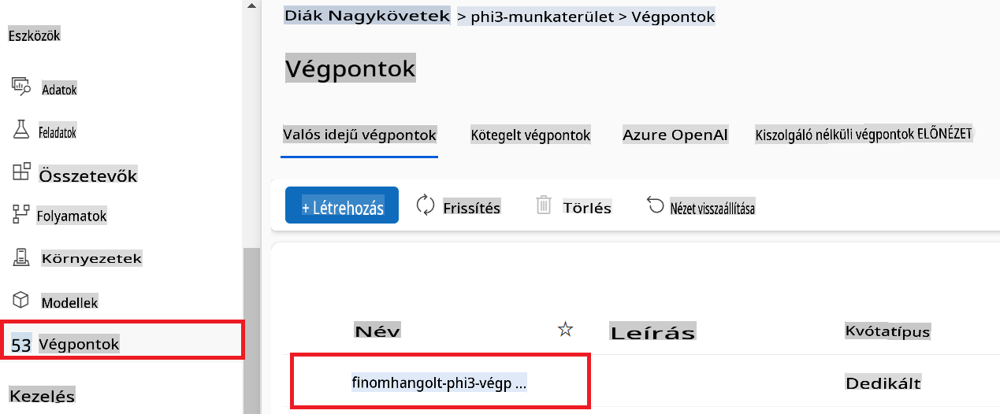

1. Ezen az oldalon kezelheted a végpontokat a telepítési folyamat során.

> [!NOTE]
> A telepítés befejezése után győződj meg arról, hogy a **Live traffic** értéke **100%**. Ha nem az, válaszd az **Update traffic** lehetőséget a forgalmi beállítások módosításához. Ne feledd, hogy a modellt nem tudod tesztelni, ha a forgalom 0%-ra van állítva.
>
> 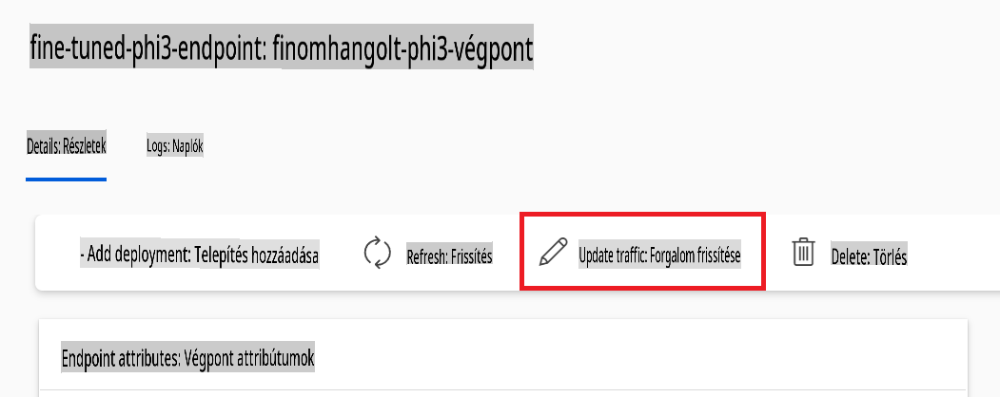
>
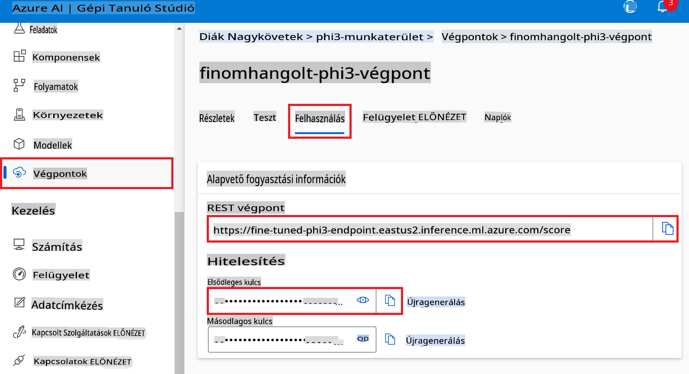

#### Egyéni kapcsolat hozzáadása

1. Látogass el az [Azure AI Foundry](https://ai.azure.com/?WT.mc_id=aiml-137032-kinfeylo) oldalára.

1. Navigálj az általad létrehozott Azure AI Foundry projekthez.

1. A létrehozott projektben válaszd ki a bal oldali menüből a **Beállítások** opciót.

1. Válaszd a **+ Új kapcsolat** lehetőséget.

    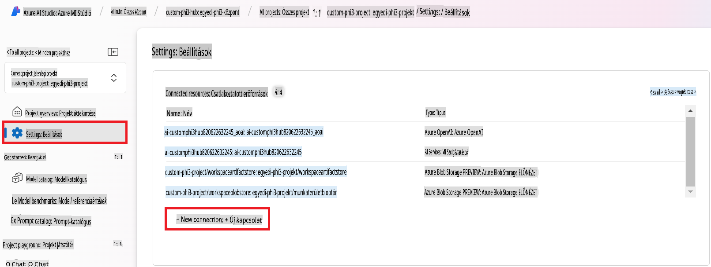

1. A navigációs menüben válaszd az **Egyéni kulcsok** lehetőséget.

    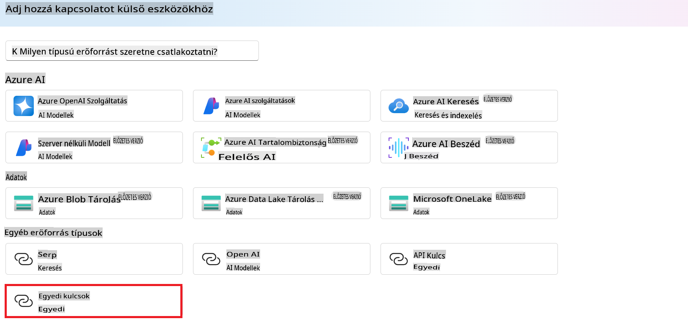

1. Hajtsd végre a következő lépéseket:

    - Válaszd a **+ Kulcs-érték párok hozzáadása** opciót.
    - A kulcs neve mezőbe írd be, hogy **endpoint**, és illeszd be az Azure ML Studio-ból másolt végpontot az érték mezőbe.
    - Ismét válaszd a **+ Kulcs-érték párok hozzáadása** opciót.
    - A kulcs neve mezőbe írd be, hogy **key**, és illeszd be az Azure ML Studio-ból másolt kulcsot az érték mezőbe.
    - Miután hozzáadtad a kulcsokat, jelöld be az **is secret** opciót, hogy a kulcs ne legyen látható.

    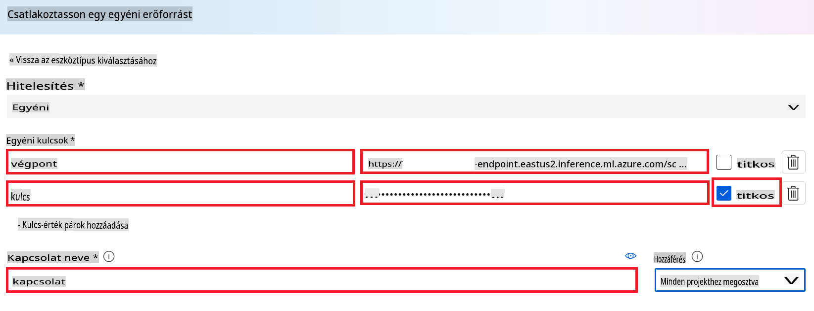

1. Válaszd a **Kapcsolat hozzáadása** opciót.

#### Prompt flow létrehozása

Most, hogy egyéni kapcsolatot hoztál létre az Azure AI Foundry-ban, létrehozunk egy Prompt flow-t az alábbi lépésekkel. Ezt követően csatlakoztatjuk a Prompt flow-t az egyéni kapcsolathoz, hogy használni tudd a finomhangolt modellt a Prompt flow-ban.

1. Navigálj az általad létrehozott Azure AI Foundry projekthez.

1. A bal oldali menüben válaszd a **Prompt flow** opciót.

1. A navigációs menüben válaszd a **+ Létrehozás** opciót.

    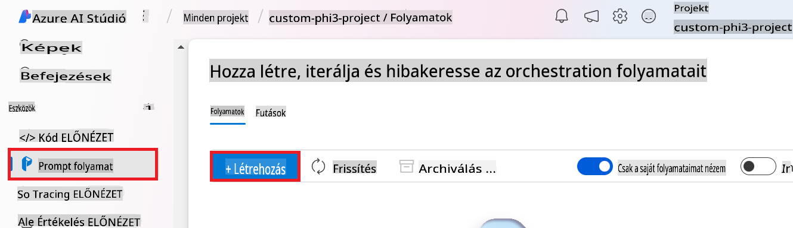

1. A navigációs menüben válaszd a **Chat flow** opciót.

    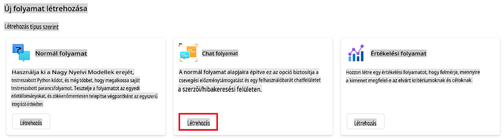

1. Add meg a használni kívánt **Mappa nevet**.

    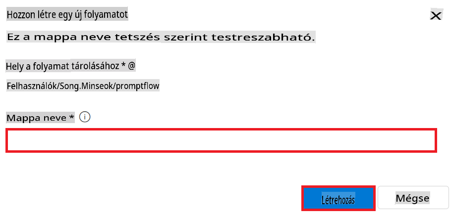

2. Válaszd a **Létrehozás** opciót.

#### Prompt flow beállítása az egyéni Phi-3 modellel való csevegéshez

Integrálnod kell a finomhangolt Phi-3 modellt egy Prompt flow-ba. Azonban a meglévő Prompt flow nem erre a célra készült. Ezért újra kell tervezned a Prompt flow-t, hogy lehetővé tedd az egyéni modell integrációját.

1. A Prompt flow-ban hajtsd végre a következő lépéseket a meglévő folyamat újratervezéséhez:

    - Válaszd a **Nyers fájl mód** opciót.
    - Töröld az összes meglévő kódot a *flow.dag.yml* fájlból.
    - Add hozzá a következő kódot a *flow.dag.yml* fájlhoz.

        ```yml
        inputs:
          input_data:
            type: string
            default: "Who founded Microsoft?"

        outputs:
          answer:
            type: string
            reference: ${integrate_with_promptflow.output}

        nodes:
        - name: integrate_with_promptflow
          type: python
          source:
            type: code
            path: integrate_with_promptflow.py
          inputs:
            input_data: ${inputs.input_data}
        ```

    - Válaszd a **Mentés** opciót.

    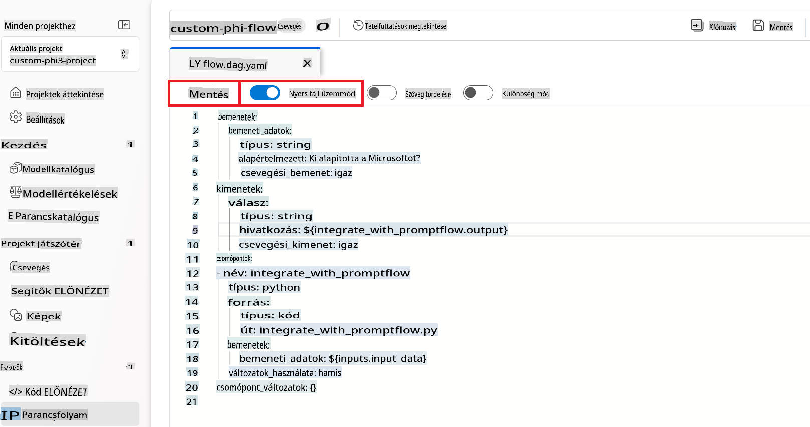

1. Add hozzá a következő kódot az *integrate_with_promptflow.py* fájlhoz, hogy az egyéni Phi-3 modellt használhasd a Prompt flow-ban.

    ```python
    import logging
    import requests
    from promptflow import tool
    from promptflow.connections import CustomConnection

    # Logging setup
    logging.basicConfig(
        format="%(asctime)s - %(levelname)s - %(name)s - %(message)s",
        datefmt="%Y-%m-%d %H:%M:%S",
        level=logging.DEBUG
    )
    logger = logging.getLogger(__name__)

    def query_phi3_model(input_data: str, connection: CustomConnection) -> str:
        """
        Send a request to the Phi-3 model endpoint with the given input data using Custom Connection.
        """

        # "connection" is the name of the Custom Connection, "endpoint", "key" are the keys in the Custom Connection
        endpoint_url = connection.endpoint
        api_key = connection.key

        headers = {
            "Content-Type": "application/json",
            "Authorization": f"Bearer {api_key}"
        }
        data = {
            "input_data": {
                "input_string": [
                    {"role": "user", "content": input_data}
                ],
                "parameters": {
                    "temperature": 0.7,
                    "max_new_tokens": 128
                }
            }
        }
        try:
            response = requests.post(endpoint_url, json=data, headers=headers)
            response.raise_for_status()
            
            # Log the full JSON response
            logger.debug(f"Full JSON response: {response.json()}")

            result = response.json()["output"]
            logger.info("Successfully received response from Azure ML Endpoint.")
            return result
        except requests.exceptions.RequestException as e:
            logger.error(f"Error querying Azure ML Endpoint: {e}")
            raise

    @tool
    def my_python_tool(input_data: str, connection: CustomConnection) -> str:
        """
        Tool function to process input data and query the Phi-3 model.
        """
        return query_phi3_model(input_data, connection)

    ```

    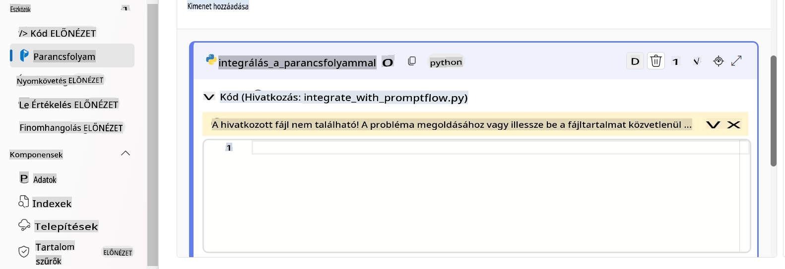

> [!NOTE]
> További részletekért a Prompt flow használatáról az Azure AI Foundry-ban, látogass el ide: [Prompt flow in Azure AI Foundry](https://learn.microsoft.com/azure/ai-studio/how-to/prompt-flow).

1. Válaszd ki a **Chat input** és **Chat output** opciókat, hogy lehetővé tedd a csevegést a modellel.

    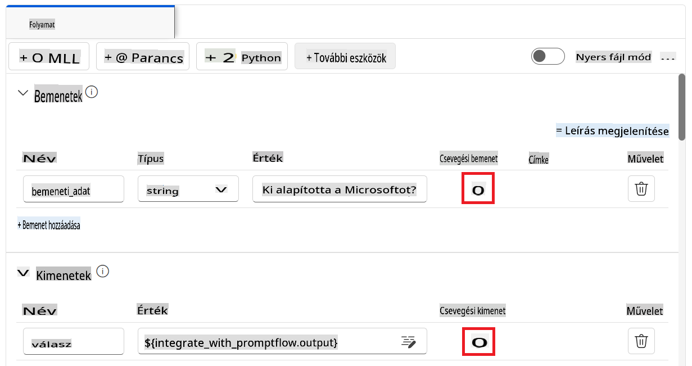

1. Most már készen állsz arra, hogy csevegj az egyéni Phi-3 modellel. A következő gyakorlatban megtanulod, hogyan indítsd el a Prompt flow-t, és hogyan használd a finomhangolt Phi-3 modellel való csevegéshez.

> [!NOTE]
>
> Az újratervezett folyamatnak az alábbi képen látható módon kell kinéznie:
>
> 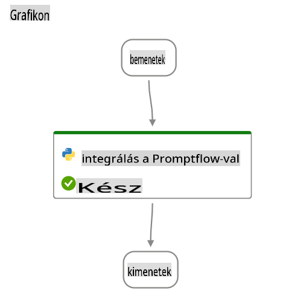
>

### Csevegés az egyéni Phi-3 modellel

Most, hogy finomhangoltad és integráltad az egyéni Phi-3 modellt a Prompt flow-val, készen állsz arra, hogy elkezdd a vele való interakciót. Ez a gyakorlat végigvezet a modell beállításának és csevegésének folyamatán a Prompt flow használatával. A lépések követésével teljes mértékben kihasználhatod a finomhangolt Phi-3 modell képességeit különféle feladatok és beszélgetések során.

- Csevegj az egyéni Phi-3 modellel a Prompt flow használatával.

#### Prompt flow indítása

1. Válaszd a **Számítási munkamenet indítása** opciót a Prompt flow elindításához.

    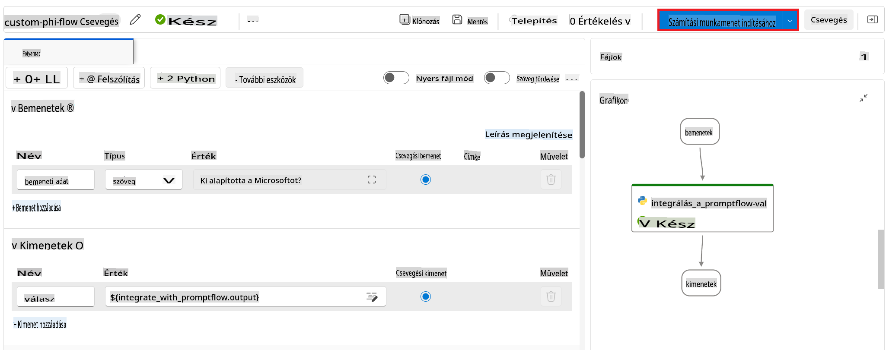

1. Válaszd a **Bemenet érvényesítése és feldolgozása** opciót a paraméterek frissítéséhez.

    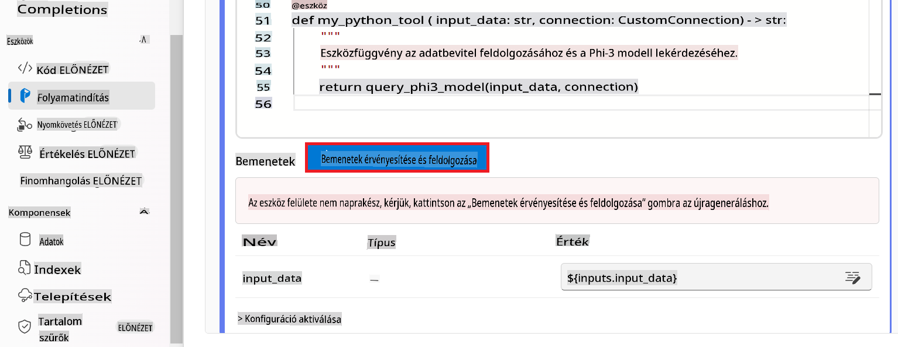

1. Válaszd ki a **Kapcsolat** **Értékét** az általad létrehozott egyéni kapcsolathoz. Például *connection*.

    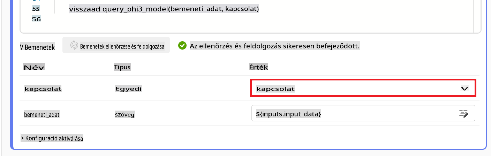

#### Csevegés az egyéni modellel

1. Válaszd a **Chat** opciót.

    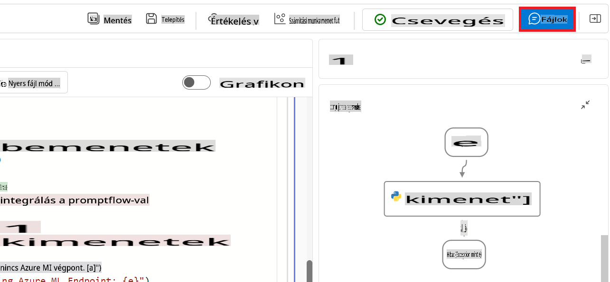

1. Íme egy példa az eredményekre: Most már cseveghetsz az egyéni Phi-3 modellel. Javasolt olyan kérdéseket feltenni, amelyek az adatokon alapulnak, amelyeket a finomhangoláshoz használtál.

    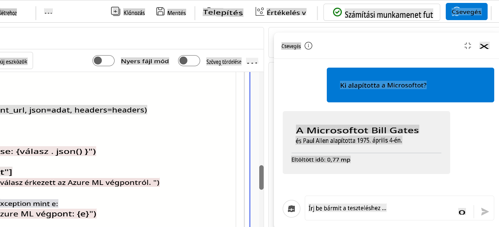

**Felelősségkizárás**:  
Ez a dokumentum gépi AI fordítószolgáltatások segítségével lett lefordítva. Bár törekszünk a pontosságra, kérjük, vegye figyelembe, hogy az automatikus fordítások hibákat vagy pontatlanságokat tartalmazhatnak. Az eredeti dokumentum az eredeti nyelvén tekintendő hiteles forrásnak. Kritikus információk esetén javasolt a professzionális, emberi fordítás igénybevétele. Nem vállalunk felelősséget az ebből a fordításból eredő félreértésekért vagy téves értelmezésekért.