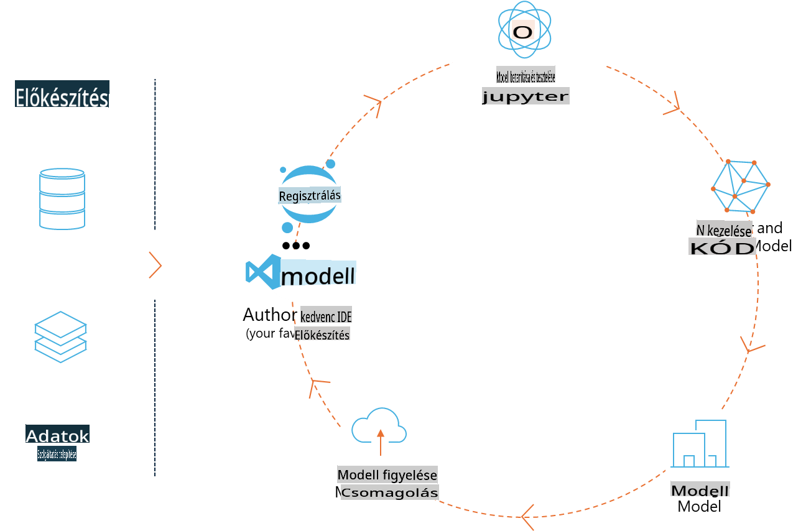
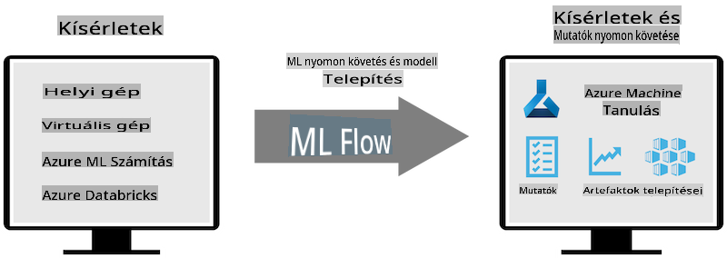
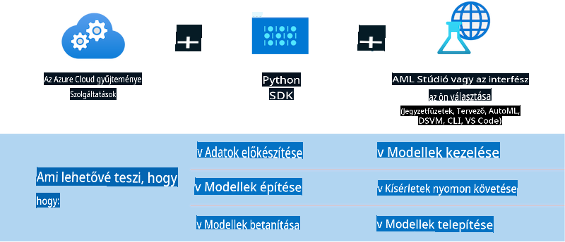

# MLflow

[MLflow](https://mlflow.org/) egy nyílt forráskódú platform, amelyet a gépi tanulás teljes életciklusának kezelésére terveztek.



Az MLFlow a gépi tanulási életciklus kezelésére szolgál, beleértve a kísérletezést, a reprodukálhatóságot, a telepítést és egy központi modellregisztert. Az MLFlow jelenleg négy komponenst kínál:

- **MLflow Tracking:** Kísérletek, kód, adatkonfigurációk és eredmények rögzítése és lekérdezése.
- **MLflow Projects:** Adattudományi kód csomagolása olyan formátumban, amely reprodukálható futtatásokat tesz lehetővé bármely platformon.
- **MLflow Models:** Gépi tanulási modellek telepítése különféle kiszolgálási környezetekben.
- **Model Registry:** Modellek tárolása, annotálása és kezelése egy központi tárhelyen.

Az MLFlow lehetőséget nyújt a kísérletek nyomon követésére, a kód reprodukálható futtatásokba való csomagolására, valamint a modellek megosztására és telepítésére. Az MLFlow integrálva van a Databricks platformba, és számos gépi tanulási könyvtárat támogat, így könyvtárfüggetlen. Bármely gépi tanulási könyvtárral és bármely programozási nyelven használható, mivel REST API-t és CLI-t biztosít a kényelem érdekében.



Az MLFlow főbb jellemzői:

- **Kísérletkövetés:** Paraméterek és eredmények rögzítése és összehasonlítása.
- **Modellkezelés:** Modellek telepítése különböző kiszolgálási és inferenciaplatformokra.
- **Model Registry:** Az MLFlow modellek életciklusának közös kezelése, beleértve a verziókezelést és az annotációkat.
- **Projektek:** Gépi tanulási kód csomagolása megosztásra vagy gyártási használatra.

Az MLFlow támogatja az MLOps ciklust is, amely magában foglalja az adatok előkészítését, a modellek regisztrálását és kezelését, a modellek végrehajtásra való csomagolását, szolgáltatások telepítését és a modellek monitorozását. Célja, hogy egyszerűsítse a prototípustól a gyártási munkafolyamatig vezető folyamatot, különösen a felhő- és peremhálózati környezetekben.

## E2E Szenárió - Wrapper készítése és Phi-3 használata MLFlow modelként

Ebben az E2E mintában két különböző megközelítést mutatunk be egy wrapper létrehozására a Phi-3 kisméretű nyelvi modell (SLM) köré, majd annak MLFlow modellként való futtatására helyben vagy a felhőben, például egy Azure Machine Learning munkaterületen.



| Projekt | Leírás | Helyszín |
| ------------ | ----------- | -------- |
| Transformer Pipeline | A Transformer Pipeline a legegyszerűbb lehetőség egy wrapper készítésére, ha HuggingFace modellt szeretnél használni az MLFlow kísérleti transformers ízével. | [**TransformerPipeline.ipynb**](../../../../../../code/06.E2E/E2E_Phi-3-MLflow_TransformerPipeline.ipynb) |
| Egyedi Python Wrapper | Az írás idején a transformer pipeline nem támogatta az MLFlow wrapper generálását HuggingFace modellekhez ONNX formátumban, még az optimális kísérleti Python csomaggal sem. Az ilyen esetekben egyedi Python wrapper készíthető az MLFlow modellhez. | [**CustomPythonWrapper.ipynb**](../../../../../../code/06.E2E/E2E_Phi-3-MLflow_CustomPythonWrapper.ipynb) |

## Projekt: Transformer Pipeline

1. Az MLFlow és HuggingFace releváns Python csomagjaira lesz szükséged:

    ``` Python
    import mlflow
    import transformers
    ```

2. Ezután el kell indítanod egy transformer pipeline-t a cél Phi-3 modellre hivatkozva a HuggingFace regiszterében. Ahogy a _Phi-3-mini-4k-instruct_ modellkártyáján látható, a feladata "szöveg generálás" típusú:

    ``` Python
    pipeline = transformers.pipeline(
        task = "text-generation",
        model = "microsoft/Phi-3-mini-4k-instruct"
    )
    ```

3. Most elmentheted a Phi-3 modell transformer pipeline-ját MLFlow formátumban, és megadhatod a további részleteket, például a cél műtárgyak elérési útját, a specifikus modellkonfigurációs beállításokat és az inferencia API típusát:

    ``` Python
    model_info = mlflow.transformers.log_model(
        transformers_model = pipeline,
        artifact_path = "phi3-mlflow-model",
        model_config = model_config,
        task = "llm/v1/chat"
    )
    ```

## Projekt: Egyedi Python Wrapper

1. Itt használhatjuk a Microsoft [ONNX Runtime generate() API-ját](https://github.com/microsoft/onnxruntime-genai) az ONNX modell inferenciájához és a tokenek kódolásához / dekódolásához. Az _onnxruntime_genai_ csomagot kell választanod a cél számítási környezetedhez, az alábbi példa CPU-t céloz:

    ``` Python
    import mlflow
    from mlflow.models import infer_signature
    import onnxruntime_genai as og
    ```

1. Egyedi osztályunk két metódust valósít meg: _load_context()_ az **ONNX modell**, a **generátor paraméterek** és a **tokenizáló** inicializálásához; valamint a _predict()_ metódust, amely kimeneti tokeneket generál az adott prompthoz:

    ``` Python
    class Phi3Model(mlflow.pyfunc.PythonModel):
        def load_context(self, context):
            # Retrieving model from the artifacts
            model_path = context.artifacts["phi3-mini-onnx"]
            model_options = {
                 "max_length": 300,
                 "temperature": 0.2,         
            }
        
            # Defining the model
            self.phi3_model = og.Model(model_path)
            self.params = og.GeneratorParams(self.phi3_model)
            self.params.set_search_options(**model_options)
            
            # Defining the tokenizer
            self.tokenizer = og.Tokenizer(self.phi3_model)
    
        def predict(self, context, model_input):
            # Retrieving prompt from the input
            prompt = model_input["prompt"][0]
            self.params.input_ids = self.tokenizer.encode(prompt)
    
            # Generating the model's response
            response = self.phi3_model.generate(self.params)
    
            return self.tokenizer.decode(response[0][len(self.params.input_ids):])
    ```

1. Most használhatod az _mlflow.pyfunc.log_model()_ függvényt, hogy egy egyedi Python wrappert generálj (pickle formátumban) a Phi-3 modellhez, az eredeti ONNX modellel és a szükséges függőségekkel együtt:

    ``` Python
    model_info = mlflow.pyfunc.log_model(
        artifact_path = artifact_path,
        python_model = Phi3Model(),
        artifacts = {
            "phi3-mini-onnx": "cpu_and_mobile/cpu-int4-rtn-block-32-acc-level-4",
        },
        input_example = input_example,
        signature = infer_signature(input_example, ["Run"]),
        extra_pip_requirements = ["torch", "onnxruntime_genai", "numpy"],
    )
    ```

## Az MLFlow modellek aláírásai

1. A fenti Transformer Pipeline projekt 3. lépésében az MLFlow modell feladatát "_llm/v1/chat_" értékre állítottuk. Ez az utasítás egy olyan modell API wrappert generál, amely kompatibilis az OpenAI Chat API-jával, az alábbiak szerint:

    ``` Python
    {inputs: 
      ['messages': Array({content: string (required), name: string (optional), role: string (required)}) (required), 'temperature': double (optional), 'max_tokens': long (optional), 'stop': Array(string) (optional), 'n': long (optional), 'stream': boolean (optional)],
    outputs: 
      ['id': string (required), 'object': string (required), 'created': long (required), 'model': string (required), 'choices': Array({finish_reason: string (required), index: long (required), message: {content: string (required), name: string (optional), role: string (required)} (required)}) (required), 'usage': {completion_tokens: long (required), prompt_tokens: long (required), total_tokens: long (required)} (required)],
    params: 
      None}
    ```

1. Ennek eredményeként a promptodat a következő formátumban küldheted be:

    ``` Python
    messages = [{"role": "user", "content": "What is the capital of Spain?"}]
    ```

1. Ezután használhatod az OpenAI API-kompatibilis utófeldolgozást, például a _response[0][‘choices’][0][‘message’][‘content’]_ kódot, hogy az eredményt szépen formázott módon jelenítsd meg, például így:

    ``` JSON
    Question: What is the capital of Spain?
    
    Answer: The capital of Spain is Madrid. It is the largest city in Spain and serves as the political, economic, and cultural center of the country. Madrid is located in the center of the Iberian Peninsula and is known for its rich history, art, and architecture, including the Royal Palace, the Prado Museum, and the Plaza Mayor.
    
    Usage: {'prompt_tokens': 11, 'completion_tokens': 73, 'total_tokens': 84}
    ```

1. A fenti Egyedi Python Wrapper projekt 3. lépésében engedélyeztük, hogy az MLFlow csomag aláírást generáljon egy adott bemeneti példából. Az MLFlow wrapperünk aláírása így fog kinézni:

    ``` Python
    {inputs: 
      ['prompt': string (required)],
    outputs: 
      [string (required)],
    params: 
      None}
    ```

1. Így a promptunknak tartalmaznia kell a "prompt" kulcsszót, például így:

    ``` Python
    {"prompt": "<|system|>You are a stand-up comedian.<|end|><|user|>Tell me a joke about atom<|end|><|assistant|>",}
    ```

1. A modell kimenete ezután sztring formátumban lesz elérhető:

    ``` JSON
    Alright, here's a little atom-related joke for you!
    
    Why don't electrons ever play hide and seek with protons?
    
    Because good luck finding them when they're always "sharing" their electrons!
    
    Remember, this is all in good fun, and we're just having a little atomic-level humor!
    ```

**Felelősség kizárása**:  
Ez a dokumentum gépi AI fordítási szolgáltatások segítségével került lefordításra. Bár törekszünk a pontosságra, kérjük, vegye figyelembe, hogy az automatikus fordítások hibákat vagy pontatlanságokat tartalmazhatnak. Az eredeti dokumentum az eredeti nyelvén tekintendő hiteles forrásnak. Kritikus információk esetén professzionális, emberi fordítás igénybevétele javasolt. Nem vállalunk felelősséget az ezen fordítás használatából eredő félreértésekért vagy téves értelmezésekért.