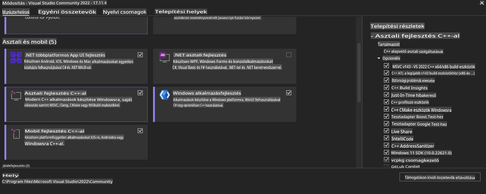
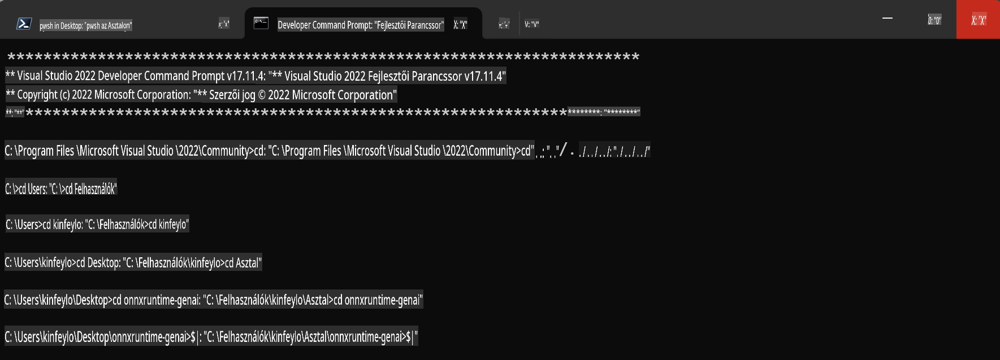

# **Útmutató az OnnxRuntime GenAI Windows GPU-hoz**

Ez az útmutató lépéseket nyújt az ONNX Runtime (ORT) GPU-kkal való beállításához és használatához Windows rendszeren. Célja, hogy segítsen kihasználni a GPU gyorsítás előnyeit a modellek teljesítményének és hatékonyságának javítása érdekében.

Az útmutató az alábbiakat tartalmazza:

- Környezet beállítása: Útmutatás a szükséges függőségek, például CUDA, cuDNN és ONNX Runtime telepítéséhez.
- Konfiguráció: Hogyan lehet az környezetet és az ONNX Runtime-ot hatékonyan konfigurálni a GPU-erőforrások használatához.
- Optimalizálási tippek: Tanácsok a GPU-beállítások finomhangolásához az optimális teljesítmény érdekében.

### **1. Python 3.10.x /3.11.8**

   ***Megjegyzés*** Javasolt a [miniforge](https://github.com/conda-forge/miniforge/releases/latest/download/Miniforge3-Windows-x86_64.exe) használata Python környezetként.

   ```bash

   conda create -n pydev python==3.11.8

   conda activate pydev

   ```

   ***Emlékeztető*** Ha bármilyen ONNX Python könyvtárat telepítettél, először távolítsd el azt.

### **2. Telepítsd a CMake-et a winget segítségével**

   ```bash

   winget install -e --id Kitware.CMake

   ```

### **3. Telepítsd a Visual Studio 2022-t - Asztali fejlesztés C++-szal**

   ***Megjegyzés*** Ha nem szeretnél fordítani, kihagyhatod ezt a lépést.



### **4. Telepítsd az NVIDIA illesztőprogramokat**

1. **NVIDIA GPU Driver**  [https://www.nvidia.com/en-us/drivers/](https://www.nvidia.com/en-us/drivers/)

2. **NVIDIA CUDA 12.4** [https://developer.nvidia.com/cuda-12-4-0-download-archive](https://developer.nvidia.com/cuda-12-4-0-download-archive)

3. **NVIDIA CUDNN 9.4**  [https://developer.nvidia.com/cudnn-downloads](https://developer.nvidia.com/cudnn-downloads)

***Emlékeztető*** Használj alapértelmezett beállításokat a telepítési folyamat során.

### **5. Állítsd be az NVIDIA környezetet**

Másold az NVIDIA CUDNN 9.4 lib, bin, include fájljait az NVIDIA CUDA 12.4 megfelelő mappáiba.

- másold a *'C:\Program Files\NVIDIA\CUDNN\v9.4\bin\12.6'* fájlokat a *'C:\Program Files\NVIDIA GPU Computing Toolkit\CUDA\v12.4\bin'* mappába.

- másold a *'C:\Program Files\NVIDIA\CUDNN\v9.4\include\12.6'* fájlokat a *'C:\Program Files\NVIDIA GPU Computing Toolkit\CUDA\v12.4\include'* mappába.

- másold a *'C:\Program Files\NVIDIA\CUDNN\v9.4\lib\12.6'* fájlokat a *'C:\Program Files\NVIDIA GPU Computing Toolkit\CUDA\v12.4\lib\x64'* mappába.

### **6. Töltsd le a Phi-3.5-mini-instruct-onnx fájlt**

   ```bash

   winget install -e --id Git.Git

   winget install -e --id GitHub.GitLFS

   git lfs install

   git clone https://huggingface.co/microsoft/Phi-3.5-mini-instruct-onnx

   ```

### **7. Futtasd a InferencePhi35Instruct.ipynb fájlt**

   Nyisd meg a [Notebook](../../../../../../code/09.UpdateSamples/Aug/ortgpu-phi35-instruct.ipynb) fájlt, és hajtsd végre.


### **8. Fordítsd le az ORT GenAI GPU-t**

   ***Megjegyzés*** 
   
   1. Először távolíts el minden ONNX, ONNX Runtime és ONNX Runtime GenAI könyvtárat.

   ```bash

   pip list 
   
   ```

   Ezután távolíts el minden ONNX Runtime könyvtárat, például:

   ```bash

   pip uninstall onnxruntime

   pip uninstall onnxruntime-genai

   pip uninstall onnxruntume-genai-cuda
   
   ```

   2. Ellenőrizd a Visual Studio kiterjesztés támogatását.

   Ellenőrizd, hogy a C:\Program Files\NVIDIA GPU Computing Toolkit\CUDA\v12.4\extras mappában megtalálható-e a visual_studio_integration mappa. 
   
   Ha nem található, nézd meg a többi CUDA toolkit illesztőprogram mappát, és másold a visual_studio_integration mappát és annak tartalmát a C:\Program Files\NVIDIA GPU Computing Toolkit\CUDA\v12.4\extras mappába.

   - Ha nem szeretnél fordítani, kihagyhatod ezt a lépést.

   ```bash

   git clone https://github.com/microsoft/onnxruntime-genai

   ```

   - Töltsd le a [https://github.com/microsoft/onnxruntime/releases/download/v1.19.2/onnxruntime-win-x64-gpu-1.19.2.zip](https://github.com/microsoft/onnxruntime/releases/download/v1.19.2/onnxruntime-win-x64-gpu-1.19.2.zip) fájlt.

   - Csomagold ki a onnxruntime-win-x64-gpu-1.19.2.zip fájlt, nevezd át **ort** névre, és másold az ort mappát az onnxruntime-genai mappába.

   - Használj Windows Terminált, lépj be a VS 2022 fejlesztői parancssorába, majd navigálj az onnxruntime-genai mappába.



   - Fordítsd le a Python környezeteddel.

   ```bash

   cd onnxruntime-genai

   python build.py --use_cuda  --cuda_home "C:\Program Files\NVIDIA GPU Computing Toolkit\CUDA\v12.4" --config Release
 

   cd build/Windows/Release/Wheel

   pip install .whl

   ```

**Felelősségkizárás**:  
Ez a dokumentum gépi AI fordítási szolgáltatások segítségével lett lefordítva. Bár törekszünk a pontosságra, kérjük, vegye figyelembe, hogy az automatikus fordítások hibákat vagy pontatlanságokat tartalmazhatnak. Az eredeti dokumentum az eredeti nyelvén tekinthető hiteles forrásnak. Kritikus információk esetén javasolt a professzionális, emberi fordítás igénybevétele. Nem vállalunk felelősséget az ebből a fordításból eredő félreértésekért vagy téves értelmezésekért.