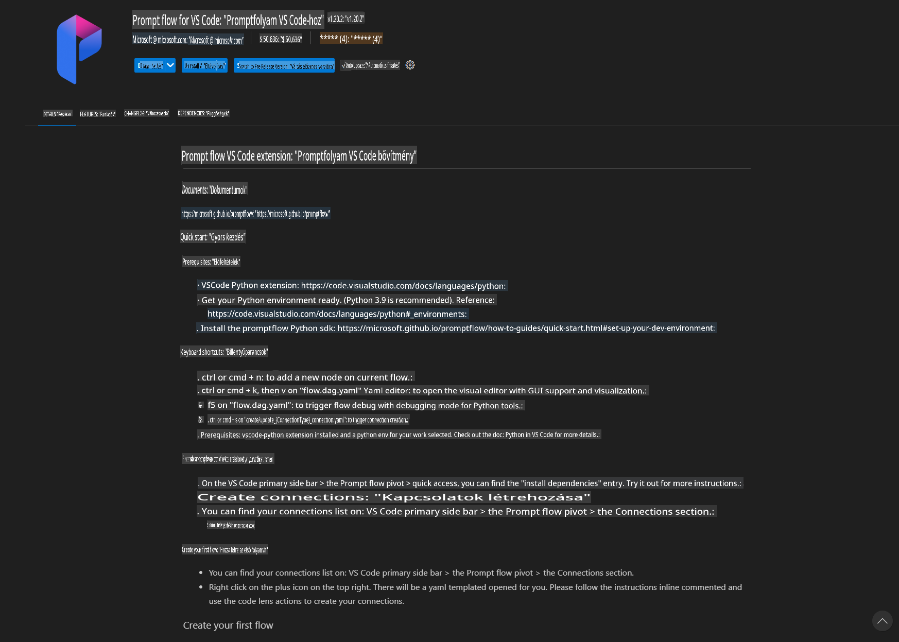
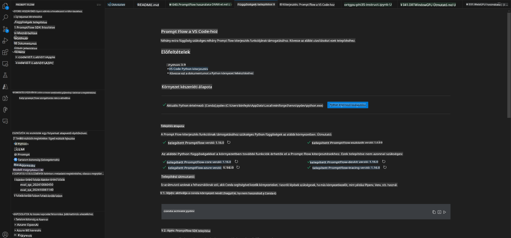
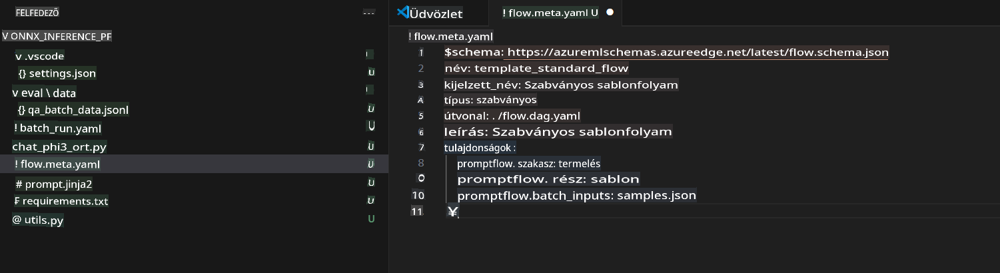
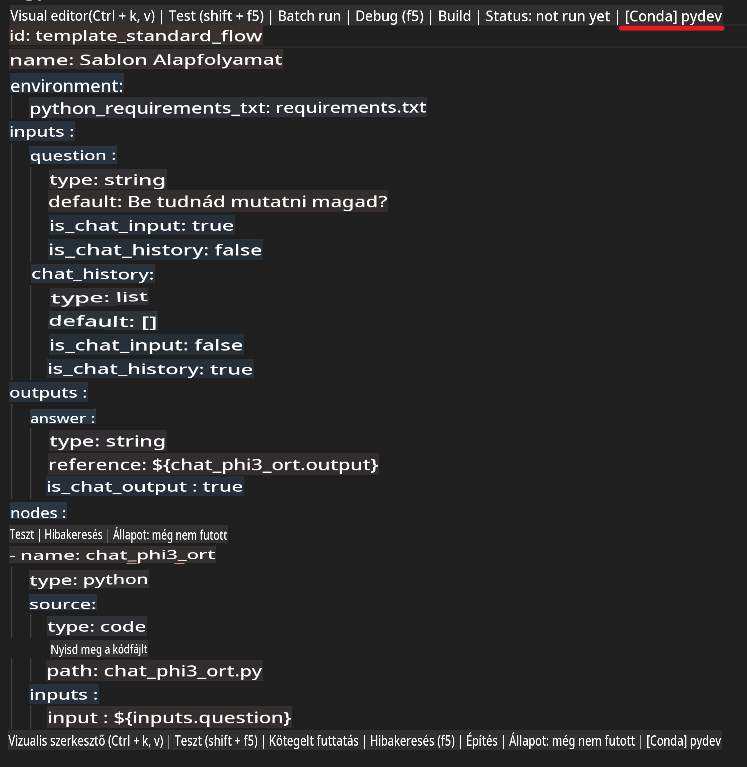
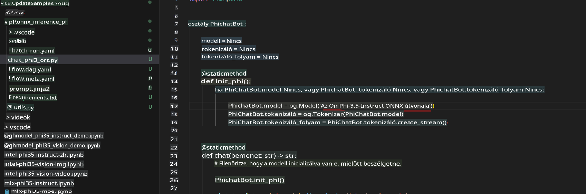
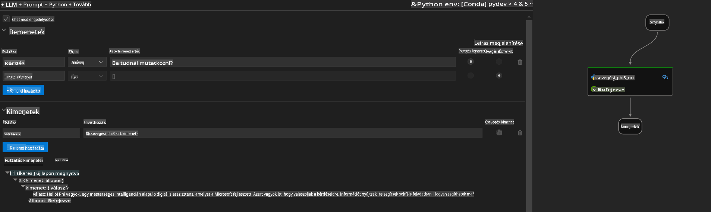
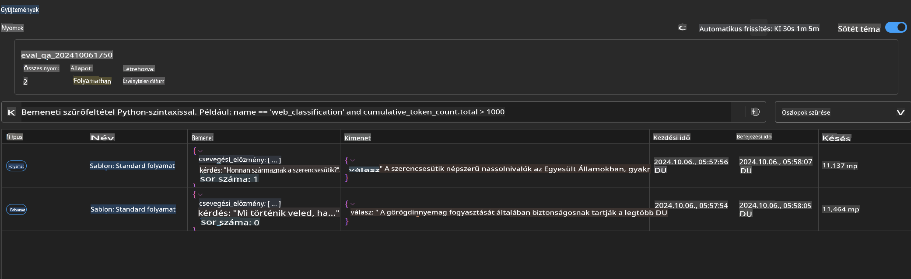

# Windows GPU használata Prompt Flow megoldás létrehozásához Phi-3.5-Instruct ONNX segítségével

Az alábbi dokumentum bemutatja, hogyan használható a PromptFlow az ONNX (Open Neural Network Exchange) segítségével AI-alkalmazások fejlesztéséhez Phi-3 modellek alapján.

A PromptFlow egy fejlesztői eszközkészlet, amely az LLM-alapú (Large Language Model) AI-alkalmazások teljes fejlesztési ciklusát leegyszerűsíti, az ötleteléstől és prototípus-készítéstől kezdve a tesztelésen és értékelésen át.

A PromptFlow és az ONNX integrálásával a fejlesztők a következőket érhetik el:

- **Modellek teljesítményének optimalizálása**: Az ONNX segítségével hatékonyabb modell-inferenciát és -telepítést valósíthatnak meg.
- **Fejlesztés egyszerűsítése**: A PromptFlow segítségével kezelhetik a munkafolyamatokat és automatizálhatják az ismétlődő feladatokat.
- **Együttműködés javítása**: Egységes fejlesztési környezet biztosításával megkönnyíthetik a csapaton belüli együttműködést.

A **Prompt Flow** egy fejlesztői eszközkészlet, amely az LLM-alapú AI-alkalmazások teljes fejlesztési ciklusát leegyszerűsíti, az ötleteléstől, prototípus-készítéstől, teszteléstől, értékeléstől egészen a gyártási telepítésig és monitorozásig. Lehetővé teszi a prompt engineering egyszerűbbé tételét, és segít olyan LLM-alkalmazások létrehozásában, amelyek gyártási minőségűek.

A Prompt Flow képes kapcsolódni az OpenAI-hoz, az Azure OpenAI Service-hez és testreszabható modellekhez (Huggingface, helyi LLM/SLM). A célunk a Phi-3.5 kvantált ONNX modell helyi alkalmazásokhoz történő telepítése. A Prompt Flow segít jobban megtervezni üzleti folyamatainkat és helyi megoldásokat létrehozni Phi-3.5 alapján. Ebben a példában az ONNX Runtime GenAI Library-t fogjuk használni, hogy elkészítsük a Prompt Flow megoldást Windows GPU-n.

## **Telepítés**

### **ONNX Runtime GenAI Windows GPU-hoz**

Olvasd el ezt az útmutatót az ONNX Runtime GenAI Windows GPU-hoz való beállításához [kattints ide](./ORTWindowGPUGuideline.md)

### **Prompt Flow beállítása VSCode-ban**

1. Telepítsd a Prompt Flow VS Code bővítményt.



2. Miután telepítetted a Prompt Flow VS Code bővítményt, kattints a bővítményre, majd válaszd a **Telepítési függőségek** opciót, és kövesd az útmutatót a Prompt Flow SDK környezetedbe való telepítéséhez.



3. Töltsd le a [Minta Kódot](../../../../../../code/09.UpdateSamples/Aug/pf/onnx_inference_pf), és nyisd meg a VS Code-ban.



4. Nyisd meg a **flow.dag.yaml** fájlt, és válaszd ki a Python környezetedet.



   Nyisd meg a **chat_phi3_ort.py** fájlt, és állítsd be a Phi-3.5-instruct ONNX modell helyét.



5. Futtasd a Prompt Flow-t tesztelés céljából.

Nyisd meg a **flow.dag.yaml** fájlt, és kattints a vizuális szerkesztőre.


Kattints rá, majd futtasd a teszteléshez.



1. Futtathatsz batch folyamatokat a terminálban további eredmények ellenőrzéséhez.

```bash

pf run create --file batch_run.yaml --stream --name 'Your eval qa name'    

```

Ellenőrizheted az eredményeket az alapértelmezett böngésződben.



**Jogi nyilatkozat**:  
Ez a dokumentum gépi AI fordítási szolgáltatások segítségével készült. Bár törekszünk a pontosságra, kérjük, vegye figyelembe, hogy az automatikus fordítások hibákat vagy pontatlanságokat tartalmazhatnak. Az eredeti dokumentum az eredeti nyelvén tekintendő hiteles forrásnak. Kritikus információk esetén javasolt professzionális, emberi fordítást igénybe venni. Nem vállalunk felelősséget az ebből a fordításból eredő félreértésekért vagy téves értelmezésekért.