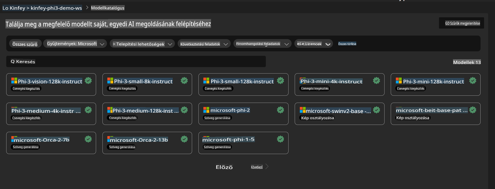
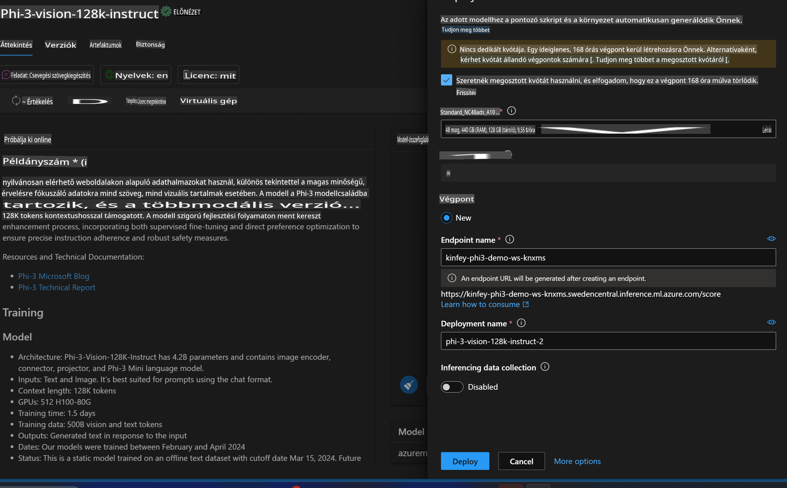
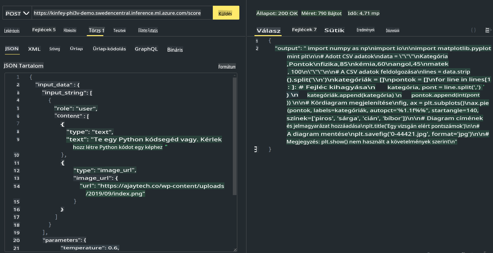

# **3. labor - Phi-3-Vision telepítése az Azure Machine Learning Service-ben**

Az NPU segítségével végezzük el a helyi kód produkciós telepítését, majd bevezetjük a PHI-3-VISION képességét, hogy képekből kódot generáljunk.

Ebben az útmutatóban gyorsan létrehozhatunk egy Model As Service Phi-3 Vision szolgáltatást az Azure Machine Learning Service-ben.

***Megjegyzés***: A Phi-3 Vision gyors tartalomgeneráláshoz számítási kapacitást igényel. Ehhez felhőalapú számítási erőforrásokra van szükségünk.

### **1. Hozz létre egy Azure Machine Learning Service-t**

Az Azure Portálon hozzunk létre egy Azure Machine Learning Service-t. Ha nem tudod, hogyan kezdj hozzá, látogasd meg ezt a linket: [https://learn.microsoft.com/azure/machine-learning/quickstart-create-resources?view=azureml-api-2](https://learn.microsoft.com/azure/machine-learning/quickstart-create-resources?view=azureml-api-2)

### **2. Válaszd ki a Phi-3 Vision-t az Azure Machine Learning Service-ben**



### **3. Telepítsd a Phi-3-Vision-t az Azure-ban**



### **4. Teszteld az Endpoint-et a Postman-ben**



***Megjegyzés***

1. Az átadandó paramétereknek tartalmazniuk kell az Authorization, azureml-model-deployment és Content-Type elemeket. Ellenőrizd a telepítési információkat ezek megszerzéséhez.

2. A paraméterek átadásához a Phi-3-Vision egy kép linkjét várja. Kérlek, kövesd a GPT-4-Vision módszerét a paraméterek továbbításához, például:

```json

{
  "input_data":{
    "input_string":[
      {
        "role":"user",
        "content":[ 
          {
            "type": "text",
            "text": "You are a Python coding assistant.Please create Python code for image "
          },
          {
              "type": "image_url",
              "image_url": {
                "url": "https://ajaytech.co/wp-content/uploads/2019/09/index.png"
              }
          }
        ]
      }
    ],
    "parameters":{
          "temperature": 0.6,
          "top_p": 0.9,
          "do_sample": false,
          "max_new_tokens": 2048
    }
  }
}

```

3. Használd a Post metódust a **/score** hívásához.

**Gratulálok**! Sikeresen elvégezted a gyors PHI-3-VISION telepítést, és kipróbáltad, hogyan lehet képekből kódot generálni. Következő lépésként kombinálhatjuk az NPU-kat és a felhőt alkalmazások létrehozásához.

**Felelősségkizárás**:  
Ez a dokumentum gépi AI fordítószolgáltatások segítségével került lefordításra. Bár törekszünk a pontosságra, kérjük, vegye figyelembe, hogy az automatikus fordítások hibákat vagy pontatlanságokat tartalmazhatnak. Az eredeti dokumentum az eredeti nyelvén tekintendő hiteles forrásnak. Kritikus információk esetén javasolt a professzionális, emberi fordítás igénybevétele. Nem vállalunk felelősséget az ezen fordítás használatából eredő félreértésekért vagy téves értelmezésekért.