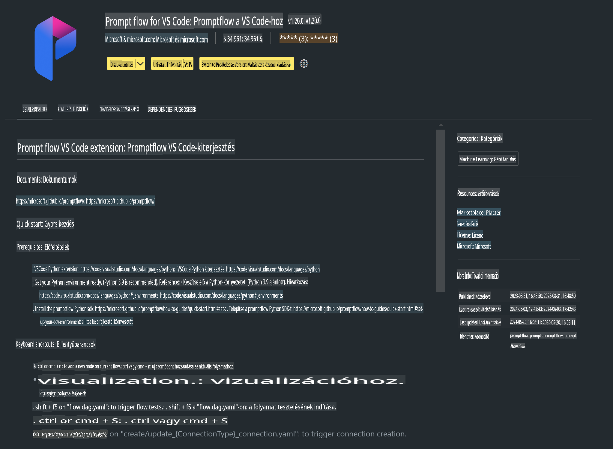

# **Lab 0 - Telepítés**

Amikor belépünk a Lab-ba, be kell állítanunk a megfelelő környezetet:

### **1. Python 3.11+**

Ajánlott a miniforge használata a Python környezet konfigurálásához.

A miniforge konfigurálásához látogass el ide: [https://github.com/conda-forge/miniforge](https://github.com/conda-forge/miniforge)

Miután a miniforge konfigurálva van, futtasd a következő parancsot Power Shell-ben:

```bash

conda create -n pyenv python==3.11.8 -y

conda activate pyenv

```

### **2. Prompt flow SDK telepítése**

A Lab 1-ben a Prompt flow-t használjuk, ezért szükséges a Prompt flow SDK konfigurálása.

```bash

pip install promptflow --upgrade

```

Ezzel a paranccsal ellenőrizheted a Prompt flow SDK-t:

```bash

pf --version

```

### **3. Visual Studio Code Prompt flow bővítmény telepítése**



### **4. Apple MLX keretrendszer**

Az MLX egy tömbalapú keretrendszer gépi tanulási kutatásokhoz Apple Siliconon, amelyet az Apple gépi tanulási kutatócsapata fejlesztett. Az **Apple MLX keretrendszerrel** gyorsíthatod az LLM / SLM működését Apple Siliconon. Ha többet szeretnél megtudni, olvasd el ezt: [https://github.com/microsoft/PhiCookBook/blob/main/md/01.Introduction/03/MLX_Inference.md](https://github.com/microsoft/PhiCookBook/blob/main/md/01.Introduction/03/MLX_Inference.md).

Telepítsd az MLX keretrendszer könyvtárat bash-ben:

```bash

pip install mlx-lm

```

### **5. Egyéb Python könyvtárak**

Hozz létre egy requirements.txt fájlt, és add hozzá ezt a tartalmat:

```txt

notebook
numpy 
scipy 
scikit-learn 
matplotlib 
pandas 
pillow 
graphviz

```

### **6. NVM telepítése**

Telepítsd az nvm-et Powershell-ben:

```bash

brew install nvm

```

Telepítsd a Node.js 18.20-as verzióját:

```bash

nvm install 18.20.0

nvm use 18.20.0

```

### **7. Visual Studio Code fejlesztési támogatás telepítése**

```bash

npm install --global yo generator-code

```

Gratulálunk! Sikeresen konfiguráltad az SDK-t. Most lépj tovább a gyakorlati lépésekre.

**Jogi nyilatkozat**:  
Ez a dokumentum gépi AI fordítószolgáltatásokkal készült fordítás. Bár igyekszünk a pontosságra törekedni, kérjük, vegye figyelembe, hogy az automatizált fordítások hibákat vagy pontatlanságokat tartalmazhatnak. Az eredeti dokumentum az eredeti nyelvén tekintendő hiteles forrásnak. Kritikus információk esetén javasolt a professzionális, emberi fordítás igénybevétele. Nem vállalunk felelősséget a fordítás használatából eredő félreértésekért vagy téves értelmezésekért.