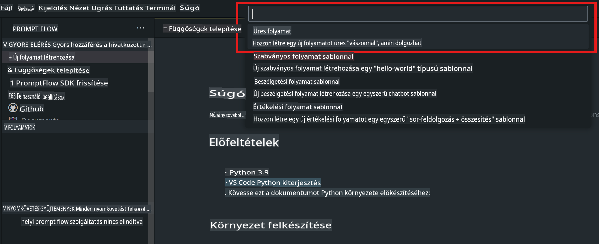
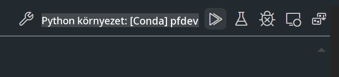

# **2. labor - Prompt flow futtatása Phi-3-mini-vel AIPC-n**

## **Mi az a Prompt flow?**

A Prompt flow egy fejlesztői eszközkészlet, amely az LLM-alapú AI alkalmazások teljes fejlesztési ciklusát leegyszerűsíti az ötleteléstől, prototípus készítésen, tesztelésen, értékelésen át egészen a gyártási telepítésig és monitorozásig. Megkönnyíti a promptok kidolgozását, és lehetővé teszi, hogy gyártási szintű minőségű LLM alkalmazásokat építs.

A Prompt flow segítségével képes leszel:

- Olyan folyamatokat létrehozni, amelyek LLM-eket, promptokat, Python kódot és egyéb eszközöket kapcsolnak össze egy végrehajtható munkafolyamatban.

- Könnyedén hibakeresni és iterálni a folyamataidat, különösen az LLM-ekkel való interakciókat.

- Értékelni a folyamataidat, nagyobb adathalmazokkal számolni a minőségi és teljesítménymutatókat.

- Integrálni a tesztelést és az értékelést a CI/CD rendszeredbe, hogy biztosítsd a folyamataid minőségét.

- A folyamataidat könnyedén telepíteni a választott kiszolgálási platformra, vagy integrálni az alkalmazásod kódjába.

- (Opcionális, de erősen ajánlott) Együttműködni a csapatoddal az Azure AI felhőalapú Prompt flow verziójának kihasználásával.


## **Generációs kód folyamatok építése Apple Siliconon**

***Megjegyzés***: Ha még nem végezted el a környezet telepítését, látogasd meg a [0. labor - Telepítések](./01.Installations.md) oldalt.

1. Nyisd meg a Prompt flow bővítményt a Visual Studio Code-ban, és hozz létre egy üres folyamatprojektet.



2. Adj hozzá bemeneti és kimeneti paramétereket, valamint Python kódot új folyamatként.


Hivatkozhatsz erre a struktúrára (flow.dag.yaml) a folyamatod felépítéséhez:

```yaml

inputs:
  prompt:
    type: string
    default: Write python code for Fibonacci serie. Please use markdown as output
outputs:
  result:
    type: string
    reference: ${gen_code_by_phi3.output}
nodes:
- name: gen_code_by_phi3
  type: python
  source:
    type: code
    path: gen_code_by_phi3.py
  inputs:
    prompt: ${inputs.prompt}


```

3. Phi-3-mini kvantálása

Célunk, hogy az SLM-et hatékonyabban futtassuk helyi eszközökön. Általában a modellt kvantáljuk (INT4, FP16, FP32).

```bash

python -m mlx_lm.convert --hf-path microsoft/Phi-3-mini-4k-instruct

```

**Megjegyzés:** az alapértelmezett mappa neve mlx_model.

4. Adj hozzá kódot a ***Chat_With_Phi3.py*** fájlhoz.

```python


from promptflow import tool

from mlx_lm import load, generate


# The inputs section will change based on the arguments of the tool function, after you save the code
# Adding type to arguments and return value will help the system show the types properly
# Please update the function name/signature per need
@tool
def my_python_tool(prompt: str) -> str:

    model_id = './mlx_model_phi3_mini'

    model, tokenizer = load(model_id)

    # <|user|>\nWrite python code for Fibonacci serie. Please use markdown as output<|end|>\n<|assistant|>

    response = generate(model, tokenizer, prompt="<|user|>\n" + prompt  + "<|end|>\n<|assistant|>", max_tokens=2048, verbose=True)

    return response


```

4. Tesztelheted a folyamatot Debug vagy Run opcióval, hogy ellenőrizd, megfelelő-e a generált kód.



5. Futtasd a folyamatot fejlesztési API-ként a terminálban.

```

pf flow serve --source ./ --port 8080 --host localhost   

```

Tesztelheted Postman / Thunder Client segítségével.


### **Megjegyzések**

1. Az első futtatás hosszú időt vesz igénybe. Javasolt a Phi-3 modell letöltése a Hugging Face CLI-n keresztül.

2. Az Intel NPU korlátozott számítási teljesítményét figyelembe véve ajánlott a Phi-3-mini-4k-instruct használata.

3. Az INT4 konverzióhoz Intel NPU gyorsítást használunk, de ha újraindítod a szolgáltatást, törölni kell a cache és nc_workshop mappákat.


## **Források**

1. Ismerd meg a Promptflow-t: [https://microsoft.github.io/promptflow/](https://microsoft.github.io/promptflow/)

2. Ismerd meg az Intel NPU gyorsítást: [https://github.com/intel/intel-npu-acceleration-library](https://github.com/intel/intel-npu-acceleration-library)

3. Példakód letöltése: [Helyi NPU Ügynök Példakód](../../../../../../../../../code/07.Lab/01/AIPC/local-npu-agent)

**Jogi nyilatkozat**:  
Ez a dokumentum gépi AI fordítószolgáltatások használatával készült fordítás. Bár törekszünk a pontosságra, kérjük, vegye figyelembe, hogy az automatikus fordítások hibákat vagy pontatlanságokat tartalmazhatnak. Az eredeti dokumentum az eredeti nyelvén tekintendő hiteles forrásnak. Kritikus információk esetén javasolt professzionális, emberi fordítást igénybe venni. Nem vállalunk felelősséget a fordítás használatából eredő félreértésekért vagy téves értelmezésekért.