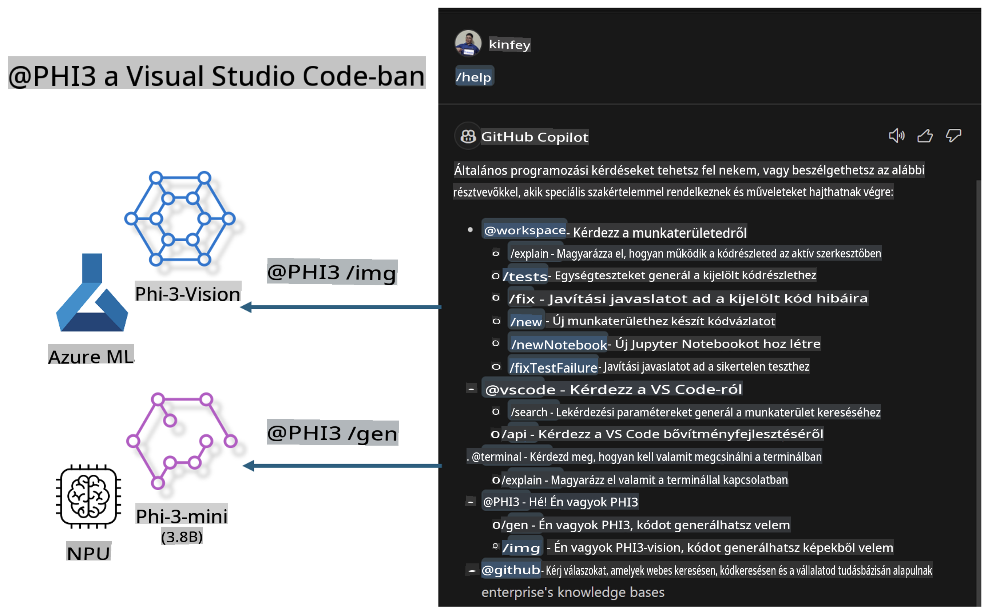

# **Építsd meg saját Visual Studio Code GitHub Copilot Chat-edet a Microsoft Phi-3 családdal**

Használtad már a GitHub Copilot Chat munkaterületi ügynökét? Szeretnéd megépíteni a saját csapatod kódügynökét? Ez a gyakorlati labor célja, hogy az open source modell kombinálásával vállalati szintű kódalapú üzleti ügynököt hozz létre.

## **Alapok**

### **Miért válaszd a Microsoft Phi-3-at**

A Phi-3 egy családsorozat, amely magában foglalja a phi-3-mini, phi-3-small és phi-3-medium modelleket különböző tréningparaméterek alapján szöveg-generáláshoz, párbeszéd-kiegészítéshez és kódgeneráláshoz. Emellett létezik a phi-3-vision, amely a Vision-re épül. Ideális vállalatok vagy különböző csapatok számára, hogy offline generatív AI megoldásokat hozzanak létre.

Ajánlott olvasmány: [https://github.com/microsoft/PhiCookBook/blob/main/md/01.Introduction/01/01.PhiFamily.md](https://github.com/microsoft/PhiCookBook/blob/main/md/01.Introduction/01/01.PhiFamily.md)

### **Microsoft GitHub Copilot Chat**

A GitHub Copilot Chat bővítmény egy csevegési felületet biztosít, amely lehetővé teszi, hogy a GitHub Copilot-tal kommunikálj, és közvetlenül a VS Code-ban kapj válaszokat kódolással kapcsolatos kérdésekre, anélkül, hogy dokumentációkban vagy online fórumokon kellene keresgélned.

A Copilot Chat szintaxiskiemelést, behúzásokat és egyéb formázási funkciókat használhat a generált válaszok tisztábbá tételéhez. A felhasználó kérdésének típusától függően az eredmény tartalmazhat hivatkozásokat a kontextusra, amelyet a Copilot a válasz generálásához használt, például forráskódfájlokra vagy dokumentációkra, illetve gombokat a VS Code funkcióinak eléréséhez.

- A Copilot Chat beépül a fejlesztői munkafolyamatba, és ott nyújt segítséget, ahol szükséged van rá:

- Indíts egy beágyazott csevegést közvetlenül a szerkesztőből vagy a terminálból, ha segítségre van szükséged kódolás közben.

- Használd a Chat nézetet, hogy mindig legyen egy AI asszisztensed kéznél.

- Indíts gyors csevegést, hogy gyors kérdést tehess fel, majd visszatérhess ahhoz, amin dolgozol.

A GitHub Copilot Chat-et különböző forgatókönyvekben használhatod, például:

- Kódolási kérdések megválaszolása arról, hogyan lehet a legjobban megoldani egy problémát.

- Mások kódjának magyarázata és fejlesztési javaslatok.

- Kódjavítási javaslatok.

- Egységteszt-esetek generálása.

- Kód-dokumentáció létrehozása.

Ajánlott olvasmány: [https://code.visualstudio.com/docs/copilot/copilot-chat](https://code.visualstudio.com/docs/copilot/copilot-chat?WT.mc_id=aiml-137032-kinfeylo)

### **Microsoft GitHub Copilot Chat @workspace**

Az **@workspace** hivatkozás a Copilot Chat-ben lehetővé teszi, hogy kérdéseket tegyél fel az egész kódbázisoddal kapcsolatban. A kérdés alapján a Copilot intelligensen visszakeresi a releváns fájlokat és szimbólumokat, amelyeket válaszában hivatkozásként és kódpéldaként használ fel.

Az **@workspace** a következő forrásokat vizsgálja át, hogy megválaszolja a kérdéseidet, hasonlóan ahhoz, ahogy egy fejlesztő navigálna egy kódbázisban a VS Code-ban:

- Az összes fájl a munkaterületen, kivéve azokat, amelyeket egy .gitignore fájl figyelmen kívül hagy.

- A könyvtárszerkezet az összes beágyazott mappával és fájlnevekkel.

- A GitHub kódkeresési indexe, ha a munkaterület egy GitHub-repozitórium, és a kódkeresés indexelte.

- Szimbólumok és definíciók a munkaterületen.

- Jelenleg kiválasztott vagy látható szöveg az aktív szerkesztőben.

Megjegyzés: A .gitignore figyelmen kívül van hagyva, ha egy fájl nyitva van, vagy szöveg van kijelölve egy figyelmen kívül hagyott fájlban.

Ajánlott olvasmány: [https://code.visualstudio.com/docs/copilot/copilot-chat](https://code.visualstudio.com/docs/copilot/workspace-context?WT.mc_id=aiml-137032-kinfeylo)

## **További információ erről a laborról**

A GitHub Copilot jelentősen javította a vállalatok programozási hatékonyságát, és minden vállalat szeretné testreszabni a GitHub Copilot releváns funkcióit. Sok vállalat testreszabott bővítményeket hozott létre a GitHub Copilot-hoz hasonlóan, saját üzleti forgatókönyveik és open source modelljeik alapján. A vállalatok számára a testreszabott bővítmények könnyebben ellenőrizhetők, de ez befolyásolja a felhasználói élményt. Végül is a GitHub Copilot erősebb általános forgatókönyvek és szakmaiság kezelésében. Ha az élményt következetesen lehetne tartani, jobb lenne testreszabni a vállalat saját bővítményét. A GitHub Copilot Chat releváns API-kat biztosít a vállalatok számára, hogy bővítsék a Chat élményt. A következetes élmény fenntartása és a testreszabott funkciók biztosítása jobb felhasználói élményt eredményez.

Ez a labor főként a Phi-3 modellt használja, kombinálva a helyi NPU-val és az Azure hibrid megoldásával, hogy egyedi ügynököt építsen a GitHub Copilot Chat-ben ***@PHI3***, amely segíti a vállalati fejlesztőket a kódgenerálásban ***(@PHI3 /gen)*** és a képek alapján történő kódgenerálásban ***(@PHI3 /img)***.

### ***Megjegyzés:***

Ez a labor jelenleg az Intel CPU és az Apple Silicon AIPC-jében valósult meg. Továbbra is frissítjük a Qualcomm NPU verzióját.

## **Labor**

| Név | Leírás | AIPC | Apple |
| ------------ | ----------- | -------- |-------- |
| Lab0 - Telepítések (✅) | Kapcsolódó környezetek és telepítőeszközök konfigurálása és telepítése | [Go](./HOL/AIPC/01.Installations.md) |[Go](./HOL/Apple/01.Installations.md) |
| Lab1 - Prompt flow futtatása Phi-3-mini-vel (✅) | AIPC / Apple Silicon kombinálása, helyi NPU használata kódgenerálásra Phi-3-mini segítségével | [Go](./HOL/AIPC/02.PromptflowWithNPU.md) |  [Go](./HOL/Apple/02.PromptflowWithMLX.md) |
| Lab2 - Phi-3-vision telepítése az Azure Machine Learning Service-en (✅) | Kód generálása az Azure Machine Learning Service Modell Katalógusának - Phi-3-vision képének telepítésével | [Go](./HOL/AIPC/03.DeployPhi3VisionOnAzure.md) |[Go](./HOL/Apple/03.DeployPhi3VisionOnAzure.md) |
| Lab3 - @phi-3 ügynök létrehozása a GitHub Copilot Chat-ben (✅)  | Egyedi Phi-3 ügynök létrehozása a GitHub Copilot Chat-ben kódgenerálás, grafikon generálás, RAG stb. céljából | [Go](./HOL/AIPC/04.CreatePhi3AgentInVSCode.md) | [Go](./HOL/Apple/04.CreatePhi3AgentInVSCode.md) |
| Minta kód (✅)  | Minta kód letöltése | [Go](../../../../../../../code/07.Lab/01/AIPC) | [Go](../../../../../../../code/07.Lab/01/Apple) |

## **Erőforrások**

1. Phi-3 Cookbook [https://github.com/microsoft/Phi-3CookBook](https://github.com/microsoft/Phi-3CookBook)

2. Tudj meg többet a GitHub Copilot-ról [https://learn.microsoft.com/training/paths/copilot/](https://learn.microsoft.com/training/paths/copilot/?WT.mc_id=aiml-137032-kinfeylo)

3. Tudj meg többet a GitHub Copilot Chat-ről [https://learn.microsoft.com/training/paths/accelerate-app-development-using-github-copilot/](https://learn.microsoft.com/training/paths/accelerate-app-development-using-github-copilot/?WT.mc_id=aiml-137032-kinfeylo)

4. Tudj meg többet a GitHub Copilot Chat API-ról [https://code.visualstudio.com/api/extension-guides/chat](https://code.visualstudio.com/api/extension-guides/chat?WT.mc_id=aiml-137032-kinfeylo)

5. Tudj meg többet az Azure AI Foundry-ról [https://learn.microsoft.com/training/paths/create-custom-copilots-ai-studio/](https://learn.microsoft.com/training/paths/create-custom-copilots-ai-studio/?WT.mc_id=aiml-137032-kinfeylo)

6. Tudj meg többet az Azure AI Foundry Modell Katalógusáról [https://learn.microsoft.com/azure/ai-studio/how-to/model-catalog-overview](https://learn.microsoft.com/azure/ai-studio/how-to/model-catalog-overview)

**Felelősségkizárás**:  
Ez a dokumentum gépi AI fordítási szolgáltatások segítségével került lefordításra. Bár törekszünk a pontosságra, kérjük, vegye figyelembe, hogy az automatikus fordítások hibákat vagy pontatlanságokat tartalmazhatnak. Az eredeti dokumentum az eredeti nyelvén tekintendő a hiteles forrásnak. Kritikus információk esetén javasolt professzionális, emberi fordítást igénybe venni. Nem vállalunk felelősséget a fordítás használatából eredő félreértésekért vagy téves értelmezésekért.