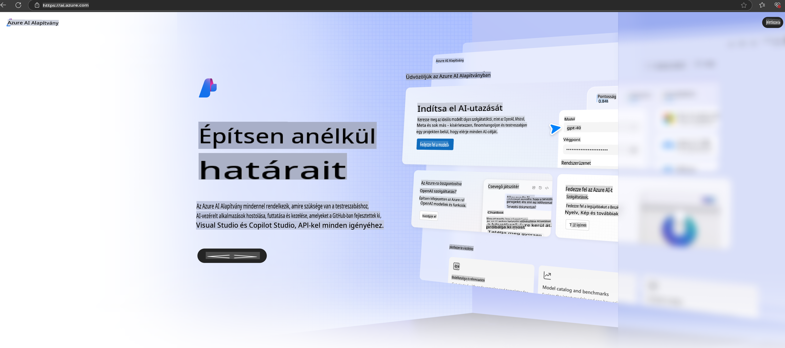

# **Phi-3 használata az Azure AI Foundry-ban**

A Generatív AI fejlődésével célunk, hogy egy egységes platformot használjunk különböző LLM-ek és SLM-ek kezelésére, vállalati adatintegrációra, finomhangolásra/RAG műveletekre, valamint a különböző vállalati tevékenységek értékelésére az LLM-ek és SLM-ek integrálása után. Így a generatív AI intelligens alkalmazásai jobban megvalósíthatók. Az [Azure AI Foundry](https://ai.azure.com) egy vállalati szintű generatív AI alkalmazási platform.

Az Azure AI Foundry segítségével értékelhetjük a nagyméretű nyelvi modellek (LLM) válaszait, és prompt flow-val optimalizálhatjuk az alkalmazás komponenseit a jobb teljesítmény érdekében. A platform megkönnyíti a koncepciók bizonyításától a teljes körű gyártásig történő átalakítás skálázhatóságát. A folyamatos monitorozás és finomhangolás támogatja a hosszú távú sikert.

Egyszerű lépésekkel gyorsan telepíthetjük a Phi-3 modellt az Azure AI Foundry-ban, majd az Azure AI Foundry segítségével elvégezhetjük a Phi-3-hoz kapcsolódó Playground/Chat, finomhangolás, értékelés és egyéb feladatokat.

## **1. Előkészületek**

Ha már telepítve van az [Azure Developer CLI](https://learn.microsoft.com/azure/developer/azure-developer-cli/overview?WT.mc_id=aiml-138114-kinfeylo) az eszközödön, akkor e sablon használata olyan egyszerű, mint egy új könyvtárban futtatni az alábbi parancsot.

## Manuális létrehozás

Egy Microsoft Azure AI Foundry projekt és hub létrehozása remek módja az AI munkád szervezésének és kezelésének. Az alábbiakban egy lépésről lépésre útmutatót találsz a kezdéshez:

### Projekt létrehozása az Azure AI Foundry-ban

1. **Nyisd meg az Azure AI Foundry-t**: Jelentkezz be az Azure AI Foundry portálra.
2. **Projekt létrehozása**:
   - Ha már egy projektben vagy, válaszd ki az "Azure AI Foundry"-t az oldal bal felső részén, hogy a Kezdőlapra juss.
   - Kattints a "+ Projekt létrehozása" gombra.
   - Adj nevet a projektnek.
   - Ha van már hubod, az alapértelmezettként lesz kiválasztva. Ha több hubhoz is van hozzáférésed, választhatsz egy másikat a legördülő menüből. Ha új hubot szeretnél létrehozni, válaszd a "Új hub létrehozása" lehetőséget, és adj meg egy nevet.
   - Kattints a "Létrehozás" gombra.

### Hub létrehozása az Azure AI Foundry-ban

1. **Nyisd meg az Azure AI Foundry-t**: Jelentkezz be az Azure fiókoddal.
2. **Hub létrehozása**:
   - Válaszd ki a Bal oldali menüből a Menedzsment központot.
   - Kattints az "Összes erőforrás" menüpontra, majd a "+ Új projekt" melletti lefelé mutató nyílra, és válaszd a "+ Új hub" lehetőséget.
   - Az "Új hub létrehozása" párbeszédablakban adj meg egy nevet a hubodnak (pl. contoso-hub), és módosítsd a többi mezőt igény szerint.
   - Kattints a "Tovább" gombra, ellenőrizd az információkat, majd kattints a "Létrehozás" gombra.

Részletesebb útmutatásért tekintsd meg a hivatalos [Microsoft dokumentációt](https://learn.microsoft.com/azure/ai-studio/how-to/create-projects).

A sikeres létrehozás után az általad létrehozott stúdiót elérheted az [ai.azure.com](https://ai.azure.com/) weboldalon.

Egy AI Foundry-ban több projekt is lehet. Hozz létre egy projektet az AI Foundry-ban az előkészítéshez.

Az Azure AI Foundry [QuickStarts](https://learn.microsoft.com/azure/ai-studio/quickstarts/get-started-code) segítségével is gyorsan kezdhetsz.

## **2. Phi modell telepítése az Azure AI Foundry-ban**

Kattints a projekt Felfedezés opciójára, hogy belépj a Modellkatalógusba, és válaszd ki a Phi-3-at.

Válaszd ki a Phi-3-mini-4k-instruct modellt.

Kattints a 'Telepítés' gombra, hogy telepítsd a Phi-3-mini-4k-instruct modellt.

> [!NOTE]
>
> A telepítés során kiválaszthatod a számítási kapacitást.

## **3. Playground Chat Phi az Azure AI Foundry-ban**

Lépj a telepítési oldalra, válaszd ki a Playgroundot, és csevegj a Phi-3-mal az Azure AI Foundry-ban.

## **4. Modell telepítése az Azure AI Foundry-ból**

Egy modell telepítéséhez az Azure Modellkatalógusból kövesd az alábbi lépéseket:

- Jelentkezz be az Azure AI Foundry-ba.
- Válaszd ki a telepíteni kívánt modellt az Azure AI Foundry modellkatalógusából.
- A modell Részletek oldalán válaszd a Telepítés lehetőséget, majd válaszd a Serverless API-t az Azure AI Content Safety-vel.
- Válaszd ki azt a projektet, amelyben a modelleket telepíteni szeretnéd. A Serverless API használatához a munkaterületnek az East US 2 vagy Sweden Central régióhoz kell tartoznia. Testreszabhatod a Telepítés nevét.
- A telepítési varázslóban válaszd ki az Árazás és feltételek opciót, hogy megismerd az árazást és a használati feltételeket.
- Kattints a Telepítés gombra. Várj, amíg a telepítés elkészül, és átirányítanak a Telepítések oldalra.
- Kattints az Open in playground gombra, hogy elkezdhesd a modell használatát.
- Visszatérhetsz a Telepítések oldalra, választhatod a telepítést, és jegyezd fel az endpoint Cél URL-jét és a Titkos Kulcsot, amelyeket a telepítés meghívásához és válaszok generálásához használhatsz.
- Az endpoint részleteit, URL-jét és hozzáférési kulcsait mindig megtalálhatod, ha navigálsz az Építés fülre, és kiválasztod a Telepítések opciót az Összetevők szekcióból.

> [!NOTE]
> Kérjük, vedd figyelembe, hogy a fiókodnak rendelkeznie kell Azure AI Developer szerepkör engedélyekkel az Erőforrás Csoportban ezen lépések végrehajtásához.

## **5. Phi API használata az Azure AI Foundry-ban**

A https://{A projekted neve}.region.inference.ml.azure.com/swagger.json URL-en keresztül, Postman GET segítségével, és a Kulccsal kombinálva megismerheted az elérhető interfészeket.

Nagyon egyszerűen megszerezheted a kérések paramétereit, valamint a válaszok paramétereit.

**Felelősségkizárás**:  
Ez a dokumentum gépi AI fordítószolgáltatások segítségével készült fordítás. Bár törekszünk a pontosságra, kérjük, vegye figyelembe, hogy az automatikus fordítások hibákat vagy pontatlanságokat tartalmazhatnak. Az eredeti dokumentum az eredeti nyelvén tekintendő hiteles forrásnak. Fontos információk esetén javasolt professzionális emberi fordítást igénybe venni. Nem vállalunk felelősséget a fordítás használatából eredő félreértésekért vagy téves értelmezésekért.