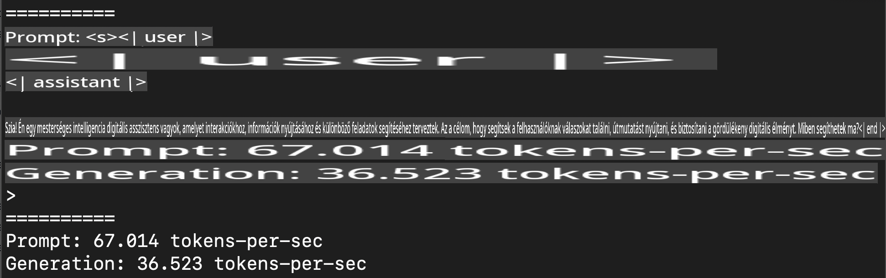
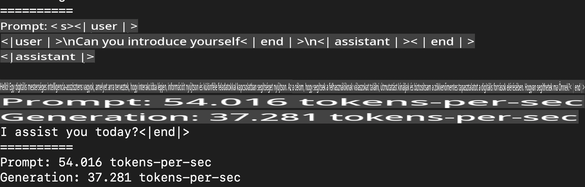
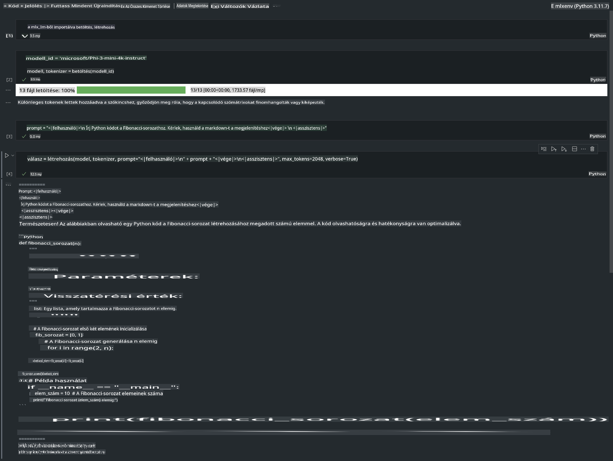

# **Phi-3 következtetés az Apple MLX Framework segítségével**

## **Mi az MLX Framework**

Az MLX egy tömbkeretrendszer gépi tanulási kutatásokhoz Apple Silicon eszközökön, amelyet az Apple gépi tanulási kutatócsapata hozott létre.

Az MLX-t gépi tanulási kutatók tervezték gépi tanulási kutatók számára. A keretrendszert úgy alakították ki, hogy felhasználóbarát legyen, ugyanakkor hatékonyan lehessen modelleket tanítani és telepíteni. Maga a keretrendszer kialakítása koncepcionálisan is egyszerű. Célunk, hogy a kutatók könnyen bővíthessék és fejleszthessék az MLX-t, lehetővé téve új ötletek gyors felfedezését.

Az LLM-ek gyorsíthatók Apple Silicon eszközökön az MLX segítségével, és a modellek kényelmesen futtathatók helyben.

## **Phi-3-mini futtatása MLX-szel**

### **1. Állítsd be az MLX környezeted**

1. Python 3.11.x
2. Telepítsd az MLX könyvtárat

```bash

pip install mlx-lm

```

### **2. Phi-3-mini futtatása Terminálban MLX-szel**

```bash

python -m mlx_lm.generate --model microsoft/Phi-3-mini-4k-instruct --max-token 2048 --prompt  "<|user|>\nCan you introduce yourself<|end|>\n<|assistant|>"

```

Az eredmény (az én környezetemben: Apple M1 Max, 64GB):



### **3. Phi-3-mini kvantálása MLX segítségével Terminálban**

```bash

python -m mlx_lm.convert --hf-path microsoft/Phi-3-mini-4k-instruct

```

***Megjegyzés:*** A modellt az mlx_lm.convert segítségével lehet kvantálni, és az alapértelmezett kvantálás az INT4. Ebben a példában a Phi-3-mini modellt INT4 formátumra kvantáljuk.

A modellt az mlx_lm.convert segítségével lehet kvantálni, és az alapértelmezett kvantálás az INT4. Ez a példa a Phi-3-mini modellt INT4 formátumra kvantálja. A kvantálás után a modell az alapértelmezett ./mlx_model könyvtárba kerül mentésre.

A kvantált modellt MLX segítségével tesztelhetjük terminálból.

```bash

python -m mlx_lm.generate --model ./mlx_model/ --max-token 2048 --prompt  "<|user|>\nCan you introduce yourself<|end|>\n<|assistant|>"

```

Az eredmény:



### **4. Phi-3-mini futtatása MLX-szel Jupyter Notebookban**



***Megjegyzés:*** Kérlek, olvasd el ezt a mintát [kattints erre a linkre](../../../../../code/03.Inference/MLX/MLX_DEMO.ipynb)

## **Források**

1. Tudj meg többet az Apple MLX Frameworkről [https://ml-explore.github.io](https://ml-explore.github.io/mlx/build/html/index.html)

2. Apple MLX GitHub Repo [https://github.com/ml-explore](https://github.com/ml-explore)

**Felelősségkizárás**:  
Ez a dokumentum gépi AI fordítási szolgáltatások segítségével készült. Bár igyekszünk pontosságra törekedni, kérjük, vegye figyelembe, hogy az automatizált fordítások hibákat vagy pontatlanságokat tartalmazhatnak. Az eredeti dokumentum az eredeti nyelvén tekintendő hiteles forrásnak. Kritikus információk esetén javasolt a professzionális, emberi fordítás igénybevétele. Nem vállalunk felelősséget a fordítás használatából eredő félreértésekért vagy téves értelmezésekért.