# Phi-3 finomhangolása az Azure AI Foundry-val

Nézzük meg, hogyan lehet finomhangolni a Microsoft Phi-3 Mini nyelvi modellt az Azure AI Foundry segítségével. A finomhangolás lehetővé teszi, hogy a Phi-3 Mini modellt speciális feladatokhoz igazítsuk, így még erősebbé és kontextusérzékenyebbé tegyük.

## Szempontok

- **Képességek:** Mely modellek finomhangolhatók? Mit lehet elérni az alapképességek finomhangolásával?  
- **Költség:** Mi a finomhangolás árazási modellje?  
- **Testreszabhatóság:** Mennyire lehet módosítani az alapmodellt, és milyen módokon?  
- **Kényelem:** Hogyan zajlik a finomhangolás? Kell-e egyedi kódot írnom? Saját számítási kapacitást kell hoznom?  
- **Biztonság:** A finomhangolt modellek biztonsági kockázatokat rejthetnek magukban – vannak-e óvintézkedések a nem szándékos károk elkerülésére?

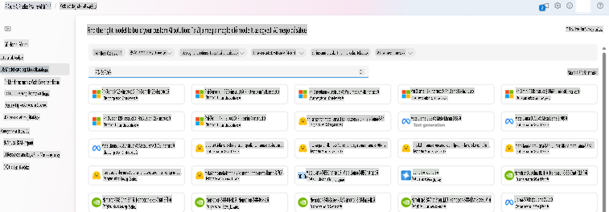

## Felkészülés a finomhangolásra

### Előfeltételek

> [!NOTE]  
> A Phi-3 család modelljeinél a fizetés alapú finomhangolási ajánlat csak **East US 2** régiókban létrehozott hubok esetén érhető el.

- Egy Azure előfizetés. Ha még nincs Azure előfizetésed, hozz létre egy [fizetős Azure fiókot](https://azure.microsoft.com/pricing/purchase-options/pay-as-you-go) a kezdéshez.

- Egy [AI Foundry projekt](https://ai.azure.com?WT.mc_id=aiml-138114-kinfeylo).  
- Azure szerepkör-alapú hozzáférés-vezérlések (Azure RBAC) szükségesek az Azure AI Foundry műveletekhez való hozzáférés biztosításához. Ahhoz, hogy elvégezd az ebben a cikkben szereplő lépéseket, a felhasználói fiókodnak az __Azure AI Fejlesztői szerepkörrel__ kell rendelkeznie az erőforráscsoporton.

### Előfizetési szolgáltató regisztrációja

Ellenőrizd, hogy az előfizetés regisztrálva van-e az `Microsoft.Network` erőforrás-szolgáltatónál.

1. Jelentkezz be az [Azure portálra](https://portal.azure.com).  
1. Válaszd ki a bal oldali menüből az **Előfizetések** lehetőséget.  
1. Válaszd ki azt az előfizetést, amelyet használni szeretnél.  
1. Válaszd ki a bal oldali menüből az **AI projektbeállítások** > **Erőforrás-szolgáltatók** lehetőséget.  
1. Ellenőrizd, hogy a **Microsoft.Network** szerepel-e az erőforrás-szolgáltatók listájában. Ha nem, add hozzá.

### Adatelőkészítés

Készítsd elő az edzési és validációs adatokat a modell finomhangolásához. Az edzési és validációs adathalmazoknak tartalmazniuk kell bemeneti és kimeneti példákat arra vonatkozóan, hogyan szeretnéd, hogy a modell működjön.

Győződj meg róla, hogy az összes edzési példa megfelel az előrejelzési formátumnak. A hatékony finomhangoláshoz biztosítsd a kiegyensúlyozott és változatos adathalmazt.

Ez magában foglalja az adatok kiegyensúlyozását, különféle forgatókönyvek bevonását, valamint az edzési adatok időszakos finomítását, hogy azok igazodjanak a valós elvárásokhoz, ami végső soron pontosabb és kiegyensúlyozottabb modellválaszokat eredményez.

Különböző modell típusok különböző formátumú edzési adatokat igényelnek.

### Chat Completion

Az általad használt edzési és validációs adatok **kötelezően** JSON Lines (JSONL) dokumentum formátumúak legyenek. Az `Phi-3-mini-128k-instruct` finomhangolási adathalmaznak a Chat completions API által használt beszélgetési formátumban kell lennie.

### Példa fájlformátum

```json
    {"messages": [{"role": "system", "content": "You are an Xbox customer support agent whose primary goal is to help users with issues they are experiencing with their Xbox devices. You are friendly and concise. You only provide factual answers to queries, and do not provide answers that are not related to Xbox."}, {"role": "user", "content": "Is Xbox better than PlayStation?"}, {"role": "assistant", "content": "I apologize, but I cannot provide personal opinions. My primary job is to assist you with any issues related to your Xbox device. Do you have any Xbox-related issues that need addressing?"}]}
    {"messages": [{"role": "system", "content": "You are an Xbox customer support agent whose primary goal is to help users with issues they are experiencing with their Xbox devices. You are friendly and concise. You only provide factual answers to queries, and do not provide answers that are not related to Xbox."}, {"role": "user", "content": "Can I play PC games on my Xbox?"}, {"role": "assistant", "content": "While Xbox consoles don't natively support PC games, they can play an array of Xbox games, many of which are also available on PC. Can I assist you with finding games compatible with your Xbox device?"}]}
    {"messages": [{"role": "system", "content": "You are an Xbox customer support agent whose primary goal is to help users with issues they are experiencing with their Xbox devices. You are friendly and concise. You only provide factual answers to queries, and do not provide answers that are not related to Xbox."}, {"role": "user", "content": "I'm having trouble connecting my Xbox to the Wi-Fi."}, {"role": "assistant", "content": "No worries, let's go through the network settings on your Xbox. Can you please tell me what happens when you try to connect it to the Wi-Fi?"}]}
```

A támogatott fájltípus JSON Lines. A fájlokat az alapértelmezett adattárba töltjük fel, és elérhetővé tesszük a projektedben.

## Phi-3 finomhangolása az Azure AI Foundry-val

Az Azure AI Foundry lehetővé teszi, hogy a nagy nyelvi modelleket a saját adathalmazaidhoz igazítsd egy finomhangolásnak nevezett folyamat segítségével. A finomhangolás jelentős értéket nyújt azáltal, hogy lehetővé teszi a testreszabást és az optimalizálást specifikus feladatokhoz és alkalmazásokhoz. Ez jobb teljesítményhez, költséghatékonysághoz, csökkentett késleltetéshez és testreszabott eredményekhez vezet.

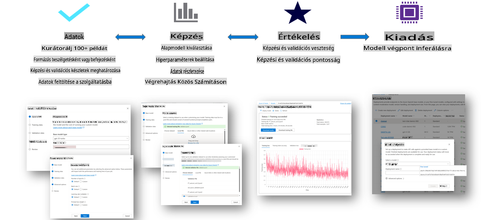

### Új projekt létrehozása

1. Jelentkezz be az [Azure AI Foundry](https://ai.azure.com) oldalra.  

1. Válaszd ki a **+Új projekt** lehetőséget az új projekt létrehozásához az Azure AI Foundry-ban.  

    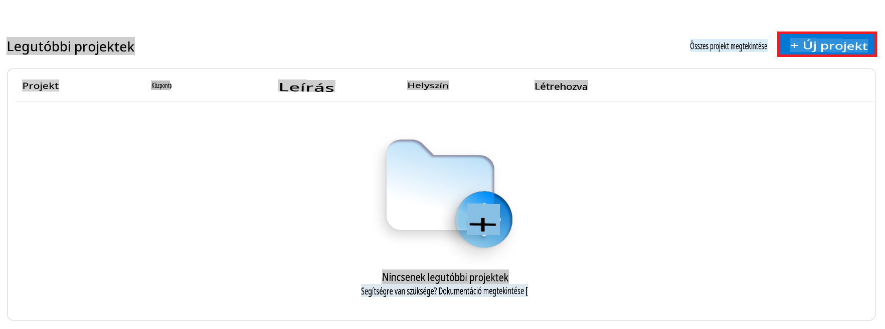

1. Végezze el a következő feladatokat:

    - A projekt **Hub neve**. Egyedi értéknek kell lennie.  
    - Válaszd ki a használni kívánt **Hubot** (hozz létre újat, ha szükséges).  

    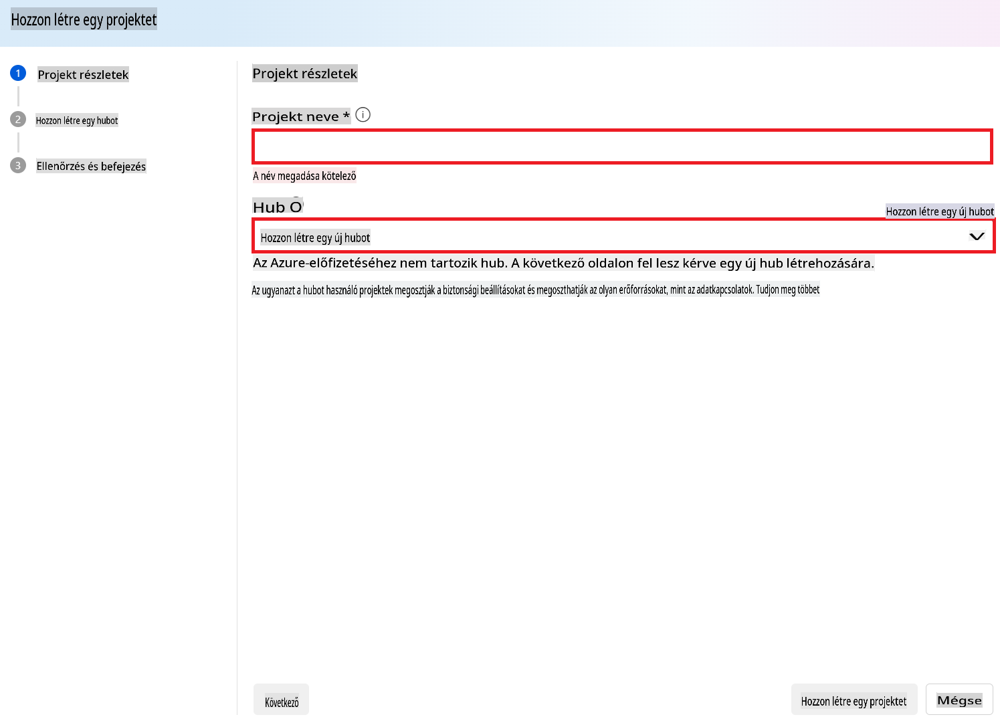

1. Hajtsd végre a következő feladatokat egy új hub létrehozásához:

    - Add meg a **Hub nevet**. Egyedi értéknek kell lennie.  
    - Válaszd ki az Azure **Előfizetést**.  
    - Válaszd ki a használni kívánt **Erőforráscsoportot** (hozz létre újat, ha szükséges).  
    - Válaszd ki a használni kívánt **Helyszínt**.  
    - Válaszd ki a használni kívánt **Azure AI Szolgáltatások csatlakoztatása** opciót (hozz létre újat, ha szükséges).  
    - Válaszd ki az **Azure AI Keresés csatlakoztatása** lehetőséget a **Csatlakoztatás kihagyása** opcióval.  

    

1. Válaszd a **Tovább** lehetőséget.  
1. Válaszd a **Projekt létrehozása** lehetőséget.

### Adatelőkészítés

A finomhangolás előtt gyűjtsd össze vagy hozz létre a feladatodhoz kapcsolódó adathalmazt, például beszélgetési utasításokat, kérdés-válasz párokat vagy bármilyen releváns szöveges adatot. Tisztítsd meg és előfeldolgozd az adatokat, például távolítsd el a zajokat, kezeld a hiányzó értékeket, és tokenizáld a szöveget.

### Phi-3 modellek finomhangolása az Azure AI Foundry-ban

> [!NOTE]  
> A Phi-3 modellek finomhangolása jelenleg az East US 2 helyszínen található projektek esetében támogatott.

1. Válaszd ki a bal oldali sávból a **Modellek katalógusa** lehetőséget.

1. Írd be a **phi-3** nevet a **keresősávba**, és válaszd ki a használni kívánt phi-3 modellt.

    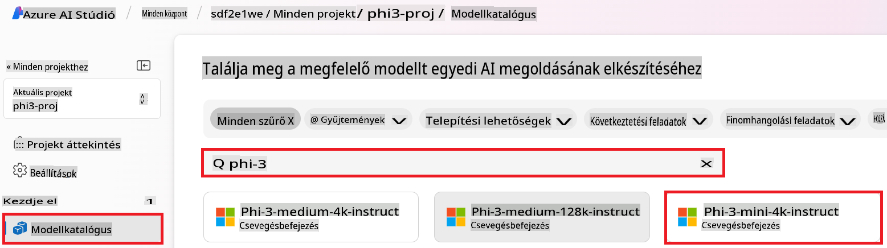

1. Válaszd a **Finomhangolás** lehetőséget.

    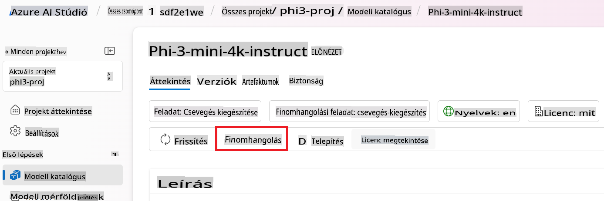

1. Add meg a **Finomhangolt modell nevét**.

    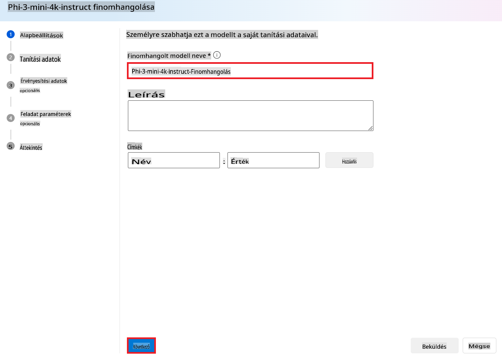

1. Válaszd a **Tovább** lehetőséget.

1. Végezze el a következő feladatokat:

    - Válaszd ki a **feladattípust** **Chat completion** értékre.  
    - Válaszd ki az **Edzési adatokat**, amelyeket használni szeretnél. Feltöltheted az Azure AI Foundry adattárából vagy a helyi környezetedből.  

    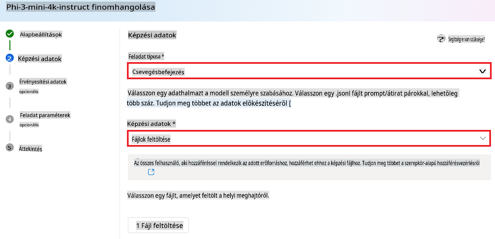

1. Válaszd a **Tovább** lehetőséget.

1. Töltsd fel a használni kívánt **Validációs adatokat**, vagy válaszd az **Edzési adatok automatikus szétosztása** lehetőséget.

    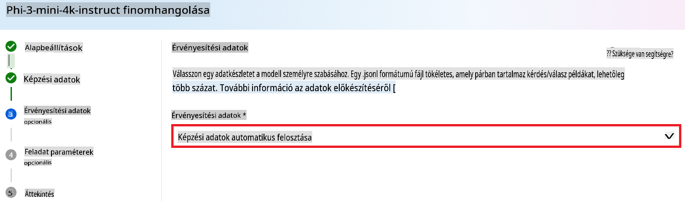

1. Válaszd a **Tovább** lehetőséget.

1. Végezze el a következő feladatokat:

    - Válaszd ki a használni kívánt **Batch méret szorzót**.  
    - Válaszd ki a használni kívánt **Tanulási sebességet**.  
    - Válaszd ki a használni kívánt **Epochok** számát.  

    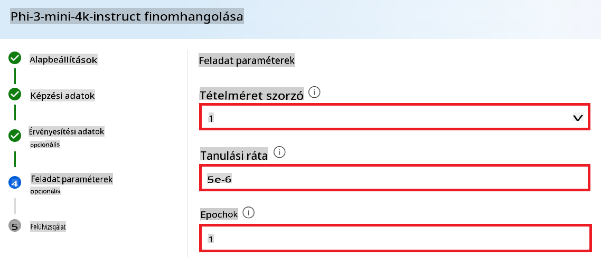

1. Válaszd a **Beküldés** lehetőséget a finomhangolási folyamat elindításához.

    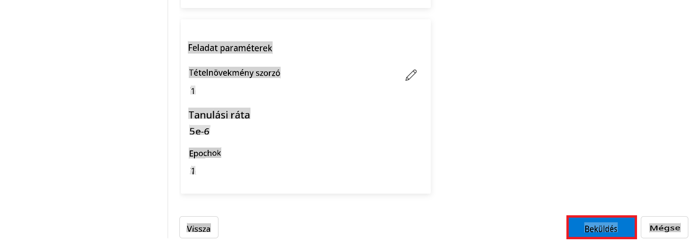

1. Amint a modell finomhangolása befejeződik, az állapot **Befejezettként** jelenik meg, ahogy az alábbi képen látható. Most már telepítheted a modellt, és használhatod a saját alkalmazásodban, a játszótéren vagy a prompt flow-ban. További információért lásd: [Hogyan telepítsük a Phi-3 nyelvi modelleket az Azure AI Foundry-val](https://learn.microsoft.com/azure/ai-studio/how-to/deploy-models-phi-3?tabs=phi-3-5&pivots=programming-language-python).

    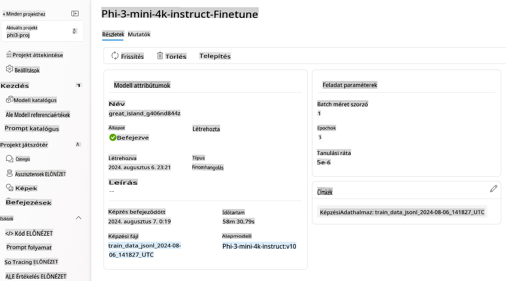

> [!NOTE]  
> További részletes információért a Phi-3 finomhangolásáról, látogass el ide: [Phi-3 modellek finomhangolása az Azure AI Foundry-ban](https://learn.microsoft.com/azure/ai-studio/how-to/fine-tune-phi-3?tabs=phi-3-mini).

## Finomhangolt modellek eltávolítása

A finomhangolt modelleket törölheted az [Azure AI Foundry](https://ai.azure.com) finomhangolási modell listájából vagy a modell részletező oldaláról. Válaszd ki a törölni kívánt finomhangolt modellt a Finomhangolási oldalról, majd kattints a Törlés gombra a modell eltávolításához.

> [!NOTE]  
> Egy egyedi modellt nem lehet törölni, ha van meglévő telepítése. Először törölnöd kell a modell telepítését, mielőtt törölhetnéd az egyedi modellt.

## Költségek és kvóták

### Költségek és kvóták a Phi-3 modellek finomhangolásához szolgáltatásként

A szolgáltatásként finomhangolt Phi modelleket a Microsoft kínálja, és az Azure AI Foundry-val integrálva használhatók. Az árakat megtalálod a modellek [telepítése](https://learn.microsoft.com/azure/ai-studio/how-to/deploy-models-phi-3?tabs=phi-3-5&pivots=programming-language-python) vagy finomhangolása során, a telepítési varázsló Ár és feltételek fülén.

## Tartalomszűrés

A fizetés alapú szolgáltatásként telepített modelleket az Azure AI Tartalombiztonság védi. Amikor valós idejű végpontokra telepíted őket, letilthatod ezt a funkciót. Az Azure AI tartalombiztonság engedélyezése esetén mind a prompt, mind a válasz egy osztályozó modellekből álló rendszerbe kerül, amely a káros tartalom felismerésére és megelőzésére szolgál. A tartalomszűrő rendszer a bemeneti promptokban és a kimeneti válaszokban előforduló potenciálisan káros tartalom bizonyos kategóriáit észleli és kezeli. További információ: [Azure AI Tartalombiztonság](https://learn.microsoft.com/azure/ai-studio/concepts/content-filtering).

**Finomhangolási konfiguráció**

Hiperparaméterek: Határozd meg a hiperparamétereket, például a tanulási sebességet, a batch méretet és az edzési epochok számát.

**Veszteségfüggvény**

Válassz egy megfelelő veszteségfüggvényt a feladatodhoz (pl. cross-entropy).

**Optimalizáló**

Válassz egy optimalizálót (pl. Adam) a gradiens frissítésekhez az edzés során.

**Finomhangolási folyamat**

- Előre betanított modell betöltése: Töltsd be a Phi-3 Mini ellenőrzőpontját.  
- Egyedi rétegek hozzáadása: Adj hozzá feladatspecifikus rétegeket (pl. osztályozó fej beszélgetési utasításokhoz).

**Modell betanítása**  
Finomhangold a modellt az előkészített adathalmazoddal. Kövesd az edzési folyamatot, és szükség szerint állítsd be a hiperparamétereket.

**Értékelés és validáció**

Validációs adathalmaz: Oszd fel az adataidat edzési és validációs részekre.

**Teljesítmény értékelése**

Használj metrikákat, mint például pontosság, F1-pontszám vagy perplexitás a modell teljesítményének értékeléséhez.

## Finomhangolt modell mentése

**Ellenőrzőpont**  
Mentse el a finomhangolt modell ellenőrzőpontját későbbi használatra.

## Telepítés

- Telepítés webszolgáltatásként: Telepítsd a finomhangolt modellt webszolgáltatásként az Azure AI Foundry-ban.  
- Végpont tesztelése: Küldj tesztkérdéseket a telepített végpontra a működés ellenőrzéséhez.

## Iteráció és fejlesztés

Iteráció: Ha a teljesítmény nem kielégítő, iterálj a hiperparaméterek módosításával, több adat hozzáadásával vagy további epochok finomhangolásával.

## Felügyelet és finomítás

Folyamatosan figyeld a modell viselkedését, és szükség esetén finomítsd.

## Testreszabás és bővítés

Egyedi feladatok: A Phi-3 Mini különböző feladatokra finomhangolható a beszélgetési utasításokon túl. Fedezz fel más felhasználási eseteket!  
Kísérletezz: Próbálj ki különböző architektúrákat, rétegkombinációkat és technikákat a teljesítmény javítása érdekében.

> [!NOTE]  
> A finomhangolás egy iteratív folyamat. Kísérletezz, tanulj, és igazítsd a modellt a legjobb eredmények elérése érdekében az adott feladathoz!

**Felelősségkizárás**:  
Ez a dokumentum gépi AI fordítási szolgáltatásokkal készült. Bár törekszünk a pontosságra, kérjük, vegye figyelembe, hogy az automatikus fordítások hibákat vagy pontatlanságokat tartalmazhatnak. Az eredeti dokumentum az eredeti nyelvén tekintendő hiteles forrásnak. Kritikus információk esetén javasolt professzionális, emberi fordítást igénybe venni. Nem vállalunk felelősséget a fordítás használatából eredő félreértésekért vagy téves értelmezésekért.