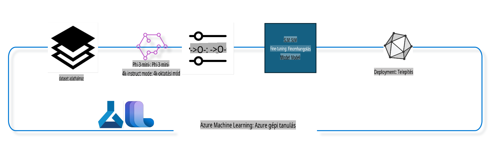

## Hogyan használjunk chat-kompletion komponenseket az Azure ML rendszer-regisztrációból egy modell finomhangolására

Ebben a példában finomhangoljuk a Phi-3-mini-4k-instruct modellt, hogy befejezzen egy beszélgetést két ember között az ultrachat_200k adathalmaz felhasználásával.



A példa bemutatja, hogyan lehet finomhangolni egy modellt az Azure ML SDK és Python segítségével, majd a finomhangolt modellt online végpontra telepíteni valós idejű előrejelzéshez.

### Tréning adatok

Az ultrachat_200k adathalmazt fogjuk használni. Ez az UltraChat adathalmaz erősen szűrt verziója, amelyet a Zephyr-7B-β, egy korszerű 7b chatmodell tanításához használtak.

### Modell

A Phi-3-mini-4k-instruct modellt fogjuk használni, hogy bemutassuk, hogyan lehet egy modellt finomhangolni a chat-kompletion feladathoz. Ha ezt a jegyzetfüzetet egy adott modellkártyáról nyitottad meg, ne felejtsd el lecserélni a konkrét modell nevét.

### Feladatok

- Válassz egy modellt a finomhangoláshoz.
- Válassz és vizsgáld meg a tréning adatokat.
- Konfiguráld a finomhangolási feladatot.
- Futtasd a finomhangolási feladatot.
- Vizsgáld meg a tréning- és értékelési metrikákat.
- Regisztráld a finomhangolt modellt.
- Telepítsd a finomhangolt modellt valós idejű előrejelzéshez.
- Tisztítsd meg az erőforrásokat.

## 1. Előkészületek beállítása

- Telepítsd a függőségeket.
- Csatlakozz az AzureML Munkaterülethez. Tudj meg többet az SDK hitelesítésének beállításáról. Cseréld ki a <WORKSPACE_NAME>, <RESOURCE_GROUP> és <SUBSCRIPTION_ID> értékeket az alábbiakban.
- Csatlakozz az azureml rendszer-regisztrációhoz.
- Állíts be egy opcionális kísérlet nevet.
- Ellenőrizd vagy hozd létre a számítási erőforrást.

> [!NOTE]
> Követelmény, hogy egy GPU csomópont több GPU kártyát is tartalmazhat. Például egy Standard_NC24rs_v3 csomópontban 4 NVIDIA V100 GPU található, míg egy Standard_NC12s_v3 csomópontban 2 NVIDIA V100 GPU van. További információért nézd meg a dokumentációt. Az egy csomópontban lévő GPU kártyák számát az alábbi gpus_per_node paraméterben állíthatod be. A helyes érték beállítása biztosítja az összes GPU kihasználását a csomóponton. Az ajánlott GPU számítási SKU-k itt és itt találhatók.

### Python Könyvtárak

Telepítsd a függőségeket az alábbi cella futtatásával. Ez nem opcionális lépés, ha új környezetben futtatod.

```bash
pip install azure-ai-ml
pip install azure-identity
pip install datasets==2.9.0
pip install mlflow
pip install azureml-mlflow
```

### Azure ML-lel való interakció

1. Ez a Python szkript az Azure Machine Learning (Azure ML) szolgáltatással való interakcióra szolgál. Íme egy összefoglaló arról, hogy mit csinál:

    - Importálja az azure.ai.ml, azure.identity és azure.ai.ml.entities csomagok szükséges moduljait, valamint a time modult.

    - Megpróbál hitelesítést végezni a DefaultAzureCredential() használatával, amely egyszerűsített hitelesítési élményt nyújt az Azure felhőben futó alkalmazások fejlesztéséhez. Ha ez nem sikerül, az InteractiveBrowserCredential() módszerre vált, amely interaktív bejelentkezési promptot biztosít.

    - Megpróbál létrehozni egy MLClient példányt a from_config metódussal, amely az alapértelmezett konfigurációs fájlból (config.json) olvassa be a beállításokat. Ha ez nem sikerül, manuálisan adja meg az előfizetés azonosítóját, az erőforráscsoport nevét és a munkaterület nevét.

    - Létrehoz egy másik MLClient példányt az "azureml" nevű Azure ML regisztrációhoz. Ez a regisztráció tartalmazza a modelleket, finomhangolási folyamatokat és környezeteket.

    - Beállítja az experiment_name változót "chat_completion_Phi-3-mini-4k-instruct" értékre.

    - Egyedi időbélyeget generál az aktuális idő másodpercben történő konvertálásával egész számmá, majd sztringgé. Ez az időbélyeg egyedi nevek és verziók létrehozására használható.

    ```python
    # Import necessary modules from Azure ML and Azure Identity
    from azure.ai.ml import MLClient
    from azure.identity import (
        DefaultAzureCredential,
        InteractiveBrowserCredential,
    )
    from azure.ai.ml.entities import AmlCompute
    import time  # Import time module
    
    # Try to authenticate using DefaultAzureCredential
    try:
        credential = DefaultAzureCredential()
        credential.get_token("https://management.azure.com/.default")
    except Exception as ex:  # If DefaultAzureCredential fails, use InteractiveBrowserCredential
        credential = InteractiveBrowserCredential()
    
    # Try to create an MLClient instance using the default config file
    try:
        workspace_ml_client = MLClient.from_config(credential=credential)
    except:  # If that fails, create an MLClient instance by manually providing the details
        workspace_ml_client = MLClient(
            credential,
            subscription_id="<SUBSCRIPTION_ID>",
            resource_group_name="<RESOURCE_GROUP>",
            workspace_name="<WORKSPACE_NAME>",
        )
    
    # Create another MLClient instance for the Azure ML registry named "azureml"
    # This registry is where models, fine-tuning pipelines, and environments are stored
    registry_ml_client = MLClient(credential, registry_name="azureml")
    
    # Set the experiment name
    experiment_name = "chat_completion_Phi-3-mini-4k-instruct"
    
    # Generate a unique timestamp that can be used for names and versions that need to be unique
    timestamp = str(int(time.time()))
    ```

## 2. Válassz egy alapmodellt a finomhangoláshoz

1. A Phi-3-mini-4k-instruct egy 3.8 milliárd paraméteres, könnyű, korszerű nyílt modell, amely a Phi-2-höz használt adathalmazokra épül. A modell a Phi-3 modellcsaládba tartozik, és a Mini verzió két változatban érhető el: 4K és 128K, amelyek a támogatott kontextushosszúságot (tokenekben) jelentik. A modellt finomhangolnunk kell a konkrét célunkhoz, hogy használni tudjuk. Az AzureML Stúdió Modellkatalógusában böngészheted ezeket a modelleket, a chat-kompletion feladat szűrésével. Ebben a példában a Phi-3-mini-4k-instruct modellt használjuk. Ha ezt a jegyzetfüzetet egy másik modellhez nyitottad meg, cseréld ki a modell nevét és verzióját ennek megfelelően.

    > [!NOTE]
    > a modell id tulajdonsága. Ezt adjuk meg bemenetként a finomhangolási feladatnak. Ez az AzureML Stúdió Modellkatalógusában a Modell részletek oldalon az Eszközazonosító mezőben is elérhető.

2. Ez a Python szkript az Azure Machine Learning (Azure ML) szolgáltatással való interakcióra szolgál. Íme egy összefoglaló arról, hogy mit csinál:

    - Beállítja a model_name változót "Phi-3-mini-4k-instruct" értékre.

    - A registry_ml_client objektum models tulajdonságának get metódusát használja a megadott nevű modell legújabb verziójának lekérésére az Azure ML regisztrációból. A get metódus két argumentummal hívódik meg: a modell neve és egy címke, amely jelzi, hogy a modell legújabb verzióját kell lekérni.

    - Üzenetet nyomtat a konzolra, amely jelzi a finomhangoláshoz használt modell nevét, verzióját és azonosítóját. Az üzenetbe a modell neve, verziója és azonosítója a format metódus segítségével kerül beillesztésre. Ezek az értékek a foundation_model objektum tulajdonságaiként érhetők el.

    ```python
    # Set the model name
    model_name = "Phi-3-mini-4k-instruct"
    
    # Get the latest version of the model from the Azure ML registry
    foundation_model = registry_ml_client.models.get(model_name, label="latest")
    
    # Print the model name, version, and id
    # This information is useful for tracking and debugging
    print(
        "\n\nUsing model name: {0}, version: {1}, id: {2} for fine tuning".format(
            foundation_model.name, foundation_model.version, foundation_model.id
        )
    )
    ```

## 3. Hozz létre egy számítási erőforrást a feladathoz

A finomhangolási feladat CSAK GPU számítással működik. A számítás mérete a modell méretétől függ, és a legtöbb esetben trükkös lehet az ideális számítási erőforrás kiválasztása. Ebben a cellában segítünk a felhasználónak a megfelelő számítási erőforrás kiválasztásában.

> [!NOTE]
> Az alább felsorolt számítások a legoptimalizáltabb konfigurációval működnek. A konfiguráció bármilyen módosítása Cuda memóriahiány hibához vezethet. Ilyen esetekben próbálj meg nagyobb méretű számítást választani.

> [!NOTE]
> A compute_cluster_size kiválasztásakor győződj meg arról, hogy az erőforráscsoportodban elérhető a számítás. Ha egy adott számítás nem érhető el, kérheted a hozzáférést az erőforrásokhoz.

### Modell ellenőrzése finomhangolási támogatásra

1. Ez a Python szkript egy Azure Machine Learning (Azure ML) modell ellenőrzésére szolgál. Íme egy összefoglaló arról, hogy mit csinál:

    - Importálja az ast modult, amely funkciókat biztosít a Python absztrakt szintaxis grammatikájának feldolgozásához.

    - Ellenőrzi, hogy a foundation_model objektumnak (amely egy Azure ML modellt képvisel) van-e finetune_compute_allow_list nevű címkéje. Az Azure ML-ben a címkék kulcs-érték párok, amelyeket létrehozhatsz és használhatsz a modellek szűrésére és rendezésére.

    - Ha a finetune_compute_allow_list címke jelen van, az ast.literal_eval funkciót használja a címke értékének (egy sztring) biztonságos Python listává alakítására. Ez a lista a computes_allow_list változóhoz van rendelve. Ezután üzenetet nyomtat, amely jelzi, hogy a listából hozz létre egy számítást.

    - Ha a finetune_compute_allow_list címke nincs jelen, a computes_allow_list értéke None lesz, és üzenetet nyomtat, amely jelzi, hogy a finetune_compute_allow_list címke nem része a modell címkéinek.

    - Összefoglalva, ez a szkript egy konkrét címkét ellenőriz a modell metaadataiban, a címke értékét listává alakítja, ha létezik, és ennek megfelelően tájékoztatja a felhasználót.

    ```python
    # Import the ast module, which provides functions to process trees of the Python abstract syntax grammar
    import ast
    
    # Check if the 'finetune_compute_allow_list' tag is present in the model's tags
    if "finetune_compute_allow_list" in foundation_model.tags:
        # If the tag is present, use ast.literal_eval to safely parse the tag's value (a string) into a Python list
        computes_allow_list = ast.literal_eval(
            foundation_model.tags["finetune_compute_allow_list"]
        )  # convert string to python list
        # Print a message indicating that a compute should be created from the list
        print(f"Please create a compute from the above list - {computes_allow_list}")
    else:
        # If the tag is not present, set computes_allow_list to None
        computes_allow_list = None
        # Print a message indicating that the 'finetune_compute_allow_list' tag is not part of the model's tags
        print("`finetune_compute_allow_list` is not part of model tags")
    ```

### Számítási példány ellenőrzése

1. Ez a Python szkript az Azure Machine Learning (Azure ML) szolgáltatással való interakcióra szolgál, és több ellenőrzést végez egy számítási példányon. Íme egy összefoglaló arról, hogy mit csinál:

    - Megpróbálja lekérni a compute_cluster változóban tárolt nevű számítási példányt az Azure ML munkaterületből. Ha a számítási példány állapota "failed", ValueError-t dob.

    - Ellenőrzi, hogy a computes_allow_list nem None. Ha nem, az összes méretet kisbetűsre alakítja a listában, és ellenőrzi, hogy a jelenlegi számítási példány mérete szerepel-e a listában. Ha nem, ValueError-t dob.

    - Ha a computes_allow_list None, ellenőrzi, hogy a számítási példány mérete szerepel-e egy nem támogatott GPU VM méretek listájában. Ha igen, ValueError-t dob.

    - Lekéri az összes elérhető számítási méret listáját a munkaterületen. Ezután végigiterál ezen a listán, és minden számítási méretnél ellenőrzi, hogy annak neve megegyezik-e a jelenlegi számítási példány méretével. Ha igen, lekéri a GPU-k számát az adott számítási mérethez, és a gpu_count_found értékét True-ra állítja.

    - Ha gpu_count_found True, nyomtatja a számítási példány GPU-k számát. Ha gpu_count_found False, ValueError-t dob.

    - Összefoglalva, ez a szkript több ellenőrzést végez egy Azure ML munkaterület számítási példányán, beleértve az állapotát, méretét egy engedélyezési vagy tiltási lista alapján, valamint a GPU-k számát.

    ```python
    # Print the exception message
    print(e)
    # Raise a ValueError if the compute size is not available in the workspace
    raise ValueError(
        f"WARNING! Compute size {compute_cluster_size} not available in workspace"
    )
    
    # Retrieve the compute instance from the Azure ML workspace
    compute = workspace_ml_client.compute.get(compute_cluster)
    # Check if the provisioning state of the compute instance is "failed"
    if compute.provisioning_state.lower() == "failed":
        # Raise a ValueError if the provisioning state is "failed"
        raise ValueError(
            f"Provisioning failed, Compute '{compute_cluster}' is in failed state. "
            f"please try creating a different compute"
        )
    
    # Check if computes_allow_list is not None
    if computes_allow_list is not None:
        # Convert all compute sizes in computes_allow_list to lowercase
        computes_allow_list_lower_case = [x.lower() for x in computes_allow_list]
        # Check if the size of the compute instance is in computes_allow_list_lower_case
        if compute.size.lower() not in computes_allow_list_lower_case:
            # Raise a ValueError if the size of the compute instance is not in computes_allow_list_lower_case
            raise ValueError(
                f"VM size {compute.size} is not in the allow-listed computes for finetuning"
            )
    else:
        # Define a list of unsupported GPU VM sizes
        unsupported_gpu_vm_list = [
            "standard_nc6",
            "standard_nc12",
            "standard_nc24",
            "standard_nc24r",
        ]
        # Check if the size of the compute instance is in unsupported_gpu_vm_list
        if compute.size.lower() in unsupported_gpu_vm_list:
            # Raise a ValueError if the size of the compute instance is in unsupported_gpu_vm_list
            raise ValueError(
                f"VM size {compute.size} is currently not supported for finetuning"
            )
    
    # Initialize a flag to check if the number of GPUs in the compute instance has been found
    gpu_count_found = False
    # Retrieve a list of all available compute sizes in the workspace
    workspace_compute_sku_list = workspace_ml_client.compute.list_sizes()
    available_sku_sizes = []
    # Iterate over the list of available compute sizes
    for compute_sku in workspace_compute_sku_list:
        available_sku_sizes.append(compute_sku.name)
        # Check if the name of the compute size matches the size of the compute instance
        if compute_sku.name.lower() == compute.size.lower():
            # If it does, retrieve the number of GPUs for that compute size and set gpu_count_found to True
            gpus_per_node = compute_sku.gpus
            gpu_count_found = True
    # If gpu_count_found is True, print the number of GPUs in the compute instance
    if gpu_count_found:
        print(f"Number of GPU's in compute {compute.size}: {gpus_per_node}")
    else:
        # If gpu_count_found is False, raise a ValueError
        raise ValueError(
            f"Number of GPU's in compute {compute.size} not found. Available skus are: {available_sku_sizes}."
            f"This should not happen. Please check the selected compute cluster: {compute_cluster} and try again."
        )
    ```
### Konfigurálás a Pipeline-hoz

Ez a Python szkript egy gépi tanulási pipeline-t definiál és konfigurál az Azure Machine Learning SDK használatával. Íme, mit csinál:

1. Importálja a szükséges modulokat az Azure AI ML SDK-ból.  
2. Lekéri a "chat_completion_pipeline" nevű pipeline-komponenst a regisztrációs adatbázisból.  
3. Definiál egy pipeline-munkát a `@pipeline` decorator and the function `create_pipeline`. The name of the pipeline is set to `pipeline_display_name`.

1. Inside the `create_pipeline` function, it initializes the fetched pipeline component with various parameters, including the model path, compute clusters for different stages, dataset splits for training and testing, the number of GPUs to use for fine-tuning, and other fine-tuning parameters.

1. It maps the output of the fine-tuning job to the output of the pipeline job. This is done so that the fine-tuned model can be easily registered, which is required to deploy the model to an online or batch endpoint.

1. It creates an instance of the pipeline by calling the `create_pipeline` function.

1. It sets the `force_rerun` setting of the pipeline to `True`, meaning that cached results from previous jobs will not be used.

1. It sets the `continue_on_step_failure` setting of the pipeline to `False` segítségével, ami azt jelenti, hogy a pipeline leáll, ha bármelyik lépés hibát jelez.  

Összefoglalva, ez a szkript egy gépi tanulási pipeline-t definiál és konfigurál egy chat-kompletálási feladathoz az Azure Machine Learning SDK-val.  

```python
    # Import necessary modules from the Azure AI ML SDK
    from azure.ai.ml.dsl import pipeline
    from azure.ai.ml import Input
    
    # Fetch the pipeline component named "chat_completion_pipeline" from the registry
    pipeline_component_func = registry_ml_client.components.get(
        name="chat_completion_pipeline", label="latest"
    )
    
    # Define the pipeline job using the @pipeline decorator and the function create_pipeline
    # The name of the pipeline is set to pipeline_display_name
    @pipeline(name=pipeline_display_name)
    def create_pipeline():
        # Initialize the fetched pipeline component with various parameters
        # These include the model path, compute clusters for different stages, dataset splits for training and testing, the number of GPUs to use for fine-tuning, and other fine-tuning parameters
        chat_completion_pipeline = pipeline_component_func(
            mlflow_model_path=foundation_model.id,
            compute_model_import=compute_cluster,
            compute_preprocess=compute_cluster,
            compute_finetune=compute_cluster,
            compute_model_evaluation=compute_cluster,
            # Map the dataset splits to parameters
            train_file_path=Input(
                type="uri_file", path="./ultrachat_200k_dataset/train_sft.jsonl"
            ),
            test_file_path=Input(
                type="uri_file", path="./ultrachat_200k_dataset/test_sft.jsonl"
            ),
            # Training settings
            number_of_gpu_to_use_finetuning=gpus_per_node,  # Set to the number of GPUs available in the compute
            **finetune_parameters
        )
        return {
            # Map the output of the fine tuning job to the output of pipeline job
            # This is done so that we can easily register the fine tuned model
            # Registering the model is required to deploy the model to an online or batch endpoint
            "trained_model": chat_completion_pipeline.outputs.mlflow_model_folder
        }
    
    # Create an instance of the pipeline by calling the create_pipeline function
    pipeline_object = create_pipeline()
    
    # Don't use cached results from previous jobs
    pipeline_object.settings.force_rerun = True
    
    # Set continue on step failure to False
    # This means that the pipeline will stop if any step fails
    pipeline_object.settings.continue_on_step_failure = False
    ```  

### A munka beküldése  

1. Ez a Python szkript egy gépi tanulási pipeline-munkát küld be egy Azure Machine Learning munkaterületre, majd megvárja a munka befejezését. Íme, mit csinál:  

   - Meghívja a `create_or_update` metódust a `jobs` objektumon belül a `workspace_ml_client`-ben, hogy beküldje a pipeline-munkát. A futtatandó pipeline-t a `pipeline_object` határozza meg, a kísérlet nevét pedig az `experiment_name` adja meg.  
   - Ezután meghívja a `stream` metódust a `jobs` objektumon belül a `workspace_ml_client`-ben, hogy megvárja a pipeline-munka befejezését. A várakozandó munka a `pipeline_job` objektum `name` attribútumával van megadva.  

Összefoglalva, ez a szkript egy gépi tanulási pipeline-munkát küld be egy Azure Machine Learning munkaterületre, majd megvárja a munka befejezését.  

```python
    # Submit the pipeline job to the Azure Machine Learning workspace
    # The pipeline to be run is specified by pipeline_object
    # The experiment under which the job is run is specified by experiment_name
    pipeline_job = workspace_ml_client.jobs.create_or_update(
        pipeline_object, experiment_name=experiment_name
    )
    
    # Wait for the pipeline job to complete
    # The job to wait for is specified by the name attribute of the pipeline_job object
    workspace_ml_client.jobs.stream(pipeline_job.name)
    ```  

## 6. A finomhangolt modell regisztrálása a munkaterületen  

Regisztrálni fogjuk a modellt a finomhangolási munka kimenetéből. Ez nyomon követi a kapcsolatot a finomhangolt modell és a finomhangolási munka között. A finomhangolási munka továbbá kapcsolatot tart a bázismodell, az adatok és a tanítási kód között.  

### A gépi tanulási modell regisztrálása  

1. Ez a Python szkript egy gépi tanulási modellt regisztrál, amelyet egy Azure Machine Learning pipeline-ban tanítottak. Íme, mit csinál:  

   - Importálja a szükséges modulokat az Azure AI ML SDK-ból.  
   - Ellenőrzi, hogy a `trained_model` kimenet elérhető-e a pipeline-munkából, a `jobs` objektum `get` metódusának meghívásával a `workspace_ml_client`-ben, és az `outputs` attribútum elérésével.  
   - Összeállít egy elérési utat a tanított modellhez, egy karakterlánc formázásával, amely tartalmazza a pipeline-munka nevét és a kimenet nevét ("trained_model").  
   - Meghatározza a finomhangolt modell nevét úgy, hogy hozzáfűzi a "-ultrachat-200k" utótagot az eredeti modellnévhez, és az esetleges perjeleket kötőjellel helyettesíti.  
   - Felkészül a modell regisztrálására egy `Model` objektum létrehozásával, amely tartalmazza az elérési utat, a modell típusát (MLflow modell), a modell nevét és verzióját, valamint a modell leírását.  
   - Regisztrálja a modellt a `create_or_update` metódus meghívásával a `models` objektumon belül a `workspace_ml_client`-ben, az `Model` objektum argumentumként történő átadásával.  
   - Kinyomtatja a regisztrált modellt.  

Összefoglalva, ez a szkript egy gépi tanulási modellt regisztrál, amelyet egy Azure Machine Learning pipeline-ban tanítottak.  

```python
    # Import necessary modules from the Azure AI ML SDK
    from azure.ai.ml.entities import Model
    from azure.ai.ml.constants import AssetTypes
    
    # Check if the `trained_model` output is available from the pipeline job
    print("pipeline job outputs: ", workspace_ml_client.jobs.get(pipeline_job.name).outputs)
    
    # Construct a path to the trained model by formatting a string with the name of the pipeline job and the name of the output ("trained_model")
    model_path_from_job = "azureml://jobs/{0}/outputs/{1}".format(
        pipeline_job.name, "trained_model"
    )
    
    # Define a name for the fine-tuned model by appending "-ultrachat-200k" to the original model name and replacing any slashes with hyphens
    finetuned_model_name = model_name + "-ultrachat-200k"
    finetuned_model_name = finetuned_model_name.replace("/", "-")
    
    print("path to register model: ", model_path_from_job)
    
    # Prepare to register the model by creating a Model object with various parameters
    # These include the path to the model, the type of the model (MLflow model), the name and version of the model, and a description of the model
    prepare_to_register_model = Model(
        path=model_path_from_job,
        type=AssetTypes.MLFLOW_MODEL,
        name=finetuned_model_name,
        version=timestamp,  # Use timestamp as version to avoid version conflict
        description=model_name + " fine tuned model for ultrachat 200k chat-completion",
    )
    
    print("prepare to register model: \n", prepare_to_register_model)
    
    # Register the model by calling the create_or_update method of the models object in the workspace_ml_client with the Model object as the argument
    registered_model = workspace_ml_client.models.create_or_update(
        prepare_to_register_model
    )
    
    # Print the registered model
    print("registered model: \n", registered_model)
    ```  

## 7. A finomhangolt modell telepítése egy online végpontra  

Az online végpontok tartós REST API-t biztosítanak, amely integrálható alkalmazásokkal, amelyek használni kívánják a modellt.  

### Végpont kezelése  

1. Ez a Python szkript egy kezelt online végpontot hoz létre az Azure Machine Learning-ben egy regisztrált modellhez. Íme, mit csinál:  

   - Importálja a szükséges modulokat az Azure AI ML SDK-ból.  
   - Egyedi nevet definiál az online végpont számára úgy, hogy hozzáfűz egy időbélyeget az "ultrachat-completion-" karakterlánchoz.  
   - Felkészül az online végpont létrehozására egy `ManagedOnlineEndpoint` objektum létrehozásával, amely tartalmazza a végpont nevét, leírását és az autentikációs módot ("key").  
   - Létrehozza az online végpontot a `begin_create_or_update` metódus meghívásával a `workspace_ml_client`-ben, az `ManagedOnlineEndpoint` objektum argumentumként történő átadásával. Ezután megvárja a létrehozási művelet befejezését a `wait` metódus meghívásával.  

Összefoglalva, ez a szkript egy kezelt online végpontot hoz létre az Azure Machine Learning-ben egy regisztrált modellhez.  

```python
    # Import necessary modules from the Azure AI ML SDK
    from azure.ai.ml.entities import (
        ManagedOnlineEndpoint,
        ManagedOnlineDeployment,
        ProbeSettings,
        OnlineRequestSettings,
    )
    
    # Define a unique name for the online endpoint by appending a timestamp to the string "ultrachat-completion-"
    online_endpoint_name = "ultrachat-completion-" + timestamp
    
    # Prepare to create the online endpoint by creating a ManagedOnlineEndpoint object with various parameters
    # These include the name of the endpoint, a description of the endpoint, and the authentication mode ("key")
    endpoint = ManagedOnlineEndpoint(
        name=online_endpoint_name,
        description="Online endpoint for "
        + registered_model.name
        + ", fine tuned model for ultrachat-200k-chat-completion",
        auth_mode="key",
    )
    
    # Create the online endpoint by calling the begin_create_or_update method of the workspace_ml_client with the ManagedOnlineEndpoint object as the argument
    # Then wait for the creation operation to complete by calling the wait method
    workspace_ml_client.begin_create_or_update(endpoint).wait()
    ```  

> [!NOTE]  
> Itt található a telepítéshez támogatott SKU-k listája - [Managed online endpoints SKU list](https://learn.microsoft.com/azure/machine-learning/reference-managed-online-endpoints-vm-sku-list)  

### A gépi tanulási modell telepítése  

1. Ez a Python szkript egy regisztrált gépi tanulási modellt telepít egy kezelt online végpontra az Azure Machine Learning-ben. Íme, mit csinál:  

   - Importálja az `ast` modult, amely funkciókat biztosít a Python absztrakt szintaxisfákkal való munkához.  
   - Beállítja a telepítés példánytípusát "Standard_NC6s_v3"-ra.  
   - Ellenőrzi, hogy a `foundation model` tartalmazza-e az `inference_compute_allow_list` címkét. Ha igen, átalakítja a címke értékét listává, ellenkező esetben `None` értéket rendel hozzá.  
   - Ellenőrzi, hogy a megadott példánytípus szerepel-e az engedélyezett listán. Ha nem, üzenetet ír ki, amelyben arra kéri a felhasználót, hogy válasszon egy típust az engedélyezett listáról.  
   - Felkészül a telepítés létrehozására egy `ManagedOnlineDeployment` objektum létrehozásával, amely tartalmazza a telepítés nevét, a végpont nevét, a modell azonosítóját, a példány típusát és számát, valamint az élő állapot és kérés beállításait.  
   - Létrehozza a telepítést a `begin_create_or_update` metódus meghívásával a `workspace_ml_client`-ben, az `ManagedOnlineDeployment` objektum argumentumként történő átadásával. Ezután megvárja a létrehozási művelet befejezését a `wait` metódus meghívásával.  
   - Beállítja, hogy a végpont forgalmának 100%-át a "demo" telepítésre irányítsa.  
   - Frissíti a végpontot a `begin_create_or_update` metódus meghívásával a `workspace_ml_client`-ben, az `endpoint` objektum argumentumként történő átadásával. Ezután megvárja a frissítési művelet befejezését a `result` metódus meghívásával.  

Összefoglalva, ez a szkript egy regisztrált gépi tanulási modellt telepít egy kezelt online végpontra az Azure Machine Learning-ben.  

```python
    # Import the ast module, which provides functions to process trees of the Python abstract syntax grammar
    import ast
    
    # Set the instance type for the deployment
    instance_type = "Standard_NC6s_v3"
    
    # Check if the `inference_compute_allow_list` tag is present in the foundation model
    if "inference_compute_allow_list" in foundation_model.tags:
        # If it is, convert the tag value from a string to a Python list and assign it to `inference_computes_allow_list`
        inference_computes_allow_list = ast.literal_eval(
            foundation_model.tags["inference_compute_allow_list"]
        )
        print(f"Please create a compute from the above list - {computes_allow_list}")
    else:
        # If it's not, set `inference_computes_allow_list` to `None`
        inference_computes_allow_list = None
        print("`inference_compute_allow_list` is not part of model tags")
    
    # Check if the specified instance type is in the allow list
    if (
        inference_computes_allow_list is not None
        and instance_type not in inference_computes_allow_list
    ):
        print(
            f"`instance_type` is not in the allow listed compute. Please select a value from {inference_computes_allow_list}"
        )
    
    # Prepare to create the deployment by creating a `ManagedOnlineDeployment` object with various parameters
    demo_deployment = ManagedOnlineDeployment(
        name="demo",
        endpoint_name=online_endpoint_name,
        model=registered_model.id,
        instance_type=instance_type,
        instance_count=1,
        liveness_probe=ProbeSettings(initial_delay=600),
        request_settings=OnlineRequestSettings(request_timeout_ms=90000),
    )
    
    # Create the deployment by calling the `begin_create_or_update` method of the `workspace_ml_client` with the `ManagedOnlineDeployment` object as the argument
    # Then wait for the creation operation to complete by calling the `wait` method
    workspace_ml_client.online_deployments.begin_create_or_update(demo_deployment).wait()
    
    # Set the traffic of the endpoint to direct 100% of the traffic to the "demo" deployment
    endpoint.traffic = {"demo": 100}
    
    # Update the endpoint by calling the `begin_create_or_update` method of the `workspace_ml_client` with the `endpoint` object as the argument
    # Then wait for the update operation to complete by calling the `result` method
    workspace_ml_client.begin_create_or_update(endpoint).result()
    ```  

## 8. A végpont tesztelése mintaadatokkal  

Mintaadatokat fogunk lekérni a tesztadatkészletből, és beküldjük az online végpontra kiértékelés céljából. Ezután megjelenítjük a kiértékelt címkéket az eredeti címkék mellett.  

### Az eredmények beolvasása  

1. Ez a Python szkript egy JSON Lines fájlt olvas be egy pandas DataFrame-be, véletlenszerű mintát vesz, és visszaállítja az indexet. Íme, mit csinál:  

   - Beolvassa a `./ultrachat_200k_dataset/test_gen.jsonl` fájlt egy pandas DataFrame-be. A `read_json` függvényt a `lines=True` argumentummal használja, mert a fájl JSON Lines formátumban van, ahol minden sor egy különálló JSON objektum.  
   - Véletlenszerű mintát vesz 1 sorból a DataFrame-ből. A `sample` függvényt az `n=1` argumentummal használja a kiválasztandó véletlen sorok számának megadásához.  
   - Visszaállítja a DataFrame indexét. A `reset_index` függvényt a `drop=True` argumentummal használja, hogy eldobja az eredeti indexet, és új alapértelmezett egész szám indexet hozzon létre.  
   - Megjeleníti a DataFrame első 2 sorát a `head` függvénnyel és a `2` argumentummal. Mivel azonban a DataFrame csak egy sort tartalmaz a mintavétel után, csak azt az egy sort jeleníti meg.  

Összefoglalva, ez a szkript egy JSON Lines fájlt olvas be egy pandas DataFrame-be, véletlenszerű mintát vesz 1 sorból, visszaállítja az indexet, és megjeleníti az első sort.  

```python
    # Import pandas library
    import pandas as pd
    
    # Read the JSON Lines file './ultrachat_200k_dataset/test_gen.jsonl' into a pandas DataFrame
    # The 'lines=True' argument indicates that the file is in JSON Lines format, where each line is a separate JSON object
    test_df = pd.read_json("./ultrachat_200k_dataset/test_gen.jsonl", lines=True)
    
    # Take a random sample of 1 row from the DataFrame
    # The 'n=1' argument specifies the number of random rows to select
    test_df = test_df.sample(n=1)
    
    # Reset the index of the DataFrame
    # The 'drop=True' argument indicates that the original index should be dropped and replaced with a new index of default integer values
    # The 'inplace=True' argument indicates that the DataFrame should be modified in place (without creating a new object)
    test_df.reset_index(drop=True, inplace=True)
    
    # Display the first 2 rows of the DataFrame
    # However, since the DataFrame only contains one row after the sampling, this will only display that one row
    test_df.head(2)
    ```  

### JSON objektum létrehozása  

1. Ez a Python szkript egy JSON objektumot hoz létre specifikus paraméterekkel, és elmenti egy fájlba. Íme, mit csinál:  

   - Importálja a `json` modult, amely funkciókat biztosít a JSON adatokkal való munkához.  
   - Létrehoz egy `parameters` nevű szótárat, amely kulcsokat és értékeket tartalmaz, amelyek egy gépi tanulási modell paramétereit képviselik. A kulcsok: "temperature", "top_p", "do_sample", és "max_new_tokens", az értékek pedig rendre: 0.6, 0.9, True és 200.  
   - Létrehoz egy másik `test_json` nevű szótárat két kulccsal: "input_data" és "params". Az "input_data" értéke egy másik szótár, amely tartalmazza az "input_string" és "parameters" kulcsokat. Az "input_string" értéke egy lista, amely tartalmazza a `test_df` DataFrame első üzenetét. A "parameters" értéke a korábban létrehozott `parameters` szótár. A "params" értéke egy üres szótár.  
   - Megnyit egy `sample_score.json` nevű fájlt.  

```python
    # Import the json module, which provides functions to work with JSON data
    import json
    
    # Create a dictionary `parameters` with keys and values that represent parameters for a machine learning model
    # The keys are "temperature", "top_p", "do_sample", and "max_new_tokens", and their corresponding values are 0.6, 0.9, True, and 200 respectively
    parameters = {
        "temperature": 0.6,
        "top_p": 0.9,
        "do_sample": True,
        "max_new_tokens": 200,
    }
    
    # Create another dictionary `test_json` with two keys: "input_data" and "params"
    # The value of "input_data" is another dictionary with keys "input_string" and "parameters"
    # The value of "input_string" is a list containing the first message from the `test_df` DataFrame
    # The value of "parameters" is the `parameters` dictionary created earlier
    # The value of "params" is an empty dictionary
    test_json = {
        "input_data": {
            "input_string": [test_df["messages"][0]],
            "parameters": parameters,
        },
        "params": {},
    }
    
    # Open a file named `sample_score.json` in the `./ultrachat_200k_dataset` directory in write mode
    with open("./ultrachat_200k_dataset/sample_score.json", "w") as f:
        # Write the `test_json` dictionary to the file in JSON format using the `json.dump` function
        json.dump(test_json, f)
    ```  

### Végpont meghívása  

1. Ez a Python szkript egy online végpontot hív meg az Azure Machine Learning-ben, hogy kiértékeljen egy JSON fájlt. Íme, mit csinál:  

   - Meghívja az `invoke` metódust az `online_endpoints` tulajdonságon belül a `workspace_ml_client` objektumban. Ez a metódus arra szolgál, hogy egy kérést küldjön egy online végpontra, és választ kapjon.  
   - Meghatározza a végpont és a telepítés nevét az `endpoint_name` és `deployment_name` argumentumokkal. Ebben az esetben a végpont neve az `online_endpoint_name` változóban van tárolva, a telepítés neve pedig "demo".  
   - Megadja a kiértékelendő JSON fájl elérési útját a `request_file` argumentummal. Ebben az esetben a fájl a `./ultrachat_200k_dataset/sample_score.json`.  
   - Tárolja a végpont válaszát a `response` változóban.  
   - Kinyomtatja a nyers választ.  

Összefoglalva, ez a szkript egy online végpontot hív meg az Azure Machine Learning-ben, hogy kiértékeljen egy JSON fájlt, és kinyomtatja a választ.  

```python
    # Invoke the online endpoint in Azure Machine Learning to score the `sample_score.json` file
    # The `invoke` method of the `online_endpoints` property of the `workspace_ml_client` object is used to send a request to an online endpoint and get a response
    # The `endpoint_name` argument specifies the name of the endpoint, which is stored in the `online_endpoint_name` variable
    # The `deployment_name` argument specifies the name of the deployment, which is "demo"
    # The `request_file` argument specifies the path to the JSON file to be scored, which is `./ultrachat_200k_dataset/sample_score.json`
    response = workspace_ml_client.online_endpoints.invoke(
        endpoint_name=online_endpoint_name,
        deployment_name="demo",
        request_file="./ultrachat_200k_dataset/sample_score.json",
    )
    
    # Print the raw response from the endpoint
    print("raw response: \n", response, "\n")
    ```  

## 9. Az online végpont törlése  

1. Ne felejtsd el törölni az online végpontot, különben a végpont által használt számítási erőforrás számlázása tovább folytatódik. Ez a Python kód egy online végpontot töröl az Azure Machine Learning-ben. Íme, mit csinál:  

   - Meghívja a `begin_delete` metódust az `online_endpoints` tulajdonságon belül a `workspace_ml_client` objektumban. Ez a metódus egy online végpont törlésének megkezdésére szolgál.  
   - Meghatározza a törlendő végpont nevét a `name` argumentummal. Ebben az esetben a végpont neve az `online_endpoint_name` változóban van tárolva.  
   - Meghívja a `wait` metódust, hogy megvárja a törlési művelet befejezését. Ez egy blokkoló művelet, ami azt jelenti, hogy a szkript nem folytatódik, amíg a törlés be nem fejeződik.  

Összefoglalva, ez a kód elindítja egy online végpont törlését az Azure Machine Learning-ben, és megvárja a művelet befejezését.  

```python
    # Delete the online endpoint in Azure Machine Learning
    # The `begin_delete` method of the `online_endpoints` property of the `workspace_ml_client` object is used to start the deletion of an online endpoint
    # The `name` argument specifies the name of the endpoint to be deleted, which is stored in the `online_endpoint_name` variable
    # The `wait` method is called to wait for the deletion operation to complete. This is a blocking operation, meaning that it will prevent the script from continuing until the deletion is finished
    workspace_ml_client.online_endpoints.begin_delete(name=online_endpoint_name).wait()
    ```  

**Jogi nyilatkozat**:  
Ez a dokumentum gépi AI fordítási szolgáltatások segítségével lett lefordítva. Bár törekszünk a pontosságra, kérjük, vegye figyelembe, hogy az automatikus fordítások hibákat vagy pontatlanságokat tartalmazhatnak. Az eredeti dokumentum az eredeti nyelvén tekintendő hiteles forrásnak. Kritikus információk esetén javasolt professzionális, emberi fordítást igénybe venni. Nem vállalunk felelősséget a fordítás használatából eredő félreértésekért vagy téves értelmezésekért.