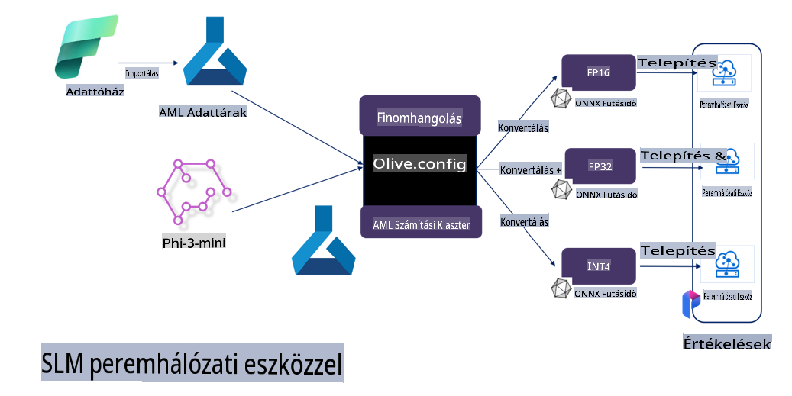

# **Phi-3 Finomhangolása a Microsoft Olive segítségével**

[Olive](https://github.com/microsoft/OLive?WT.mc_id=aiml-138114-kinfeylo) egy könnyen használható, hardver-tudatos modelloptimalizáló eszköz, amely egyesíti az iparág vezető technikáit a modellkompresszió, optimalizálás és fordítás terén.

Az eszköz célja, hogy leegyszerűsítse a gépi tanulási modellek optimalizálásának folyamatát, biztosítva, hogy azok a lehető leghatékonyabban használják ki a specifikus hardverarchitektúrákat.

Legyen szó felhőalapú alkalmazásokról vagy élkészülékekről, az Olive lehetővé teszi a modellek könnyed és hatékony optimalizálását.

## Főbb jellemzők:
- Az Olive összegyűjti és automatizálja az optimalizálási technikákat a kívánt hardvercélokhoz.
- Nincs egyetlen optimalizálási technika, amely minden helyzetre illik, ezért az Olive lehetőséget ad az iparági szakértőknek, hogy saját innovatív optimalizálási megoldásaikat integrálják.

## Mérnöki munka csökkentése:
- A fejlesztőknek gyakran több hardvergyártó-specifikus eszközláncot kell megtanulniuk és használniuk, hogy a betanított modelleket telepítésre előkészítsék és optimalizálják.
- Az Olive leegyszerűsíti ezt a folyamatot azáltal, hogy automatizálja az optimalizálási technikákat a kívánt hardverhez.

## Kész, végponttól végpontig terjedő optimalizálási megoldás:

Az integrált technikák összeállításával és finomhangolásával az Olive egységes megoldást kínál a végponttól végpontig terjedő optimalizálásra.
Figyelembe veszi a korlátokat, például a pontosságot és a késleltetést, miközben optimalizálja a modelleket.

## Microsoft Olive használata finomhangoláshoz

A Microsoft Olive egy nagyon egyszerűen használható nyílt forráskódú modelloptimalizáló eszköz, amely képes lefedni mind a finomhangolást, mind a referenciát a generatív mesterséges intelligencia területén. Csak egyszerű konfigurációra van szükség, és az eszköz kombinálható nyílt forráskódú kis nyelvi modellekkel és kapcsolódó futtatási környezetekkel (AzureML / helyi GPU, CPU, DirectML). Így automatikus optimalizálással elvégezheti a modell finomhangolását vagy referenciáját, és megtalálhatja a legjobb modellt, amelyet telepíthet a felhőben vagy élkészülékeken. Ez lehetővé teszi a vállalatok számára, hogy saját iparági vertikális modelljeiket építsék helyben és a felhőben.


## Phi-3 Finomhangolása a Microsoft Olive segítségével 



## Phi-3 Olive Példa Kód és Példa
Ebben a példában az Olive segítségével a következőket végezheti el:

- Egy LoRA adapter finomhangolása, amely mondatokat osztályoz Szomorúság, Öröm, Félelem, Meglepetés kategóriákba.
- Az adapter súlyainak egyesítése az alapmodellel.
- A modell optimalizálása és kvantálása int4 formátumba.

[Minta Kód](../../code/03.Finetuning/olive-ort-example/README.md)

### Microsoft Olive beállítása

A Microsoft Olive telepítése nagyon egyszerű, és CPU, GPU, DirectML és Azure ML számára is telepíthető.

```bash
pip install olive-ai
```

Ha egy ONNX modellt szeretne futtatni CPU-val, használhatja a következőt:

```bash
pip install olive-ai[cpu]
```

Ha egy ONNX modellt szeretne futtatni GPU-val, használhatja a következőt:

```python
pip install olive-ai[gpu]
```

Ha az Azure ML-t szeretné használni, használja a következőt:

```python
pip install git+https://github.com/microsoft/Olive#egg=olive-ai[azureml]
```

**Megjegyzés**
Operációs rendszer követelmény: Ubuntu 20.04 / 22.04 

### **Microsoft Olive Config.json fájlja**

A telepítés után a Config fájl segítségével különböző modell-specifikus beállításokat konfigurálhat, beleértve az adatokat, számítást, képzést, telepítést és modellgenerálást.

**1. Adatok**

A Microsoft Olive támogatja a helyi és a felhőben lévő adatokkal való képzést, és ezeket beállíthatja a konfigurációban.

*Helyi adatok beállítása*

Egyszerűen beállíthatja a finomhangoláshoz szükséges adatkészletet, amely általában json formátumú, és hozzáigazíthatja az adat sablonhoz. Ezt a modell követelményei alapján kell módosítani (például hozzáigazítani a Microsoft Phi-3-mini által megkövetelt formátumhoz. Ha más modelleket használ, kérjük, tekintse meg a finomhangoláshoz szükséges formátumokat).

```json

    "data_configs": [
        {
            "name": "dataset_default_train",
            "type": "HuggingfaceContainer",
            "load_dataset_config": {
                "params": {
                    "data_name": "json", 
                    "data_files":"dataset/dataset-classification.json",
                    "split": "train"
                }
            },
            "pre_process_data_config": {
                "params": {
                    "dataset_type": "corpus",
                    "text_cols": [
                            "phrase",
                            "tone"
                    ],
                    "text_template": "### Text: {phrase}\n### The tone is:\n{tone}",
                    "corpus_strategy": "join",
                    "source_max_len": 2048,
                    "pad_to_max_len": false,
                    "use_attention_mask": false
                }
            }
        }
    ],
```

**Felhő adatforrás beállítása**

Az Azure AI Studio / Azure Machine Learning Service adattárolójának összekapcsolásával a felhőben lévő adatokkal különböző adatforrásokat vihet be az Azure AI Studio / Azure Machine Learning Service-be a finomhangolás támogatásához.

```json

    "data_configs": [
        {
            "name": "dataset_default_train",
            "type": "HuggingfaceContainer",
            "load_dataset_config": {
                "params": {
                    "data_name": "json", 
                    "data_files": {
                        "type": "azureml_datastore",
                        "config": {
                            "azureml_client": {
                                "subscription_id": "Your Azure Subscrition ID",
                                "resource_group": "Your Azure Resource Group",
                                "workspace_name": "Your Azure ML Workspaces name"
                            },
                            "datastore_name": "workspaceblobstore",
                            "relative_path": "Your train_data.json Azure ML Location"
                        }
                    },
                    "split": "train"
                }
            },
            "pre_process_data_config": {
                "params": {
                    "dataset_type": "corpus",
                    "text_cols": [
                            "Question",
                            "Best Answer"
                    ],
                    "text_template": "<|user|>\n{Question}<|end|>\n<|assistant|>\n{Best Answer}\n<|end|>",
                    "corpus_strategy": "join",
                    "source_max_len": 2048,
                    "pad_to_max_len": false,
                    "use_attention_mask": false
                }
            }
        }
    ],
    
```

**2. Számítási konfiguráció**

Ha helyben szeretne dolgozni, közvetlenül használhatja a helyi adatforrásokat. Ha az Azure AI Studio / Azure Machine Learning Service erőforrásait szeretné használni, konfigurálnia kell a releváns Azure paramétereket, például a számítási teljesítmény nevét.

```json

    "systems": {
        "aml": {
            "type": "AzureML",
            "config": {
                "accelerators": ["gpu"],
                "hf_token": true,
                "aml_compute": "Your Azure AI Studio / Azure Machine Learning Service Compute Name",
                "aml_docker_config": {
                    "base_image": "Your Azure AI Studio / Azure Machine Learning Service docker",
                    "conda_file_path": "conda.yaml"
                }
            }
        },
        "azure_arc": {
            "type": "AzureML",
            "config": {
                "accelerators": ["gpu"],
                "aml_compute": "Your Azure AI Studio / Azure Machine Learning Service Compute Name",
                "aml_docker_config": {
                    "base_image": "Your Azure AI Studio / Azure Machine Learning Service docker",
                    "conda_file_path": "conda.yaml"
                }
            }
        }
    },
```

***Megjegyzés***

Mivel az Azure AI Studio / Azure Machine Learning Service tartályon keresztül fut, szükséges a szükséges környezet konfigurálása. Ezt a conda.yaml környezetben kell beállítani.

```yaml

name: project_environment
channels:
  - defaults
dependencies:
  - python=3.8.13
  - pip=22.3.1
  - pip:
      - einops
      - accelerate
      - azure-keyvault-secrets
      - azure-identity
      - bitsandbytes
      - datasets
      - huggingface_hub
      - peft
      - scipy
      - sentencepiece
      - torch>=2.2.0
      - transformers
      - git+https://github.com/microsoft/Olive@jiapli/mlflow_loading_fix#egg=olive-ai[gpu]
      - --extra-index-url https://aiinfra.pkgs.visualstudio.com/PublicPackages/_packaging/ORT-Nightly/pypi/simple/ 
      - ort-nightly-gpu==1.18.0.dev20240307004
      - --extra-index-url https://aiinfra.pkgs.visualstudio.com/PublicPackages/_packaging/onnxruntime-genai/pypi/simple/
      - onnxruntime-genai-cuda

    

```

**3. SLM kiválasztása**

Használhat modellt közvetlenül a Hugging Face-ből, vagy kombinálhatja az Azure AI Studio / Azure Machine Learning Model Catalog-jával, hogy kiválassza a használni kívánt modellt. Az alábbi kódpéldában a Microsoft Phi-3-mini-t használjuk példaként.

Ha a modell helyben van, ezt a módszert használhatja:

```json

    "input_model":{
        "type": "PyTorchModel",
        "config": {
            "hf_config": {
                "model_name": "model-cache/microsoft/phi-3-mini",
                "task": "text-generation",
                "model_loading_args": {
                    "trust_remote_code": true
                }
            }
        }
    },
```

Ha egy modellt szeretne használni az Azure AI Studio / Azure Machine Learning Service-ből, ezt a módszert használhatja:

```json

    "input_model":{
        "type": "PyTorchModel",
        "config": {
            "model_path": {
                "type": "azureml_registry_model",
                "config": {
                    "name": "microsoft/Phi-3-mini-4k-instruct",
                    "registry_name": "azureml-msr",
                    "version": "11"
                }
            },
             "model_file_format": "PyTorch.MLflow",
             "hf_config": {
                "model_name": "microsoft/Phi-3-mini-4k-instruct",
                "task": "text-generation",
                "from_pretrained_args": {
                    "trust_remote_code": true
                }
            }
        }
    },
```

**Megjegyzés:**
Az Azure AI Studio / Azure Machine Learning Service integrációjához a modell beállításakor figyeljen a verziószámra és a kapcsolódó elnevezésre.

Minden Azure modellen PyTorch.MLflow beállítás szükséges.

Hugging Face fiókra van szüksége, és a kulcsot össze kell kapcsolnia az Azure AI Studio / Azure Machine Learning kulcsértékével.

**4. Algoritmus**

A Microsoft Olive jól integrálja a Lora és QLora finomhangolási algoritmusokat. Csak néhány releváns paramétert kell konfigurálnia. Itt a QLora példáját mutatjuk be.

```json
        "lora": {
            "type": "LoRA",
            "config": {
                "target_modules": [
                    "o_proj",
                    "qkv_proj"
                ],
                "double_quant": true,
                "lora_r": 64,
                "lora_alpha": 64,
                "lora_dropout": 0.1,
                "train_data_config": "dataset_default_train",
                "eval_dataset_size": 0.3,
                "training_args": {
                    "seed": 0,
                    "data_seed": 42,
                    "per_device_train_batch_size": 1,
                    "per_device_eval_batch_size": 1,
                    "gradient_accumulation_steps": 4,
                    "gradient_checkpointing": false,
                    "learning_rate": 0.0001,
                    "num_train_epochs": 3,
                    "max_steps": 10,
                    "logging_steps": 10,
                    "evaluation_strategy": "steps",
                    "eval_steps": 187,
                    "group_by_length": true,
                    "adam_beta2": 0.999,
                    "max_grad_norm": 0.3
                }
            }
        },
```

Ha kvantálási átalakítást szeretne végezni, a Microsoft Olive fő ága már támogatja az onnxruntime-genai módszert. Beállíthatja az igényei szerint:

1. adapter súlyainak egyesítése az alapmodellel
2. A modell átalakítása onnx modellé a szükséges pontossággal a ModelBuilder segítségével

például kvantált INT4-re való átalakítás:

```json

        "merge_adapter_weights": {
            "type": "MergeAdapterWeights"
        },
        "builder": {
            "type": "ModelBuilder",
            "config": {
                "precision": "int4"
            }
        }
```

**Megjegyzés** 
- Ha QLoRA-t használ, az ONNXRuntime-genai kvantálási átalakítás jelenleg nem támogatott.

- Itt meg kell jegyezni, hogy a fenti lépéseket az igényei szerint állíthatja be. Nem szükséges teljes mértékben konfigurálni a fentieket. Az igényei szerint közvetlenül használhatja az algoritmus lépéseit finomhangolás nélkül. Végül konfigurálnia kell a releváns motorokat.

```json

    "engine": {
        "log_severity_level": 0,
        "host": "aml",
        "target": "aml",
        "search_strategy": false,
        "execution_providers": ["CUDAExecutionProvider"],
        "cache_dir": "../model-cache/models/phi3-finetuned/cache",
        "output_dir" : "../model-cache/models/phi3-finetuned"
    }
```

**5. Finomhangolás befejezése**

A parancssorban hajtsa végre az olive-config.json könyvtárában:

```bash
olive run --config olive-config.json  
```

**Felelősségkizárás**:  
Ez a dokumentum gépi AI fordítószolgáltatások segítségével lett lefordítva. Bár törekszünk a pontosságra, kérjük, vegye figyelembe, hogy az automatikus fordítások hibákat vagy pontatlanságokat tartalmazhatnak. Az eredeti dokumentum az eredeti nyelvén tekintendő hiteles forrásnak. Kritikus információk esetén javasolt professzionális, emberi fordítást igénybe venni. Nem vállalunk felelősséget a fordítás használatából eredő félreértésekért vagy téves értelmezésekért.