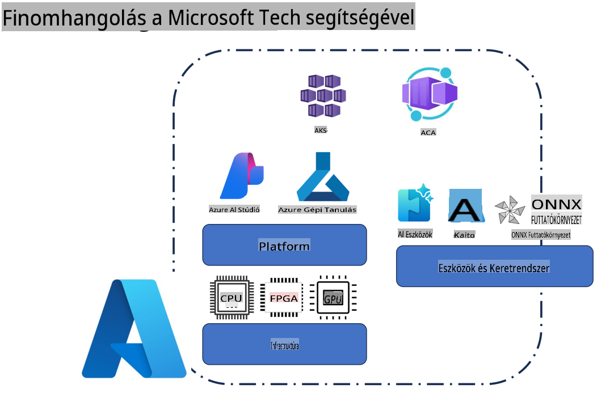
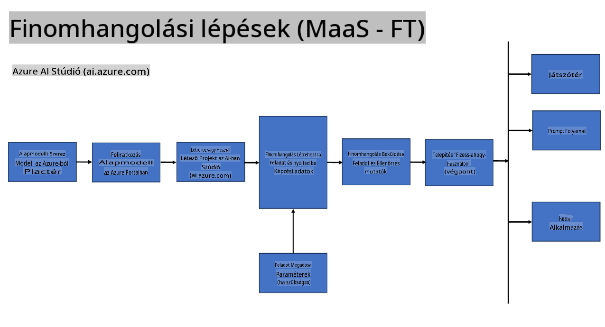
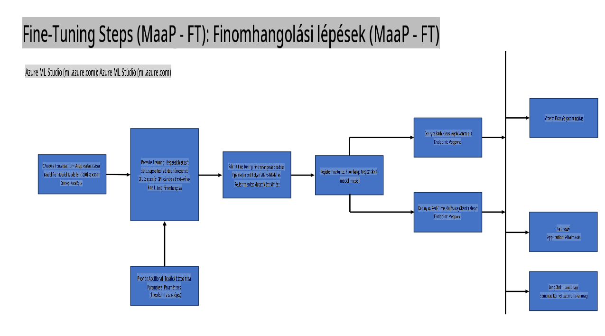
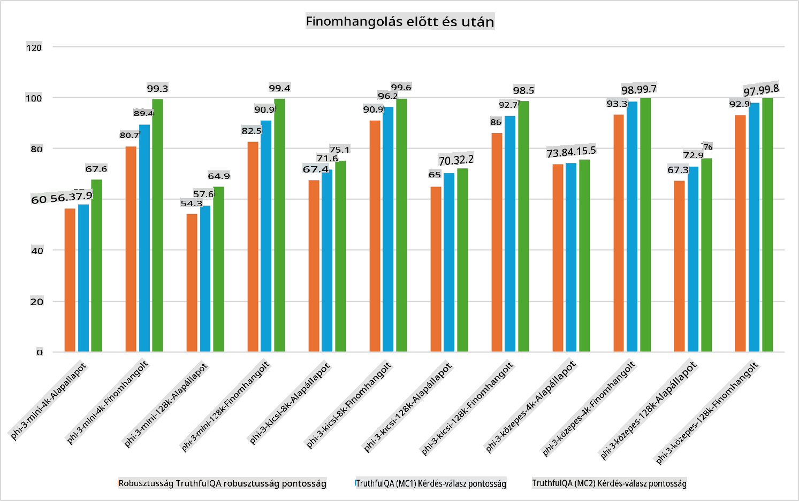

## Finomhangolási Forgatókönyvek

**Platform** Ide tartoznak olyan technológiák, mint az Azure AI Foundry, Azure Machine Learning, AI Tools, Kaito és ONNX Runtime. 

**Infrastruktúra** Ez magában foglalja a CPU-t és az FPGA-t, amelyek alapvető fontosságúak a finomhangolási folyamat során. Nézzük meg az egyes technológiák ikonjait.

**Eszközök és Keretrendszerek** Ide tartozik az ONNX Runtime és az ONNX Runtime. Nézzük meg az ezekhez tartozó ikonokat.  
[Helyezze be az ONNX Runtime és ONNX Runtime ikonokat]

A finomhangolási folyamat a Microsoft technológiáival számos komponensből és eszközből áll. Ezek megértésével és használatával hatékonyan finomhangolhatjuk alkalmazásainkat, és jobb megoldásokat hozhatunk létre.

## Modell mint Szolgáltatás

Finomhangolja a modellt hosztolt finomhangolással, anélkül hogy számítási kapacitást kellene létrehozni és kezelni.

A szerver nélküli finomhangolás elérhető a Phi-3-mini és Phi-3-medium modellekhez, lehetővé téve a fejlesztők számára, hogy gyorsan és egyszerűen testre szabják a modelleket felhő- és peremhálózati forgatókönyvekhez anélkül, hogy számítási kapacitásról kellene gondoskodniuk. Bejelentettük továbbá, hogy a Phi-3-small modell mostantól elérhető a Models-as-a-Service kínálatunkon keresztül, így a fejlesztők gyorsan és könnyedén kezdhetik meg az AI fejlesztést anélkül, hogy az alapinfrastruktúrát kezelniük kellene.

## Modell mint Platform 

A felhasználók saját számítási kapacitásukat kezelik a modellek finomhangolásához.

[Finomhangolási Példa](https://github.com/Azure/azureml-examples/blob/main/sdk/python/foundation-models/system/finetune/chat-completion/chat-completion.ipynb)

## Finomhangolási Forgatókönyvek 

| | | | | | | |
|-|-|-|-|-|-|-|
|Forgatókönyv|LoRA|QLoRA|PEFT|DeepSpeed|ZeRO|DORA|
|Előre betanított LLM-ek testreszabása specifikus feladatokhoz vagy területekhez|Igen|Igen|Igen|Igen|Igen|Igen|
|Finomhangolás NLP feladatokhoz, például szövegosztályozás, névfelismerés és gépi fordítás|Igen|Igen|Igen|Igen|Igen|Igen|
|Finomhangolás QA feladatokhoz|Igen|Igen|Igen|Igen|Igen|Igen|
|Finomhangolás emberihez hasonló válaszok generálásához chatbotokban|Igen|Igen|Igen|Igen|Igen|Igen|
|Finomhangolás zene, művészet vagy más kreatív tartalmak generálásához|Igen|Igen|Igen|Igen|Igen|Igen|
|Számítási és pénzügyi költségek csökkentése|Igen|Igen|Nem|Igen|Igen|Nem|
|Memóriahasználat csökkentése|Nem|Igen|Nem|Igen|Igen|Igen|
|Kevesebb paraméter használata hatékony finomhangoláshoz|Nem|Igen|Igen|Nem|Nem|Igen|
|Memóriahatékony adatpárhuzamosság, amely hozzáférést biztosít az összes rendelkezésre álló GPU-eszköz aggregált GPU-memóriájához|Nem|Nem|Nem|Igen|Igen|Igen|

## Finomhangolási Teljesítmény Példák

**Felelősségkizárás**:  
Ez a dokumentum gépi AI fordítási szolgáltatásokkal került lefordításra. Bár törekszünk a pontosságra, kérjük, vegye figyelembe, hogy az automatikus fordítások hibákat vagy pontatlanságokat tartalmazhatnak. Az eredeti dokumentum az eredeti nyelvén tekinthető hiteles forrásnak. Kritikus információk esetén javasolt a professzionális, emberi fordítás igénybevétele. Nem vállalunk felelősséget a fordítás használatából eredő félreértésekért vagy téves értelmezésekért.