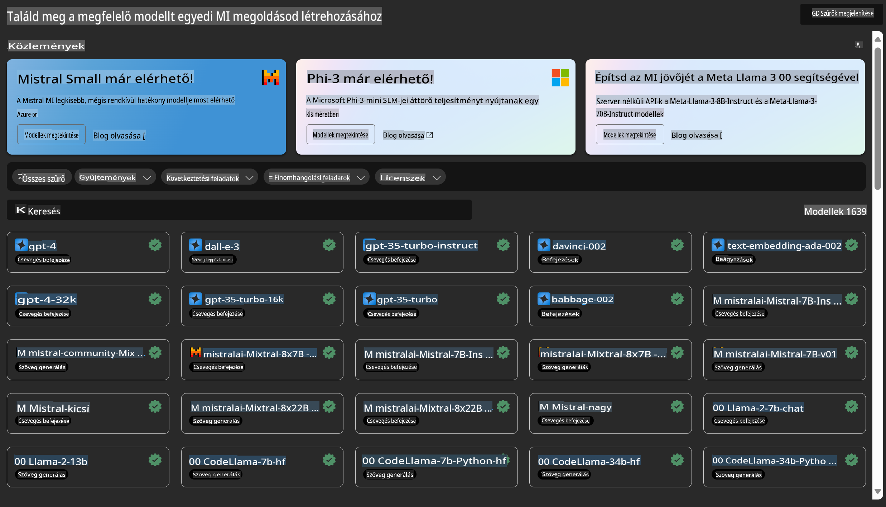

# **Azure Machine Learning Szolgáltatás bemutatása**

[Azure Machine Learning](https://ml.azure.com?WT.mc_id=aiml-138114-kinfeylo) egy felhőalapú szolgáltatás, amely a gépi tanulási (ML) projektek életciklusának felgyorsítására és kezelésére szolgál.

ML szakemberek, adatelemzők és mérnökök napi munkafolyamataik során használhatják a következőkre:

- Modellek betanítása és telepítése.  
- Gépi tanulási műveletek (MLOps) kezelése.  
- Létrehozhatsz modellt az Azure Machine Learning-ben, vagy használhatsz nyílt forráskódú platformokon, például PyTorch, TensorFlow vagy scikit-learn alapuló modelleket.  
- Az MLOps eszközök segítenek a modellek monitorozásában, újratanításában és újratelepítésében.  

## Kiknek szól az Azure Machine Learning?

**Adatelemzők és ML mérnökök**

Olyan eszközöket használhatnak, amelyek felgyorsítják és automatizálják a napi munkafolyamatokat.  
Az Azure ML biztosít funkciókat az igazságosság, magyarázhatóság, nyomon követhetőség és auditálhatóság érdekében.  

**Alkalmazásfejlesztők**  
Zökkenőmentesen integrálhatják a modelleket alkalmazásaikba vagy szolgáltatásaikba.  

**Platformfejlesztők**  

Hozzáférhetnek egy robusztus eszközkészlethez, amelyet a megbízható Azure Resource Manager API-k támogatnak.  
Ezek az eszközök lehetővé teszik fejlett ML eszközök létrehozását.  

**Vállalatok**  

A Microsoft Azure felhőben dolgozó vállalatok profitálhatnak az ismerős biztonsági és szerepköralapú hozzáférés-szabályozásból.  
Állítsd be a projekteket, hogy szabályozd a védett adatokhoz és a specifikus műveletekhez való hozzáférést.  

## Hatékonyság a csapat minden tagjának  
Az ML projektek gyakran különböző készségekkel rendelkező csapatot igényelnek az építéshez és karbantartáshoz.  

Az Azure ML olyan eszközöket biztosít, amelyek lehetővé teszik, hogy:  
- Együttműködj a csapatoddal megosztott jegyzetfüzetek, számítási erőforrások, szerver nélküli számítások, adatok és környezetek segítségével.  
- Olyan modelleket fejlessz, amelyek megfelelnek a származási és auditálási követelményeknek igazságosság, magyarázhatóság, nyomon követhetőség és auditálhatóság révén.  
- Gyorsan és egyszerűen telepíts ML modelleket nagy léptékben, majd kezeld és irányítsd őket hatékonyan MLOps-szal.  
- Futtasd a gépi tanulási munkaterheléseket bárhol, beépített irányítási, biztonsági és megfelelőségi funkciókkal.  

## Keresztkompatibilis platformeszközök  

Az ML csapat bármely tagja használhatja a számára kedvelt eszközöket a feladatok elvégzéséhez.  
Legyen szó gyors kísérletezésről, hiperparaméter-hangolásról, pipeline-ok építéséről vagy következtetések kezeléséről, használhatod az ismerős felületeket, például:  
- Azure Machine Learning Studio  
- Python SDK (v2)  
- Azure CLI (v2)  
- Azure Resource Manager REST API-k  

Ahogy a modelleket finomítod és együttműködsz a fejlesztési ciklus során, megoszthatod és megtalálhatod az eszközöket, erőforrásokat és metrikákat az Azure Machine Learning Studio felhasználói felületén belül.  

## **LLM/SLM az Azure ML-ben**

Az Azure ML számos LLM/SLM-funkcióval bővült, kombinálva az LLMOps-t és az SLMOps-t, hogy egy vállalati szintű generatív mesterséges intelligencia technológiai platformot hozzon létre.

### **Modellkatalógus**

A vállalati felhasználók a Modellkatalógus segítségével különböző üzleti forgatókönyvekhez igazodó modelleket telepíthetnek, és Model as Service formában szolgáltatásokat nyújthatnak a vállalati fejlesztők vagy felhasználók számára.

Az Azure Machine Learning Studio Modellkatalógusa egy központ, ahol különféle modelleket fedezhetsz fel és használhatsz, amelyek lehetővé teszik Generatív AI alkalmazások létrehozását. A modellkatalógus több száz modellt kínál különböző modell-szolgáltatóktól, például Azure OpenAI szolgáltatás, Mistral, Meta, Cohere, Nvidia, Hugging Face, valamint a Microsoft által betanított modellek. A Microsofton kívüli szolgáltatók modelljei nem Microsoft termékek, ahogyan azt a Microsoft termékfeltételei meghatározzák, és a modellel biztosított feltételek vonatkoznak rájuk.

### **Feladatpipeline**

A gépi tanulási pipeline lényege, hogy egy teljes gépi tanulási feladatot több lépésből álló munkafolyamatra bontson. Minden lépés egy kezelhető komponens, amelyet külön-külön lehet fejleszteni, optimalizálni, konfigurálni és automatizálni. A lépések jól meghatározott interfészeken keresztül kapcsolódnak egymáshoz. Az Azure Machine Learning pipeline szolgáltatás automatikusan kezeli a pipeline lépései közötti összes függőséget.

Az SLM/LLM finomhangolásában a pipeline segítségével kezelhetjük adatainkat, betanítási és generálási folyamataikat.

### **Prompt flow**

Az Azure Machine Learning prompt flow előnyei  
Az Azure Machine Learning prompt flow számos előnyt kínál, amelyek segítik a felhasználókat az ötleteléstől a kísérletezésen át egészen a gyártásra kész LLM-alapú alkalmazásokig:

**Prompt mérnöki agilitás**  

Interaktív szerkesztési élmény: Az Azure Machine Learning prompt flow vizuális megjelenítést nyújt a folyamat struktúrájáról, amely lehetővé teszi a felhasználók számára, hogy könnyen átlássák és navigálják projektjeiket. Jegyzetfüzet-szerű kódolási élményt is kínál a hatékony fejlesztéshez és hibakereséshez.  
Prompt hangolási változatok: A felhasználók több prompt változatot hozhatnak létre és hasonlíthatnak össze, elősegítve az iteratív finomítási folyamatot.  

Értékelés: Beépített értékelési folyamatok lehetővé teszik a felhasználók számára, hogy felmérjék promtjaik és folyamataik minőségét és hatékonyságát.  

Átfogó erőforrások: Az Azure Machine Learning prompt flow beépített eszközkönyvtárat, mintákat és sablonokat tartalmaz, amelyek kiindulópontként szolgálnak a fejlesztéshez, inspirálva a kreativitást és felgyorsítva a folyamatot.  

**Vállalati szintű készenlét LLM-alapú alkalmazásokhoz**  

Együttműködés: Az Azure Machine Learning prompt flow támogatja a csapatmunkát, lehetővé téve több felhasználó számára, hogy együtt dolgozzanak a prompt mérnöki projekteken, megosszák tudásukat és fenntartsák a verziókezelést.  

Minden egy platformon: Az Azure Machine Learning prompt flow leegyszerűsíti a teljes prompt mérnöki folyamatot, a fejlesztéstől és értékeléstől a telepítésig és monitorozásig. A felhasználók könnyedén telepíthetik folyamataikat Azure Machine Learning végpontként, és valós időben figyelhetik teljesítményüket, biztosítva az optimális működést és a folyamatos fejlesztést.  

Azure Machine Learning vállalati szintű megoldások: A Prompt flow kihasználja az Azure Machine Learning robusztus vállalati szintű megoldásait, biztonságos, skálázható és megbízható alapot nyújtva a folyamatok fejlesztéséhez, kísérletezéséhez és telepítéséhez.  

Az Azure Machine Learning prompt flow segítségével a felhasználók kihasználhatják a prompt mérnöki agilitást, hatékonyan együttműködhetnek, és vállalati szintű megoldásokat alkalmazhatnak az LLM-alapú alkalmazások sikeres fejlesztéséhez és telepítéséhez.

Az Azure ML számítási kapacitását, adatait és különböző komponenseit kombinálva a vállalati fejlesztők könnyedén létrehozhatják saját mesterséges intelligencia alkalmazásaikat.

**Felelősségkizárás**:  
Ez a dokumentum gépi AI fordítási szolgáltatások segítségével lett lefordítva. Bár igyekszünk a pontosságra törekedni, kérjük, vegye figyelembe, hogy az automatikus fordítások hibákat vagy pontatlanságokat tartalmazhatnak. Az eredeti dokumentum az eredeti nyelvén tekintendő hiteles forrásnak. Fontos információk esetén javasolt a professzionális, emberi fordítás igénybevétele. Nem vállalunk felelősséget a fordítás használatából eredő félreértésekért vagy téves értelmezésekért.