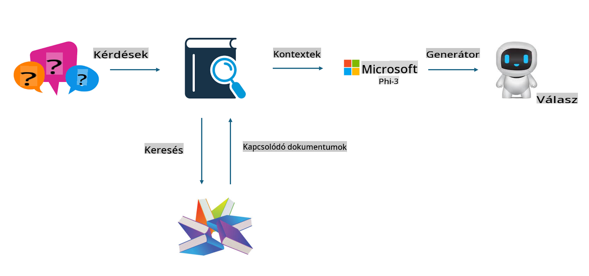
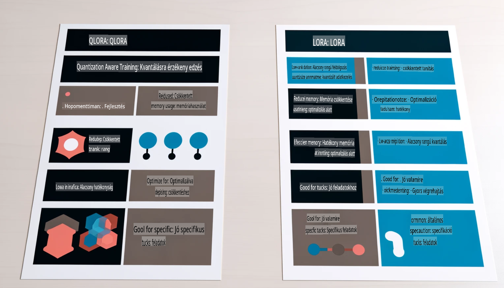

# **Legyen a Phi-3 iparági szakértő**

Ahhoz, hogy a Phi-3 modellt egy iparágban alkalmazzuk, hozzá kell adnunk az iparági üzleti adatokat a Phi-3 modellhez. Két különböző lehetőségünk van: az első a RAG (Retrieval Augmented Generation), a második pedig a Fine Tuning.

## **RAG vs Fine-tuning**

### **Retrieval Augmented Generation**

A RAG az adatvisszakeresés és a szöveggenerálás kombinációja. A vállalat strukturált és strukturálatlan adatai a vektoralapú adatbázisban vannak tárolva. Amikor releváns tartalomra keresünk, a megfelelő összefoglaló és tartalom kerül elő, amely kontextust képez, és ezt a LLM/SLM szövegkiegészítő képességeivel kombinálva generál tartalmat.

### **Fine-tuning**

A Fine-tuning egy meglévő modell fejlesztésén alapul. Nem kell a modell algoritmusával kezdeni, de folyamatosan adatokat kell gyűjteni. Ha pontosabb terminológiára és nyelvi kifejezésmódra van szükség iparági alkalmazásokban, a Fine-tuning a jobb választás. Azonban, ha az adatok gyakran változnak, a Fine-tuning bonyolulttá válhat.

### **Hogyan válasszunk?**

1. Ha a válaszunkhoz külső adatok bevonása szükséges, a RAG a legjobb választás.

2. Ha stabil és pontos iparági tudás kimenetre van szükség, a Fine-tuning jó választás lesz. A RAG előnyben részesíti a releváns tartalom lehívását, de nem mindig képes pontosan visszaadni a szakmai árnyalatokat.

3. A Fine-tuninghoz magas minőségű adatbázis szükséges, és ha csak egy szűk adatkör áll rendelkezésre, az nem hoz jelentős különbséget. A RAG rugalmasabb.

4. A Fine-tuning egy "fekete doboz", egyfajta metafizika, és nehéz megérteni a belső mechanizmusát. A RAG viszont könnyebbé teszi az adatok forrásának megtalálását, ezáltal hatékonyan korrigálja a téves tartalmakat vagy hallucinációkat, és jobb átláthatóságot biztosít.

### **Felhasználási forgatókönyvek**

1. Vertikális iparágak, amelyek specifikus szakmai szókincset és kifejezéseket igényelnek: ***Fine-tuning*** a legjobb választás.

2. Kérdés-válasz rendszerek, amelyek különböző tudáspontok szintézisét igénylik: ***RAG*** a legjobb választás.

3. Automatizált üzleti folyamatok kombinációja esetén: ***RAG + Fine-tuning*** a legjobb választás.

## **Hogyan használjuk a RAG-ot**

A vektoralapú adatbázis egy matematikai formában tárolt adatok gyűjteménye. A vektoralapú adatbázisok megkönnyítik a gépi tanulási modellek számára a korábbi bemenetek megjegyzését, lehetővé téve a gépi tanulás alkalmazását olyan felhasználási esetek támogatására, mint a keresés, ajánlások és szöveggenerálás. Az adatokat hasonlósági metrikák alapján lehet azonosítani, nem pedig pontos egyezések alapján, ami lehetővé teszi a számítógépes modellek számára, hogy megértsék az adatok kontextusát.

A vektoralapú adatbázis kulcsfontosságú a RAG megvalósításában. Az adatokat vektormodellek, például a text-embedding-3 vagy a jina-ai-embedding segítségével lehet vektoros tárolássá alakítani.

További információ a RAG alkalmazások létrehozásáról: [https://github.com/microsoft/Phi-3CookBook](https://github.com/microsoft/Phi-3CookBook?WT.mc_id=aiml-138114-kinfeylo)

## **Hogyan használjuk a Fine-tuningot**

A Fine-tuningban gyakran használt algoritmusok a Lora és a QLora. Hogyan válasszunk?
- [További információ ezzel a mintanotebookkal](../../../../code/04.Finetuning/Phi_3_Inference_Finetuning.ipynb)
- [Python FineTuning minta példája](../../../../code/04.Finetuning/FineTrainingScript.py)

### **Lora és QLora**

A LoRA (Low-Rank Adaptation) és a QLoRA (Quantized Low-Rank Adaptation) olyan technikák, amelyeket nagy nyelvi modellek (LLM-ek) finomhangolására használnak a Parameter Efficient Fine Tuning (PEFT) módszerrel. A PEFT technikák célja, hogy hatékonyabban képezzék a modelleket, mint a hagyományos módszerek.

A LoRA egy önálló finomhangolási technika, amely csökkenti a memóriahasználatot azáltal, hogy alacsony rangú közelítést alkalmaz a súlyfrissítési mátrixra. Gyors képzési időt kínál, miközben a teljesítménye közel áll a hagyományos finomhangolási módszerekhez.

A QLoRA a LoRA kiterjesztett változata, amely kvantálási technikákat alkalmaz a memóriahasználat további csökkentése érdekében. A QLoRA a súlyparaméterek precizitását a betanított LLM-ben 4 bites precizitásra kvantálja, ami memóriahatékonyabb, mint a LoRA. Ugyanakkor a QLoRA képzése körülbelül 30%-kal lassabb, mint a LoRA képzése, a kvantálási és dekvantálási lépések miatt.

A QLoRA a LoRA-t használja kiegészítőként a kvantálási hibák korrigálására. A QLoRA lehetővé teszi hatalmas modellek finomhangolását, amelyek milliárdos paraméterekkel rendelkeznek, viszonylag kis, könnyen elérhető GPU-kon. Például a QLoRA képes egy 70 milliárd paraméteres modellt finomhangolni, amelyhez 36 GPU szükséges, mindössze 2 GPU-val.

**Felelősségkizárás**:  
Ez a dokumentum gépi AI fordítószolgáltatások segítségével készült fordítás. Bár igyekszünk pontosságra törekedni, kérjük, vegye figyelembe, hogy az automatikus fordítások hibákat vagy pontatlanságokat tartalmazhatnak. Az eredeti dokumentum az eredeti nyelvén tekintendő hiteles forrásnak. Fontos információk esetén javasolt professzionális, emberi fordítás igénybevétele. Nem vállalunk felelősséget a fordítás használatából eredő félreértésekért vagy téves értelmezésekért.