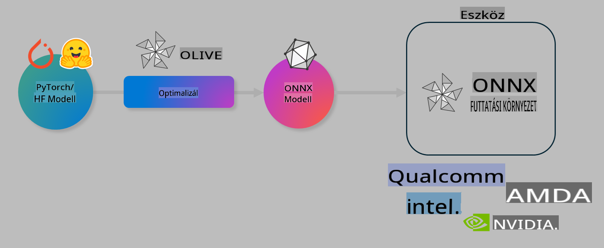

# Labor. AI modellek optimalizálása eszközön történő futtatáshoz

## Bevezetés 

> [!IMPORTANT]
> Ehhez a laborhoz **Nvidia A10 vagy A100 GPU** szükséges, a megfelelő illesztőprogramokkal és telepített CUDA eszközkészlettel (12-es vagy újabb verzió).

> [!NOTE]
> Ez egy **35 perces** labor, amely gyakorlati bevezetést nyújt a modellek eszközön történő futtatásához szükséges optimalizálásának alapfogalmaiba az OLIVE segítségével.

## Tanulási célok

A labor végére képes leszel az OLIVE használatára az alábbiakhoz:

- AI modell kvantálása az AWQ kvantálási módszerrel.
- AI modell finomhangolása egy adott feladatra.
- LoRA adapterek (finomhangolt modellek) létrehozása hatékony eszközön történő futtatáshoz az ONNX Runtime környezetben.

### Mi az az Olive?

Az Olive (*O*NNX *live*) egy modelloptimalizálási eszközkészlet, amelyhez CLI is tartozik, és amely lehetővé teszi modellek futtatását az ONNX Runtime környezetben +++https://onnxruntime.ai+++ minőség és teljesítmény biztosítása mellett.



Az Olive bemenete jellemzően egy PyTorch vagy Hugging Face modell, kimenete pedig egy optimalizált ONNX modell, amely egy eszközön (telepítési cél) fut az ONNX Runtime környezetben. Az Olive a modellt az adott telepítési cél AI gyorsítójához (NPU, GPU, CPU) optimalizálja, amelyet például Qualcomm, AMD, Nvidia vagy Intel hardvergyártók biztosítanak.

Az Olive egy *munkafolyamatot* hajt végre, amely egyedi modelloptimalizálási feladatok, úgynevezett *passzok* sorrendje – például: modellkompresszió, gráfrögzítés, kvantálás, gráfoptimalizálás. Minden passznak van egy paraméterkészlete, amelyet hangolni lehet a legjobb metrikák, például pontosság és késleltetés eléréséhez, amelyeket az adott értékelő eszköz mér. Az Olive egy keresési stratégiát alkalmaz, amely egy keresési algoritmust használ a passzok egyenkénti vagy csoportos automatikus hangolására.

#### Az Olive előnyei

- **Csökkenti a frusztrációt és az időt**, amelyet manuális próbálkozásokkal töltenél különböző gráfoptimalizálási, kompressziós és kvantálási technikákkal. Határozd meg a minőségi és teljesítménybeli elvárásaidat, és hagyd, hogy az Olive automatikusan megtalálja a legjobb modellt számodra.
- **40+ beépített modelloptimalizálási komponens**, amelyek lefedik a kvantálás, kompresszió, gráfoptimalizálás és finomhangolás legmodernebb technikáit.
- **Egyszerűen használható CLI** a gyakori modelloptimalizálási feladatokhoz, például: olive quantize, olive auto-opt, olive finetune.
- Modellcsomagolás és -telepítés beépítve.
- Támogatja a modellek generálását **Multi LoRA kiszolgáláshoz**.
- YAML/JSON használatával munkafolyamatok létrehozása modelloptimalizálási és telepítési feladatok összehangolásához.
- **Hugging Face** és **Azure AI** integráció.
- Beépített **gyorsítótár-mechanizmus**, amely **költséget takarít meg**.

## Labor utasítások
> [!NOTE]
> Győződj meg róla, hogy létrehoztad az Azure AI Hubodat és Projektedet, valamint beállítottad az A100 számítási környezetet az 1. labor szerint.

### 0. lépés: Csatlakozás az Azure AI számítási környezethez

Csatlakozni fogsz az Azure AI számítási környezethez a **VS Code** távoli elérés funkciójával.

1. Nyisd meg a **VS Code** asztali alkalmazást:
1. Nyisd meg a **parancs palettát** a **Shift+Ctrl+P** billentyűkombinációval.
1. A parancs palettában keresd meg az **AzureML - remote: Connect to compute instance in New Window** parancsot.
1. Kövesd a képernyőn megjelenő utasításokat a csatlakozáshoz. Ez magában foglalja az Azure-előfizetés, az erőforráscsoport, a projekt és az 1. laborban beállított számítási környezet kiválasztását.
1. Ha csatlakoztál az Azure ML számítási csomóponthoz, ezt a **VS Code bal alsó sarkában** fogod látni `><Azure ML: Compute Name`.

### 1. lépés: Klónozd ezt a repót

A VS Code-ban egy új terminált nyithatsz meg a **Ctrl+J** billentyűkombinációval, és klónozhatod ezt a repót:

A terminálban ezt a promptot kell látnod:

```
azureuser@computername:~/cloudfiles/code$ 
```
Klónozd a megoldást:

```bash
cd ~/localfiles
git clone https://github.com/microsoft/phi-3cookbook.git
```

### 2. lépés: Mappa megnyitása a VS Code-ban

A releváns mappa megnyitásához futtasd az alábbi parancsot a terminálban, amely új ablakot nyit meg:

```bash
code phi-3cookbook/code/04.Finetuning/Olive-lab
```

Alternatívaként megnyithatod a mappát a **Fájl** > **Mappa megnyitása** menüpont kiválasztásával.

### 3. lépés: Függőségek

Nyiss egy terminálablakot a VS Code-ban az Azure AI számítási környezetedben (tipp: **Ctrl+J**) és futtasd az alábbi parancsokat a függőségek telepítéséhez:

```bash
conda create -n olive-ai python=3.11 -y
conda activate olive-ai
pip install -r requirements.txt
az extension remove -n azure-cli-ml
az extension add -n ml
```

> [!NOTE]
> A függőségek telepítése **kb. 5 percet** vesz igénybe.

Ebben a laborban modelleket fogsz letölteni és feltölteni az Azure AI Modellkatalógusba. Ahhoz, hogy hozzáférj a modellkatalógushoz, be kell jelentkezned az Azure-ba az alábbi parancs használatával:

```bash
az login
```

> [!NOTE]
> A bejelentkezéskor ki kell választanod az előfizetésedet. Győződj meg róla, hogy azt az előfizetést választod, amelyet ehhez a laborhoz biztosítottak.

### 4. lépés: Olive parancsok futtatása

Nyiss egy terminálablakot a VS Code-ban az Azure AI számítási környezetedben (tipp: **Ctrl+J**) és győződj meg róla, hogy az `olive-ai` conda környezet aktív:

```bash
conda activate olive-ai
```

Ezután futtasd az alábbi Olive parancsokat a parancssorban.

1. **Adatok ellenőrzése:** Ebben a példában a Phi-3.5-Mini modellt fogod finomhangolni, hogy utazással kapcsolatos kérdések megválaszolására legyen specializált. Az alábbi kód megjeleníti az adatállomány első néhány rekordját, amelyek JSON lines formátumban vannak:

    ```bash
    head data/data_sample_travel.jsonl
    ```
1. **Modell kvantálása:** A modell betanítása előtt először kvantáld az alábbi parancs segítségével, amely egy Active Aware Quantization (AWQ) nevű technikát használ +++https://arxiv.org/abs/2306.00978+++. Az AWQ a modell súlyait a futtatás során keletkező aktivációk figyelembevételével kvantálja. Ez azt jelenti, hogy a kvantálási folyamat figyelembe veszi az aktivációk tényleges adateloszlását, ami jobb pontosságmegőrzést eredményez a hagyományos súlykvantálási módszerekhez képest.

    ```bash
    olive quantize \
       --model_name_or_path microsoft/Phi-3.5-mini-instruct \
       --trust_remote_code \
       --algorithm awq \
       --output_path models/phi/awq \
       --log_level 1
    ```
    
    Az AWQ kvantálás **kb. 8 percet** vesz igénybe, és **a modell méretét ~7,5 GB-ról ~2,5 GB-ra csökkenti**.
   
   Ebben a laborban megmutatjuk, hogyan lehet modelleket betölteni a Hugging Face-ből (például: `microsoft/Phi-3.5-mini-instruct`). However, Olive also allows you to input models from the Azure AI catalog by updating the `model_name_or_path` argument to an Azure AI asset ID (for example:  `azureml://registries/azureml/models/Phi-3.5-mini-instruct/versions/4`). 

1. **Train the model:** Next, the `olive finetune` parancs finomhangolja a kvantált modellt. A modell kvantálása *a finomhangolás előtt* jobb pontosságot eredményez, mivel a finomhangolási folyamat visszanyeri a kvantálásból eredő veszteség egy részét.

    ```bash
    olive finetune \
        --method lora \
        --model_name_or_path models/phi/awq \
        --data_files "data/data_sample_travel.jsonl" \
        --data_name "json" \
        --text_template "<|user|>\n{prompt}<|end|>\n<|assistant|>\n{response}<|end|>" \
        --max_steps 100 \
        --output_path ./models/phi/ft \
        --log_level 1
    ```
    
    A finomhangolás (100 lépéssel) **kb. 6 percet** vesz igénybe.

1. **Optimalizálás:** A modell betanítása után optimalizáld a modellt az Olive `auto-opt` command, which will capture the ONNX graph and automatically perform a number of optimizations to improve the model performance for CPU by compressing the model and doing fusions. It should be noted, that you can also optimize for other devices such as NPU or GPU by just updating the `--device` and `--provider` argumentumaival - de a labor céljából CPU-t használunk.

    ```bash
    olive auto-opt \
       --model_name_or_path models/phi/ft/model \
       --adapter_path models/phi/ft/adapter \
       --device cpu \
       --provider CPUExecutionProvider \
       --use_ort_genai \
       --output_path models/phi/onnx-ao \
       --log_level 1
    ```
    
    Az optimalizálás **kb. 5 percet** vesz igénybe.

### 5. lépés: Modell gyors tesztelése

A modell futtatásának teszteléséhez hozz létre egy Python fájlt a mappádban **app.py** néven, és másold be az alábbi kódot:

```python
import onnxruntime_genai as og
import numpy as np

print("loading model and adapters...", end="", flush=True)
model = og.Model("models/phi/onnx-ao/model")
adapters = og.Adapters(model)
adapters.load("models/phi/onnx-ao/model/adapter_weights.onnx_adapter", "travel")
print("DONE!")

tokenizer = og.Tokenizer(model)
tokenizer_stream = tokenizer.create_stream()

params = og.GeneratorParams(model)
params.set_search_options(max_length=100, past_present_share_buffer=False)
user_input = "what is the best thing to see in chicago"
params.input_ids = tokenizer.encode(f"<|user|>\n{user_input}<|end|>\n<|assistant|>\n")

generator = og.Generator(model, params)

generator.set_active_adapter(adapters, "travel")

print(f"{user_input}")

while not generator.is_done():
    generator.compute_logits()
    generator.generate_next_token()

    new_token = generator.get_next_tokens()[0]
    print(tokenizer_stream.decode(new_token), end='', flush=True)

print("\n")
```

Futtasd a kódot az alábbi parancs használatával:

```bash
python app.py
```

### 6. lépés: Modell feltöltése az Azure AI-ba

A modell feltöltése egy Azure AI modell-adattárba lehetővé teszi, hogy a modellt megoszthasd a fejlesztőcsapatod többi tagjával, és kezeli a modell verziókövetését is. A modell feltöltéséhez futtasd az alábbi parancsot:

> [!NOTE]
> Frissítsd a `{}`` placeholders with the name of your resource group and Azure AI Project Name. 

To find your resource group ``resourceGroup` és Azure AI Projekt nevet, majd futtasd az alábbi parancsot:

```
az ml workspace show
```

Vagy menj a +++ai.azure.com+++ oldalra, és válaszd ki a **menedzsment központot**, **projektet**, **áttekintést**.

Frissítsd a `{}` helyőrzőket az erőforráscsoportod és az Azure AI Projekt nevével.

```bash
az ml model create \
    --name ft-for-travel \
    --version 1 \
    --path ./models/phi/onnx-ao \
    --resource-group {RESOURCE_GROUP_NAME} \
    --workspace-name {PROJECT_NAME}
```
Ezután megtekintheted a feltöltött modelledet, és telepítheted a modelledet a következő oldalon: https://ml.azure.com/model/list

**Felelősségkizárás**:  
Ez a dokumentum gépi AI fordítószolgáltatások segítségével került lefordításra. Bár törekszünk a pontosságra, kérjük, vegye figyelembe, hogy az automatikus fordítások hibákat vagy pontatlanságokat tartalmazhatnak. Az eredeti dokumentum az eredeti nyelvén tekintendő hiteles forrásnak. Kritikus információk esetén javasolt professzionális, emberi fordítást igénybe venni. Nem vállalunk felelősséget az ezen fordítás használatából eredő félreértésekért vagy téves értelmezésekért.