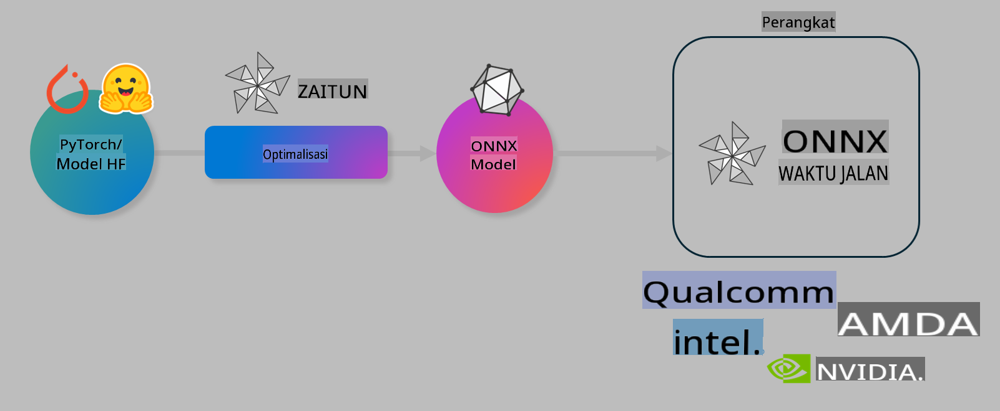

# Lab. Optimalkan Model AI untuk Inferensi di Perangkat

## Pendahuluan

> [!IMPORTANT]
> Lab ini membutuhkan **GPU Nvidia A10 atau A100** dengan driver terkait dan toolkit CUDA (versi 12+) yang telah terinstal.

> [!NOTE]
> Lab ini berdurasi **35 menit** dan akan memberikan pengenalan langsung tentang konsep dasar mengoptimalkan model untuk inferensi di perangkat menggunakan OLIVE.

## Tujuan Pembelajaran

Pada akhir lab ini, Anda akan dapat menggunakan OLIVE untuk:

- Melakukan kuantisasi model AI menggunakan metode kuantisasi AWQ.
- Menyempurnakan model AI untuk tugas tertentu.
- Menghasilkan adaptor LoRA (model yang telah disempurnakan) untuk inferensi di perangkat yang efisien pada ONNX Runtime.

### Apa itu Olive

Olive (*O*NNX *live*) adalah toolkit optimasi model dengan CLI pendamping yang memungkinkan Anda mengirimkan model untuk ONNX runtime +++https://onnxruntime.ai+++ dengan kualitas dan performa.



Input untuk Olive biasanya berupa model PyTorch atau Hugging Face, dan outputnya adalah model ONNX yang dioptimalkan untuk dijalankan pada perangkat (target penyebaran) yang menggunakan ONNX runtime. Olive akan mengoptimalkan model untuk akselerator AI (NPU, GPU, CPU) yang disediakan oleh vendor perangkat keras seperti Qualcomm, AMD, Nvidia, atau Intel.

Olive menjalankan *workflow*, yaitu urutan tugas optimasi model individu yang disebut *passes* - contoh passes meliputi: kompresi model, tangkapan grafik, kuantisasi, optimasi grafik. Setiap pass memiliki sekumpulan parameter yang dapat disesuaikan untuk mencapai metrik terbaik, seperti akurasi dan latensi, yang dievaluasi oleh evaluator terkait. Olive menggunakan strategi pencarian dengan algoritma pencarian untuk menyesuaikan setiap pass satu per satu atau beberapa pass sekaligus.

#### Manfaat Olive

- **Mengurangi frustrasi dan waktu** dari eksperimen manual coba-coba dengan teknik berbeda untuk optimasi grafik, kompresi, dan kuantisasi. Tentukan batasan kualitas dan performa Anda, dan biarkan Olive secara otomatis menemukan model terbaik untuk Anda.
- **40+ komponen optimasi model bawaan** yang mencakup teknik mutakhir dalam kuantisasi, kompresi, optimasi grafik, dan penyempurnaan.
- **CLI yang mudah digunakan** untuk tugas optimasi model umum. Contohnya, olive quantize, olive auto-opt, olive finetune.
- Pengemasan dan penyebaran model sudah terintegrasi.
- Mendukung pembuatan model untuk **Multi LoRA serving**.
- Membuat workflow menggunakan YAML/JSON untuk mengatur tugas optimasi dan penyebaran model.
- Integrasi dengan **Hugging Face** dan **Azure AI**.
- Mekanisme **caching** bawaan untuk **menghemat biaya**.

## Instruksi Lab

> [!NOTE]
> Pastikan Anda telah menyediakan Azure AI Hub dan Proyek serta mengatur komputasi A100 Anda sesuai dengan Lab 1.

### Langkah 0: Sambungkan ke Azure AI Compute

Anda akan menyambungkan ke Azure AI Compute menggunakan fitur remote di **VS Code.**

1. Buka aplikasi desktop **VS Code** Anda:
1. Buka **command palette** menggunakan **Shift+Ctrl+P**.
1. Di command palette, cari **AzureML - remote: Connect to compute instance in New Window**.
1. Ikuti instruksi di layar untuk menyambung ke Compute. Ini akan melibatkan pemilihan Azure Subscription, Resource Group, Project, dan Compute name yang Anda atur di Lab 1.
1. Setelah Anda terhubung ke node Azure ML Compute, ini akan ditampilkan di **sudut kiri bawah Visual Code** `><Azure ML: Compute Name`.

### Langkah 1: Clone repositori ini

Di VS Code, Anda dapat membuka terminal baru dengan **Ctrl+J** dan clone repositori ini:

Di terminal, Anda akan melihat prompt

```
azureuser@computername:~/cloudfiles/code$ 
```
Clone solusi 

```bash
cd ~/localfiles
git clone https://github.com/microsoft/phi-3cookbook.git
```

### Langkah 2: Buka Folder di VS Code

Untuk membuka VS Code di folder yang relevan, jalankan perintah berikut di terminal, yang akan membuka jendela baru:

```bash
code phi-3cookbook/code/04.Finetuning/Olive-lab
```

Atau, Anda dapat membuka folder dengan memilih **File** > **Open Folder**.

### Langkah 3: Instalasi Dependensi

Buka jendela terminal di VS Code di Azure AI Compute Instance Anda (tip: **Ctrl+J**) dan jalankan perintah berikut untuk menginstal dependensi:

```bash
conda create -n olive-ai python=3.11 -y
conda activate olive-ai
pip install -r requirements.txt
az extension remove -n azure-cli-ml
az extension add -n ml
```

> [!NOTE]
> Instalasi semua dependensi memakan waktu sekitar ~5 menit.

Dalam lab ini, Anda akan mengunduh dan mengunggah model ke katalog Model Azure AI. Agar dapat mengakses katalog model, Anda perlu login ke Azure menggunakan:

```bash
az login
```

> [!NOTE]
> Saat login, Anda akan diminta untuk memilih subscription. Pastikan Anda memilih subscription yang disediakan untuk lab ini.

### Langkah 4: Jalankan Perintah Olive 

Buka jendela terminal di VS Code di Azure AI Compute Instance Anda (tip: **Ctrl+J**) dan pastikan lingkungan `olive-ai` conda diaktifkan:

```bash
conda activate olive-ai
```

Selanjutnya, jalankan perintah Olive berikut di command line.

1. **Inspeksi data:** Dalam contoh ini, Anda akan menyempurnakan model Phi-3.5-Mini sehingga menjadi spesialis dalam menjawab pertanyaan terkait perjalanan. Kode di bawah ini menampilkan beberapa baris pertama dari dataset, yang berformat JSON lines:

    ```bash
    head data/data_sample_travel.jsonl
    ```
    
1. **Kuantisasi model:** Sebelum melatih model, pertama-tama Anda melakukan kuantisasi dengan perintah berikut yang menggunakan teknik bernama Active Aware Quantization (AWQ) +++https://arxiv.org/abs/2306.00978+++. AWQ mengkuantisasi bobot model dengan mempertimbangkan aktivasi yang dihasilkan selama inferensi. Ini berarti proses kuantisasi memperhitungkan distribusi data aktual dalam aktivasi, sehingga menjaga akurasi model lebih baik dibandingkan metode kuantisasi bobot tradisional.

    ```bash
    olive quantize \
       --model_name_or_path microsoft/Phi-3.5-mini-instruct \
       --trust_remote_code \
       --algorithm awq \
       --output_path models/phi/awq \
       --log_level 1
    ```
    
    Proses ini memakan waktu sekitar **~8 menit** untuk menyelesaikan kuantisasi AWQ, yang akan **mengurangi ukuran model dari ~7.5GB menjadi ~2.5GB**.
    
    Dalam lab ini, kami menunjukkan cara memasukkan model dari Hugging Face (contoh: `microsoft/Phi-3.5-mini-instruct`). However, Olive also allows you to input models from the Azure AI catalog by updating the `model_name_or_path` argument to an Azure AI asset ID (for example:  `azureml://registries/azureml/models/Phi-3.5-mini-instruct/versions/4`). 

1. **Train the model:** Next, the `olive finetune` untuk menyempurnakan model yang telah dikuantisasi. Mengkuantisasi model *sebelum* penyempurnaan alih-alih sesudahnya memberikan akurasi yang lebih baik karena proses penyempurnaan memulihkan beberapa kehilangan dari kuantisasi.

    ```bash
    olive finetune \
        --method lora \
        --model_name_or_path models/phi/awq \
        --data_files "data/data_sample_travel.jsonl" \
        --data_name "json" \
        --text_template "<|user|>\n{prompt}<|end|>\n<|assistant|>\n{response}<|end|>" \
        --max_steps 100 \
        --output_path ./models/phi/ft \
        --log_level 1
    ```
    
    Penyempurnaan memakan waktu sekitar **~6 menit** (dengan 100 langkah).

1. **Optimasi:** Dengan model yang telah dilatih, sekarang Anda mengoptimalkan model menggunakan argumen `auto-opt` command, which will capture the ONNX graph and automatically perform a number of optimizations to improve the model performance for CPU by compressing the model and doing fusions. It should be noted, that you can also optimize for other devices such as NPU or GPU by just updating the `--device` and `--provider` Olive - namun untuk tujuan lab ini, kita akan menggunakan CPU.

    ```bash
    olive auto-opt \
       --model_name_or_path models/phi/ft/model \
       --adapter_path models/phi/ft/adapter \
       --device cpu \
       --provider CPUExecutionProvider \
       --use_ort_genai \
       --output_path models/phi/onnx-ao \
       --log_level 1
    ```
    
    Proses ini memakan waktu sekitar **~5 menit** untuk menyelesaikan optimasi.

### Langkah 5: Uji cepat inferensi model

Untuk menguji inferensi model, buat file Python di folder Anda bernama **app.py** dan salin-tempel kode berikut:

```python
import onnxruntime_genai as og
import numpy as np

print("loading model and adapters...", end="", flush=True)
model = og.Model("models/phi/onnx-ao/model")
adapters = og.Adapters(model)
adapters.load("models/phi/onnx-ao/model/adapter_weights.onnx_adapter", "travel")
print("DONE!")

tokenizer = og.Tokenizer(model)
tokenizer_stream = tokenizer.create_stream()

params = og.GeneratorParams(model)
params.set_search_options(max_length=100, past_present_share_buffer=False)
user_input = "what is the best thing to see in chicago"
params.input_ids = tokenizer.encode(f"<|user|>\n{user_input}<|end|>\n<|assistant|>\n")

generator = og.Generator(model, params)

generator.set_active_adapter(adapters, "travel")

print(f"{user_input}")

while not generator.is_done():
    generator.compute_logits()
    generator.generate_next_token()

    new_token = generator.get_next_tokens()[0]
    print(tokenizer_stream.decode(new_token), end='', flush=True)

print("\n")
```

Jalankan kode menggunakan:

```bash
python app.py
```

### Langkah 6: Unggah model ke Azure AI

Mengunggah model ke repositori model Azure AI memungkinkan model tersebut dapat dibagikan dengan anggota tim pengembangan lainnya dan juga menangani kontrol versi model. Untuk mengunggah model, jalankan perintah berikut:

> [!NOTE]
> Perbarui `{}` placeholders with the name of your resource group and Azure AI Project Name. 

To find your resource group `"resourceGroup"dan nama Proyek Azure AI, jalankan perintah berikut 

```
az ml workspace show
```

Atau dengan membuka +++ai.azure.com+++ dan memilih **management center** **project** **overview**.

Perbarui placeholder `{}` dengan nama resource group Anda dan Nama Proyek Azure AI Anda.

```bash
az ml model create \
    --name ft-for-travel \
    --version 1 \
    --path ./models/phi/onnx-ao \
    --resource-group {RESOURCE_GROUP_NAME} \
    --workspace-name {PROJECT_NAME}
```
Anda kemudian dapat melihat model yang diunggah dan menyebarkan model Anda di https://ml.azure.com/model/list

**Penafian**:  
Dokumen ini telah diterjemahkan menggunakan layanan terjemahan berbasis AI. Meskipun kami berupaya untuk mencapai akurasi, harap disadari bahwa terjemahan otomatis dapat mengandung kesalahan atau ketidakakuratan. Dokumen asli dalam bahasa aslinya harus dianggap sebagai sumber yang berwenang. Untuk informasi yang bersifat krusial, disarankan menggunakan jasa terjemahan manusia profesional. Kami tidak bertanggung jawab atas kesalahpahaman atau salah penafsiran yang timbul akibat penggunaan terjemahan ini.