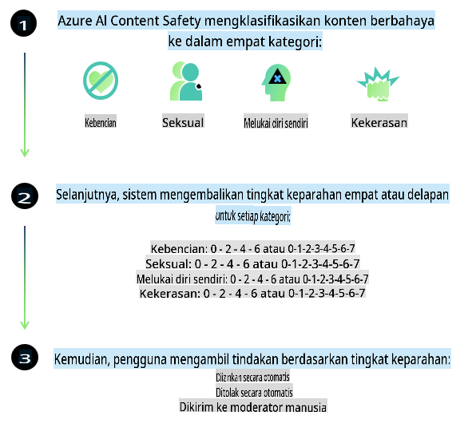

# Keamanan AI untuk Model Phi

Keluarga model Phi dikembangkan sesuai dengan [Microsoft Responsible AI Standard](https://query.prod.cms.rt.microsoft.com/cms/api/am/binary/RE5cmFl), yaitu serangkaian persyaratan di seluruh perusahaan yang didasarkan pada enam prinsip berikut: akuntabilitas, transparansi, keadilan, keandalan dan keselamatan, privasi dan keamanan, serta inklusivitas yang membentuk [Prinsip AI Bertanggung Jawab Microsoft](https://www.microsoft.com/ai/responsible-ai).

Seperti model Phi sebelumnya, pendekatan evaluasi keamanan yang menyeluruh dan pelatihan keamanan pasca-pembuatan diadopsi, dengan langkah-langkah tambahan untuk mengakomodasi kemampuan multibahasa dalam rilis ini. Pendekatan kami terhadap pelatihan dan evaluasi keamanan, termasuk pengujian dalam berbagai bahasa dan kategori risiko, dijelaskan dalam [Phi Safety Post-Training Paper](https://arxiv.org/abs/2407.13833). Meskipun model Phi diuntungkan dari pendekatan ini, pengembang harus menerapkan praktik terbaik AI yang bertanggung jawab, termasuk memetakan, mengukur, dan mengurangi risiko yang terkait dengan penggunaan spesifik mereka serta konteks budaya dan linguistiknya.

## Praktik Terbaik

Seperti model lainnya, keluarga model Phi berpotensi berperilaku dengan cara yang tidak adil, tidak dapat diandalkan, atau menyinggung.

Beberapa perilaku terbatas dari SLM dan LLM yang perlu Anda ketahui meliputi:

- **Kualitas Layanan:** Model Phi dilatih terutama pada teks berbahasa Inggris. Bahasa selain Inggris akan mengalami performa yang lebih rendah. Varian bahasa Inggris yang kurang terwakili dalam data pelatihan mungkin mengalami performa yang lebih rendah dibandingkan dengan bahasa Inggris Amerika standar.
- **Representasi Kerugian & Perpetuasi Stereotip:** Model ini dapat melebih-lebihkan atau meremehkan kelompok tertentu, menghapus representasi beberapa kelompok, atau memperkuat stereotip yang merendahkan atau negatif. Meskipun sudah dilakukan pelatihan keamanan pasca-pembuatan, keterbatasan ini mungkin masih ada karena perbedaan tingkat representasi kelompok yang berbeda atau prevalensi contoh stereotip negatif dalam data pelatihan yang mencerminkan pola dunia nyata dan bias sosial.
- **Konten yang Tidak Pantas atau Menyinggung:** Model ini dapat menghasilkan jenis konten tidak pantas atau menyinggung lainnya, yang mungkin membuatnya tidak cocok untuk diterapkan dalam konteks sensitif tanpa mitigasi tambahan yang spesifik untuk kasus penggunaan tersebut.
- **Keandalan Informasi:** Model bahasa dapat menghasilkan konten yang tidak masuk akal atau membuat-buat konten yang terdengar masuk akal tetapi sebenarnya tidak akurat atau sudah ketinggalan zaman.
- **Cakupan Terbatas untuk Kode:** Sebagian besar data pelatihan Phi-3 berbasis Python dan menggunakan paket umum seperti "typing, math, random, collections, datetime, itertools". Jika model menghasilkan skrip Python yang menggunakan paket lain atau skrip dalam bahasa lain, kami sangat menyarankan pengguna untuk memverifikasi secara manual semua penggunaan API.

Pengembang harus menerapkan praktik terbaik AI yang bertanggung jawab dan bertanggung jawab untuk memastikan bahwa kasus penggunaan tertentu mematuhi undang-undang dan peraturan yang relevan (misalnya, privasi, perdagangan, dll.).

## Pertimbangan AI yang Bertanggung Jawab

Seperti model bahasa lainnya, model seri Phi berpotensi berperilaku dengan cara yang tidak adil, tidak dapat diandalkan, atau menyinggung. Beberapa perilaku terbatas yang perlu diperhatikan meliputi:

**Kualitas Layanan:** Model Phi dilatih terutama pada teks berbahasa Inggris. Bahasa selain Inggris akan mengalami performa yang lebih rendah. Varian bahasa Inggris yang kurang terwakili dalam data pelatihan mungkin mengalami performa yang lebih rendah dibandingkan dengan bahasa Inggris Amerika standar.

**Representasi Kerugian & Perpetuasi Stereotip:** Model ini dapat melebih-lebihkan atau meremehkan kelompok tertentu, menghapus representasi beberapa kelompok, atau memperkuat stereotip yang merendahkan atau negatif. Meskipun sudah dilakukan pelatihan keamanan pasca-pembuatan, keterbatasan ini mungkin masih ada karena perbedaan tingkat representasi kelompok yang berbeda atau prevalensi contoh stereotip negatif dalam data pelatihan yang mencerminkan pola dunia nyata dan bias sosial.

**Konten yang Tidak Pantas atau Menyinggung:** Model ini dapat menghasilkan jenis konten tidak pantas atau menyinggung lainnya, yang mungkin membuatnya tidak cocok untuk diterapkan dalam konteks sensitif tanpa mitigasi tambahan yang spesifik untuk kasus penggunaan tersebut.

**Keandalan Informasi:** Model bahasa dapat menghasilkan konten yang tidak masuk akal atau membuat-buat konten yang terdengar masuk akal tetapi sebenarnya tidak akurat atau sudah ketinggalan zaman.

**Cakupan Terbatas untuk Kode:** Sebagian besar data pelatihan Phi-3 berbasis Python dan menggunakan paket umum seperti "typing, math, random, collections, datetime, itertools". Jika model menghasilkan skrip Python yang menggunakan paket lain atau skrip dalam bahasa lain, kami sangat menyarankan pengguna untuk memverifikasi secara manual semua penggunaan API.

Pengembang harus menerapkan praktik terbaik AI yang bertanggung jawab dan bertanggung jawab untuk memastikan bahwa kasus penggunaan tertentu mematuhi undang-undang dan peraturan yang relevan (misalnya, privasi, perdagangan, dll.). Area penting untuk dipertimbangkan meliputi:

**Distribusi:** Model mungkin tidak cocok untuk skenario yang dapat berdampak signifikan pada status hukum atau distribusi sumber daya atau peluang hidup (misalnya, perumahan, pekerjaan, kredit, dll.) tanpa penilaian lebih lanjut dan teknik pengurangan bias tambahan.

**Skenario Berisiko Tinggi:** Pengembang harus menilai kesesuaian penggunaan model dalam skenario berisiko tinggi di mana output yang tidak adil, tidak dapat diandalkan, atau menyinggung dapat sangat merugikan atau menyebabkan bahaya. Ini termasuk memberikan saran di domain sensitif atau ahli di mana akurasi dan keandalan sangat penting (misalnya, saran hukum atau kesehatan). Perlindungan tambahan harus diterapkan di tingkat aplikasi sesuai dengan konteks penerapan.

**Misinformasi:** Model dapat menghasilkan informasi yang tidak akurat. Pengembang harus mengikuti praktik terbaik transparansi dan memberi tahu pengguna akhir bahwa mereka sedang berinteraksi dengan sistem AI. Di tingkat aplikasi, pengembang dapat membangun mekanisme umpan balik dan pipeline untuk memperkuat respons dengan informasi kontekstual spesifik untuk kasus penggunaan, sebuah teknik yang dikenal sebagai Retrieval Augmented Generation (RAG).

**Pembuatan Konten Berbahaya:** Pengembang harus menilai output berdasarkan konteksnya dan menggunakan pengklasifikasi keamanan yang tersedia atau solusi khusus yang sesuai dengan kasus penggunaan mereka.

**Penyalahgunaan:** Bentuk penyalahgunaan lainnya seperti penipuan, spam, atau produksi malware mungkin saja terjadi, dan pengembang harus memastikan bahwa aplikasi mereka tidak melanggar hukum dan peraturan yang berlaku.

### Penyesuaian Model dan Keamanan Konten AI

Setelah menyesuaikan model, kami sangat menyarankan untuk memanfaatkan langkah-langkah [Azure AI Content Safety](https://learn.microsoft.com/azure/ai-services/content-safety/overview) untuk memantau konten yang dihasilkan oleh model, mengidentifikasi, dan memblokir potensi risiko, ancaman, dan masalah kualitas.

[Azure AI Content Safety](https://learn.microsoft.com/azure/ai-services/content-safety/overview) mendukung konten teks dan gambar. Layanan ini dapat diterapkan di cloud, kontainer yang terputus, dan perangkat edge/embedded.

## Gambaran Umum Azure AI Content Safety

Azure AI Content Safety bukanlah solusi satu ukuran untuk semua; layanan ini dapat disesuaikan agar selaras dengan kebijakan spesifik bisnis. Selain itu, model multibahasa memungkinkan layanan ini memahami beberapa bahasa secara bersamaan.

- **Azure AI Content Safety**
- **Microsoft Developer**
- **5 video**

Layanan Azure AI Content Safety mendeteksi konten berbahaya yang dihasilkan oleh pengguna dan AI dalam aplikasi dan layanan. Layanan ini mencakup API teks dan gambar yang memungkinkan Anda mendeteksi materi yang berbahaya atau tidak pantas.

[AI Content Safety Playlist](https://www.youtube.com/playlist?list=PLlrxD0HtieHjaQ9bJjyp1T7FeCbmVcPkQ)

**Penafian**:  
Dokumen ini telah diterjemahkan menggunakan layanan terjemahan berbasis AI. Meskipun kami berupaya untuk mencapai akurasi, harap disadari bahwa terjemahan otomatis mungkin mengandung kesalahan atau ketidakakuratan. Dokumen asli dalam bahasa aslinya harus dianggap sebagai sumber yang berwenang. Untuk informasi yang bersifat kritis, disarankan menggunakan terjemahan manusia profesional. Kami tidak bertanggung jawab atas kesalahpahaman atau interpretasi yang keliru yang timbul dari penggunaan terjemahan ini.