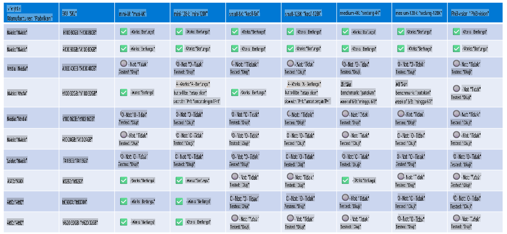

# Dukungan Perangkat Keras Phi

Microsoft Phi telah dioptimalkan untuk ONNX Runtime dan mendukung Windows DirectML. Ini bekerja dengan baik pada berbagai jenis perangkat keras, termasuk GPU, CPU, dan bahkan perangkat seluler.

## Perangkat Keras yang Didukung
Secara khusus, perangkat keras yang didukung meliputi:

- GPU SKU: RTX 4090 (DirectML)
- GPU SKU: 1 A100 80GB (CUDA)
- CPU SKU: Standard F64s v2 (64 vCPUs, 128 GiB memori)

## SKU Mobile

- Android - Samsung Galaxy S21
- Apple iPhone 14 atau yang lebih baru dengan Prosesor A16/A17

## Spesifikasi Perangkat Keras Phi

- Konfigurasi Minimum yang Dibutuhkan.
- Windows: GPU yang mendukung DirectX 12 dan minimal 4GB RAM gabungan

CUDA: NVIDIA GPU dengan Compute Capability >= 7.02



## Menjalankan onnxruntime pada beberapa GPU

Saat ini, model ONNX Phi yang tersedia hanya untuk 1 GPU. Dimungkinkan untuk mendukung multi-gpu untuk model Phi, tetapi ORT dengan 2 GPU tidak menjamin akan memberikan throughput yang lebih tinggi dibandingkan dengan 2 instance ORT. Silakan lihat [ONNX Runtime](https://onnxruntime.ai/) untuk pembaruan terbaru.

Pada [Build 2024 Tim GenAI ONNX](https://youtu.be/WLW4SE8M9i8?si=EtG04UwDvcjunyfC) mengumumkan bahwa mereka telah mengaktifkan multi-instance alih-alih multi-gpu untuk model Phi.

Saat ini, ini memungkinkan Anda menjalankan satu instance onnxruntime atau onnxruntime-genai dengan variabel lingkungan CUDA_VISIBLE_DEVICES seperti ini.

```Python
CUDA_VISIBLE_DEVICES=0 python infer.py
CUDA_VISIBLE_DEVICES=1 python infer.py
```

Jangan ragu untuk mengeksplorasi Phi lebih lanjut di [Azure AI Foundry](https://ai.azure.com)

**Penafian**:  
Dokumen ini telah diterjemahkan menggunakan layanan terjemahan berbasis AI. Meskipun kami berupaya untuk memberikan hasil yang akurat, harap disadari bahwa terjemahan otomatis mungkin mengandung kesalahan atau ketidakakuratan. Dokumen asli dalam bahasa aslinya harus dianggap sebagai sumber yang berwenang. Untuk informasi yang bersifat kritis, disarankan menggunakan jasa terjemahan manusia profesional. Kami tidak bertanggung jawab atas kesalahpahaman atau interpretasi yang keliru yang timbul dari penggunaan terjemahan ini.