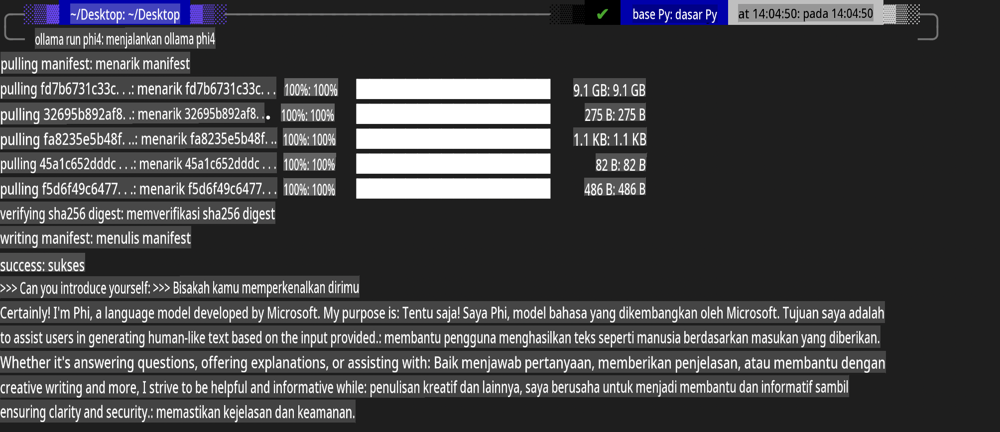
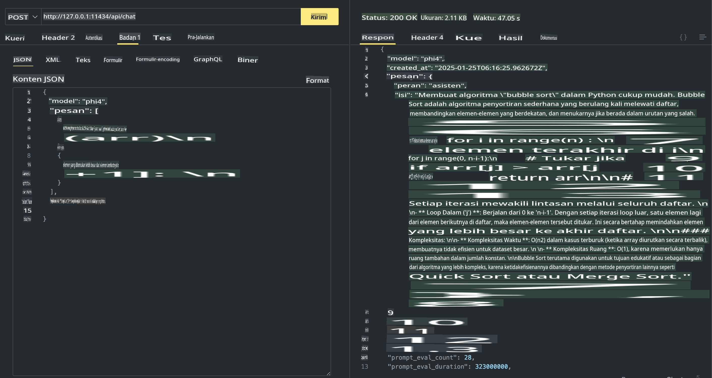

## Keluarga Phi di Ollama

[Ollama](https://ollama.com) memungkinkan lebih banyak orang untuk langsung menjalankan LLM atau SLM open source melalui skrip sederhana, dan juga dapat membangun API untuk mendukung skenario aplikasi Copilot secara lokal.

## **1. Instalasi**

Ollama mendukung penggunaan di Windows, macOS, dan Linux. Anda dapat menginstal Ollama melalui tautan ini ([https://ollama.com/download](https://ollama.com/download)). Setelah instalasi berhasil, Anda dapat langsung menggunakan skrip Ollama untuk memanggil Phi-3 melalui jendela terminal. Anda dapat melihat semua [perpustakaan yang tersedia di Ollama](https://ollama.com/library). Jika Anda membuka repositori ini di Codespace, Ollama sudah terinstal.

```bash

ollama run phi4

```

> [!NOTE]
> Model akan diunduh pertama kali saat Anda menjalankannya. Tentu saja, Anda juga dapat langsung menentukan model Phi-4 yang sudah diunduh. Kami mengambil WSL sebagai contoh untuk menjalankan perintah. Setelah model berhasil diunduh, Anda dapat langsung berinteraksi melalui terminal.



## **2. Memanggil API phi-4 dari Ollama**

Jika Anda ingin memanggil API Phi-4 yang dihasilkan oleh Ollama, Anda dapat menggunakan perintah ini di terminal untuk memulai server Ollama.

```bash

ollama serve

```

> [!NOTE]
> Jika menjalankan MacOS atau Linux, harap perhatikan bahwa Anda mungkin menemui kesalahan berikut **"Error: listen tcp 127.0.0.1:11434: bind: address already in use"**. Anda mungkin mendapatkan kesalahan ini saat menjalankan perintah. Anda dapat mengabaikan kesalahan ini, karena biasanya menunjukkan bahwa server sudah berjalan, atau Anda dapat menghentikan dan memulai ulang Ollama:

**macOS**

```bash

brew services restart ollama

```

**Linux**

```bash

sudo systemctl stop ollama

```

Ollama mendukung dua API: generate dan chat. Anda dapat memanggil API model yang disediakan oleh Ollama sesuai kebutuhan Anda, dengan mengirimkan permintaan ke layanan lokal yang berjalan di port 11434.

**Chat**

```bash

curl http://127.0.0.1:11434/api/chat -d '{
  "model": "phi3",
  "messages": [
    {
      "role": "system",
      "content": "Your are a python developer."
    },
    {
      "role": "user",
      "content": "Help me generate a bubble algorithm"
    }
  ],
  "stream": false
  
}'

This is the result in Postman



## Additional Resources

Check the list of available models in Ollama in [their library](https://ollama.com/library).

Pull your model from the Ollama server using this command

```bash
ollama pull phi4
```

Run the model using this command

```bash
ollama run phi4
```

***Note:*** Visit this link [https://github.com/ollama/ollama/blob/main/docs/api.md](https://github.com/ollama/ollama/blob/main/docs/api.md) to learn more

## Calling Ollama from Python

You can use `requests` or `urllib3` to make requests to the local server endpoints used above. However, a popular way to use Ollama in Python is via the [openai](https://pypi.org/project/openai/) SDK, since Ollama provides OpenAI-compatible server endpoints as well.

Here is an example for phi3-mini:

```python
import openai

client = openai.OpenAI(
    base_url="http://localhost:11434/v1",
    api_key="nokeyneeded",
)

response = client.chat.completions.create(
    model="phi4",
    temperature=0.7,
    n=1,
    messages=[
        {"role": "system", "content": "You are a helpful assistant."},
        {"role": "user", "content": "Write a haiku about a hungry cat"},
    ],
)

print("Response:")
print(response.choices[0].message.content)
```

## Calling Ollama from JavaScript 

```javascript
// Contoh Meringkas sebuah file dengan Phi-4
script({
    model: "ollama:phi4",
    title: "Meringkas dengan Phi-4",
    system: ["system"],
})

// Contoh meringkas
const file = def("FILE", env.files)
$`Ringkas ${file} dalam satu paragraf.`
```

## Calling Ollama from C#

Create a new C# Console application and add the following NuGet package:

```bash
dotnet add package Microsoft.SemanticKernel --version 1.34.0
```

Then replace this code in the `Program.cs` file

```csharp
using Microsoft.SemanticKernel;
using Microsoft.SemanticKernel.ChatCompletion;

// menambahkan layanan chat completion menggunakan endpoint server lokal Ollama
#pragma warning disable SKEXP0001, SKEXP0003, SKEXP0010, SKEXP0011, SKEXP0050, SKEXP0052
builder.AddOpenAIChatCompletion(
    modelId: "phi4",
    endpoint: new Uri("http://localhost:11434/"),
    apiKey: "non required");

// menjalankan prompt sederhana ke layanan chat
string prompt = "Tulis lelucon tentang anak kucing";
var response = await kernel.InvokePromptAsync(prompt);
Console.WriteLine(response.GetValue<string>());
```

Run the app with the command:

```bash
dotnet run
```

**Penafian**:  
Dokumen ini telah diterjemahkan menggunakan layanan penerjemahan berbasis AI. Meskipun kami berusaha untuk mencapai akurasi, harap diketahui bahwa terjemahan otomatis dapat mengandung kesalahan atau ketidakakuratan. Dokumen asli dalam bahasa aslinya harus dianggap sebagai sumber yang berwenang. Untuk informasi yang bersifat kritis, disarankan untuk menggunakan jasa penerjemahan manusia profesional. Kami tidak bertanggung jawab atas kesalahpahaman atau penafsiran yang salah yang timbul dari penggunaan terjemahan ini.