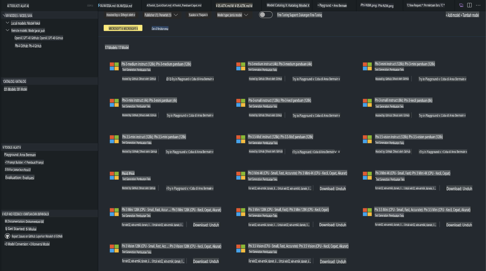
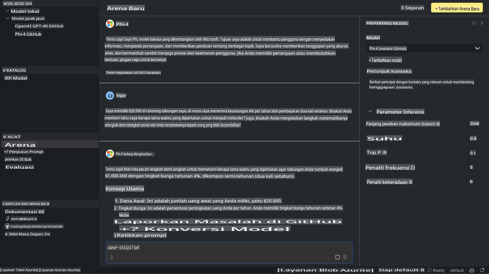

# Keluarga Phi di AITK

[AI Toolkit untuk VS Code](https://marketplace.visualstudio.com/items?itemName=ms-windows-ai-studio.windows-ai-studio) mempermudah pengembangan aplikasi AI generatif dengan menggabungkan alat dan model pengembangan AI terbaru dari Azure AI Foundry Catalog dan katalog lain seperti Hugging Face. Anda dapat menjelajahi katalog model AI yang didukung oleh GitHub Models dan Azure AI Foundry Model Catalogs, mengunduhnya secara lokal atau jarak jauh, melakukan penyempurnaan, menguji, dan menggunakannya dalam aplikasi Anda.

AI Toolkit Preview akan berjalan secara lokal. Inferensi lokal atau penyempurnaan tergantung pada model yang Anda pilih, Anda mungkin memerlukan GPU seperti NVIDIA CUDA GPU. Anda juga dapat menjalankan GitHub Models langsung dengan AITK.

## Memulai

[Pelajari lebih lanjut cara menginstal subsistem Windows untuk Linux](https://learn.microsoft.com/windows/wsl/install?WT.mc_id=aiml-137032-kinfeylo)

dan [mengubah distribusi default](https://learn.microsoft.com/windows/wsl/install#change-the-default-linux-distribution-installed).

[Repositori GitHub AI Toolkit](https://github.com/microsoft/vscode-ai-toolkit/)

- Windows, Linux, macOS
  
- Untuk penyempurnaan model di Windows dan Linux, Anda memerlukan Nvidia GPU. Selain itu, **Windows** memerlukan subsistem untuk Linux dengan distro Ubuntu 18.4 atau lebih tinggi. [Pelajari lebih lanjut cara menginstal subsistem Windows untuk Linux](https://learn.microsoft.com/windows/wsl/install) dan [mengubah distribusi default](https://learn.microsoft.com/windows/wsl/install#change-the-default-linux-distribution-installed).

### Instal AI Toolkit

AI Toolkit dikemas sebagai [Ekstensi Visual Studio Code](https://code.visualstudio.com/docs/setup/additional-components#_vs-code-extensions), jadi Anda perlu menginstal [VS Code](https://code.visualstudio.com/docs/setup/windows?WT.mc_id=aiml-137032-kinfeylo) terlebih dahulu, dan mengunduh AI Toolkit dari [VS Marketplace](https://marketplace.visualstudio.com/items?itemName=ms-windows-ai-studio.windows-ai-studio). 
[AI Toolkit tersedia di Visual Studio Marketplace](https://marketplace.visualstudio.com/items?itemName=ms-windows-ai-studio.windows-ai-studio) dan dapat diinstal seperti ekstensi VS Code lainnya.

Jika Anda belum familiar dengan cara menginstal ekstensi VS Code, ikuti langkah-langkah berikut:

### Masuk

1. Di Activity Bar di VS Code pilih **Extensions**
2. Di bilah pencarian Extensions ketik "AI Toolkit"
3. Pilih "AI Toolkit for Visual Studio Code"
4. Pilih **Install**

Sekarang, Anda siap menggunakan ekstensi ini!

Anda akan diminta untuk masuk ke GitHub, jadi klik "Allow" untuk melanjutkan. Anda akan diarahkan ke halaman masuk GitHub.

Silakan masuk dan ikuti langkah-langkah prosesnya. Setelah selesai, Anda akan diarahkan kembali ke VS Code.

Setelah ekstensi berhasil diinstal, Anda akan melihat ikon AI Toolkit muncul di Activity Bar Anda.

Mari kita eksplorasi tindakan yang tersedia!

### Tindakan yang Tersedia

Sidebar utama AI Toolkit diatur ke dalam  

- **Models**
- **Resources**
- **Playground**  
- **Fine-tuning**
- **Evaluation**

Semua tersedia di bagian Resources. Untuk memulai, pilih **Model Catalog**.

### Mengunduh Model dari Katalog

Setelah meluncurkan AI Toolkit dari sidebar VS Code, Anda dapat memilih dari opsi berikut:



- Temukan model yang didukung dari **Model Catalog** dan unduh secara lokal
- Uji inferensi model di **Model Playground**
- Lakukan penyempurnaan model secara lokal atau jarak jauh di **Model Fine-tuning**
- Terapkan model yang telah disempurnakan ke cloud melalui command palette untuk AI Toolkit
- Evaluasi model

> [!NOTE]
>
> **GPU Vs CPU**
>
> Anda akan melihat bahwa kartu model menunjukkan ukuran model, platform, dan jenis akselerator (CPU, GPU). Untuk kinerja yang dioptimalkan pada **perangkat Windows yang memiliki setidaknya satu GPU**, pilih versi model yang hanya menargetkan Windows.
>
> Ini memastikan Anda memiliki model yang dioptimalkan untuk akselerator DirectML.
>
> Nama model memiliki format
>
> - `{model_name}-{accelerator}-{quantization}-{format}`.
>
>Untuk memeriksa apakah perangkat Windows Anda memiliki GPU, buka **Task Manager** lalu pilih tab **Performance**. Jika Anda memiliki GPU, mereka akan terdaftar dengan nama seperti "GPU 0" atau "GPU 1".

### Menjalankan Model di Playground

Setelah semua parameter diatur, klik **Generate Project**.

Setelah model Anda diunduh, pilih **Load in Playground** pada kartu model di katalog:

- Mulai unduhan model
- Instal semua prasyarat dan dependensi
- Buat workspace di VS Code



### Menggunakan REST API dalam Aplikasi Anda

AI Toolkit dilengkapi dengan server web REST API lokal **pada port 5272** yang menggunakan format [OpenAI chat completions](https://platform.openai.com/docs/api-reference/chat/create). 

Ini memungkinkan Anda menguji aplikasi Anda secara lokal tanpa harus bergantung pada layanan model AI cloud. Sebagai contoh, file JSON berikut menunjukkan cara mengonfigurasi body dari permintaan:

```json
{
    "model": "Phi-4",
    "messages": [
        {
            "role": "user",
            "content": "what is the golden ratio?"
        }
    ],
    "temperature": 0.7,
    "top_p": 1,
    "top_k": 10,
    "max_tokens": 100,
    "stream": true
}
```

Anda dapat menguji REST API menggunakan (misalnya) [Postman](https://www.postman.com/) atau utilitas CURL (Client URL):

```bash
curl -vX POST http://127.0.0.1:5272/v1/chat/completions -H 'Content-Type: application/json' -d @body.json
```

### Menggunakan Perpustakaan Klien OpenAI untuk Python

```python
from openai import OpenAI

client = OpenAI(
    base_url="http://127.0.0.1:5272/v1/", 
    api_key="x" # required for the API but not used
)

chat_completion = client.chat.completions.create(
    messages=[
        {
            "role": "user",
            "content": "what is the golden ratio?",
        }
    ],
    model="Phi-4",
)

print(chat_completion.choices[0].message.content)
```

### Menggunakan Perpustakaan Klien Azure OpenAI untuk .NET

Tambahkan [Azure OpenAI client library untuk .NET](https://www.nuget.org/packages/Azure.AI.OpenAI/) ke proyek Anda menggunakan NuGet:

```bash
dotnet add {project_name} package Azure.AI.OpenAI --version 1.0.0-beta.17
```

Tambahkan file C# bernama **OverridePolicy.cs** ke proyek Anda dan tempelkan kode berikut:

```csharp
// OverridePolicy.cs
using Azure.Core.Pipeline;
using Azure.Core;

internal partial class OverrideRequestUriPolicy(Uri overrideUri)
    : HttpPipelineSynchronousPolicy
{
    private readonly Uri _overrideUri = overrideUri;

    public override void OnSendingRequest(HttpMessage message)
    {
        message.Request.Uri.Reset(_overrideUri);
    }
}
```

Selanjutnya, tempelkan kode berikut ke file **Program.cs** Anda:

```csharp
// Program.cs
using Azure.AI.OpenAI;

Uri localhostUri = new("http://localhost:5272/v1/chat/completions");

OpenAIClientOptions clientOptions = new();
clientOptions.AddPolicy(
    new OverrideRequestUriPolicy(localhostUri),
    Azure.Core.HttpPipelinePosition.BeforeTransport);
OpenAIClient client = new(openAIApiKey: "unused", clientOptions);

ChatCompletionsOptions options = new()
{
    DeploymentName = "Phi-4",
    Messages =
    {
        new ChatRequestSystemMessage("You are a helpful assistant. Be brief and succinct."),
        new ChatRequestUserMessage("What is the golden ratio?"),
    }
};

StreamingResponse<StreamingChatCompletionsUpdate> streamingChatResponse
    = await client.GetChatCompletionsStreamingAsync(options);

await foreach (StreamingChatCompletionsUpdate chatChunk in streamingChatResponse)
{
    Console.Write(chatChunk.ContentUpdate);
}
```


## Penyempurnaan Model dengan AI Toolkit

- Memulai dengan penemuan model dan playground.
- Penyempurnaan model dan inferensi menggunakan sumber daya komputasi lokal.
- Penyempurnaan model jarak jauh dan inferensi menggunakan sumber daya Azure.

[Penyempurnaan Model dengan AI Toolkit](../../03.FineTuning/Finetuning_VSCodeaitoolkit.md)

## Sumber Daya Q&A AI Toolkit

Silakan merujuk ke [halaman Q&A kami](https://github.com/microsoft/vscode-ai-toolkit/blob/main/archive/QA.md) untuk masalah dan solusi yang paling umum.

**Penafian**:  
Dokumen ini telah diterjemahkan menggunakan layanan terjemahan berbasis AI. Meskipun kami berusaha untuk mencapai akurasi, harap diketahui bahwa terjemahan otomatis mungkin mengandung kesalahan atau ketidakakuratan. Dokumen asli dalam bahasa aslinya harus dianggap sebagai sumber yang berwenang. Untuk informasi yang bersifat krusial, disarankan menggunakan jasa terjemahan manusia profesional. Kami tidak bertanggung jawab atas kesalahpahaman atau penafsiran yang keliru yang timbul dari penggunaan terjemahan ini.