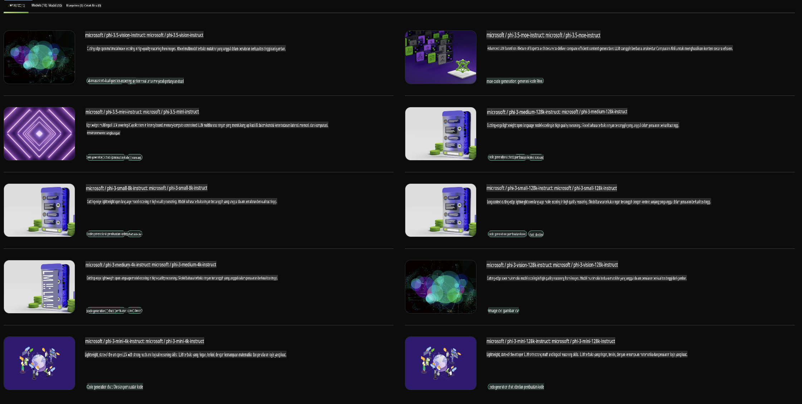

## Keluarga Phi di NVIDIA NIM

NVIDIA NIM adalah kumpulan layanan mikro yang mudah digunakan, dirancang untuk mempercepat penerapan model AI generatif di seluruh cloud, pusat data, dan workstation. NIM dikategorikan berdasarkan keluarga model dan per model. Sebagai contoh, NVIDIA NIM untuk model bahasa besar (LLM) menghadirkan kekuatan LLM mutakhir ke aplikasi perusahaan, menyediakan kemampuan pemrosesan dan pemahaman bahasa alami yang tak tertandingi.

NIM mempermudah tim IT dan DevOps untuk meng-host sendiri model bahasa besar (LLM) di lingkungan mereka yang dikelola, sambil tetap menyediakan API standar industri bagi pengembang untuk membangun kopilot, chatbot, dan asisten AI yang kuat yang dapat mentransformasi bisnis mereka. Dengan memanfaatkan akselerasi GPU canggih dan penerapan yang dapat diskalakan dari NVIDIA, NIM menawarkan jalur tercepat untuk inferensi dengan kinerja yang luar biasa.

Anda dapat menggunakan NVIDIA NIM untuk inferensi Model Keluarga Phi.



### **Contoh - Phi-3-Vision di NVIDIA NIM**

Bayangkan Anda memiliki sebuah gambar (`demo.png`) dan Anda ingin menghasilkan kode Python yang memproses gambar ini dan menyimpan versinya yang baru (`phi-3-vision.jpg`).

Kode di atas mengotomatiskan proses ini dengan:

1. Menyiapkan lingkungan dan konfigurasi yang diperlukan.
2. Membuat prompt yang menginstruksikan model untuk menghasilkan kode Python yang dibutuhkan.
3. Mengirimkan prompt ke model dan mengumpulkan kode yang dihasilkan.
4. Mengekstrak dan menjalankan kode yang dihasilkan.
5. Menampilkan gambar asli dan yang telah diproses.

Pendekatan ini memanfaatkan kekuatan AI untuk mengotomatiskan tugas pemrosesan gambar, sehingga lebih mudah dan cepat untuk mencapai tujuan Anda.

[Contoh Solusi Kode](../../../../../code/06.E2E/E2E_Nvidia_NIM_Phi3_Vision.ipynb)

Mari kita uraikan apa yang dilakukan seluruh kode ini langkah demi langkah:

1. **Install Paket yang Dibutuhkan**:
    ```python
    !pip install langchain_nvidia_ai_endpoints -U
    ```
    Perintah ini menginstal paket `langchain_nvidia_ai_endpoints`, memastikan versinya adalah yang terbaru.

2. **Import Modul yang Diperlukan**:
    ```python
    from langchain_nvidia_ai_endpoints import ChatNVIDIA
    import getpass
    import os
    import base64
    ```
    Import ini membawa modul-modul yang diperlukan untuk berinteraksi dengan endpoint NVIDIA AI, menangani password dengan aman, berinteraksi dengan sistem operasi, dan melakukan encoding/decoding data dalam format base64.

3. **Siapkan API Key**:
    ```python
    if not os.getenv("NVIDIA_API_KEY"):
        os.environ["NVIDIA_API_KEY"] = getpass.getpass("Enter your NVIDIA API key: ")
    ```
    Kode ini memeriksa apakah variabel lingkungan `NVIDIA_API_KEY` sudah disetel. Jika belum, pengguna diminta untuk memasukkan API key mereka secara aman.

4. **Tentukan Model dan Jalur Gambar**:
    ```python
    model = 'microsoft/phi-3-vision-128k-instruct'
    chat = ChatNVIDIA(model=model)
    img_path = './imgs/demo.png'
    ```
    Ini menetapkan model yang akan digunakan, membuat instance `ChatNVIDIA` dengan model yang ditentukan, dan mendefinisikan jalur file gambar.

5. **Buat Prompt Teks**:
    ```python
    text = "Please create Python code for image, and use plt to save the new picture under imgs/ and name it phi-3-vision.jpg."
    ```
    Ini mendefinisikan prompt teks yang menginstruksikan model untuk menghasilkan kode Python untuk memproses sebuah gambar.

6. **Encode Gambar dalam Base64**:
    ```python
    with open(img_path, "rb") as f:
        image_b64 = base64.b64encode(f.read()).decode()
    image = f''
    ```
    Kode ini membaca file gambar, mengenkripsi dalam base64, dan membuat tag gambar HTML dengan data yang telah dienkripsi.

7. **Gabungkan Teks dan Gambar ke dalam Prompt**:
    ```python
    prompt = f"{text} {image}"
    ```
    Ini menggabungkan prompt teks dan tag gambar HTML ke dalam satu string.

8. **Hasilkan Kode Menggunakan ChatNVIDIA**:
    ```python
    code = ""
    for chunk in chat.stream(prompt):
        print(chunk.content, end="")
        code += chunk.content
    ```
    Kode ini mengirimkan prompt ke `ChatNVIDIA` model and collects the generated code in chunks, printing and appending each chunk to the `code` string.

9. **Ekstrak Kode Python dari Konten yang Dihasilkan**:
    ```python
    begin = code.index('```python') + 9
    code = code[begin:]
    end = code.index('```')
    code = code[:end]
    ```
    Ini mengekstrak kode Python yang sebenarnya dari konten yang dihasilkan dengan menghapus format markdown.

10. **Jalankan Kode yang Dihasilkan**:
    ```python
    import subprocess
    result = subprocess.run(["python", "-c", code], capture_output=True)
    ```
    Ini menjalankan kode Python yang diekstrak sebagai subprocess dan menangkap outputnya.

11. **Tampilkan Gambar**:
    ```python
    from IPython.display import Image, display
    display(Image(filename='./imgs/phi-3-vision.jpg'))
    display(Image(filename='./imgs/demo.png'))
    ```
    Baris-baris ini menampilkan gambar menggunakan modul `IPython.display`.

**Penafian**:  
Dokumen ini telah diterjemahkan menggunakan layanan terjemahan berbasis AI. Meskipun kami berupaya untuk memberikan terjemahan yang akurat, harap diperhatikan bahwa terjemahan otomatis mungkin mengandung kesalahan atau ketidakakuratan. Dokumen asli dalam bahasa aslinya harus dianggap sebagai sumber yang berwenang. Untuk informasi yang bersifat kritis, disarankan menggunakan layanan terjemahan manusia profesional. Kami tidak bertanggung jawab atas kesalahpahaman atau interpretasi yang salah yang timbul dari penggunaan terjemahan ini.