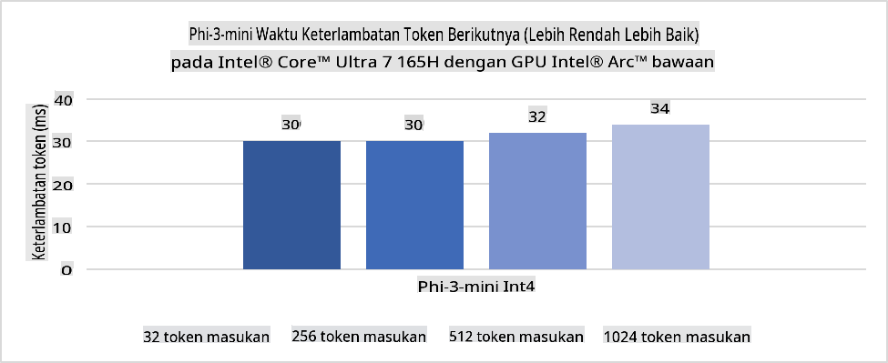
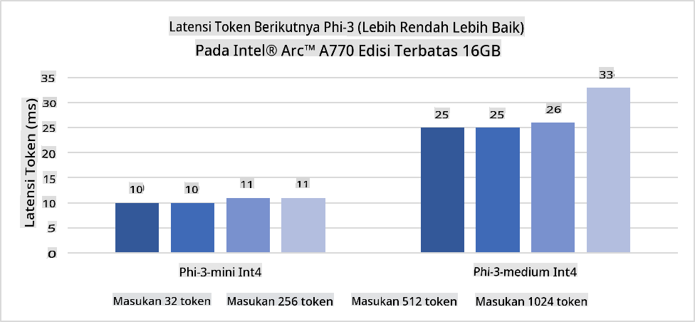
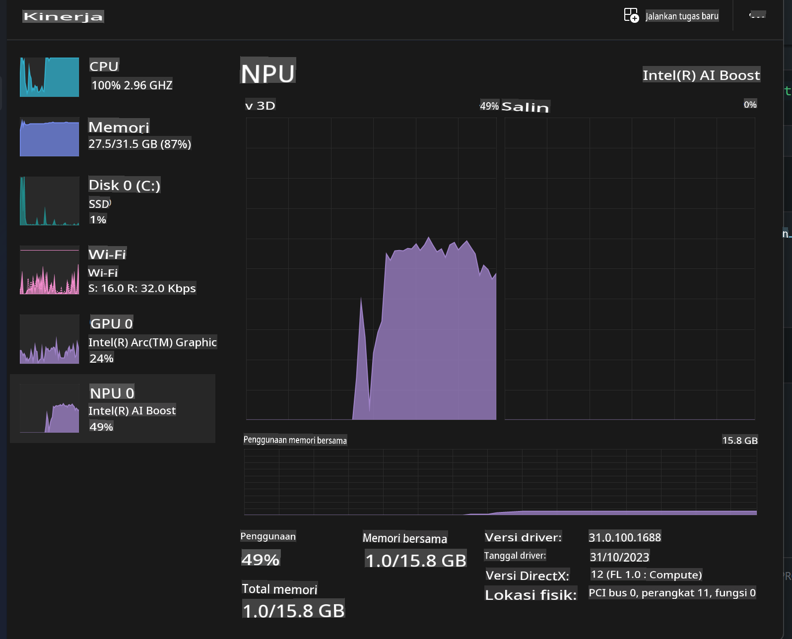
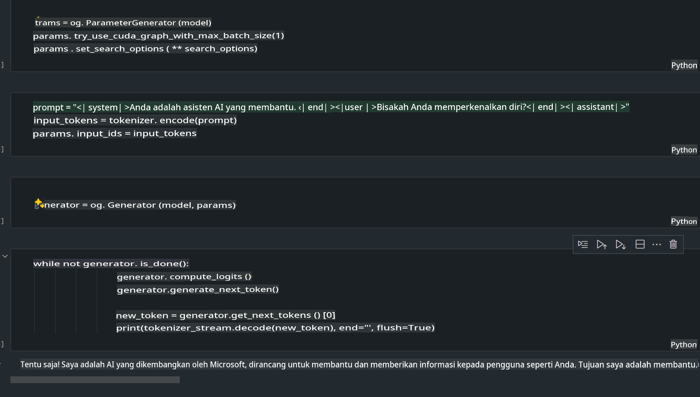
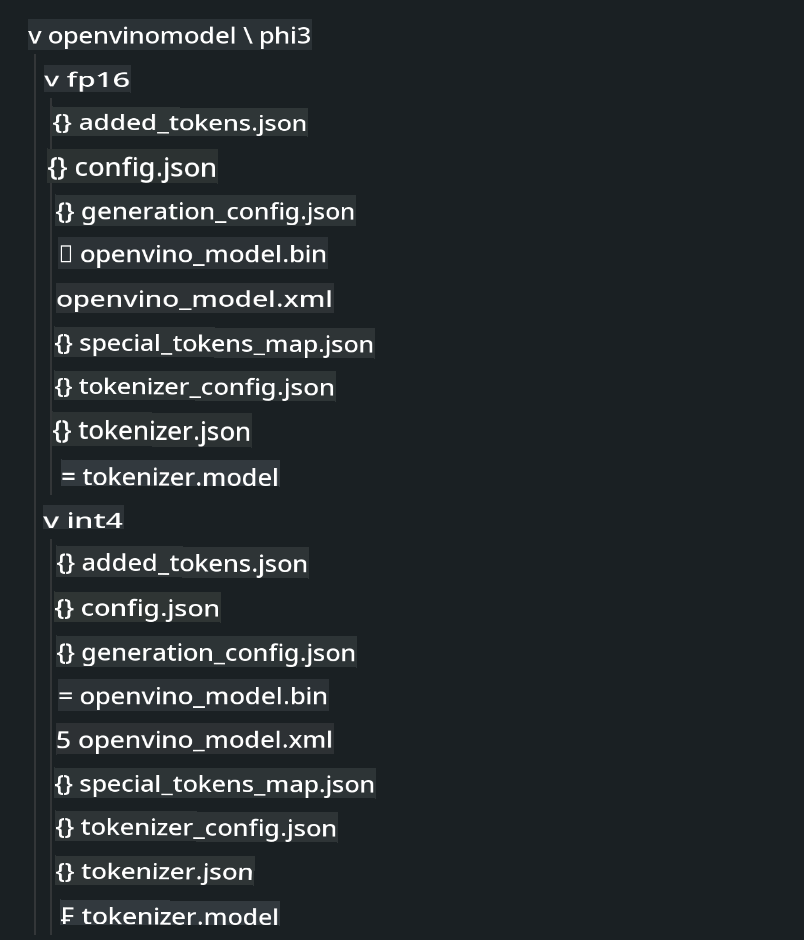
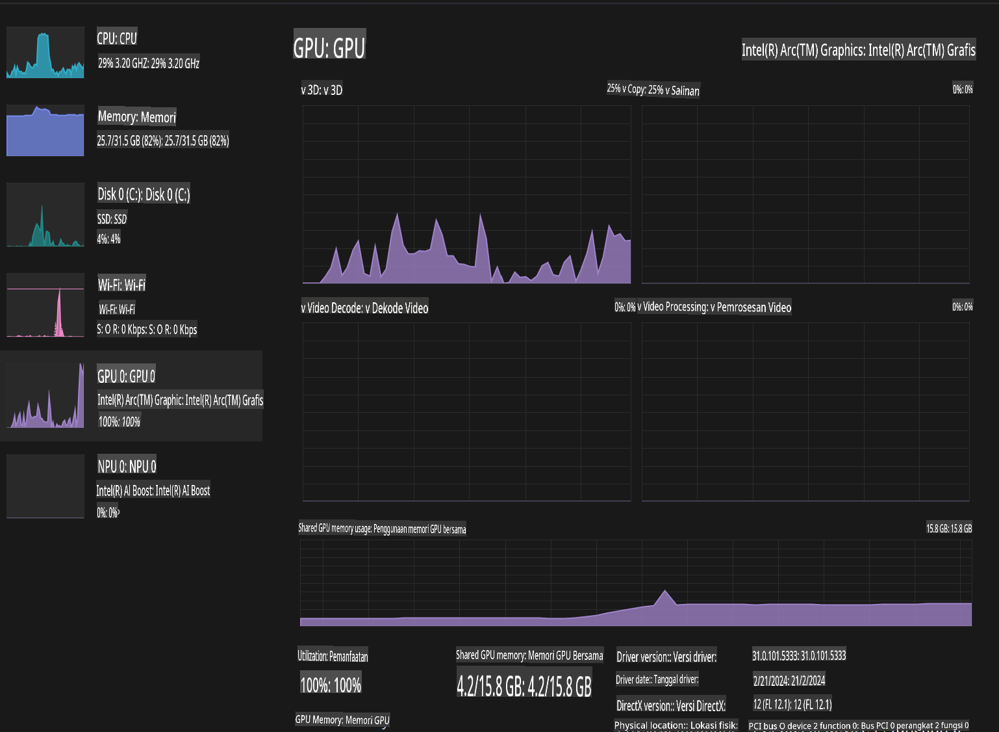

# **Inferensi Phi-3 di AI PC**

Dengan kemajuan AI generatif dan peningkatan kemampuan perangkat keras di perangkat edge, semakin banyak model AI generatif yang kini dapat diintegrasikan ke perangkat BYOD (Bring Your Own Device) milik pengguna. AI PC adalah salah satu model tersebut. Mulai tahun 2024, Intel, AMD, dan Qualcomm telah bekerja sama dengan produsen PC untuk memperkenalkan AI PC yang memungkinkan penerapan model AI generatif lokal melalui modifikasi perangkat keras. Dalam diskusi ini, kita akan berfokus pada Intel AI PC dan mengeksplorasi cara menjalankan Phi-3 di Intel AI PC.

### Apa itu NPU

NPU (Neural Processing Unit) adalah prosesor khusus atau unit pemrosesan pada SoC yang dirancang khusus untuk mempercepat operasi jaringan saraf dan tugas-tugas AI. Tidak seperti CPU dan GPU yang bersifat umum, NPU dioptimalkan untuk komputasi paralel berbasis data, menjadikannya sangat efisien dalam memproses data multimedia besar seperti video dan gambar, serta data untuk jaringan saraf. Mereka sangat andal untuk menangani tugas-tugas terkait AI, seperti pengenalan suara, pengaburan latar belakang dalam panggilan video, dan proses pengeditan foto atau video seperti deteksi objek.

## NPU vs GPU

Meskipun banyak beban kerja AI dan pembelajaran mesin dijalankan di GPU, ada perbedaan penting antara GPU dan NPU.
GPU dikenal karena kemampuan komputasi paralelnya, tetapi tidak semua GPU sama efisiennya di luar pemrosesan grafis. Sebaliknya, NPU dirancang khusus untuk komputasi kompleks dalam operasi jaringan saraf, sehingga sangat efektif untuk tugas-tugas AI.

Singkatnya, NPU adalah ahli matematika yang mempercepat perhitungan AI, dan mereka memainkan peran kunci di era baru AI PC!

***Contoh ini didasarkan pada prosesor Intel Core Ultra terbaru dari Intel***

## **1. Menggunakan NPU untuk Menjalankan Model Phi-3**

Perangkat Intel® NPU adalah akselerator inferensi AI yang terintegrasi dengan CPU klien Intel, dimulai dari generasi CPU Intel® Core™ Ultra (sebelumnya dikenal sebagai Meteor Lake). Ini memungkinkan eksekusi tugas jaringan saraf buatan dengan hemat energi.





**Intel NPU Acceleration Library**

Intel NPU Acceleration Library [https://github.com/intel/intel-npu-acceleration-library](https://github.com/intel/intel-npu-acceleration-library) adalah pustaka Python yang dirancang untuk meningkatkan efisiensi aplikasi Anda dengan memanfaatkan kekuatan Intel Neural Processing Unit (NPU) untuk melakukan komputasi berkecepatan tinggi pada perangkat keras yang kompatibel.

Contoh Phi-3-mini pada AI PC yang didukung oleh prosesor Intel® Core™ Ultra.


Instal pustaka Python dengan pip

```bash

   pip install intel-npu-acceleration-library

```

***Catatan*** Proyek ini masih dalam pengembangan, tetapi model referensinya sudah sangat lengkap.

### **Menjalankan Phi-3 dengan Intel NPU Acceleration Library**

Dengan menggunakan akselerasi Intel NPU, pustaka ini tidak memengaruhi proses pengkodean tradisional. Anda hanya perlu menggunakan pustaka ini untuk mengkuantisasi model Phi-3 asli, seperti FP16, INT8, INT4, seperti 

```python
from transformers import AutoTokenizer, pipeline,TextStreamer
from intel_npu_acceleration_library import NPUModelForCausalLM, int4
from intel_npu_acceleration_library.compiler import CompilerConfig
import warnings

model_id = "microsoft/Phi-3-mini-4k-instruct"

compiler_conf = CompilerConfig(dtype=int4)
model = NPUModelForCausalLM.from_pretrained(
    model_id, use_cache=True, config=compiler_conf, attn_implementation="sdpa"
).eval()

tokenizer = AutoTokenizer.from_pretrained(model_id)

text_streamer = TextStreamer(tokenizer, skip_prompt=True)
```

Setelah kuantisasi berhasil, lanjutkan eksekusi untuk memanggil NPU agar dapat menjalankan model Phi-3.

```python
generation_args = {
   "max_new_tokens": 1024,
   "return_full_text": False,
   "temperature": 0.3,
   "do_sample": False,
   "streamer": text_streamer,
}

pipe = pipeline(
   "text-generation",
   model=model,
   tokenizer=tokenizer,
)

query = "<|system|>You are a helpful AI assistant.<|end|><|user|>Can you introduce yourself?<|end|><|assistant|>"

with warnings.catch_warnings():
    warnings.simplefilter("ignore")
    pipe(query, **generation_args)
```

Saat menjalankan kode, kita dapat melihat status NPU melalui Task Manager



***Contoh*** : [AIPC_NPU_DEMO.ipynb](../../../../../code/03.Inference/AIPC/AIPC_NPU_DEMO.ipynb)

## **2. Menggunakan DirectML + ONNX Runtime untuk Menjalankan Model Phi-3**

### **Apa itu DirectML**

[DirectML](https://github.com/microsoft/DirectML) adalah pustaka DirectX 12 yang berkinerja tinggi dan dipercepat perangkat keras untuk pembelajaran mesin. DirectML menyediakan akselerasi GPU untuk tugas-tugas pembelajaran mesin umum di berbagai perangkat keras dan driver yang didukung, termasuk semua GPU yang mendukung DirectX 12 dari vendor seperti AMD, Intel, NVIDIA, dan Qualcomm.

Saat digunakan secara terpisah, API DirectML adalah pustaka DirectX 12 tingkat rendah yang cocok untuk aplikasi berkinerja tinggi dan latensi rendah seperti kerangka kerja, game, dan aplikasi real-time lainnya. Interoperabilitas mulus DirectML dengan Direct3D 12 serta overhead rendah dan konsistensinya di berbagai perangkat keras membuat DirectML ideal untuk mempercepat pembelajaran mesin saat kinerja tinggi diinginkan, serta keandalan dan prediktabilitas hasil di berbagai perangkat keras sangat penting.

***Catatan*** : DirectML terbaru sudah mendukung NPU(https://devblogs.microsoft.com/directx/introducing-neural-processor-unit-npu-support-in-directml-developer-preview/)

###  DirectML dan CUDA dalam hal kemampuan dan kinerja:

**DirectML** adalah pustaka pembelajaran mesin yang dikembangkan oleh Microsoft. Ini dirancang untuk mempercepat beban kerja pembelajaran mesin pada perangkat Windows, termasuk desktop, laptop, dan perangkat edge.
- Berbasis DX12: DirectML dibangun di atas DirectX 12 (DX12), yang menyediakan dukungan perangkat keras yang luas di berbagai GPU, termasuk NVIDIA dan AMD.
- Dukungan Lebih Luas: Karena memanfaatkan DX12, DirectML dapat bekerja dengan GPU apa pun yang mendukung DX12, bahkan GPU terintegrasi.
- Pemrosesan Gambar: DirectML memproses gambar dan data lainnya menggunakan jaringan saraf, membuatnya cocok untuk tugas seperti pengenalan gambar, deteksi objek, dan lainnya.
- Kemudahan Pengaturan: Pengaturan DirectML sederhana dan tidak memerlukan SDK atau pustaka khusus dari produsen GPU.
- Performa: Dalam beberapa kasus, DirectML memiliki kinerja yang baik dan dapat lebih cepat daripada CUDA, terutama untuk beban kerja tertentu.
- Keterbatasan: Namun, ada kasus di mana DirectML mungkin lebih lambat, terutama untuk ukuran batch besar float16.

**CUDA** adalah platform komputasi paralel dan model pemrograman NVIDIA. Ini memungkinkan pengembang memanfaatkan kekuatan GPU NVIDIA untuk komputasi umum, termasuk pembelajaran mesin dan simulasi ilmiah.
- Khusus NVIDIA: CUDA terintegrasi erat dengan GPU NVIDIA dan dirancang khusus untuk mereka.
- Sangat Dioptimalkan: Ini memberikan kinerja luar biasa untuk tugas-tugas yang dipercepat GPU, terutama saat menggunakan GPU NVIDIA.
- Banyak Digunakan: Banyak kerangka kerja dan pustaka pembelajaran mesin (seperti TensorFlow dan PyTorch) memiliki dukungan CUDA.
- Kustomisasi: Pengembang dapat menyetel pengaturan CUDA untuk tugas tertentu, yang dapat menghasilkan kinerja optimal.
- Keterbatasan: Namun, ketergantungan CUDA pada perangkat keras NVIDIA dapat menjadi kendala jika Anda menginginkan kompatibilitas yang lebih luas di berbagai GPU.

### Memilih Antara DirectML dan CUDA

Pilihan antara DirectML dan CUDA tergantung pada kasus penggunaan spesifik Anda, ketersediaan perangkat keras, dan preferensi Anda.
Jika Anda mencari kompatibilitas yang lebih luas dan kemudahan pengaturan, DirectML mungkin menjadi pilihan yang baik. Namun, jika Anda memiliki GPU NVIDIA dan membutuhkan kinerja yang sangat dioptimalkan, CUDA tetap menjadi pesaing kuat. Singkatnya, baik DirectML maupun CUDA memiliki kekuatan dan kelemahan masing-masing, jadi pertimbangkan kebutuhan dan perangkat keras yang tersedia saat membuat keputusan.

### **AI Generatif dengan ONNX Runtime**

Di era AI, portabilitas model AI sangat penting. ONNX Runtime dapat dengan mudah menerapkan model yang telah dilatih ke berbagai perangkat. Pengembang tidak perlu memperhatikan kerangka inferensi dan dapat menggunakan API yang seragam untuk menyelesaikan inferensi model. Di era AI generatif, ONNX Runtime juga telah melakukan optimasi kode (https://onnxruntime.ai/docs/genai/). Melalui ONNX Runtime yang dioptimalkan, model AI generatif yang telah dikuantisasi dapat diinferensi di berbagai terminal. Dalam AI Generatif dengan ONNX Runtime, Anda dapat melakukan inferensi model AI melalui API Python, C#, C / C++. Tentu saja, penerapan pada iPhone dapat memanfaatkan API Generative AI dengan ONNX Runtime menggunakan C++.

[Kode Contoh](https://github.com/Azure-Samples/Phi-3MiniSamples/tree/main/onnx)

***kompilasi AI generatif dengan pustaka ONNX Runtime***

```bash

winget install --id=Kitware.CMake  -e

git clone https://github.com/microsoft/onnxruntime.git

cd .\onnxruntime\

./build.bat --build_shared_lib --skip_tests --parallel --use_dml --config Release

cd ../

git clone https://github.com/microsoft/onnxruntime-genai.git

cd .\onnxruntime-genai\

mkdir ort

cd ort

mkdir include

mkdir lib

copy ..\onnxruntime\include\onnxruntime\core\providers\dml\dml_provider_factory.h ort\include

copy ..\onnxruntime\include\onnxruntime\core\session\onnxruntime_c_api.h ort\include

copy ..\onnxruntime\build\Windows\Release\Release\*.dll ort\lib

copy ..\onnxruntime\build\Windows\Release\Release\onnxruntime.lib ort\lib

python build.py --use_dml


```

**Instal pustaka**

```bash

pip install .\onnxruntime_genai_directml-0.3.0.dev0-cp310-cp310-win_amd64.whl

```

Hasil eksekusi seperti ini 



***Contoh*** : [AIPC_DirectML_DEMO.ipynb](../../../../../code/03.Inference/AIPC/AIPC_DirectML_DEMO.ipynb)

## **3. Menggunakan Intel OpenVino untuk Menjalankan Model Phi-3**

### **Apa itu OpenVINO**

[OpenVINO](https://github.com/openvinotoolkit/openvino) adalah toolkit open-source untuk mengoptimalkan dan menerapkan model pembelajaran mendalam. Ini memberikan kinerja pembelajaran mendalam yang ditingkatkan untuk model visi, audio, dan bahasa dari kerangka kerja populer seperti TensorFlow, PyTorch, dan lainnya. Mulailah dengan OpenVINO. OpenVINO juga dapat digunakan bersama dengan CPU dan GPU untuk menjalankan model Phi-3.

***Catatan***: Saat ini, OpenVINO belum mendukung NPU.

### **Instal Pustaka OpenVINO**

```bash

 pip install git+https://github.com/huggingface/optimum-intel.git

 pip install git+https://github.com/openvinotoolkit/nncf.git

 pip install openvino-nightly

```

### **Menjalankan Phi-3 dengan OpenVINO**

Seperti NPU, OpenVINO menyelesaikan pemanggilan model AI generatif dengan menjalankan model yang telah dikuantisasi. Kita perlu mengkuantisasi model Phi-3 terlebih dahulu dan menyelesaikan kuantisasi model di command line melalui optimum-cli.

**INT4**

```bash

optimum-cli export openvino --model "microsoft/Phi-3-mini-4k-instruct" --task text-generation-with-past --weight-format int4 --group-size 128 --ratio 0.6  --sym  --trust-remote-code ./openvinomodel/phi3/int4

```

**FP16**

```bash

optimum-cli export openvino --model "microsoft/Phi-3-mini-4k-instruct" --task text-generation-with-past --weight-format fp16 --trust-remote-code ./openvinomodel/phi3/fp16

```

Format yang dikonversi akan seperti ini



Muat jalur model (model_dir), konfigurasi terkait (ov_config = {"PERFORMANCE_HINT": "LATENCY", "NUM_STREAMS": "1", "CACHE_DIR": ""}), dan perangkat yang dipercepat perangkat keras (GPU.0) melalui OVModelForCausalLM.

```python

ov_model = OVModelForCausalLM.from_pretrained(
     model_dir,
     device='GPU.0',
     ov_config=ov_config,
     config=AutoConfig.from_pretrained(model_dir, trust_remote_code=True),
     trust_remote_code=True,
)

```

Saat menjalankan kode, kita dapat melihat status GPU melalui Task Manager.



***Contoh*** : [AIPC_OpenVino_Demo.ipynb](../../../../../code/03.Inference/AIPC/AIPC_OpenVino_Demo.ipynb)

### ***Catatan*** : Ketiga metode di atas masing-masing memiliki keunggulan, tetapi disarankan untuk menggunakan akselerasi NPU untuk inferensi AI PC.

**Penafian**:  
Dokumen ini telah diterjemahkan menggunakan layanan penerjemahan berbasis AI. Meskipun kami berupaya untuk memberikan hasil yang akurat, harap disadari bahwa terjemahan otomatis mungkin mengandung kesalahan atau ketidakakuratan. Dokumen asli dalam bahasa aslinya harus dianggap sebagai sumber yang berwenang. Untuk informasi yang bersifat kritis, disarankan menggunakan jasa penerjemah manusia profesional. Kami tidak bertanggung jawab atas kesalahpahaman atau salah tafsir yang timbul dari penggunaan terjemahan ini.