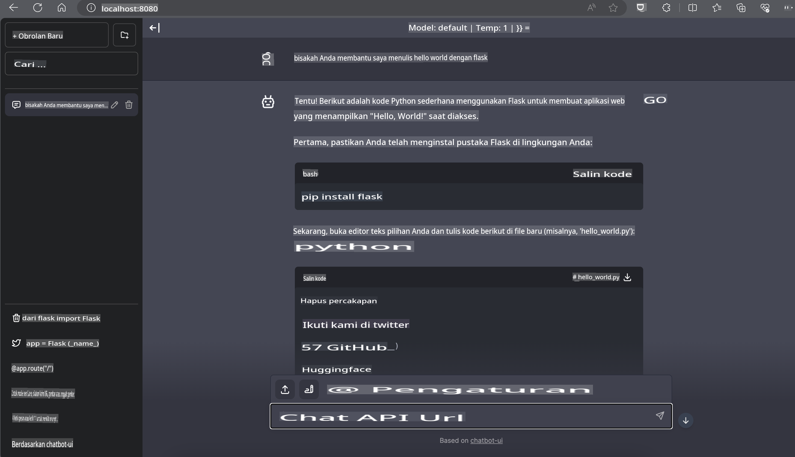

# **Inferensi Phi-3 di Nvidia Jetson**

Nvidia Jetson adalah serangkaian papan komputasi tertanam dari Nvidia. Model Jetson TK1, TX1, dan TX2 semuanya menggunakan prosesor Tegra (atau SoC) dari Nvidia yang mengintegrasikan unit pemrosesan pusat (CPU) berbasis arsitektur ARM. Jetson adalah sistem berdaya rendah yang dirancang untuk mempercepat aplikasi pembelajaran mesin. Nvidia Jetson digunakan oleh pengembang profesional untuk menciptakan produk AI revolusioner di berbagai industri, serta oleh pelajar dan penggemar untuk belajar AI secara langsung dan membuat proyek-proyek luar biasa. SLM diterapkan pada perangkat edge seperti Jetson, yang memungkinkan implementasi yang lebih baik untuk skenario aplikasi AI generatif industri.

## Penerapan pada NVIDIA Jetson:
Pengembang yang bekerja pada robotika otonom dan perangkat tertanam dapat memanfaatkan Phi-3 Mini. Ukurannya yang relatif kecil membuatnya ideal untuk penerapan di perangkat edge. Parameter telah disesuaikan secara teliti selama pelatihan, memastikan akurasi tinggi dalam responsnya.

### Optimisasi TensorRT-LLM:
Perpustakaan [TensorRT-LLM NVIDIA](https://github.com/NVIDIA/TensorRT-LLM?WT.mc_id=aiml-138114-kinfeylo) mengoptimalkan inferensi model bahasa besar. Perpustakaan ini mendukung jendela konteks panjang Phi-3 Mini, meningkatkan throughput dan latensi. Optimisasi mencakup teknik seperti LongRoPE, FP8, dan inflight batching.

### Ketersediaan dan Penerapan:
Pengembang dapat mengeksplorasi Phi-3 Mini dengan jendela konteks 128K di [AI NVIDIA](https://www.nvidia.com/en-us/ai-data-science/generative-ai/). Model ini dikemas sebagai NVIDIA NIM, sebuah mikroservis dengan API standar yang dapat diterapkan di mana saja. Selain itu, tersedia juga [implementasi TensorRT-LLM di GitHub](https://github.com/NVIDIA/TensorRT-LLM).

## **1. Persiapan**

a. Jetson Orin NX / Jetson NX

b. JetPack 5.1.2+
   
c. Cuda 11.8
   
d. Python 3.8+

## **2. Menjalankan Phi-3 di Jetson**

Kita dapat memilih [Ollama](https://ollama.com) atau [LlamaEdge](https://llamaedge.com).

Jika Anda ingin menggunakan gguf di cloud dan perangkat edge secara bersamaan, LlamaEdge dapat dipahami sebagai WasmEdge (WasmEdge adalah runtime WebAssembly yang ringan, berkinerja tinggi, dan skalabel, cocok untuk aplikasi cloud native, edge, dan terdesentralisasi. WasmEdge mendukung aplikasi serverless, fungsi tertanam, mikroservis, kontrak pintar, dan perangkat IoT). Anda dapat menerapkan model kuantitatif gguf ke perangkat edge dan cloud melalui LlamaEdge.


Berikut adalah langkah-langkah penggunaannya:

1. Instal dan unduh pustaka serta file terkait

```bash

curl -sSf https://raw.githubusercontent.com/WasmEdge/WasmEdge/master/utils/install.sh | bash -s -- --plugin wasi_nn-ggml

curl -LO https://github.com/LlamaEdge/LlamaEdge/releases/latest/download/llama-api-server.wasm

curl -LO https://github.com/LlamaEdge/chatbot-ui/releases/latest/download/chatbot-ui.tar.gz

tar xzf chatbot-ui.tar.gz

```

**Catatan**: llama-api-server.wasm dan chatbot-ui harus berada di direktori yang sama.

2. Jalankan skrip di terminal

```bash

wasmedge --dir .:. --nn-preload default:GGML:AUTO:{Your gguf path} llama-api-server.wasm -p phi-3-chat

```

Berikut adalah hasil yang dijalankan:



***Kode Contoh*** [Phi-3 Mini WASM Notebook Sample](https://github.com/Azure-Samples/Phi-3MiniSamples/tree/main/wasm)

Secara keseluruhan, Phi-3 Mini mewakili langkah maju dalam pemodelan bahasa, menggabungkan efisiensi, kesadaran konteks, dan keunggulan optimisasi dari NVIDIA. Apakah Anda sedang membangun robot atau aplikasi edge, Phi-3 Mini adalah alat yang kuat untuk diperhatikan.

**Penafian**:  
Dokumen ini telah diterjemahkan menggunakan layanan terjemahan berbasis AI. Meskipun kami berusaha untuk memberikan hasil yang akurat, harap disadari bahwa terjemahan otomatis mungkin mengandung kesalahan atau ketidakakuratan. Dokumen asli dalam bahasa aslinya harus dianggap sebagai sumber yang otoritatif. Untuk informasi yang bersifat kritis, disarankan untuk menggunakan jasa terjemahan manusia profesional. Kami tidak bertanggung jawab atas kesalahpahaman atau penafsiran yang keliru yang timbul dari penggunaan terjemahan ini.