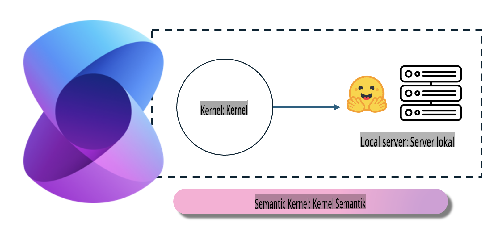
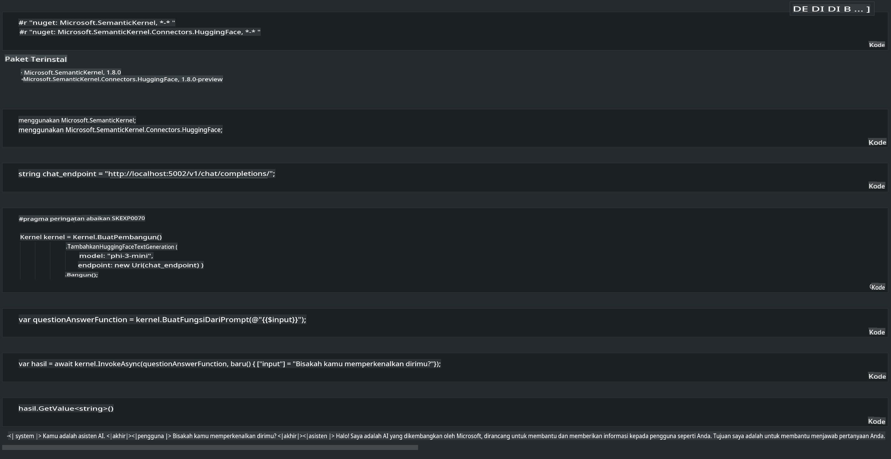

# **Inferensi Phi-3 di Server Lokal**

Kita dapat menerapkan Phi-3 di server lokal. Pengguna dapat memilih solusi [Ollama](https://ollama.com) atau [LM Studio](https://llamaedge.com), atau mereka dapat menulis kode mereka sendiri. Anda dapat menghubungkan layanan lokal Phi-3 melalui [Semantic Kernel](https://github.com/microsoft/semantic-kernel?WT.mc_id=aiml-138114-kinfeylo) atau [Langchain](https://www.langchain.com/) untuk membangun aplikasi Copilot.

## **Menggunakan Semantic Kernel untuk mengakses Phi-3-mini**

Dalam aplikasi Copilot, kita membuat aplikasi melalui Semantic Kernel / LangChain. Kerangka aplikasi jenis ini umumnya kompatibel dengan Azure OpenAI Service / model OpenAI, dan juga dapat mendukung model open source di Hugging Face serta model lokal. Apa yang harus kita lakukan jika ingin menggunakan Semantic Kernel untuk mengakses Phi-3-mini? Dengan menggunakan .NET sebagai contoh, kita dapat menggabungkannya dengan Hugging Face Connector di Semantic Kernel. Secara default, ini dapat disesuaikan dengan model id di Hugging Face (saat pertama kali digunakan, model akan diunduh dari Hugging Face, yang memakan waktu cukup lama). Anda juga dapat menghubungkannya ke layanan lokal yang telah dibangun. Dibandingkan keduanya, kami merekomendasikan menggunakan yang terakhir karena memiliki tingkat otonomi yang lebih tinggi, terutama dalam aplikasi perusahaan.

Dari gambar tersebut, mengakses layanan lokal melalui Semantic Kernel dapat dengan mudah terhubung ke server model Phi-3-mini yang telah dibangun sendiri. Berikut adalah hasil yang dijalankan:

***Kode Contoh*** https://github.com/kinfey/Phi3MiniSamples/tree/main/semantickernel

**Penafian**:  
Dokumen ini telah diterjemahkan menggunakan layanan penerjemahan berbasis AI. Meskipun kami berupaya untuk memberikan terjemahan yang akurat, harap diketahui bahwa terjemahan otomatis mungkin mengandung kesalahan atau ketidakakuratan. Dokumen asli dalam bahasa aslinya harus dianggap sebagai sumber yang berwenang. Untuk informasi yang bersifat kritis, disarankan menggunakan jasa penerjemahan profesional oleh manusia. Kami tidak bertanggung jawab atas kesalahpahaman atau interpretasi yang salah yang timbul dari penggunaan terjemahan ini.