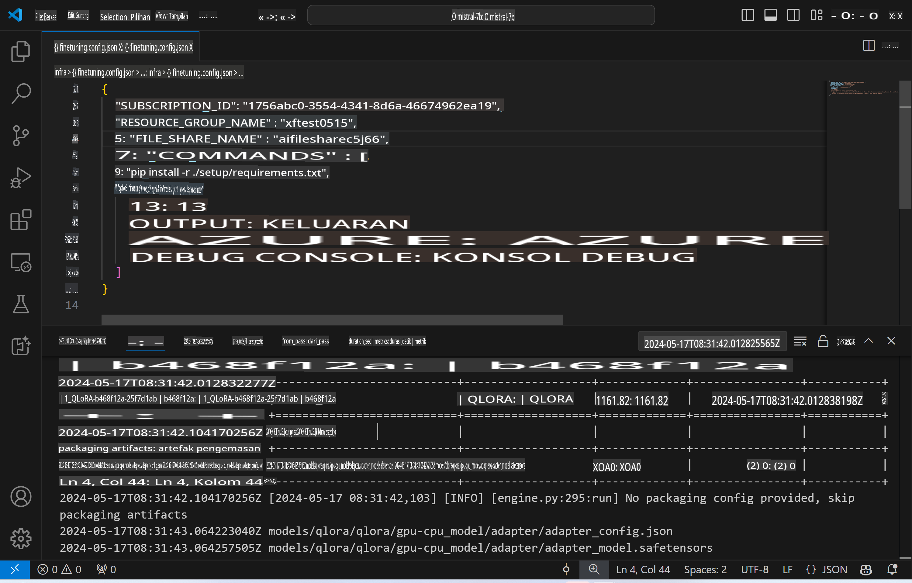
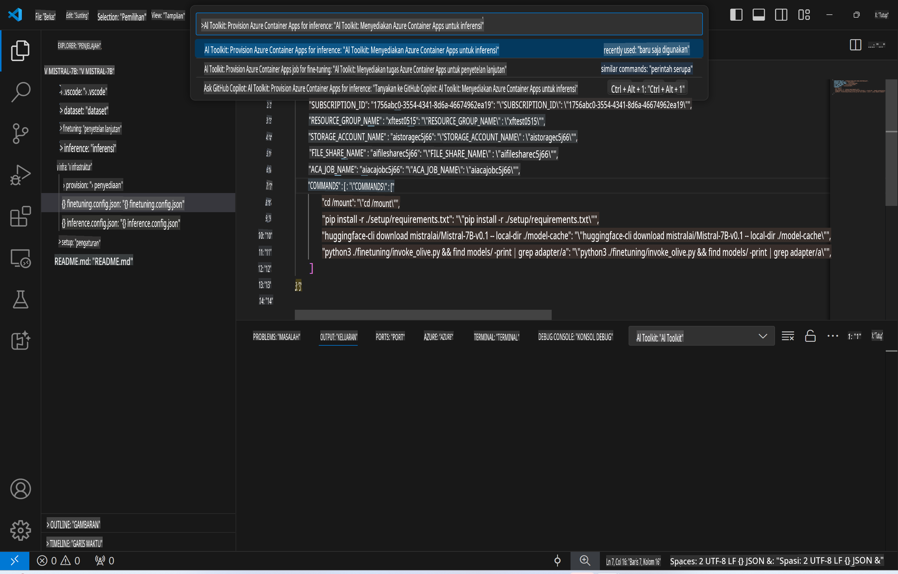
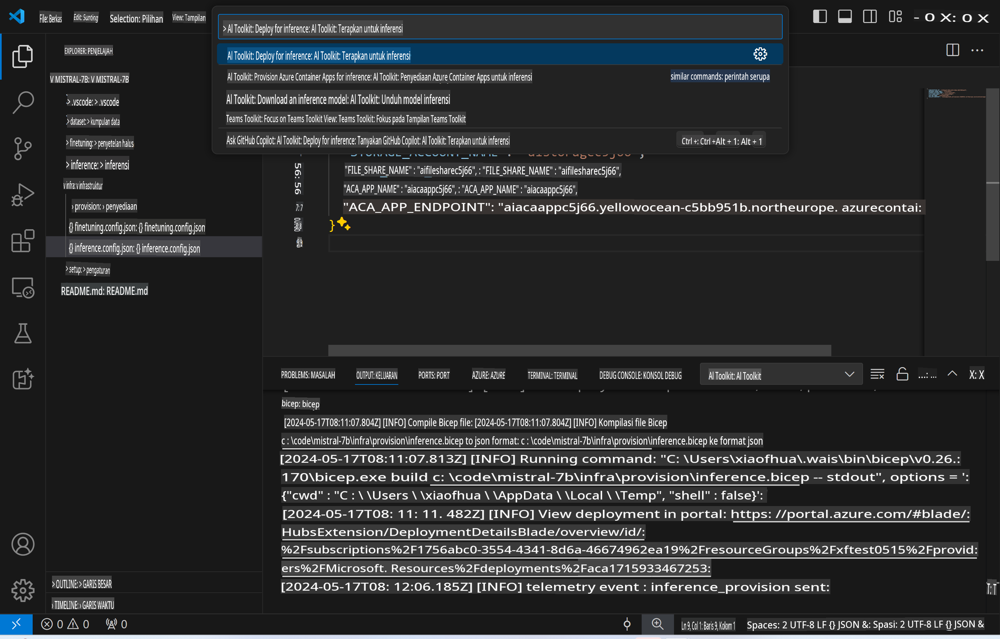
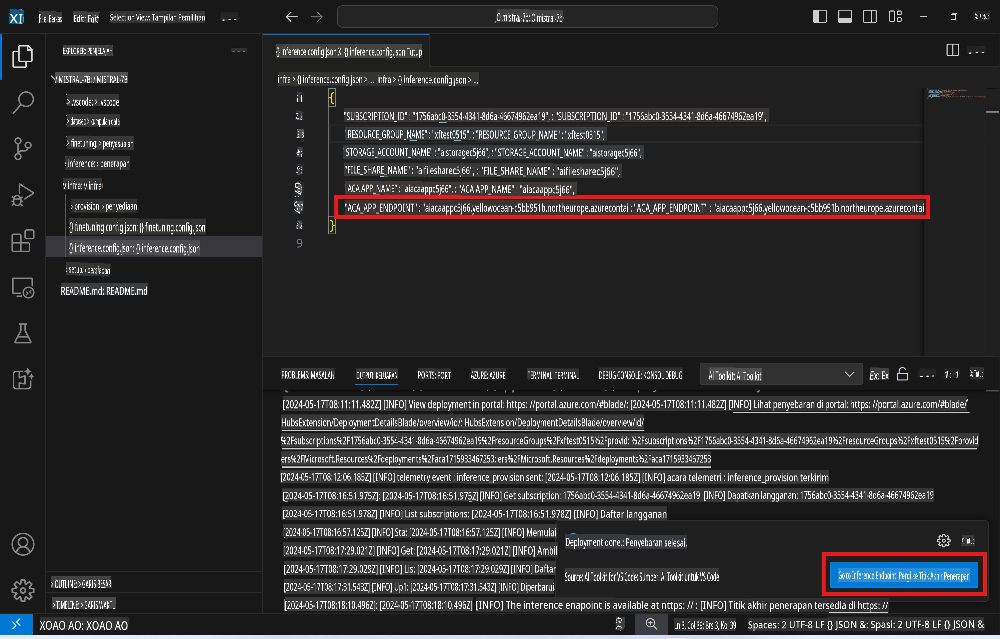

# Inferensi Jarak Jauh dengan Model yang Telah Disesuaikan

Setelah adapter dilatih di lingkungan jarak jauh, gunakan aplikasi Gradio sederhana untuk berinteraksi dengan model.



### Menyediakan Sumber Daya Azure
Anda perlu mengatur Sumber Daya Azure untuk inferensi jarak jauh dengan menjalankan `AI Toolkit: Provision Azure Container Apps for inference` dari palet perintah. Selama proses ini, Anda akan diminta untuk memilih Langganan Azure dan grup sumber daya Anda.  


Secara default, langganan dan grup sumber daya untuk inferensi seharusnya sesuai dengan yang digunakan untuk penyempurnaan. Inferensi akan menggunakan Lingkungan Azure Container App yang sama dan mengakses model serta adapter model yang disimpan di Azure Files, yang dihasilkan selama langkah penyempurnaan.

## Menggunakan AI Toolkit

### Penyebaran untuk Inferensi  
Jika Anda ingin merevisi kode inferensi atau memuat ulang model inferensi, silakan jalankan perintah `AI Toolkit: Deploy for inference`. Ini akan menyinkronkan kode terbaru Anda dengan ACA dan memulai ulang replika.



Setelah penyebaran berhasil diselesaikan, model kini siap untuk dievaluasi menggunakan endpoint ini.

### Mengakses API Inferensi

Anda dapat mengakses API inferensi dengan mengklik tombol "*Go to Inference Endpoint*" yang ditampilkan di notifikasi VSCode. Sebagai alternatif, endpoint web API dapat ditemukan di bawah `ACA_APP_ENDPOINT` di `./infra/inference.config.json` dan di panel output.



> **Catatan:** Endpoint inferensi mungkin memerlukan beberapa menit untuk menjadi sepenuhnya operasional.

## Komponen Inferensi yang Termasuk dalam Template

| Folder | Isi |
| ------ |--------- |
| `infra` | Berisi semua konfigurasi yang diperlukan untuk operasi jarak jauh. |
| `infra/provision/inference.parameters.json` | Menyimpan parameter untuk template bicep, yang digunakan untuk menyediakan sumber daya Azure untuk inferensi. |
| `infra/provision/inference.bicep` | Berisi template untuk menyediakan sumber daya Azure untuk inferensi. |
| `infra/inference.config.json` | File konfigurasi yang dihasilkan oleh perintah `AI Toolkit: Provision Azure Container Apps for inference`. Digunakan sebagai input untuk palet perintah jarak jauh lainnya. |

### Menggunakan AI Toolkit untuk Mengonfigurasi Penyediaan Sumber Daya Azure
Konfigurasikan [AI Toolkit](https://marketplace.visualstudio.com/items?itemName=ms-windows-ai-studio.windows-ai-studio)

Sediakan Azure Container Apps untuk inferensi` command.

You can find configuration parameters in `./infra/provision/inference.parameters.json` file. Here are the details:
| Parameter | Description |
| --------- |------------ |
| `defaultCommands` | This is the commands to initiate a web API. |
| `maximumInstanceCount` | This parameter sets the maximum capacity of GPU instances. |
| `location` | This is the location where Azure resources are provisioned. The default value is the same as the chosen resource group's location. |
| `storageAccountName`, `fileShareName` `acaEnvironmentName`, `acaEnvironmentStorageName`, `acaAppName`,  `acaLogAnalyticsName` | These parameters are used to name the Azure resources for provision. By default, they will be same to the fine-tuning resource name. You can input a new, unused resource name to create your own custom-named resources, or you can input the name of an already existing Azure resource if you'd prefer to use that. For details, refer to the section [Using existing Azure Resources](../../../../../md/01.Introduction/03). |

### Using Existing Azure Resources

By default, the inference provision use the same Azure Container App Environment, Storage Account, Azure File Share, and Azure Log Analytics that were used for fine-tuning. A separate Azure Container App is created solely for the inference API. 

If you have customized the Azure resources during the fine-tuning step or want to use your own existing Azure resources for inference, specify their names in the `./infra/inference.parameters.json` file. Kemudian, jalankan perintah `AI Toolkit: Provision Azure Container Apps for inference` dari palet perintah. Ini akan memperbarui sumber daya yang ditentukan dan membuat sumber daya yang belum ada.

Sebagai contoh, jika Anda memiliki lingkungan kontainer Azure yang sudah ada, `./infra/finetuning.parameters.json` Anda seharusnya terlihat seperti ini:

```json
{
    "$schema": "https://schema.management.azure.com/schemas/2019-04-01/deploymentParameters.json#",
    "contentVersion": "1.0.0.0",
    "parameters": {
      ...
      "acaEnvironmentName": {
        "value": "<your-aca-env-name>"
      },
      "acaEnvironmentStorageName": {
        "value": null
      },
      ...
    }
  }
```

### Penyediaan Manual  
Jika Anda lebih suka mengonfigurasi sumber daya Azure secara manual, Anda dapat menggunakan file bicep yang disediakan di file `./infra/provision` folders. If you have already set up and configured all the Azure resources without using the AI Toolkit command palette, you can simply enter the resource names in the `inference.config.json`.

Sebagai contoh:

```json
{
  "SUBSCRIPTION_ID": "<your-subscription-id>",
  "RESOURCE_GROUP_NAME": "<your-resource-group-name>",
  "STORAGE_ACCOUNT_NAME": "<your-storage-account-name>",
  "FILE_SHARE_NAME": "<your-file-share-name>",
  "ACA_APP_NAME": "<your-aca-name>",
  "ACA_APP_ENDPOINT": "<your-aca-endpoint>"
}
```

**Penafian**:  
Dokumen ini telah diterjemahkan menggunakan layanan terjemahan berbasis AI. Meskipun kami berupaya untuk memberikan hasil yang akurat, harap disadari bahwa terjemahan otomatis dapat mengandung kesalahan atau ketidakakuratan. Dokumen asli dalam bahasa aslinya harus dianggap sebagai sumber yang otoritatif. Untuk informasi yang bersifat kritis, disarankan menggunakan jasa terjemahan manusia profesional. Kami tidak bertanggung jawab atas kesalahpahaman atau interpretasi yang keliru yang timbul dari penggunaan terjemahan ini.