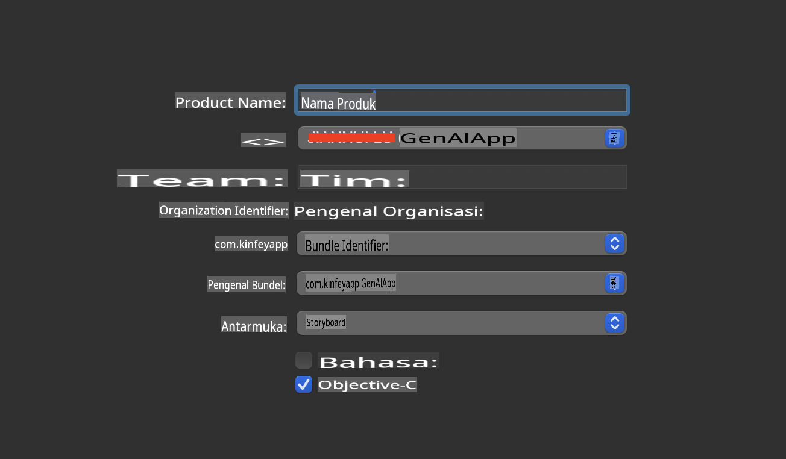
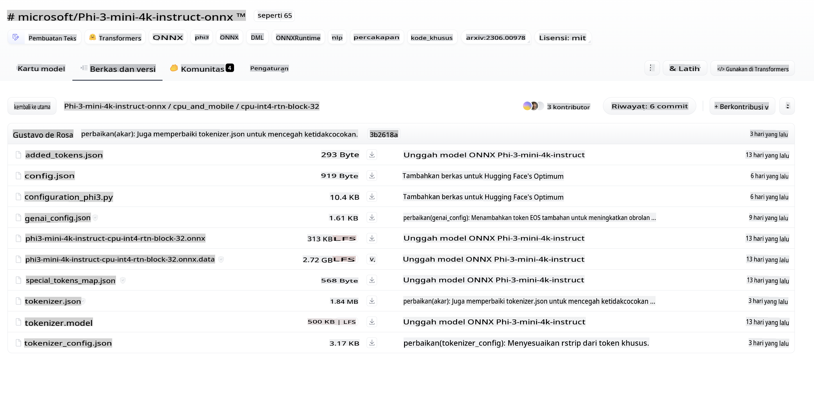
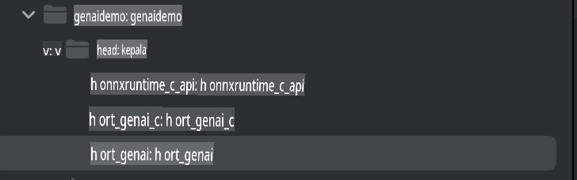
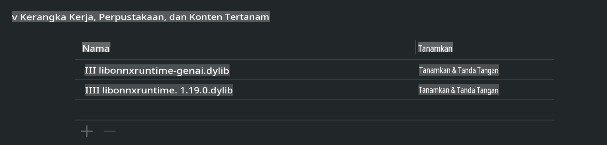
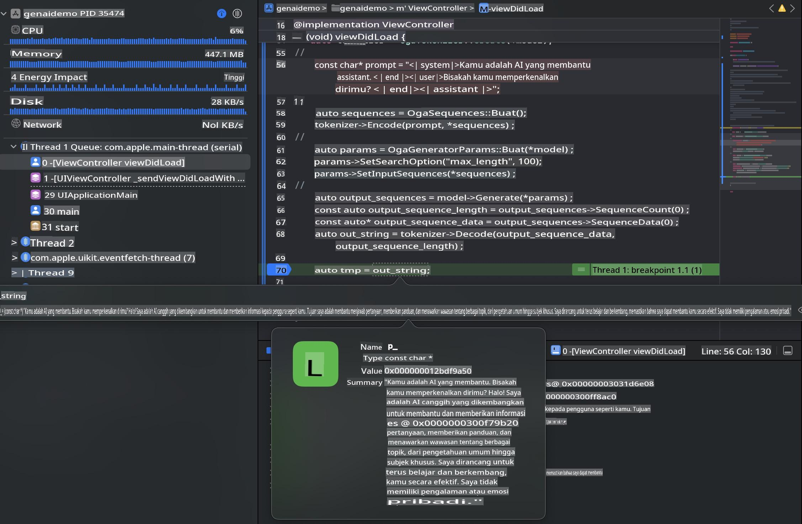

# **Inferensi Phi-3 di iOS**

Phi-3-mini adalah seri model baru dari Microsoft yang memungkinkan penerapan Large Language Models (LLMs) pada perangkat edge dan IoT. Phi-3-mini tersedia untuk penerapan di iOS, Android, dan perangkat Edge, memungkinkan AI generatif untuk digunakan di lingkungan BYOD. Contoh berikut menunjukkan cara menerapkan Phi-3-mini di iOS.

## **1. Persiapan**

- **a.** macOS 14+
- **b.** Xcode 15+
- **c.** iOS SDK 17.x (iPhone 14 A16 atau lebih tinggi)
- **d.** Instal Python 3.10+ (disarankan menggunakan Conda)
- **e.** Instal pustaka Python: `python-flatbuffers`
- **f.** Instal CMake

### Semantic Kernel dan Inferensi

Semantic Kernel adalah kerangka kerja aplikasi yang memungkinkan Anda membuat aplikasi yang kompatibel dengan Azure OpenAI Service, model OpenAI, dan bahkan model lokal. Mengakses layanan lokal melalui Semantic Kernel memudahkan integrasi dengan server model Phi-3-mini yang Anda host sendiri.

### Memanggil Model Kuantisasi dengan Ollama atau LlamaEdge

Banyak pengguna lebih suka menggunakan model kuantisasi untuk menjalankan model secara lokal. [Ollama](https://ollama.com) dan [LlamaEdge](https://llamaedge.com) memungkinkan pengguna memanggil berbagai model kuantisasi:

#### **Ollama**

Anda dapat menjalankan `ollama run phi3` secara langsung atau mengonfigurasinya secara offline. Buat sebuah Modelfile dengan jalur ke file `gguf` Anda. Contoh kode untuk menjalankan model kuantisasi Phi-3-mini:

```gguf
FROM {Add your gguf file path}
TEMPLATE \"\"\"<|user|> .Prompt<|end|> <|assistant|>\"\"\"
PARAMETER stop <|end|>
PARAMETER num_ctx 4096
```

#### **LlamaEdge**

Jika Anda ingin menggunakan `gguf` baik di cloud maupun perangkat edge secara bersamaan, LlamaEdge adalah opsi yang bagus.

## **2. Mengompilasi ONNX Runtime untuk iOS**

```bash

git clone https://github.com/microsoft/onnxruntime.git

cd onnxruntime

./build.sh --build_shared_lib --ios --skip_tests --parallel --build_dir ./build_ios --ios --apple_sysroot iphoneos --osx_arch arm64 --apple_deploy_target 17.5 --cmake_generator Xcode --config Release

cd ../

```

### **Catatan**

- **a.** Sebelum mengompilasi, pastikan Xcode telah dikonfigurasi dengan benar dan tetapkan sebagai direktori pengembang aktif di terminal:

    ```bash
    sudo xcode-select -switch /Applications/Xcode.app/Contents/Developer
    ```

- **b.** ONNX Runtime perlu dikompilasi untuk berbagai platform. Untuk iOS, Anda dapat mengompilasi untuk `arm64` or `x86_64`.

- **c.** Disarankan untuk menggunakan iOS SDK versi terbaru untuk pengompilan. Namun, Anda juga dapat menggunakan versi yang lebih lama jika membutuhkan kompatibilitas dengan SDK sebelumnya.

## **3. Mengompilasi AI Generatif dengan ONNX Runtime untuk iOS**

> **Catatan:** Karena AI Generatif dengan ONNX Runtime masih dalam tahap pratinjau, harap perhatikan kemungkinan adanya perubahan.

```bash

git clone https://github.com/microsoft/onnxruntime-genai
 
cd onnxruntime-genai
 
mkdir ort
 
cd ort
 
mkdir include
 
mkdir lib
 
cd ../
 
cp ../onnxruntime/include/onnxruntime/core/session/onnxruntime_c_api.h ort/include
 
cp ../onnxruntime/build_ios/Release/Release-iphoneos/libonnxruntime*.dylib* ort/lib
 
export OPENCV_SKIP_XCODEBUILD_FORCE_TRYCOMPILE_DEBUG=1
 
python3 build.py --parallel --build_dir ./build_ios --ios --ios_sysroot iphoneos --ios_arch arm64 --ios_deployment_target 17.5 --cmake_generator Xcode --cmake_extra_defines CMAKE_XCODE_ATTRIBUTE_CODE_SIGNING_ALLOWED=NO

```

## **4. Membuat Aplikasi App di Xcode**

Saya memilih Objective-C sebagai metode pengembangan aplikasi, karena menggunakan AI Generatif dengan API C++ ONNX Runtime, Objective-C lebih kompatibel. Tentu saja, Anda juga dapat menyelesaikan pemanggilan terkait melalui Swift bridging.



## **5. Menyalin Model ONNX Kuantisasi INT4 ke Proyek Aplikasi**

Kita perlu mengimpor model kuantisasi INT4 dalam format ONNX, yang harus diunduh terlebih dahulu.



Setelah diunduh, Anda perlu menambahkannya ke direktori Resources proyek di Xcode.


## **6. Menambahkan API C++ di ViewControllers**

> **Catatan:**

- **a.** Tambahkan file header C++ yang sesuai ke proyek.

  

- **b.** Sertakan `onnxruntime-genai` dynamic library in Xcode.

  

- **c.** Use the C Samples code for testing. You can also add additional features like ChatUI for more functionality.

- **d.** Since you need to use C++ in your project, rename `ViewController.m` to `ViewController.mm` untuk mengaktifkan dukungan Objective-C++.

```objc

    NSString *llmPath = [[NSBundle mainBundle] resourcePath];
    char const *modelPath = llmPath.cString;

    auto model =  OgaModel::Create(modelPath);

    auto tokenizer = OgaTokenizer::Create(*model);

    const char* prompt = "<|system|>You are a helpful AI assistant.<|end|><|user|>Can you introduce yourself?<|end|><|assistant|>";

    auto sequences = OgaSequences::Create();
    tokenizer->Encode(prompt, *sequences);

    auto params = OgaGeneratorParams::Create(*model);
    params->SetSearchOption("max_length", 100);
    params->SetInputSequences(*sequences);

    auto output_sequences = model->Generate(*params);
    const auto output_sequence_length = output_sequences->SequenceCount(0);
    const auto* output_sequence_data = output_sequences->SequenceData(0);
    auto out_string = tokenizer->Decode(output_sequence_data, output_sequence_length);
    
    auto tmp = out_string;

```

## **7. Menjalankan Aplikasi**

Setelah pengaturan selesai, Anda dapat menjalankan aplikasi untuk melihat hasil inferensi model Phi-3-mini.



Untuk contoh kode lainnya dan instruksi yang lebih rinci, kunjungi [Phi-3 Mini Samples repository](https://github.com/Azure-Samples/Phi-3MiniSamples/tree/main/ios).

**Penafian**:  
Dokumen ini telah diterjemahkan menggunakan layanan terjemahan berbasis AI. Meskipun kami berusaha untuk memberikan hasil yang akurat, harap disadari bahwa terjemahan otomatis mungkin mengandung kesalahan atau ketidakakuratan. Dokumen asli dalam bahasa aslinya harus dianggap sebagai sumber yang otoritatif. Untuk informasi yang bersifat kritis, disarankan menggunakan jasa terjemahan manusia profesional. Kami tidak bertanggung jawab atas kesalahpahaman atau penafsiran yang salah yang timbul dari penggunaan terjemahan ini.