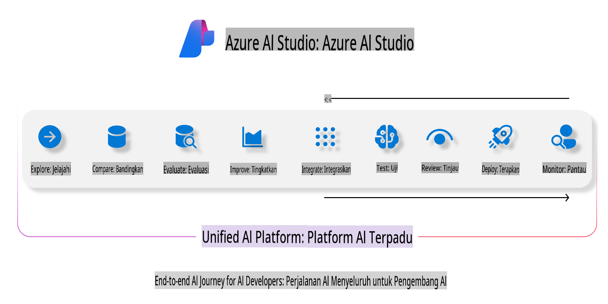
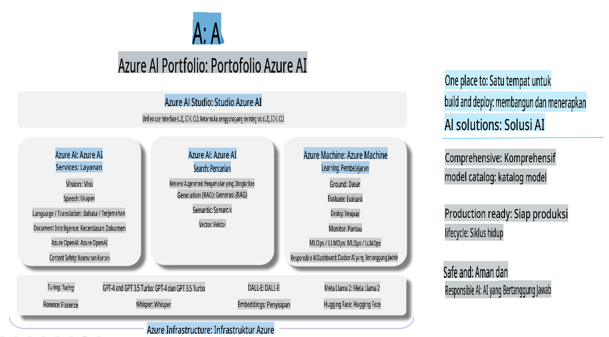

# **Menggunakan Azure AI Foundry untuk Evaluasi**

Cara mengevaluasi aplikasi AI generatif Anda menggunakan [Azure AI Foundry](https://ai.azure.com?WT.mc_id=aiml-138114-kinfeylo). Baik Anda menilai percakapan satu langkah maupun percakapan multi-langkah, Azure AI Foundry menyediakan alat untuk mengevaluasi kinerja dan keamanan model.

## Cara Mengevaluasi Aplikasi AI Generatif dengan Azure AI Foundry
Untuk petunjuk lebih detail, lihat [Dokumentasi Azure AI Foundry](https://learn.microsoft.com/azure/ai-studio/how-to/evaluate-generative-ai-app?WT.mc_id=aiml-138114-kinfeylo).

Berikut langkah-langkah untuk memulai:

## Mengevaluasi Model AI Generatif di Azure AI Foundry

**Prasyarat**

- Dataset uji dalam format CSV atau JSON.
- Model AI generatif yang telah dideploy (seperti Phi-3, GPT 3.5, GPT 4, atau model Davinci).
- Runtime dengan instance komputasi untuk menjalankan evaluasi.

## Metode Evaluasi Bawaan

Azure AI Foundry memungkinkan Anda mengevaluasi percakapan satu langkah maupun percakapan kompleks multi-langkah.  
Untuk skenario Retrieval Augmented Generation (RAG), di mana model didasarkan pada data tertentu, Anda dapat menilai kinerja menggunakan metode evaluasi bawaan.  
Selain itu, Anda juga dapat mengevaluasi skenario tanya jawab satu langkah secara umum (non-RAG).

## Membuat Evaluasi

Dari antarmuka Azure AI Foundry, navigasikan ke halaman Evaluate atau Prompt Flow.  
Ikuti wizard pembuatan evaluasi untuk menyiapkan evaluasi. Berikan nama opsional untuk evaluasi Anda.  
Pilih skenario yang sesuai dengan tujuan aplikasi Anda.  
Pilih satu atau lebih metode evaluasi untuk menilai keluaran model.

## Alur Evaluasi Kustom (Opsional)

Untuk fleksibilitas lebih besar, Anda dapat membuat alur evaluasi kustom. Sesuaikan proses evaluasi berdasarkan kebutuhan spesifik Anda.

## Melihat Hasil

Setelah menjalankan evaluasi, log, lihat, dan analisis metrik evaluasi secara mendetail di Azure AI Foundry. Dapatkan wawasan tentang kemampuan dan keterbatasan aplikasi Anda.

**Catatan** Azure AI Foundry saat ini dalam tahap pratinjau publik, jadi gunakan untuk keperluan eksperimen dan pengembangan. Untuk beban kerja produksi, pertimbangkan opsi lain. Jelajahi [dokumentasi resmi AI Foundry](https://learn.microsoft.com/azure/ai-studio/?WT.mc_id=aiml-138114-kinfeylo) untuk detail lebih lanjut dan petunjuk langkah demi langkah.

**Penafian**:  
Dokumen ini telah diterjemahkan menggunakan layanan terjemahan berbasis AI. Meskipun kami berusaha untuk memberikan hasil yang akurat, harap diperhatikan bahwa terjemahan otomatis mungkin mengandung kesalahan atau ketidakakuratan. Dokumen asli dalam bahasa aslinya harus dianggap sebagai sumber yang otoritatif. Untuk informasi yang bersifat kritis, disarankan menggunakan jasa penerjemah manusia profesional. Kami tidak bertanggung jawab atas kesalahpahaman atau penafsiran yang keliru yang timbul dari penggunaan terjemahan ini.