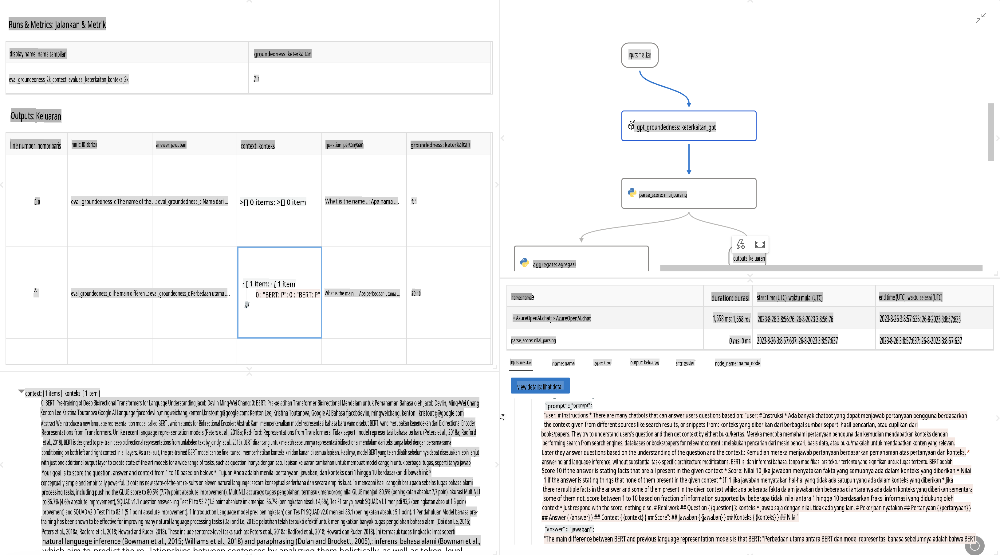

# **Memperkenalkan Promptflow**

[Microsoft Prompt Flow](https://microsoft.github.io/promptflow/index.html?WT.mc_id=aiml-138114-kinfeylo) adalah alat otomatisasi alur kerja visual yang memungkinkan pengguna membuat alur kerja otomatis menggunakan templat bawaan dan konektor kustom. Alat ini dirancang untuk membantu pengembang dan analis bisnis dengan cepat membangun proses otomatis untuk tugas seperti manajemen data, kolaborasi, dan optimalisasi proses. Dengan Prompt Flow, pengguna dapat dengan mudah menghubungkan berbagai layanan, aplikasi, dan sistem, serta mengotomatisasi proses bisnis yang kompleks.

Microsoft Prompt Flow dirancang untuk menyederhanakan siklus pengembangan end-to-end aplikasi AI yang didukung oleh Large Language Models (LLMs). Baik saat Anda sedang merancang ide, membuat prototipe, menguji, mengevaluasi, atau menerapkan aplikasi berbasis LLM, Prompt Flow mempermudah proses tersebut dan memungkinkan Anda membangun aplikasi LLM dengan kualitas produksi.

## Berikut adalah fitur utama dan manfaat menggunakan Microsoft Prompt Flow:

**Pengalaman Penulisan Interaktif**

Prompt Flow menyediakan representasi visual dari struktur alur Anda, sehingga mudah dipahami dan dinavigasi.
Ini menawarkan pengalaman pengkodean mirip notebook untuk pengembangan dan debugging alur yang efisien.

**Varian Prompt dan Penyesuaian**

Buat dan bandingkan beberapa varian prompt untuk memfasilitasi proses penyempurnaan yang iteratif. Evaluasi kinerja berbagai prompt dan pilih yang paling efektif.

**Alur Evaluasi Bawaan**

Nilai kualitas dan efektivitas prompt dan alur Anda menggunakan alat evaluasi bawaan.
Pahami seberapa baik aplikasi berbasis LLM Anda berfungsi.

**Sumber Daya Komprehensif**

Prompt Flow mencakup perpustakaan alat, sampel, dan templat bawaan. Sumber daya ini menjadi titik awal untuk pengembangan, menginspirasi kreativitas, dan mempercepat proses.

**Kolaborasi dan Kesiapan Perusahaan**

Dukung kolaborasi tim dengan memungkinkan beberapa pengguna bekerja bersama pada proyek rekayasa prompt.
Kelola kontrol versi dan bagikan pengetahuan secara efektif. Permudah seluruh proses rekayasa prompt, mulai dari pengembangan dan evaluasi hingga penerapan dan pemantauan.

## Evaluasi dalam Prompt Flow

Dalam Microsoft Prompt Flow, evaluasi memainkan peran penting dalam menilai seberapa baik model AI Anda bekerja. Mari kita eksplorasi bagaimana Anda dapat menyesuaikan alur evaluasi dan metrik di dalam Prompt Flow:

**Memahami Evaluasi dalam Prompt Flow**

Dalam Prompt Flow, alur merepresentasikan rangkaian node yang memproses input dan menghasilkan output. Alur evaluasi adalah jenis alur khusus yang dirancang untuk menilai kinerja sebuah run berdasarkan kriteria dan tujuan tertentu.

**Fitur utama alur evaluasi**

Biasanya dijalankan setelah alur yang diuji, menggunakan outputnya. Mereka menghitung skor atau metrik untuk mengukur kinerja alur yang diuji. Metrik dapat mencakup akurasi, skor relevansi, atau ukuran lain yang relevan.

### Menyesuaikan Alur Evaluasi

**Mendefinisikan Input**

Alur evaluasi perlu menerima output dari run yang diuji. Definisikan input dengan cara yang mirip dengan alur standar.
Sebagai contoh, jika Anda mengevaluasi alur QnA, beri nama input sebagai "jawaban." Jika mengevaluasi alur klasifikasi, beri nama input sebagai "kategori." Input ground truth (misalnya, label aktual) juga mungkin diperlukan.

**Output dan Metrik**

Alur evaluasi menghasilkan hasil yang mengukur kinerja alur yang diuji. Metrik dapat dihitung menggunakan Python atau LLM (Large Language Models). Gunakan fungsi log_metric() untuk mencatat metrik yang relevan.

**Menggunakan Alur Evaluasi yang Disesuaikan**

Kembangkan alur evaluasi Anda sendiri yang disesuaikan dengan tugas dan tujuan spesifik Anda. Sesuaikan metrik berdasarkan tujuan evaluasi Anda.
Terapkan alur evaluasi yang disesuaikan ini ke batch run untuk pengujian skala besar.

## Metode Evaluasi Bawaan

Prompt Flow juga menyediakan metode evaluasi bawaan.
Anda dapat mengirimkan batch run dan menggunakan metode ini untuk mengevaluasi seberapa baik alur Anda bekerja dengan dataset besar.
Lihat hasil evaluasi, bandingkan metrik, dan lakukan iterasi sesuai kebutuhan.
Ingat, evaluasi sangat penting untuk memastikan model AI Anda memenuhi kriteria dan tujuan yang diinginkan. Jelajahi dokumentasi resmi untuk petunjuk rinci tentang mengembangkan dan menggunakan alur evaluasi di Microsoft Prompt Flow.

Singkatnya, Microsoft Prompt Flow memberdayakan pengembang untuk membuat aplikasi LLM berkualitas tinggi dengan menyederhanakan rekayasa prompt dan menyediakan lingkungan pengembangan yang kuat. Jika Anda bekerja dengan LLM, Prompt Flow adalah alat yang layak untuk dieksplorasi. Jelajahi [Dokumentasi Evaluasi Prompt Flow](https://learn.microsoft.com/azure/machine-learning/prompt-flow/how-to-develop-an-evaluation-flow?view=azureml-api-2?WT.mc_id=aiml-138114-kinfeylo) untuk petunjuk rinci tentang mengembangkan dan menggunakan alur evaluasi di Microsoft Prompt Flow.

**Penafian**:  
Dokumen ini telah diterjemahkan menggunakan layanan terjemahan berbasis AI. Meskipun kami berupaya untuk memberikan hasil yang akurat, harap diketahui bahwa terjemahan otomatis mungkin mengandung kesalahan atau ketidakakuratan. Dokumen asli dalam bahasa aslinya harus dianggap sebagai sumber yang berwenang. Untuk informasi yang bersifat krusial, disarankan menggunakan jasa terjemahan manusia profesional. Kami tidak bertanggung jawab atas kesalahpahaman atau salah tafsir yang timbul dari penggunaan terjemahan ini.