# Fine-tune dan Integrasikan Model Phi-3 Kustom dengan Prompt Flow di Azure AI Foundry

Contoh end-to-end (E2E) ini didasarkan pada panduan "[Fine-Tune and Integrate Custom Phi-3 Models with Prompt Flow in Azure AI Foundry](https://techcommunity.microsoft.com/t5/educator-developer-blog/fine-tune-and-integrate-custom-phi-3-models-with-prompt-flow-in/ba-p/4191726?WT.mc_id=aiml-137032-kinfeylo)" dari Microsoft Tech Community. Panduan ini memperkenalkan proses fine-tuning, deployment, dan integrasi model Phi-3 kustom dengan Prompt Flow di Azure AI Foundry. 
Berbeda dengan contoh E2E, "[Fine-Tune and Integrate Custom Phi-3 Models with Prompt Flow](./E2E_Phi-3-FineTuning_PromptFlow_Integration.md)", yang melibatkan menjalankan kode secara lokal, tutorial ini sepenuhnya berfokus pada fine-tuning dan integrasi model Anda di dalam Azure AI / ML Studio.

## Gambaran Umum

Dalam contoh E2E ini, Anda akan belajar bagaimana melakukan fine-tuning model Phi-3 dan mengintegrasikannya dengan Prompt Flow di Azure AI Foundry. Dengan memanfaatkan Azure AI / ML Studio, Anda akan membangun alur kerja untuk mendistribusikan dan menggunakan model AI kustom. Contoh E2E ini dibagi menjadi tiga skenario:

**Skenario 1: Siapkan sumber daya Azure dan Persiapkan untuk fine-tuning**

**Skenario 2: Fine-tune model Phi-3 dan Deploy di Azure Machine Learning Studio**

**Skenario 3: Integrasikan dengan Prompt Flow dan Berinteraksi dengan model kustom Anda di Azure AI Foundry**

Berikut adalah gambaran umum dari contoh E2E ini.

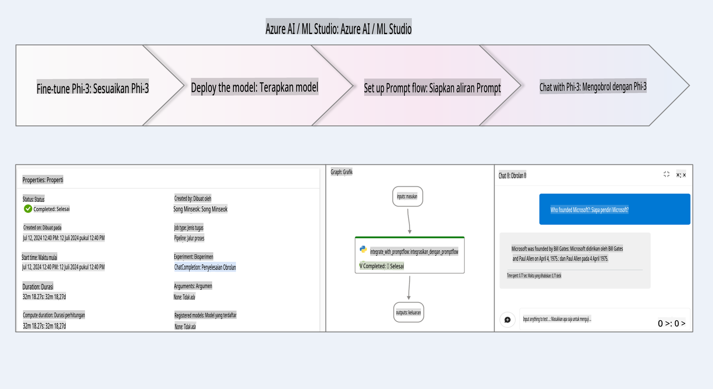

### Daftar Isi

1. **[Skenario 1: Siapkan sumber daya Azure dan Persiapkan untuk fine-tuning](../../../../../../md/02.Application/01.TextAndChat/Phi3)**
    - [Buat Azure Machine Learning Workspace](../../../../../../md/02.Application/01.TextAndChat/Phi3)
    - [Ajukan kuota GPU di Azure Subscription](../../../../../../md/02.Application/01.TextAndChat/Phi3)
    - [Tambahkan penugasan peran](../../../../../../md/02.Application/01.TextAndChat/Phi3)
    - [Siapkan proyek](../../../../../../md/02.Application/01.TextAndChat/Phi3)
    - [Persiapkan dataset untuk fine-tuning](../../../../../../md/02.Application/01.TextAndChat/Phi3)

1. **[Skenario 2: Fine-tune model Phi-3 dan Deploy di Azure Machine Learning Studio](../../../../../../md/02.Application/01.TextAndChat/Phi3)**
    - [Fine-tune model Phi-3](../../../../../../md/02.Application/01.TextAndChat/Phi3)
    - [Deploy model Phi-3 yang telah di-fine-tune](../../../../../../md/02.Application/01.TextAndChat/Phi3)

1. **[Skenario 3: Integrasikan dengan Prompt Flow dan Berinteraksi dengan model kustom Anda di Azure AI Foundry](../../../../../../md/02.Application/01.TextAndChat/Phi3)**
    - [Integrasikan model Phi-3 kustom dengan Prompt Flow](../../../../../../md/02.Application/01.TextAndChat/Phi3)
    - [Berinteraksi dengan model Phi-3 kustom Anda](../../../../../../md/02.Application/01.TextAndChat/Phi3)

## Skenario 1: Siapkan sumber daya Azure dan Persiapkan untuk fine-tuning

### Buat Azure Machine Learning Workspace

1. Ketik *azure machine learning* di **bilah pencarian** di bagian atas halaman portal dan pilih **Azure Machine Learning** dari opsi yang muncul.

    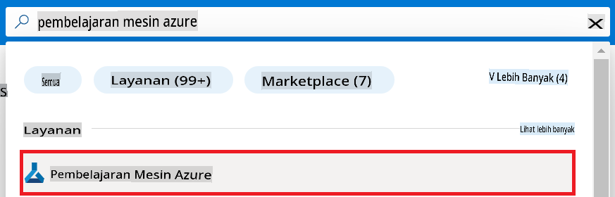

2. Pilih **+ Create** dari menu navigasi.

3. Pilih **New workspace** dari menu navigasi.

    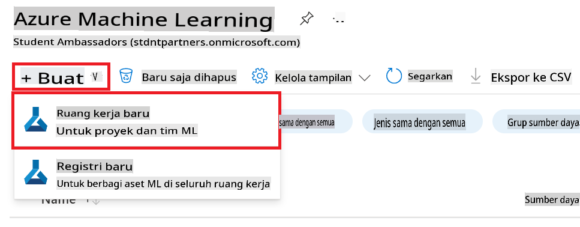

4. Lakukan langkah-langkah berikut:

    - Pilih **Subscription** Azure Anda.
    - Pilih **Resource group** yang akan digunakan (buat baru jika diperlukan).
    - Masukkan **Workspace Name**. Harus berupa nilai unik.
    - Pilih **Region** yang ingin digunakan.
    - Pilih **Storage account** yang akan digunakan (buat baru jika diperlukan).
    - Pilih **Key vault** yang akan digunakan (buat baru jika diperlukan).
    - Pilih **Application insights** yang akan digunakan (buat baru jika diperlukan).
    - Pilih **Container registry** yang akan digunakan (buat baru jika diperlukan).

    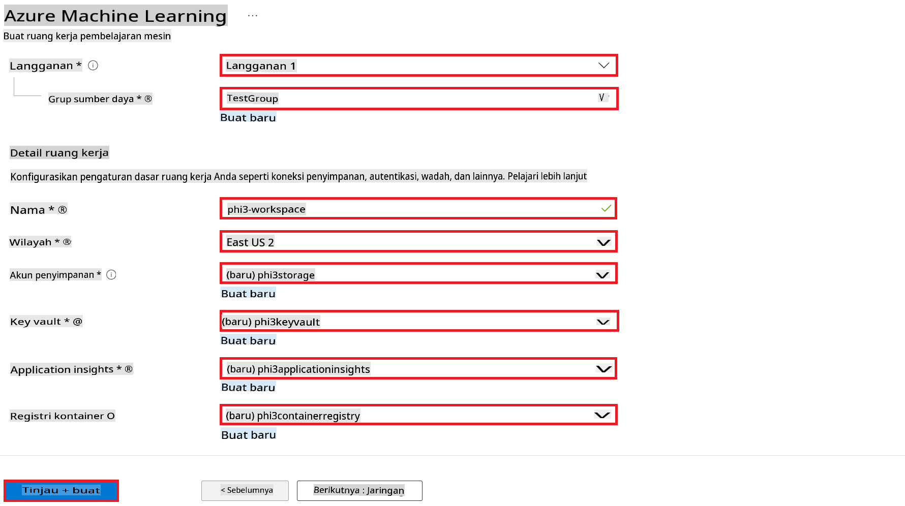

5. Pilih **Review + Create**.

6. Pilih **Create**.

### Ajukan kuota GPU di Azure Subscription

Dalam tutorial ini, Anda akan belajar bagaimana melakukan fine-tuning dan deployment model Phi-3 menggunakan GPU. Untuk fine-tuning, Anda akan menggunakan GPU *Standard_NC24ads_A100_v4*, yang memerlukan permintaan kuota. Untuk deployment, Anda akan menggunakan GPU *Standard_NC6s_v3*, yang juga memerlukan permintaan kuota.

> [!NOTE]
>
> Hanya subscription Pay-As-You-Go (jenis subscription standar) yang memenuhi syarat untuk alokasi GPU; subscription dengan manfaat tidak didukung saat ini.
>

1. Kunjungi [Azure ML Studio](https://ml.azure.com/home?wt.mc_id=studentamb_279723).

1. Lakukan langkah-langkah berikut untuk mengajukan kuota *Standard NCADSA100v4 Family*:

    - Pilih **Quota** dari tab sisi kiri.
    - Pilih **Virtual machine family** yang akan digunakan. Misalnya, pilih **Standard NCADSA100v4 Family Cluster Dedicated vCPUs**, yang mencakup GPU *Standard_NC24ads_A100_v4*.
    - Pilih **Request quota** dari menu navigasi.

        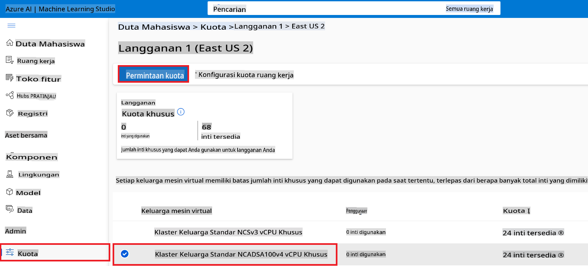

    - Di halaman Request quota, masukkan **New cores limit** yang ingin digunakan. Misalnya, 24.
    - Di halaman Request quota, pilih **Submit** untuk mengajukan kuota GPU.

1. Lakukan langkah-langkah berikut untuk mengajukan kuota *Standard NCSv3 Family*:

    - Pilih **Quota** dari tab sisi kiri.
    - Pilih **Virtual machine family** yang akan digunakan. Misalnya, pilih **Standard NCSv3 Family Cluster Dedicated vCPUs**, yang mencakup GPU *Standard_NC6s_v3*.
    - Pilih **Request quota** dari menu navigasi.
    - Di halaman Request quota, masukkan **New cores limit** yang ingin digunakan. Misalnya, 24.
    - Di halaman Request quota, pilih **Submit** untuk mengajukan kuota GPU.

### Tambahkan penugasan peran

Untuk melakukan fine-tuning dan deployment model Anda, Anda harus terlebih dahulu membuat User Assigned Managed Identity (UAI) dan memberikan izin yang sesuai. UAI ini akan digunakan untuk autentikasi selama deployment.

#### Buat User Assigned Managed Identity (UAI)

1. Ketik *managed identities* di **bilah pencarian** di bagian atas halaman portal dan pilih **Managed Identities** dari opsi yang muncul.

    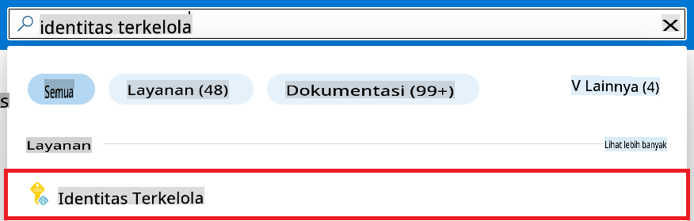

1. Pilih **+ Create**.

    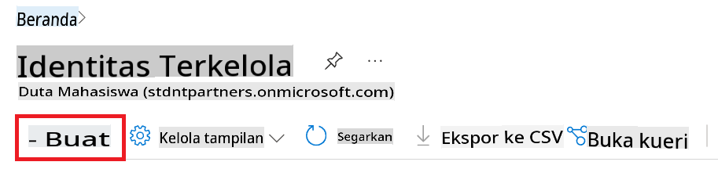

1. Lakukan langkah-langkah berikut:

    - Pilih **Subscription** Azure Anda.
    - Pilih **Resource group** yang akan digunakan (buat baru jika diperlukan).
    - Pilih **Region** yang ingin digunakan.
    - Masukkan **Name**. Harus berupa nilai unik.

    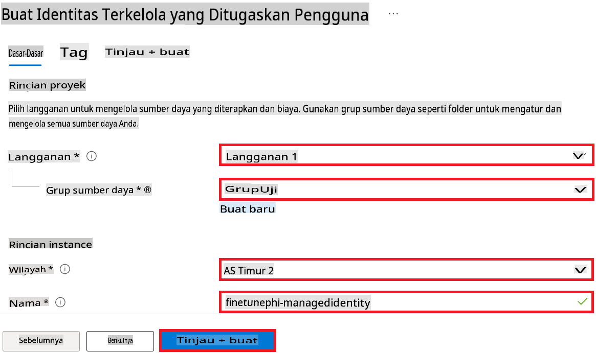

1. Pilih **Review + create**.

1. Pilih **+ Create**.

#### Tambahkan penugasan peran Contributor ke Managed Identity

1. Akses resource Managed Identity yang telah Anda buat.

1. Pilih **Azure role assignments** dari tab sisi kiri.

1. Pilih **+Add role assignment** dari menu navigasi.

1. Di halaman Add role assignment, lakukan langkah-langkah berikut:
    - Pilih **Scope** menjadi **Resource group**.
    - Pilih **Subscription** Azure Anda.
    - Pilih **Resource group** yang akan digunakan.
    - Pilih **Role** menjadi **Contributor**.

    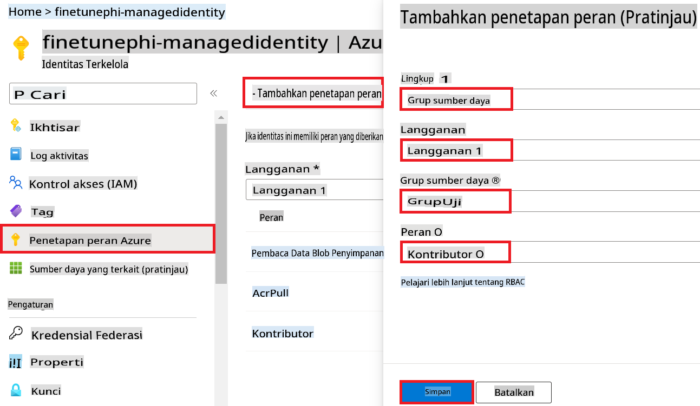

2. Pilih **Save**.

#### Tambahkan penugasan peran Storage Blob Data Reader ke Managed Identity

1. Ketik *storage accounts* di **bilah pencarian** di bagian atas halaman portal dan pilih **Storage accounts** dari opsi yang muncul.

    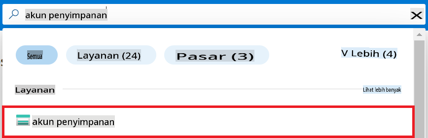

1. Pilih storage account yang terkait dengan Azure Machine Learning workspace yang Anda buat. Misalnya, *finetunephistorage*.

1. Lakukan langkah-langkah berikut untuk menuju halaman Add role assignment:

    - Akses akun penyimpanan Azure yang Anda buat.
    - Pilih **Access Control (IAM)** dari tab sisi kiri.
    - Pilih **+ Add** dari menu navigasi.
    - Pilih **Add role assignment** dari menu navigasi.

    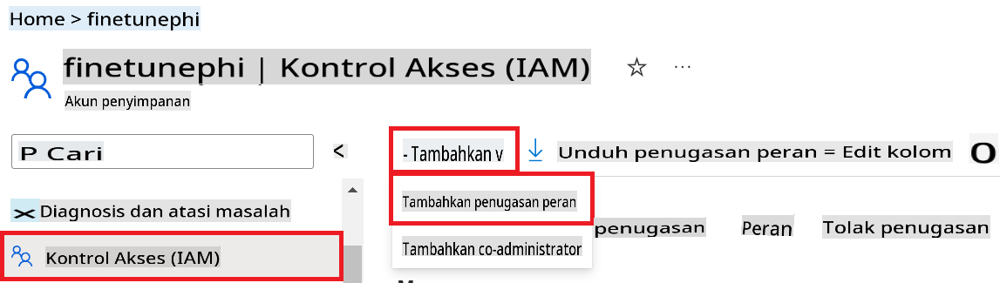

1. Di halaman Add role assignment, lakukan langkah-langkah berikut:

    - Di halaman Role, ketik *Storage Blob Data Reader* di **bilah pencarian** dan pilih **Storage Blob Data Reader** dari opsi yang muncul.
    - Di halaman Role, pilih **Next**.
    - Di halaman Members, pilih **Assign access to** **Managed identity**.
    - Di halaman Members, pilih **+ Select members**.
    - Di halaman Select managed identities, pilih **Subscription** Azure Anda.
    - Di halaman Select managed identities, pilih **Managed identity** yang telah Anda buat. Misalnya, *finetunephi-managedidentity*.
    - Di halaman Select managed identities, pilih **Select**.

    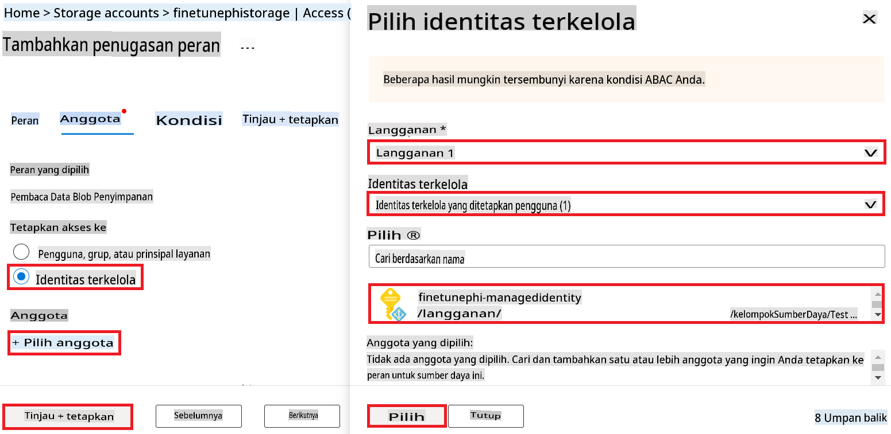

1. Pilih **Review + assign**.

#### Tambahkan penugasan peran AcrPull ke Managed Identity

1. Ketik *container registries* di **bilah pencarian** di bagian atas halaman portal dan pilih **Container registries** dari opsi yang muncul.

    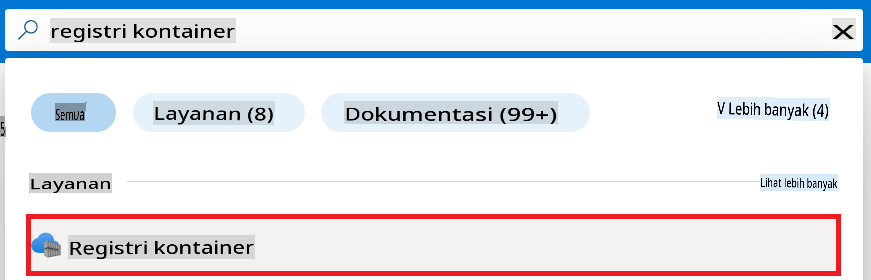

1. Pilih container registry yang terkait dengan Azure Machine Learning workspace. Misalnya, *finetunephicontainerregistry*.

1. Lakukan langkah-langkah berikut untuk menuju halaman Add role assignment:

    - Pilih **Access Control (IAM)** dari tab sisi kiri.
    - Pilih **+ Add** dari menu navigasi.
    - Pilih **Add role assignment** dari menu navigasi.

1. Di halaman Add role assignment, lakukan langkah-langkah berikut:

    - Di halaman Role, ketik *AcrPull* di **bilah pencarian** dan pilih **AcrPull** dari opsi yang muncul.
    - Di halaman Role, pilih **Next**.
    - Di halaman Members, pilih **Assign access to** **Managed identity**.
    - Di halaman Members, pilih **+ Select members**.
    - Di halaman Select managed identities, pilih **Subscription** Azure Anda.
    - Di halaman Select managed identities, pilih **Managed identity** yang telah Anda buat. Misalnya, *finetunephi-managedidentity*.
    - Di halaman Select managed identities, pilih **Select**.
    - Pilih **Review + assign**.

### Siapkan proyek

Untuk mengunduh dataset yang diperlukan untuk fine-tuning, Anda akan menyiapkan lingkungan lokal.

Dalam latihan ini, Anda akan:

- Membuat folder untuk bekerja di dalamnya.
- Membuat lingkungan virtual.
- Menginstal paket yang diperlukan.
- Membuat file *download_dataset.py* untuk mengunduh dataset.

#### Buat folder untuk bekerja di dalamnya

1. Buka jendela terminal dan ketik perintah berikut untuk membuat folder bernama *finetune-phi* di jalur default.

    ```console
    mkdir finetune-phi
    ```

2. Ketik perintah berikut di terminal Anda untuk masuk ke folder *finetune-phi* yang telah Anda buat.

    ```console
    cd finetune-phi
    ```

#### Buat lingkungan virtual

1. Ketik perintah berikut di terminal Anda untuk membuat lingkungan virtual bernama *.venv*.

    ```console
    python -m venv .venv
    ```

2. Ketik perintah berikut di terminal Anda untuk mengaktifkan lingkungan virtual.

    ```console
    .venv\Scripts\activate.bat
    ```

> [!NOTE]
> Jika berhasil, Anda akan melihat *(.venv)* sebelum prompt perintah.

#### Instal paket yang diperlukan

1. Ketik perintah berikut di terminal Anda untuk menginstal paket yang diperlukan.

    ```console
    pip install datasets==2.19.1
    ```

#### Buat `download_dataset.py`

> [!NOTE]
> Struktur folder lengkap:
>
> ```text
> └── YourUserName
> .    └── finetune-phi
> .        └── download_dataset.py
> ```

1. Buka **Visual Studio Code**.

1. Pilih **File** dari menu bar.

1. Pilih **Open Folder**.

1. Pilih folder *finetune-phi* yang telah Anda buat, yang terletak di *C:\Users\yourUserName\finetune-phi*.

    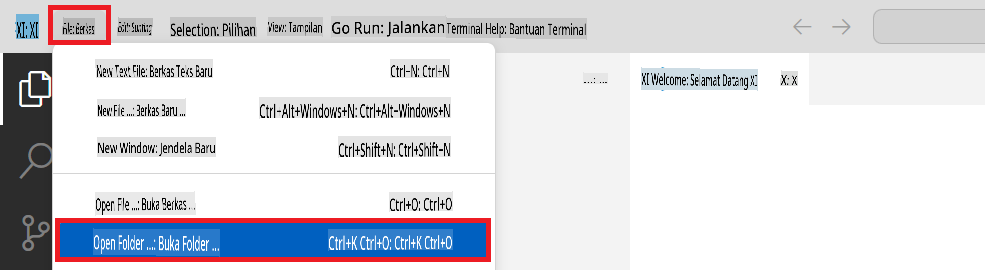

1. Di panel kiri Visual Studio Code, klik kanan dan pilih **New File** untuk membuat file baru bernama *download_dataset.py*.

    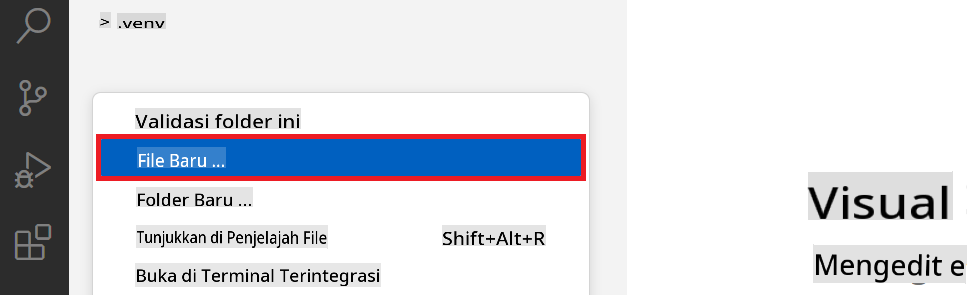

### Persiapkan dataset untuk fine-tuning

Dalam latihan ini, Anda akan menjalankan file *download_dataset.py* untuk mengunduh dataset *ultrachat_200k* ke lingkungan lokal Anda. Dataset ini kemudian akan digunakan untuk fine-tuning model Phi-3 di Azure Machine Learning.

Dalam latihan ini, Anda akan:

- Menambahkan kode ke file *download_dataset.py* untuk mengunduh dataset.
- Menjalankan file *download_dataset.py* untuk mengunduh dataset ke lingkungan lokal Anda.

#### Unduh dataset menggunakan *download_dataset.py*

1. Buka file *download_dataset.py* di Visual Studio Code.

1. Tambahkan kode berikut ke file *download_dataset.py*.

    ```python
    import json
    import os
    from datasets import load_dataset

    def load_and_split_dataset(dataset_name, config_name, split_ratio):
        """
        Load and split a dataset.
        """
        # Load the dataset with the specified name, configuration, and split ratio
        dataset = load_dataset(dataset_name, config_name, split=split_ratio)
        print(f"Original dataset size: {len(dataset)}")
        
        # Split the dataset into train and test sets (80% train, 20% test)
        split_dataset = dataset.train_test_split(test_size=0.2)
        print(f"Train dataset size: {len(split_dataset['train'])}")
        print(f"Test dataset size: {len(split_dataset['test'])}")
        
        return split_dataset

    def save_dataset_to_jsonl(dataset, filepath):
        """
        Save a dataset to a JSONL file.
        """
        # Create the directory if it does not exist
        os.makedirs(os.path.dirname(filepath), exist_ok=True)
        
        # Open the file in write mode
        with open(filepath, 'w', encoding='utf-8') as f:
            # Iterate over each record in the dataset
            for record in dataset:
                # Dump the record as a JSON object and write it to the file
                json.dump(record, f)
                # Write a newline character to separate records
                f.write('\n')
        
        print(f"Dataset saved to {filepath}")

    def main():
        """
        Main function to load, split, and save the dataset.
        """
        # Load and split the ULTRACHAT_200k dataset with a specific configuration and split ratio
        dataset = load_and_split_dataset("HuggingFaceH4/ultrachat_200k", 'default', 'train_sft[:1%]')
        
        # Extract the train and test datasets from the split
        train_dataset = dataset['train']
        test_dataset = dataset['test']

        # Save the train dataset to a JSONL file
        save_dataset_to_jsonl(train_dataset, "data/train_data.jsonl")
        
        # Save the test dataset to a separate JSONL file
        save_dataset_to_jsonl(test_dataset, "data/test_data.jsonl")

    if __name__ == "__main__":
        main()

    ```

1. Ketik perintah berikut di terminal Anda untuk menjalankan skrip dan mengunduh dataset ke lingkungan lokal Anda.

    ```console
    python download_dataset.py
    ```

1. Verifikasi bahwa dataset berhasil disimpan di direktori lokal *finetune-phi/data* Anda.

> [!NOTE]
>
> #### Catatan tentang ukuran dataset dan waktu fine-tuning
>
> Dalam tutorial ini, Anda hanya menggunakan 1% dari dataset (`split='train[:1%]'`). Ini secara signifikan mengurangi jumlah data, mempercepat proses upload dan fine-tuning. Anda dapat menyesuaikan persentase untuk menemukan keseimbangan yang tepat antara waktu pelatihan dan performa model. Menggunakan subset dataset yang lebih kecil mengurangi waktu yang dibutuhkan untuk fine-tuning, membuat proses lebih mudah dikelola untuk sebuah tutorial.

## Skenario 2: Fine-tune model Phi-3 dan Deploy di Azure Machine Learning Studio

### Fine-tune model Phi-3

Dalam latihan ini, Anda akan melakukan fine-tuning model Phi-3 di Azure Machine Learning Studio.

Dalam latihan ini, Anda akan:

- Membuat cluster komputasi untuk fine-tuning.
- Melakukan fine-tuning model Phi-3 di Azure Machine Learning Studio.

#### Buat cluster komputasi untuk fine-tuning
1. Kunjungi [Azure ML Studio](https://ml.azure.com/home?wt.mc_id=studentamb_279723).

1. Pilih **Compute** dari tab sisi kiri.

1. Pilih **Compute clusters** dari menu navigasi.

1. Pilih **+ New**.

    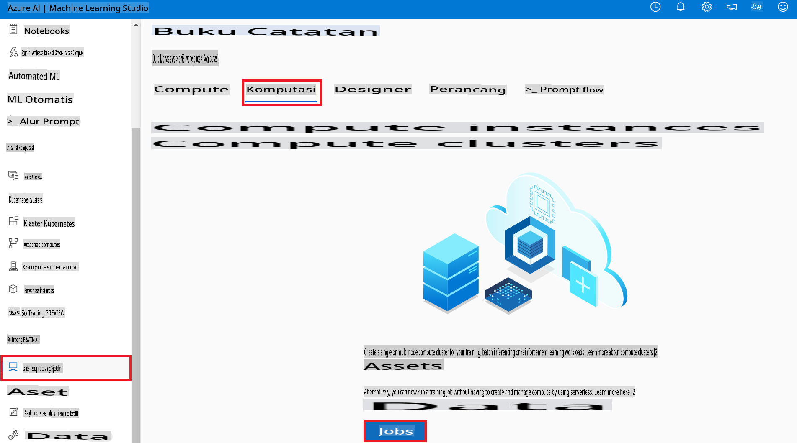

1. Lakukan tugas berikut:

    - Pilih **Region** yang ingin Anda gunakan.
    - Pilih **Virtual machine tier** menjadi **Dedicated**.
    - Pilih **Virtual machine type** menjadi **GPU**.
    - Pilih filter **Virtual machine size** menjadi **Select from all options**.
    - Pilih **Virtual machine size** menjadi **Standard_NC24ads_A100_v4**.

    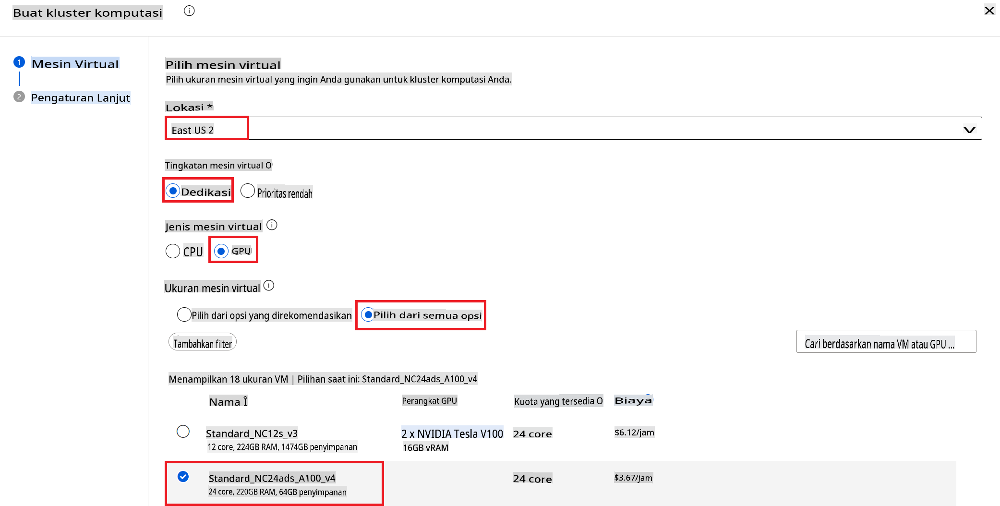

1. Pilih **Next**.

1. Lakukan tugas berikut:

    - Masukkan **Compute name**. Harus berupa nilai unik.
    - Pilih **Minimum number of nodes** menjadi **0**.
    - Pilih **Maximum number of nodes** menjadi **1**.
    - Pilih **Idle seconds before scale down** menjadi **120**.

    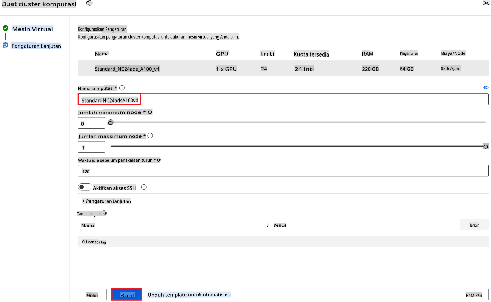

1. Pilih **Create**.

#### Fine-tune model Phi-3

1. Kunjungi [Azure ML Studio](https://ml.azure.com/home?wt.mc_id=studentamb_279723).

1. Pilih Azure Machine Learning workspace yang telah Anda buat.

    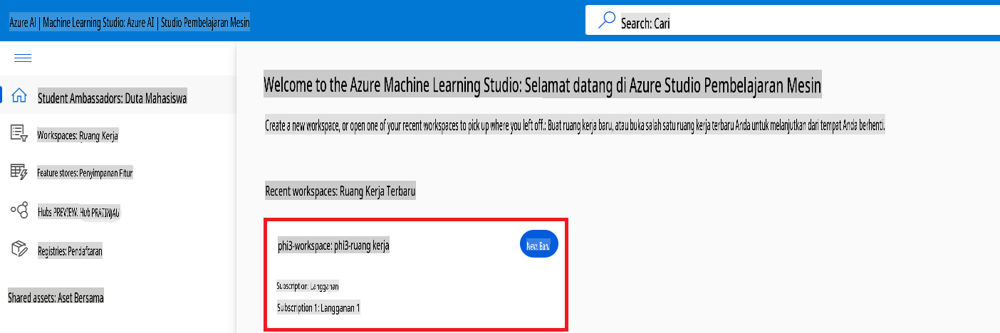

1. Lakukan tugas berikut:

    - Pilih **Model catalog** dari tab sisi kiri.
    - Ketik *phi-3-mini-4k* di **search bar** dan pilih **Phi-3-mini-4k-instruct** dari opsi yang muncul.

    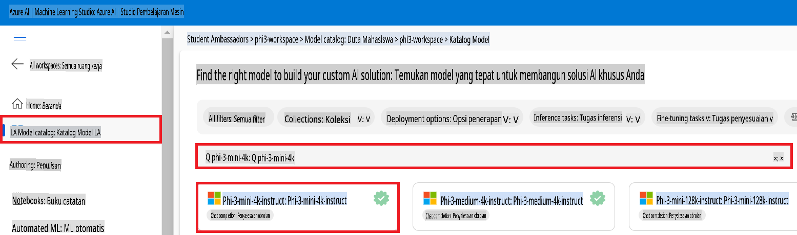

1. Pilih **Fine-tune** dari menu navigasi.

    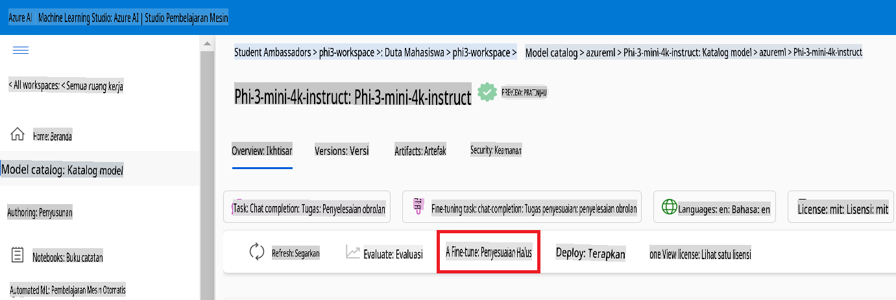

1. Lakukan tugas berikut:

    - Pilih **Select task type** menjadi **Chat completion**.
    - Pilih **+ Select data** untuk mengunggah **Training data**.
    - Pilih tipe unggahan Validation data menjadi **Provide different validation data**.
    - Pilih **+ Select data** untuk mengunggah **Validation data**.

    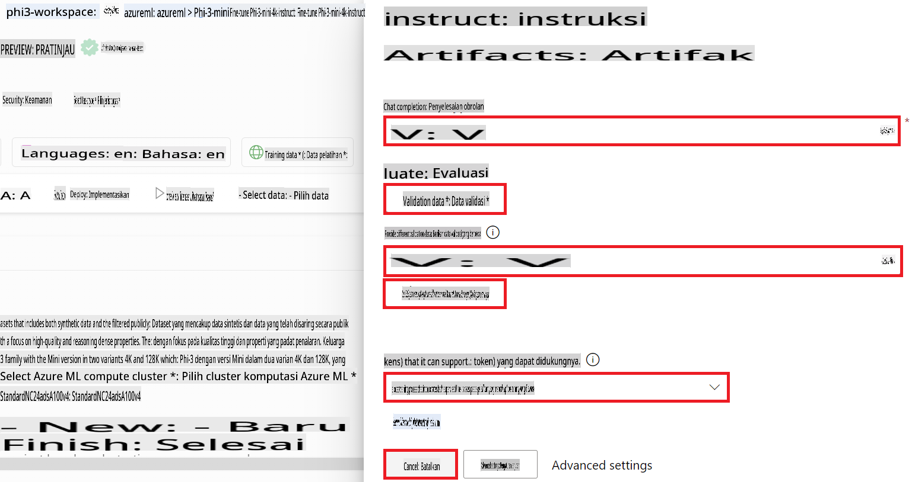

    > [!TIP]
    >
    > Anda dapat memilih **Advanced settings** untuk menyesuaikan konfigurasi seperti **learning_rate** dan **lr_scheduler_type** guna mengoptimalkan proses fine-tuning sesuai kebutuhan spesifik Anda.

1. Pilih **Finish**.

1. Dalam latihan ini, Anda berhasil melakukan fine-tune model Phi-3 menggunakan Azure Machine Learning. Harap diperhatikan bahwa proses fine-tuning dapat memakan waktu cukup lama. Setelah menjalankan pekerjaan fine-tuning, Anda perlu menunggu hingga selesai. Anda dapat memantau status pekerjaan fine-tuning dengan menavigasi ke tab Jobs di sisi kiri Azure Machine Learning Workspace Anda. Pada seri berikutnya, Anda akan melakukan deployment model yang telah di-fine-tune dan mengintegrasikannya dengan Prompt flow.

    

### Deploy model Phi-3 yang telah di-fine-tune

Untuk mengintegrasikan model Phi-3 yang telah di-fine-tune dengan Prompt flow, Anda perlu mendistribusikan model agar dapat diakses untuk inferensi real-time. Proses ini melibatkan registrasi model, pembuatan online endpoint, dan deployment model.

Dalam latihan ini, Anda akan:

- Mendaftarkan model yang telah di-fine-tune di Azure Machine Learning workspace.
- Membuat online endpoint.
- Melakukan deployment model Phi-3 yang telah di-fine-tune.

#### Mendaftarkan model yang telah di-fine-tune

1. Kunjungi [Azure ML Studio](https://ml.azure.com/home?wt.mc_id=studentamb_279723).

1. Pilih Azure Machine Learning workspace yang telah Anda buat.

    

1. Pilih **Models** dari tab sisi kiri.
1. Pilih **+ Register**.
1. Pilih **From a job output**.

    

1. Pilih pekerjaan yang telah Anda buat.

    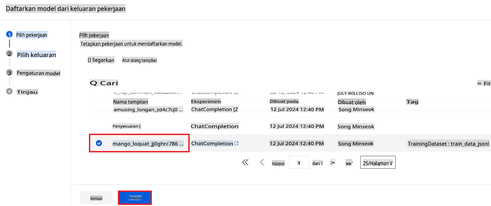

1. Pilih **Next**.

1. Pilih **Model type** menjadi **MLflow**.

1. Pastikan bahwa **Job output** telah dipilih; ini seharusnya dipilih secara otomatis.

    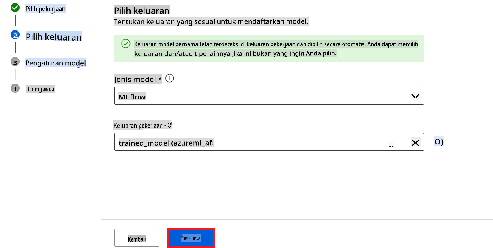

2. Pilih **Next**.

3. Pilih **Register**.

    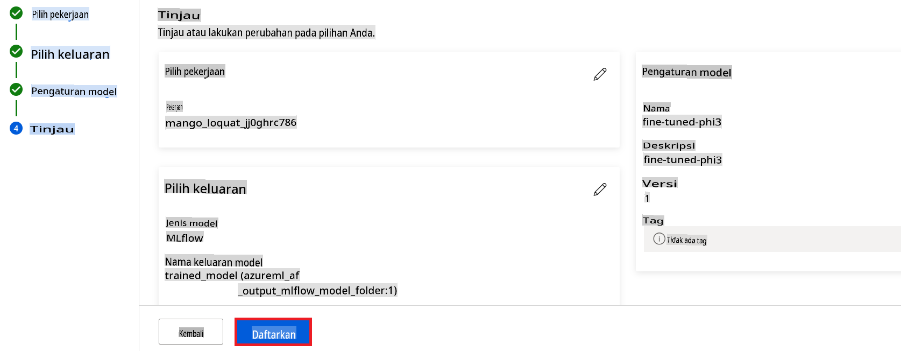

4. Anda dapat melihat model yang telah Anda daftarkan dengan menavigasi ke menu **Models** dari tab sisi kiri.

    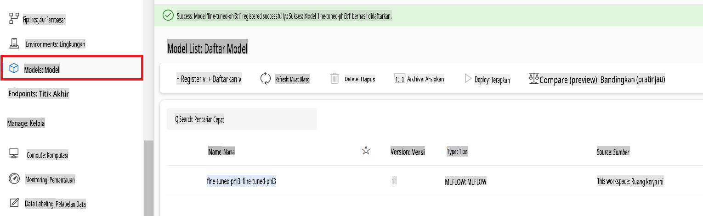

#### Deploy model yang telah di-fine-tune

1. Navigasikan ke Azure Machine Learning workspace yang telah Anda buat.

1. Pilih **Endpoints** dari tab sisi kiri.

1. Pilih **Real-time endpoints** dari menu navigasi.

    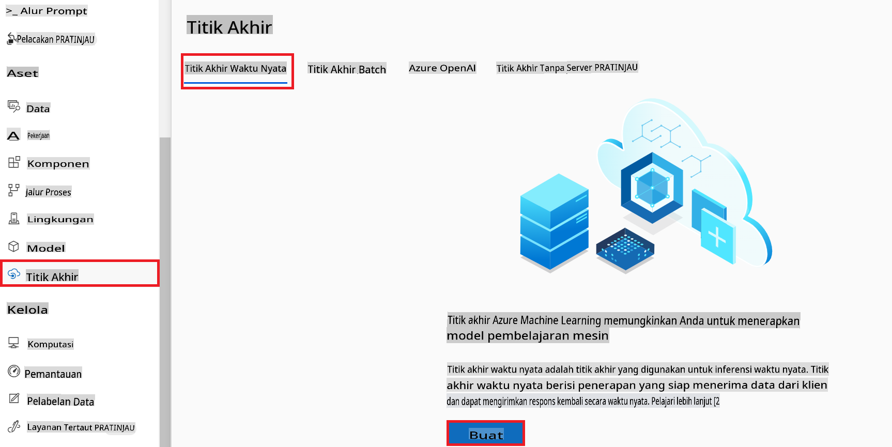

1. Pilih **Create**.

1. Pilih model yang telah Anda daftarkan.

    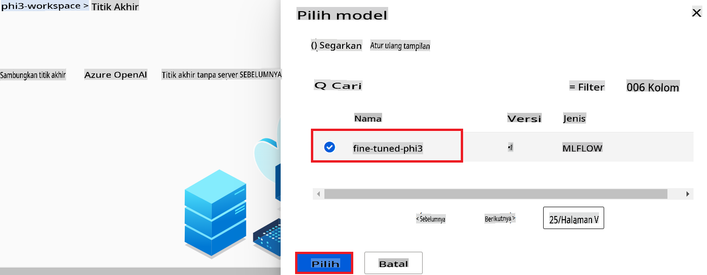

1. Pilih **Select**.

1. Lakukan tugas berikut:

    - Pilih **Virtual machine** menjadi *Standard_NC6s_v3*.
    - Pilih **Instance count** yang ingin Anda gunakan. Misalnya, *1*.
    - Pilih **Endpoint** menjadi **New** untuk membuat endpoint.
    - Masukkan **Endpoint name**. Harus berupa nilai unik.
    - Masukkan **Deployment name**. Harus berupa nilai unik.

    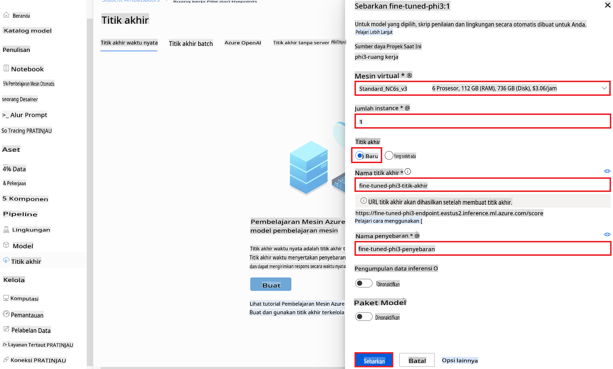

1. Pilih **Deploy**.

> [!WARNING]
> Untuk menghindari biaya tambahan pada akun Anda, pastikan untuk menghapus endpoint yang telah dibuat di Azure Machine Learning workspace.
>

#### Periksa status deployment di Azure Machine Learning Workspace

1. Navigasikan ke Azure Machine Learning workspace yang telah Anda buat.

1. Pilih **Endpoints** dari tab sisi kiri.

1. Pilih endpoint yang telah Anda buat.

    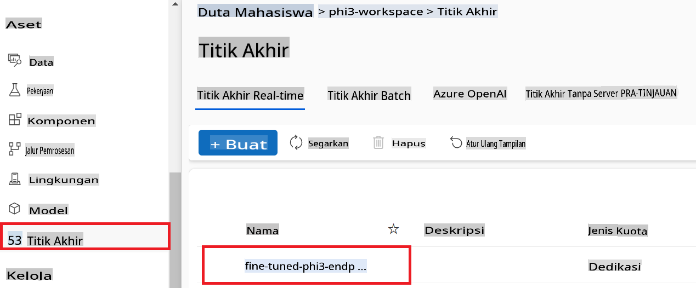

1. Pada halaman ini, Anda dapat mengelola endpoint selama proses deployment.

> [!NOTE]
> Setelah deployment selesai, pastikan bahwa **Live traffic** disetel ke **100%**. Jika tidak, pilih **Update traffic** untuk menyesuaikan pengaturan lalu lintas. Harap diperhatikan bahwa Anda tidak dapat menguji model jika lalu lintas disetel ke 0%.
>
> 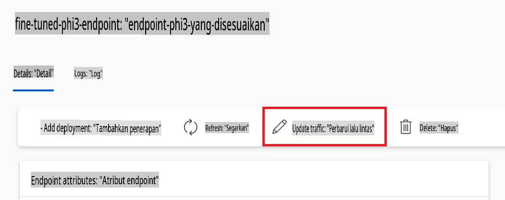
>

## Skenario 3: Integrasi dengan Prompt flow dan Berinteraksi dengan model kustom Anda di Azure AI Foundry

### Integrasikan model Phi-3 kustom dengan Prompt flow

Setelah berhasil mendistribusikan model yang telah di-fine-tune, Anda dapat mengintegrasikannya dengan Prompt Flow untuk menggunakan model Anda dalam aplikasi real-time, memungkinkan berbagai tugas interaktif dengan model Phi-3 kustom Anda.

Dalam latihan ini, Anda akan:

- Membuat Azure AI Foundry Hub.
- Membuat Azure AI Foundry Project.
- Membuat Prompt flow.
- Menambahkan koneksi kustom untuk model Phi-3 yang telah di-fine-tune.
- Menyiapkan Prompt flow untuk berinteraksi dengan model Phi-3 kustom Anda.

> [!NOTE]
> Anda juga dapat mengintegrasikan dengan Promptflow menggunakan Azure ML Studio. Proses integrasi yang sama dapat diterapkan pada Azure ML Studio.

#### Membuat Azure AI Foundry Hub

Anda perlu membuat Hub sebelum membuat Project. Hub bertindak seperti Resource Group, memungkinkan Anda mengatur dan mengelola beberapa Project dalam Azure AI Foundry.

1. Kunjungi [Azure AI Foundry](https://ai.azure.com/?WT.mc_id=aiml-137032-kinfeylo).

1. Pilih **All hubs** dari tab sisi kiri.

1. Pilih **+ New hub** dari menu navigasi.

    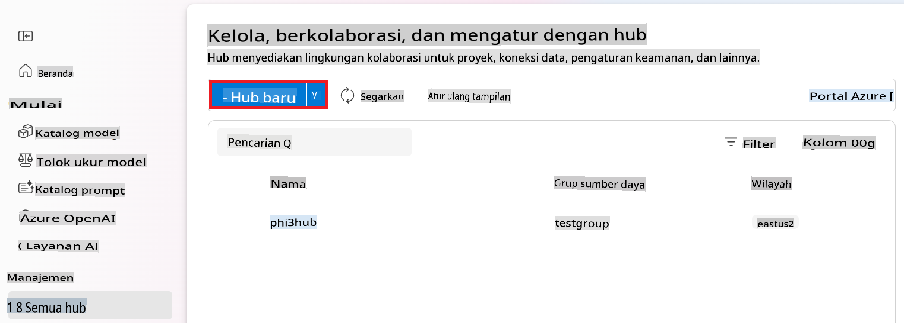

1. Lakukan tugas berikut:

    - Masukkan **Hub name**. Harus berupa nilai unik.
    - Pilih **Subscription** Azure Anda.
    - Pilih **Resource group** yang akan digunakan (buat baru jika diperlukan).
    - Pilih **Location** yang ingin Anda gunakan.
    - Pilih **Connect Azure AI Services** yang akan digunakan (buat baru jika diperlukan).
    - Pilih **Connect Azure AI Search** menjadi **Skip connecting**.

    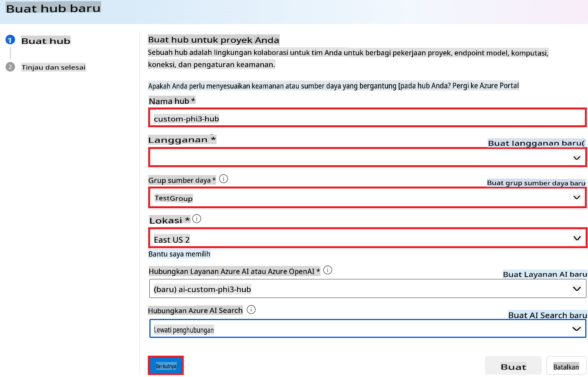

1. Pilih **Next**.

#### Membuat Azure AI Foundry Project

1. Pada Hub yang telah Anda buat, pilih **All projects** dari tab sisi kiri.

1. Pilih **+ New project** dari menu navigasi.

    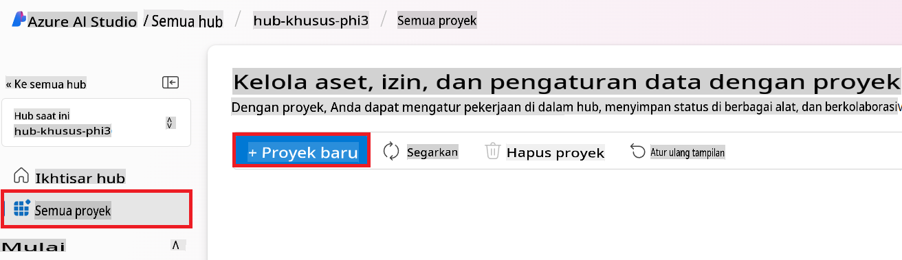

1. Masukkan **Project name**. Harus berupa nilai unik.

    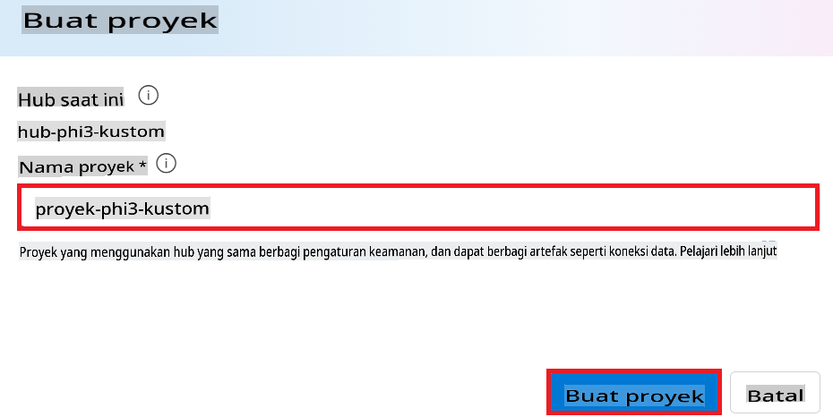

1. Pilih **Create a project**.

#### Tambahkan koneksi kustom untuk model Phi-3 yang telah di-fine-tune

Untuk mengintegrasikan model Phi-3 kustom Anda dengan Prompt flow, Anda perlu menyimpan endpoint dan kunci model dalam koneksi kustom. Pengaturan ini memastikan akses ke model Phi-3 kustom Anda di Prompt flow.

#### Atur api key dan endpoint uri dari model Phi-3 yang telah di-fine-tune

1. Kunjungi [Azure ML Studio](https://ml.azure.com/home?WT.mc_id=aiml-137032-kinfeylo).

1. Navigasikan ke Azure Machine Learning workspace yang telah Anda buat.

1. Pilih **Endpoints** dari tab sisi kiri.

    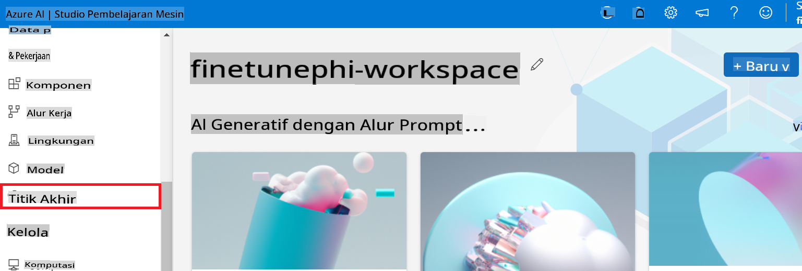

1. Pilih endpoint yang telah Anda buat.

    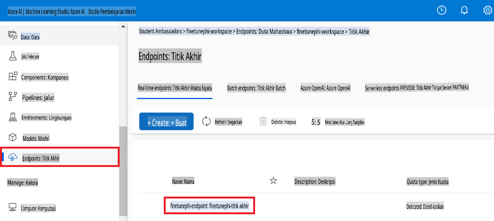

1. Pilih **Consume** dari menu navigasi.

1. Salin **REST endpoint** dan **Primary key** Anda.
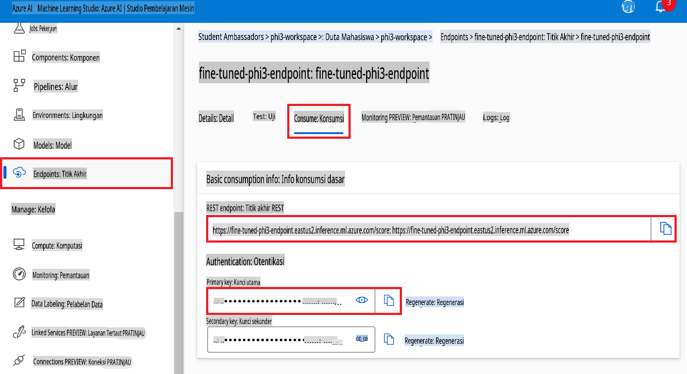

#### Tambahkan Koneksi Kustom

1. Kunjungi [Azure AI Foundry](https://ai.azure.com/?WT.mc_id=aiml-137032-kinfeylo).

1. Buka proyek Azure AI Foundry yang telah Anda buat.

1. Dalam proyek yang Anda buat, pilih **Settings** dari tab di sisi kiri.

1. Pilih **+ New connection**.

    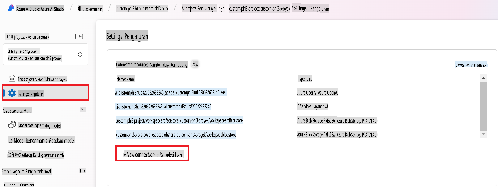

1. Pilih **Custom keys** dari menu navigasi.

    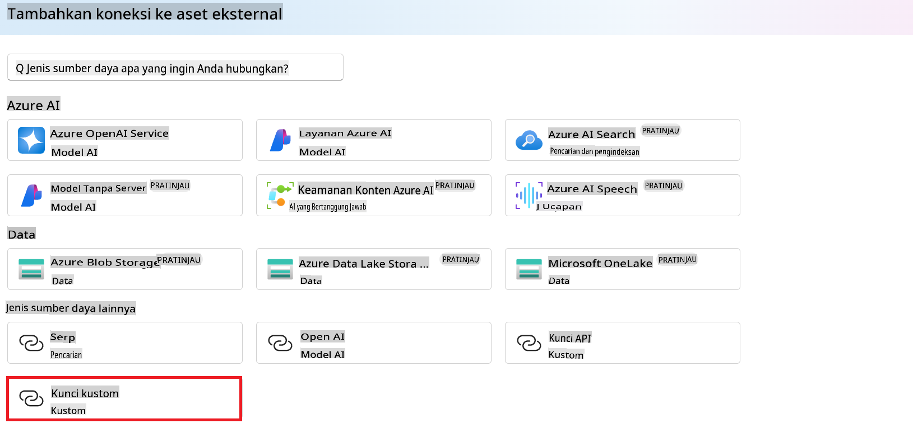

1. Lakukan langkah-langkah berikut:

    - Pilih **+ Add key value pairs**.
    - Untuk nama kunci, masukkan **endpoint** dan tempelkan endpoint yang Anda salin dari Azure ML Studio ke kolom nilai.
    - Pilih **+ Add key value pairs** lagi.
    - Untuk nama kunci, masukkan **key** dan tempelkan kunci yang Anda salin dari Azure ML Studio ke kolom nilai.
    - Setelah menambahkan kunci, pilih **is secret** untuk mencegah kunci terlihat.

    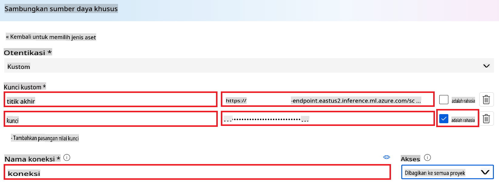

1. Pilih **Add connection**.

#### Buat Prompt flow

Anda telah menambahkan koneksi kustom di Azure AI Foundry. Sekarang, mari buat Prompt flow menggunakan langkah-langkah berikut. Kemudian, Anda akan menghubungkan Prompt flow ini ke koneksi kustom agar dapat menggunakan model yang sudah dioptimalkan dalam Prompt flow.

1. Buka proyek Azure AI Foundry yang telah Anda buat.

1. Pilih **Prompt flow** dari tab di sisi kiri.

1. Pilih **+ Create** dari menu navigasi.

    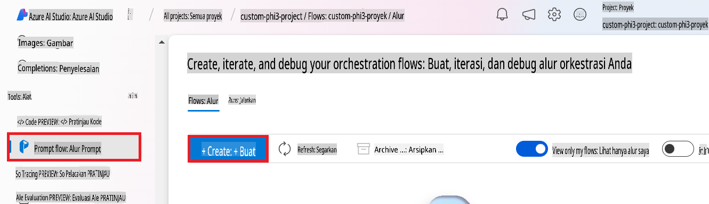

1. Pilih **Chat flow** dari menu navigasi.

    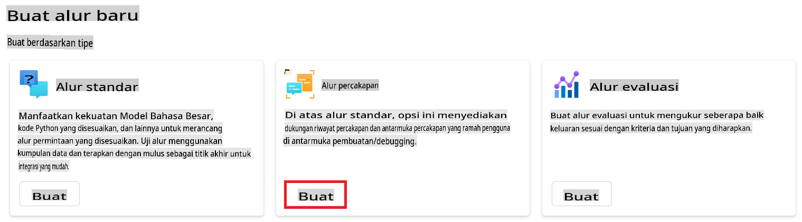

1. Masukkan **Folder name** yang akan digunakan.

    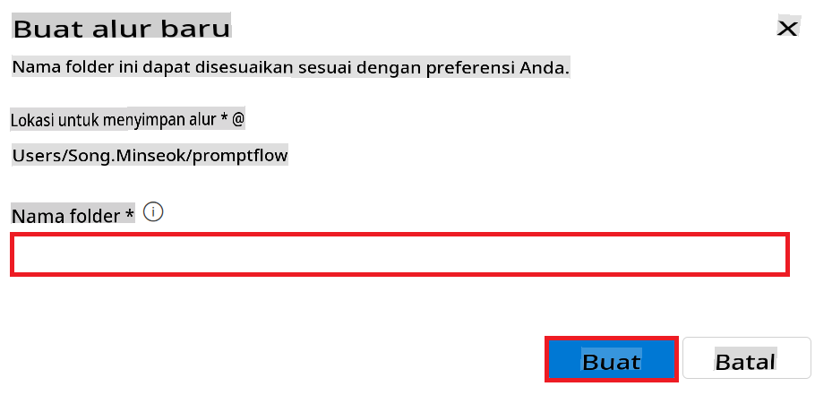

2. Pilih **Create**.

#### Atur Prompt flow untuk berinteraksi dengan model Phi-3 kustom Anda

Anda perlu mengintegrasikan model Phi-3 yang sudah dioptimalkan ke dalam Prompt flow. Namun, Prompt flow yang ada saat ini tidak dirancang untuk tujuan ini. Oleh karena itu, Anda harus mendesain ulang Prompt flow agar memungkinkan integrasi model kustom.

1. Dalam Prompt flow, lakukan langkah-langkah berikut untuk membangun ulang flow yang ada:

    - Pilih **Raw file mode**.
    - Hapus semua kode yang ada di file *flow.dag.yml*.
    - Tambahkan kode berikut ke file *flow.dag.yml*.

        ```yml
        inputs:
          input_data:
            type: string
            default: "Who founded Microsoft?"

        outputs:
          answer:
            type: string
            reference: ${integrate_with_promptflow.output}

        nodes:
        - name: integrate_with_promptflow
          type: python
          source:
            type: code
            path: integrate_with_promptflow.py
          inputs:
            input_data: ${inputs.input_data}
        ```

    - Pilih **Save**.

    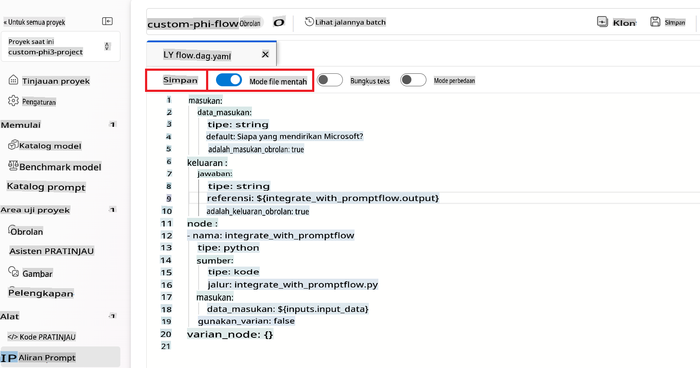

1. Tambahkan kode berikut ke file *integrate_with_promptflow.py* untuk menggunakan model Phi-3 kustom di Prompt flow.

    ```python
    import logging
    import requests
    from promptflow import tool
    from promptflow.connections import CustomConnection

    # Logging setup
    logging.basicConfig(
        format="%(asctime)s - %(levelname)s - %(name)s - %(message)s",
        datefmt="%Y-%m-%d %H:%M:%S",
        level=logging.DEBUG
    )
    logger = logging.getLogger(__name__)

    def query_phi3_model(input_data: str, connection: CustomConnection) -> str:
        """
        Send a request to the Phi-3 model endpoint with the given input data using Custom Connection.
        """

        # "connection" is the name of the Custom Connection, "endpoint", "key" are the keys in the Custom Connection
        endpoint_url = connection.endpoint
        api_key = connection.key

        headers = {
            "Content-Type": "application/json",
            "Authorization": f"Bearer {api_key}"
        }
        data = {
            "input_data": {
                "input_string": [
                    {"role": "user", "content": input_data}
                ],
                "parameters": {
                    "temperature": 0.7,
                    "max_new_tokens": 128
                }
            }
        }
        try:
            response = requests.post(endpoint_url, json=data, headers=headers)
            response.raise_for_status()
            
            # Log the full JSON response
            logger.debug(f"Full JSON response: {response.json()}")

            result = response.json()["output"]
            logger.info("Successfully received response from Azure ML Endpoint.")
            return result
        except requests.exceptions.RequestException as e:
            logger.error(f"Error querying Azure ML Endpoint: {e}")
            raise

    @tool
    def my_python_tool(input_data: str, connection: CustomConnection) -> str:
        """
        Tool function to process input data and query the Phi-3 model.
        """
        return query_phi3_model(input_data, connection)

    ```

    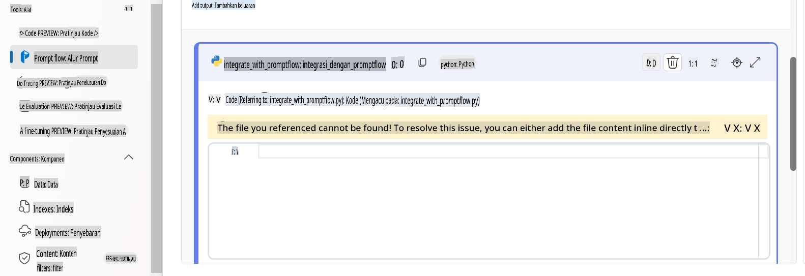

> [!NOTE]
> Untuk informasi lebih rinci tentang penggunaan Prompt flow di Azure AI Foundry, Anda dapat merujuk ke [Prompt flow di Azure AI Foundry](https://learn.microsoft.com/azure/ai-studio/how-to/prompt-flow).

1. Pilih **Chat input**, **Chat output** untuk mengaktifkan interaksi dengan model Anda.

    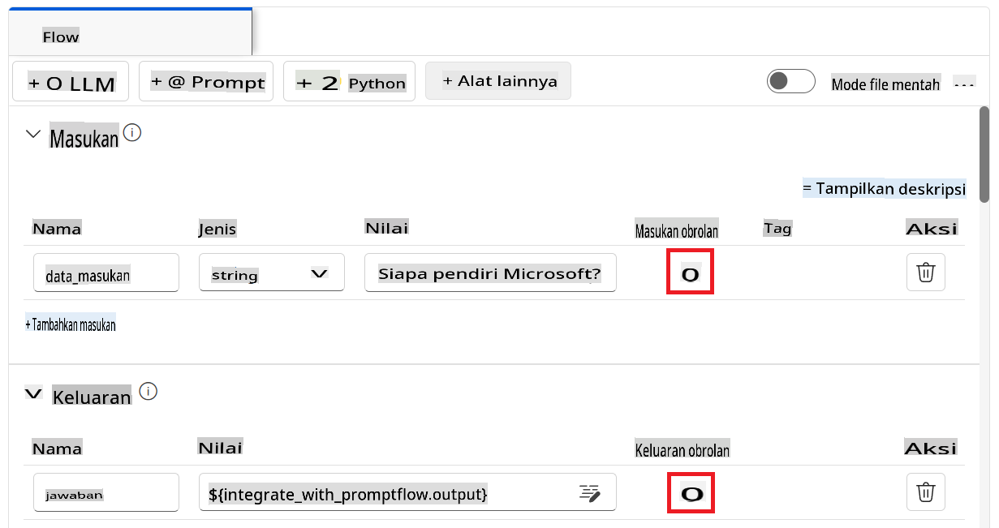

1. Sekarang Anda siap untuk berinteraksi dengan model Phi-3 kustom Anda. Dalam latihan berikutnya, Anda akan mempelajari cara memulai Prompt flow dan menggunakannya untuk berinteraksi dengan model Phi-3 yang telah dioptimalkan.

> [!NOTE]
>
> Flow yang telah dibangun ulang akan terlihat seperti gambar di bawah ini:
>
> 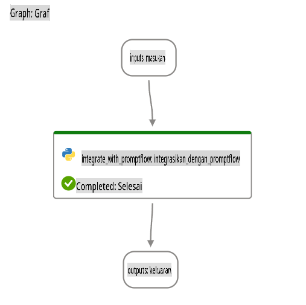
>

### Berinteraksi dengan model Phi-3 kustom Anda

Sekarang setelah Anda menyelesaikan proses optimasi dan mengintegrasikan model Phi-3 kustom Anda dengan Prompt flow, Anda siap untuk mulai berinteraksi dengannya. Latihan ini akan memandu Anda melalui proses pengaturan dan memulai interaksi dengan model Anda menggunakan Prompt flow. Dengan mengikuti langkah-langkah ini, Anda dapat sepenuhnya memanfaatkan kemampuan model Phi-3 yang telah dioptimalkan untuk berbagai tugas dan percakapan.

- Berinteraksi dengan model Phi-3 kustom Anda menggunakan Prompt flow.

#### Mulai Prompt flow

1. Pilih **Start compute sessions** untuk memulai Prompt flow.

    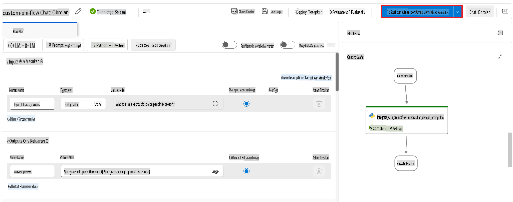

1. Pilih **Validate and parse input** untuk memperbarui parameter.

    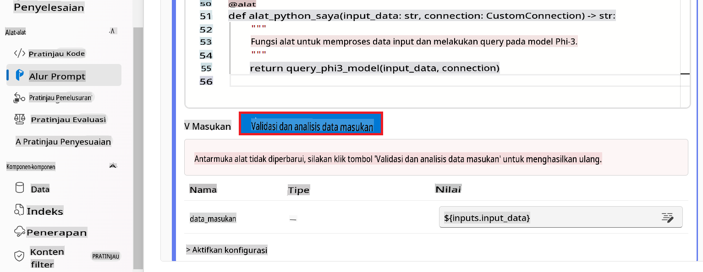

1. Pilih **Value** dari **connection** ke koneksi kustom yang Anda buat. Sebagai contoh, *connection*.

    

#### Berinteraksi dengan model kustom Anda

1. Pilih **Chat**.

    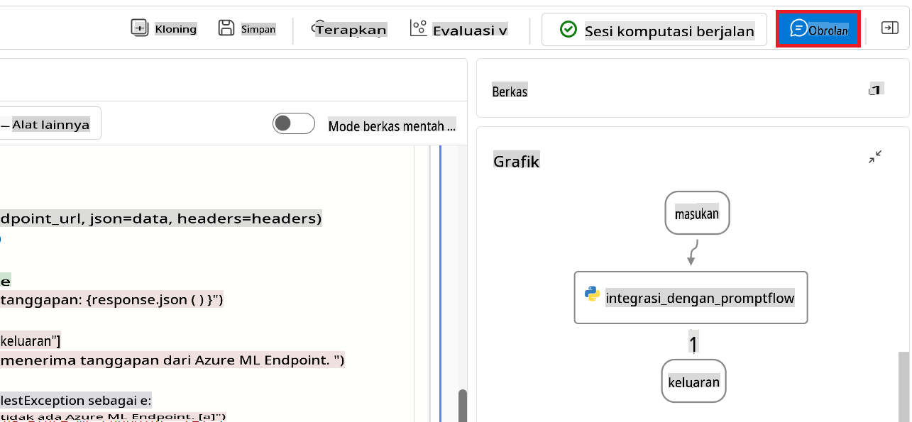

1. Berikut adalah contoh hasilnya: Sekarang Anda dapat berinteraksi dengan model Phi-3 kustom Anda. Disarankan untuk mengajukan pertanyaan berdasarkan data yang digunakan untuk proses optimasi.

    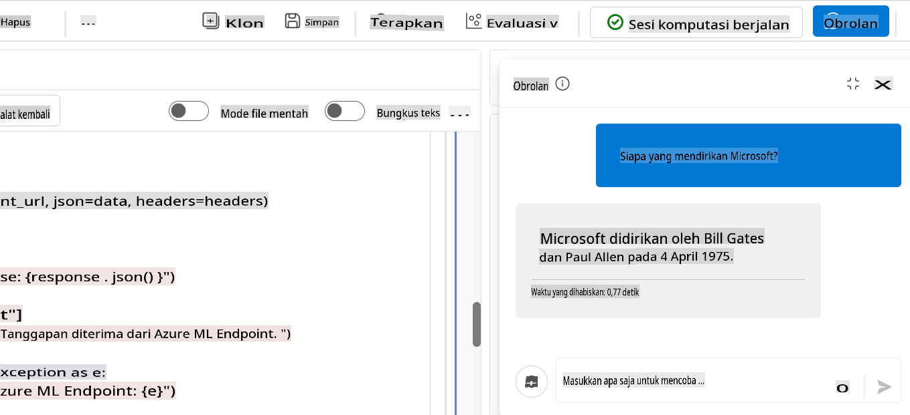

**Penafian**:  
Dokumen ini telah diterjemahkan menggunakan layanan terjemahan berbasis AI. Meskipun kami berusaha untuk mencapai akurasi, harap diketahui bahwa terjemahan otomatis dapat mengandung kesalahan atau ketidakakuratan. Dokumen asli dalam bahasa aslinya harus dianggap sebagai sumber yang berwenang. Untuk informasi yang bersifat kritis, disarankan menggunakan jasa terjemahan manusia profesional. Kami tidak bertanggung jawab atas kesalahpahaman atau interpretasi yang keliru yang timbul dari penggunaan terjemahan ini.