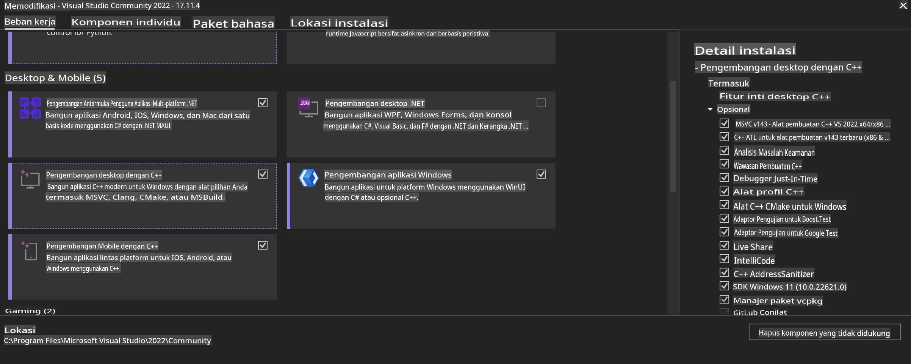
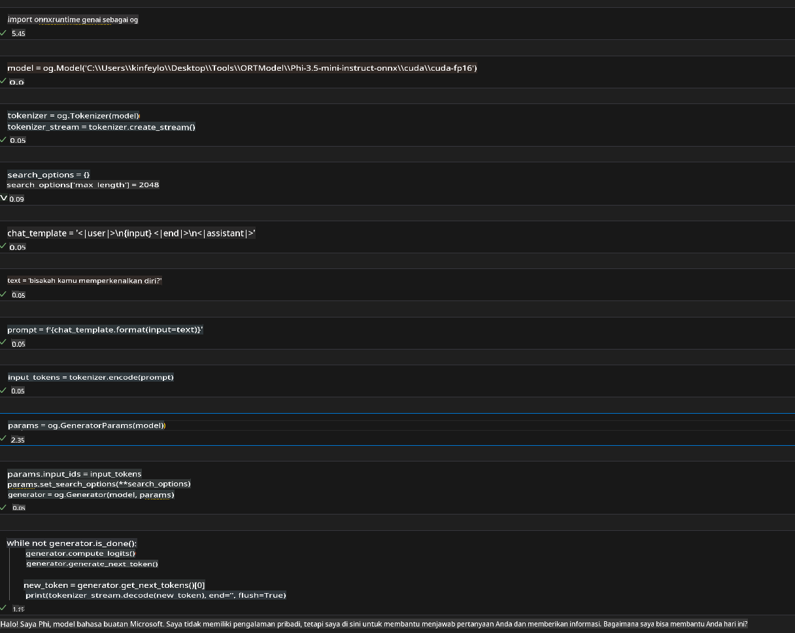
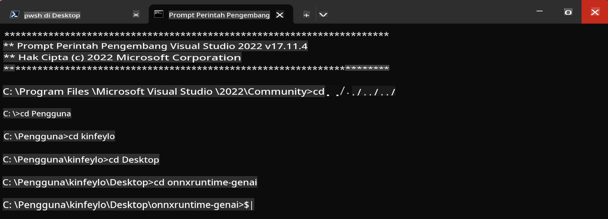

# **Panduan untuk OnnxRuntime GenAI Windows GPU**

Panduan ini memberikan langkah-langkah untuk mengatur dan menggunakan ONNX Runtime (ORT) dengan GPU di Windows. Panduan ini dirancang untuk membantu Anda memanfaatkan akselerasi GPU untuk model Anda, meningkatkan kinerja dan efisiensi.

Dokumen ini memberikan panduan tentang:

- **Pengaturan Lingkungan**: Instruksi untuk menginstal dependensi yang diperlukan seperti CUDA, cuDNN, dan ONNX Runtime.
- **Konfigurasi**: Cara mengkonfigurasi lingkungan dan ONNX Runtime untuk menggunakan sumber daya GPU secara efektif.
- **Tips Optimasi**: Saran untuk menyempurnakan pengaturan GPU Anda agar mendapatkan kinerja terbaik.

### **1. Python 3.10.x / 3.11.8**

   ***Catatan*** Disarankan menggunakan [miniforge](https://github.com/conda-forge/miniforge/releases/latest/download/Miniforge3-Windows-x86_64.exe) sebagai lingkungan Python Anda.

   ```bash

   conda create -n pydev python==3.11.8

   conda activate pydev

   ```

   ***Pengingat*** Jika Anda telah menginstal pustaka ONNX Python apa pun, harap hapus instalasinya.

### **2. Instal CMake dengan winget**

   ```bash

   winget install -e --id Kitware.CMake

   ```

### **3. Instal Visual Studio 2022 - Desktop Development dengan C++**

   ***Catatan*** Jika Anda tidak ingin melakukan kompilasi, Anda dapat melewati langkah ini.



### **4. Instal Driver NVIDIA**

1. **NVIDIA GPU Driver** [https://www.nvidia.com/en-us/drivers/](https://www.nvidia.com/en-us/drivers/)

2. **NVIDIA CUDA 12.4** [https://developer.nvidia.com/cuda-12-4-0-download-archive](https://developer.nvidia.com/cuda-12-4-0-download-archive)

3. **NVIDIA CUDNN 9.4** [https://developer.nvidia.com/cudnn-downloads](https://developer.nvidia.com/cudnn-downloads)

***Pengingat*** Gunakan pengaturan default saat proses instalasi.

### **5. Atur Lingkungan NVIDIA**

Salin file NVIDIA CUDNN 9.4 `lib`, `bin`, dan `include` ke folder NVIDIA CUDA 12.4 `lib`, `bin`, dan `include`.

- Salin file dari *'C:\Program Files\NVIDIA\CUDNN\v9.4\bin\12.6'* ke *'C:\Program Files\NVIDIA GPU Computing Toolkit\CUDA\v12.4\bin'*

- Salin file dari *'C:\Program Files\NVIDIA\CUDNN\v9.4\include\12.6'* ke *'C:\Program Files\NVIDIA GPU Computing Toolkit\CUDA\v12.4\include'*

- Salin file dari *'C:\Program Files\NVIDIA\CUDNN\v9.4\lib\12.6'* ke *'C:\Program Files\NVIDIA GPU Computing Toolkit\CUDA\v12.4\lib\x64'*

### **6. Unduh Phi-3.5-mini-instruct-onnx**

   ```bash

   winget install -e --id Git.Git

   winget install -e --id GitHub.GitLFS

   git lfs install

   git clone https://huggingface.co/microsoft/Phi-3.5-mini-instruct-onnx

   ```

### **7. Menjalankan InferencePhi35Instruct.ipynb**

   Buka [Notebook](../../../../../../code/09.UpdateSamples/Aug/ortgpu-phi35-instruct.ipynb) dan eksekusi.



### **8. Kompilasi ORT GenAI GPU**

   ***Catatan*** 
   
   1. Harap hapus instalasi semua pustaka terkait onnx, onnxruntime, dan onnxruntime-genai terlebih dahulu.

   ```bash

   pip list 
   
   ```

   Kemudian hapus semua pustaka onnxruntime, seperti:

   ```bash

   pip uninstall onnxruntime

   pip uninstall onnxruntime-genai

   pip uninstall onnxruntume-genai-cuda
   
   ```

   2. Periksa dukungan Ekstensi Visual Studio.

   Periksa folder *C:\Program Files\NVIDIA GPU Computing Toolkit\CUDA\v12.4\extras* untuk memastikan bahwa *C:\Program Files\NVIDIA GPU Computing Toolkit\CUDA\v12.4\extras\visual_studio_integration* ada.

   Jika tidak ditemukan, periksa folder toolkit CUDA lainnya dan salin folder *visual_studio_integration* beserta isinya ke *C:\Program Files\NVIDIA GPU Computing Toolkit\CUDA\v12.4\extras\visual_studio_integration*.

   - Jika Anda tidak ingin melakukan kompilasi, Anda dapat melewati langkah ini.

   ```bash

   git clone https://github.com/microsoft/onnxruntime-genai

   ```

   - Unduh [https://github.com/microsoft/onnxruntime/releases/download/v1.19.2/onnxruntime-win-x64-gpu-1.19.2.zip](https://github.com/microsoft/onnxruntime/releases/download/v1.19.2/onnxruntime-win-x64-gpu-1.19.2.zip)

   - Ekstrak file *onnxruntime-win-x64-gpu-1.19.2.zip*, lalu ubah namanya menjadi **ort**, dan salin folder **ort** ke dalam folder onnxruntime-genai.

   - Gunakan Windows Terminal, buka Developer Command Prompt untuk VS 2022, lalu navigasikan ke folder onnxruntime-genai.



   - Kompilasi menggunakan lingkungan Python Anda.

   ```bash

   cd onnxruntime-genai

   python build.py --use_cuda  --cuda_home "C:\Program Files\NVIDIA GPU Computing Toolkit\CUDA\v12.4" --config Release
 

   cd build/Windows/Release/Wheel

   pip install .whl

   ```

**Penafian**:  
Dokumen ini telah diterjemahkan menggunakan layanan terjemahan berbasis AI. Meskipun kami berusaha untuk memberikan hasil yang akurat, harap diperhatikan bahwa terjemahan otomatis mungkin mengandung kesalahan atau ketidakakuratan. Dokumen asli dalam bahasa aslinya harus dianggap sebagai sumber yang berwenang. Untuk informasi yang bersifat kritis, disarankan menggunakan jasa terjemahan manusia profesional. Kami tidak bertanggung jawab atas kesalahpahaman atau interpretasi yang keliru yang timbul dari penggunaan terjemahan ini.