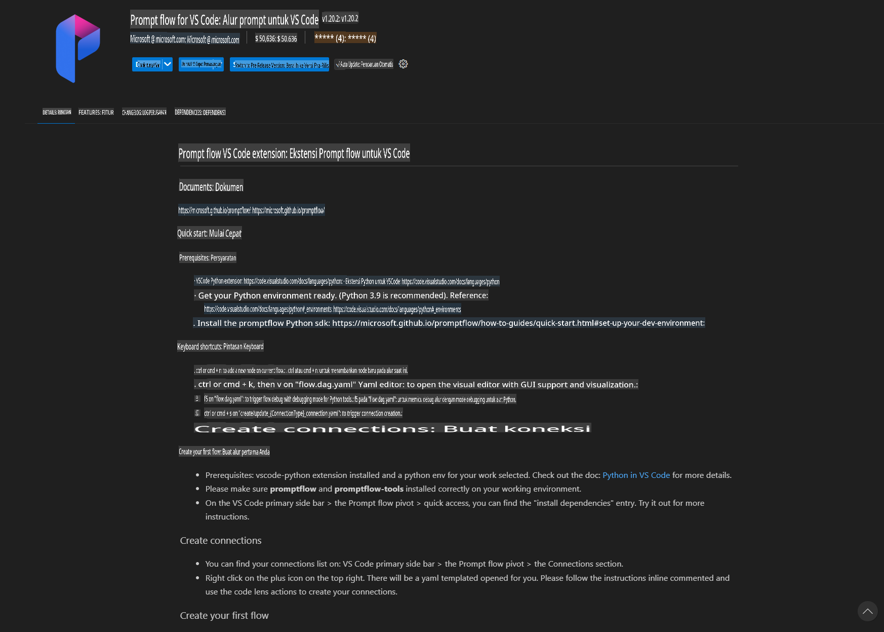
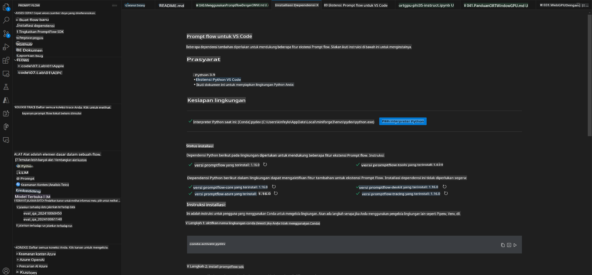
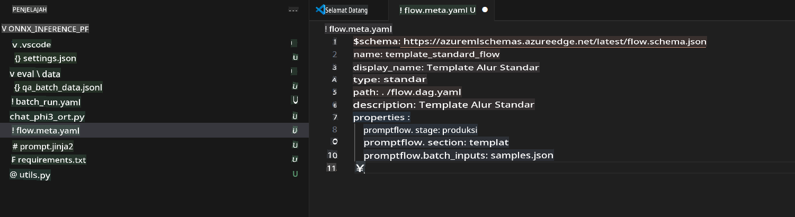
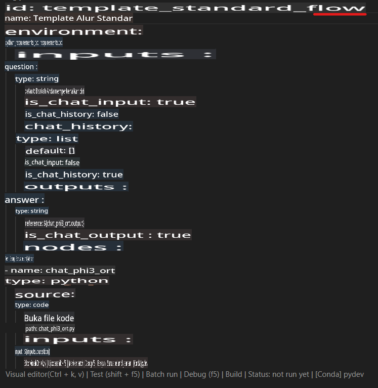
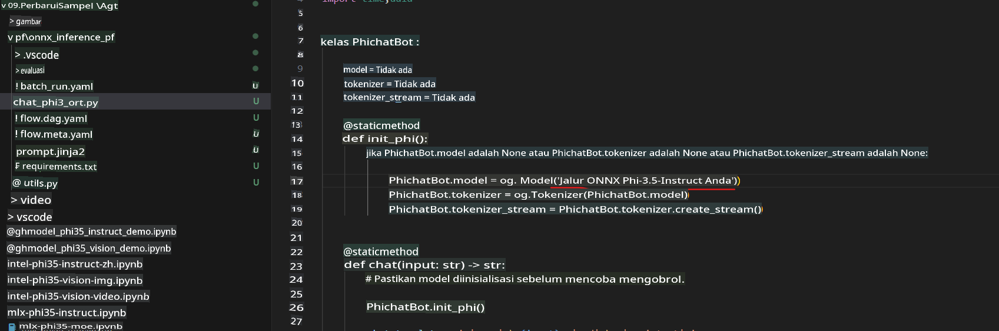
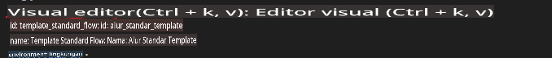
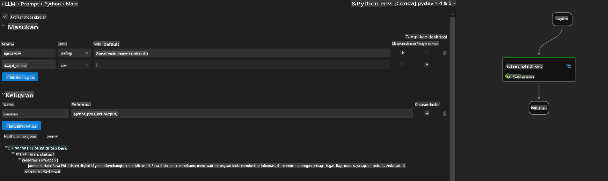
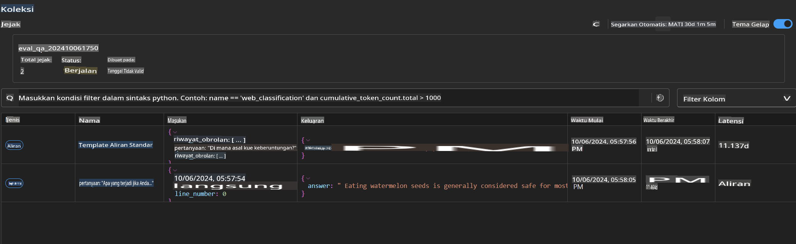

# Menggunakan GPU Windows untuk Membuat Solusi Prompt Flow dengan Phi-3.5-Instruct ONNX 

Dokumen berikut adalah contoh cara menggunakan PromptFlow dengan ONNX (Open Neural Network Exchange) untuk mengembangkan aplikasi AI berbasis model Phi-3.

PromptFlow adalah rangkaian alat pengembangan yang dirancang untuk menyederhanakan siklus pengembangan end-to-end aplikasi AI berbasis LLM (Large Language Model), mulai dari ideasi dan prototipe hingga pengujian dan evaluasi.

Dengan mengintegrasikan PromptFlow dengan ONNX, pengembang dapat:

- **Mengoptimalkan Kinerja Model**: Memanfaatkan ONNX untuk inferensi dan penerapan model yang efisien.
- **Menyederhanakan Pengembangan**: Menggunakan PromptFlow untuk mengelola alur kerja dan mengotomatisasi tugas-tugas yang berulang.
- **Meningkatkan Kolaborasi**: Memfasilitasi kolaborasi yang lebih baik antar anggota tim dengan menyediakan lingkungan pengembangan yang terintegrasi.

**Prompt flow** adalah rangkaian alat pengembangan yang dirancang untuk menyederhanakan siklus pengembangan end-to-end aplikasi AI berbasis LLM, mulai dari ideasi, prototipe, pengujian, evaluasi, hingga penerapan dan pemantauan di produksi. Alat ini membuat rekayasa prompt menjadi jauh lebih mudah dan memungkinkan Anda membangun aplikasi LLM dengan kualitas produksi.

Prompt flow dapat terhubung dengan OpenAI, Azure OpenAI Service, dan model yang dapat disesuaikan (Huggingface, LLM/SLM lokal). Kami berharap dapat menerapkan model ONNX kuantisasi Phi-3.5 ke aplikasi lokal. Prompt flow dapat membantu kami merencanakan bisnis dengan lebih baik dan menyelesaikan solusi lokal berdasarkan Phi-3.5. Dalam contoh ini, kami akan menggabungkan ONNX Runtime GenAI Library untuk menyelesaikan solusi Prompt flow berbasis GPU Windows.

## **Instalasi**

### **ONNX Runtime GenAI untuk GPU Windows**

Baca panduan ini untuk mengatur ONNX Runtime GenAI untuk GPU Windows [klik di sini](./ORTWindowGPUGuideline.md)

### **Mengatur Prompt flow di VSCode**

1. Instal Ekstensi VS Code Prompt flow



2. Setelah menginstal Ekstensi VS Code Prompt flow, klik ekstensi tersebut, dan pilih **Installation dependencies**. Ikuti panduan ini untuk menginstal Prompt flow SDK di lingkungan Anda.



3. Unduh [Kode Contoh](../../../../../../code/09.UpdateSamples/Aug/pf/onnx_inference_pf) dan gunakan VS Code untuk membuka contoh ini.



4. Buka **flow.dag.yaml** untuk memilih lingkungan Python Anda.



   Buka **chat_phi3_ort.py** untuk mengubah lokasi Model Phi-3.5-instruct ONNX Anda.



5. Jalankan Prompt flow Anda untuk pengujian.

Buka **flow.dag.yaml**, lalu klik editor visual.



Setelah mengklik ini, jalankan untuk menguji.



1. Anda dapat menjalankan batch di terminal untuk memeriksa lebih banyak hasil.

```bash

pf run create --file batch_run.yaml --stream --name 'Your eval qa name'    

```

Anda dapat memeriksa hasilnya di browser default Anda.



**Penafian**:  
Dokumen ini telah diterjemahkan menggunakan layanan penerjemahan berbasis AI. Meskipun kami berupaya untuk memberikan hasil yang akurat, harap diperhatikan bahwa terjemahan otomatis mungkin mengandung kesalahan atau ketidakakuratan. Dokumen asli dalam bahasa aslinya harus dianggap sebagai sumber yang berwenang. Untuk informasi yang bersifat kritis, disarankan menggunakan jasa penerjemahan profesional oleh manusia. Kami tidak bertanggung jawab atas kesalahpahaman atau salah tafsir yang timbul dari penggunaan terjemahan ini.