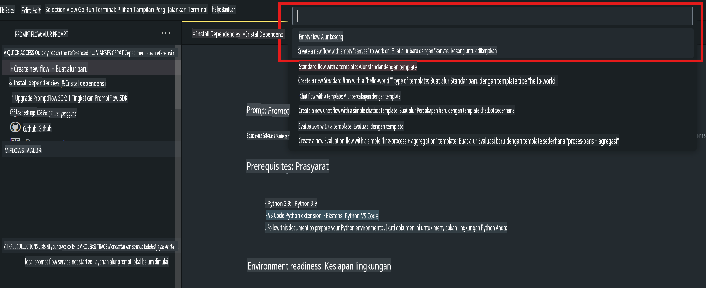
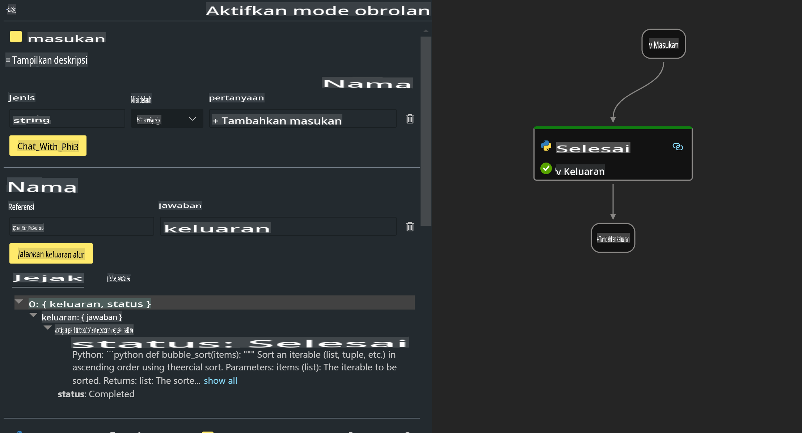

# **Lab 2 - Menjalankan Prompt flow dengan Phi-3-mini di AIPC**

## **Apa itu Prompt flow**

Prompt flow adalah serangkaian alat pengembangan yang dirancang untuk menyederhanakan siklus pengembangan aplikasi AI berbasis LLM dari awal hingga akhir, mulai dari ideasi, prototipe, pengujian, evaluasi, hingga penerapan dan pemantauan produksi. Alat ini membuat rekayasa prompt menjadi jauh lebih mudah dan memungkinkan Anda membangun aplikasi LLM dengan kualitas produksi.

Dengan prompt flow, Anda dapat:

- Membuat alur kerja yang menghubungkan LLM, prompt, kode Python, dan alat lainnya dalam sebuah alur kerja yang dapat dieksekusi.

- Melakukan debugging dan iterasi pada alur Anda, terutama interaksi dengan LLM, dengan mudah.

- Mengevaluasi alur kerja Anda, menghitung metrik kualitas dan kinerja dengan dataset yang lebih besar.

- Mengintegrasikan pengujian dan evaluasi ke dalam sistem CI/CD Anda untuk memastikan kualitas alur kerja Anda.

- Menerapkan alur kerja Anda ke platform penyajian pilihan Anda atau mengintegrasikannya ke dalam basis kode aplikasi Anda dengan mudah.

- (Opsional tetapi sangat disarankan) Berkolaborasi dengan tim Anda dengan memanfaatkan versi cloud Prompt flow di Azure AI.

## **Apa itu AIPC**

AI PC memiliki CPU, GPU, dan NPU, masing-masing dengan kemampuan akselerasi AI tertentu. NPU, atau neural processing unit, adalah akselerator khusus yang menangani tugas-tugas kecerdasan buatan (AI) dan pembelajaran mesin (ML) langsung di PC Anda tanpa perlu mengirim data untuk diproses di cloud. GPU dan CPU juga dapat memproses beban kerja ini, tetapi NPU sangat baik dalam perhitungan AI berdaya rendah. AI PC mewakili perubahan mendasar dalam cara komputer kita beroperasi. Ini bukan solusi untuk masalah yang sebelumnya tidak ada, tetapi menjanjikan peningkatan besar untuk penggunaan PC sehari-hari.

Bagaimana cara kerjanya? Dibandingkan dengan AI generatif dan model bahasa besar (LLM) yang dilatih pada banyak data publik, AI yang dijalankan di PC Anda lebih mudah diakses di hampir semua level. Konsepnya lebih mudah dipahami, dan karena dilatih pada data Anda sendiri tanpa perlu mengakses cloud, manfaatnya lebih menarik dan relevan bagi lebih banyak orang.

Dalam waktu dekat, dunia AI PC mencakup asisten pribadi dan model AI yang lebih kecil yang berjalan langsung di PC Anda, menggunakan data Anda untuk menawarkan peningkatan AI yang personal, privat, dan lebih aman untuk aktivitas yang sudah Anda lakukan setiap hari – seperti mencatat notulen rapat, mengatur liga fantasi sepak bola, mengotomatisasi peningkatan untuk pengeditan foto dan video, atau menyusun rencana perjalanan yang sempurna untuk reuni keluarga berdasarkan waktu kedatangan dan keberangkatan semua orang.

## **Membangun alur kode generasi di AIPC**

***Catatan***: Jika Anda belum menyelesaikan instalasi lingkungan, silakan kunjungi [Lab 0 - Installations](./01.Installations.md)

1. Buka Ekstensi Prompt flow di Visual Studio Code dan buat proyek alur kerja kosong.



2. Tambahkan parameter Input dan Output serta tambahkan Kode Python sebagai alur kerja baru.



Anda dapat merujuk ke struktur ini (flow.dag.yaml) untuk membangun alur kerja Anda.

```yaml

inputs:
  question:
    type: string
    default: how to write Bubble Algorithm
outputs:
  answer:
    type: string
    reference: ${Chat_With_Phi3.output}
nodes:
- name: Chat_With_Phi3
  type: python
  source:
    type: code
    path: Chat_With_Phi3.py
  inputs:
    question: ${inputs.question}


```

3. Tambahkan kode dalam ***Chat_With_Phi3.py***.

```python


from promptflow.core import tool

# import torch
from transformers import AutoTokenizer, pipeline,TextStreamer
import intel_npu_acceleration_library as npu_lib

import warnings

import asyncio
import platform

class Phi3CodeAgent:
    
    model = None
    tokenizer = None
    text_streamer = None
    
    model_id = "microsoft/Phi-3-mini-4k-instruct"

    @staticmethod
    def init_phi3():
        
        if Phi3CodeAgent.model is None or Phi3CodeAgent.tokenizer is None or Phi3CodeAgent.text_streamer is None:
            Phi3CodeAgent.model = npu_lib.NPUModelForCausalLM.from_pretrained(
                                    Phi3CodeAgent.model_id,
                                    torch_dtype="auto",
                                    dtype=npu_lib.int4,
                                    trust_remote_code=True
                                )
            Phi3CodeAgent.tokenizer = AutoTokenizer.from_pretrained(Phi3CodeAgent.model_id)
            Phi3CodeAgent.text_streamer = TextStreamer(Phi3CodeAgent.tokenizer, skip_prompt=True)

    

    @staticmethod
    def chat_with_phi3(prompt):
        
        Phi3CodeAgent.init_phi3()

        messages = "<|system|>You are a AI Python coding assistant. Please help me to generate code in Python.The answer only genertated Python code, but any comments and instructions do not need to be generated<|end|><|user|>" + prompt +"<|end|><|assistant|>"


        generation_args = {
            "max_new_tokens": 1024,
            "return_full_text": False,
            "temperature": 0.3,
            "do_sample": False,
            "streamer": Phi3CodeAgent.text_streamer,
        }

        pipe = pipeline(
            "text-generation",
            model=Phi3CodeAgent.model,
            tokenizer=Phi3CodeAgent.tokenizer,
            # **generation_args
        )

        result = ''

        with warnings.catch_warnings():
            warnings.simplefilter("ignore")
            response = pipe(messages, **generation_args)
            result =response[0]['generated_text']
            return result


@tool
def my_python_tool(question: str) -> str:
    if platform.system() == 'Windows':
        asyncio.set_event_loop_policy(asyncio.WindowsSelectorEventLoopPolicy())
    return Phi3CodeAgent.chat_with_phi3(question)


```

4. Anda dapat menguji alur kerja dari Debug atau Run untuk memeriksa apakah kode generasi berfungsi dengan baik.


5. Jalankan alur kerja sebagai API pengembangan di terminal.

```

pf flow serve --source ./ --port 8080 --host localhost   

```

Anda dapat mengujinya di Postman / Thunder Client.

### **Catatan**

1. Jalankan pertama kali memakan waktu lama. Disarankan untuk mengunduh model phi-3 dari Hugging Face CLI.

2. Mengingat keterbatasan daya komputasi Intel NPU, disarankan untuk menggunakan Phi-3-mini-4k-instruct.

3. Kami menggunakan Akselerasi Intel NPU untuk konversi kuantisasi INT4, tetapi jika Anda menjalankan ulang layanan, Anda perlu menghapus cache dan folder nc_workshop.

## **Sumber Daya**

1. Pelajari Promptflow [https://microsoft.github.io/promptflow/](https://microsoft.github.io/promptflow/)

2. Pelajari Akselerasi Intel NPU [https://github.com/intel/intel-npu-acceleration-library](https://github.com/intel/intel-npu-acceleration-library)

3. Kode Contoh, unduh [Local NPU Agent Sample Code](../../../../../../../../../code/07.Lab/01/AIPC)

**Penafian**:  
Dokumen ini telah diterjemahkan menggunakan layanan terjemahan berbasis AI. Meskipun kami berupaya untuk memberikan terjemahan yang akurat, harap diperhatikan bahwa terjemahan otomatis mungkin mengandung kesalahan atau ketidakakuratan. Dokumen asli dalam bahasa aslinya harus dianggap sebagai sumber yang berwenang. Untuk informasi yang bersifat krusial, disarankan menggunakan jasa terjemahan manusia profesional. Kami tidak bertanggung jawab atas kesalahpahaman atau interpretasi yang keliru yang timbul dari penggunaan terjemahan ini.