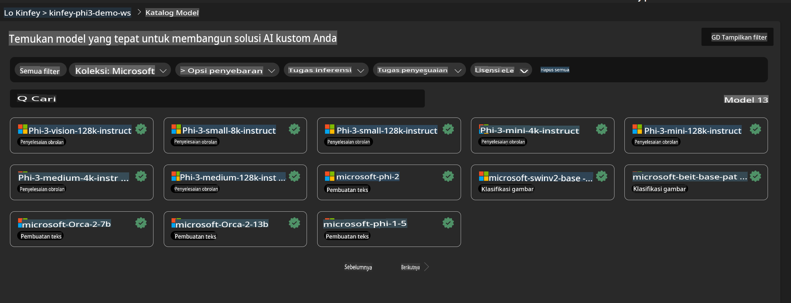
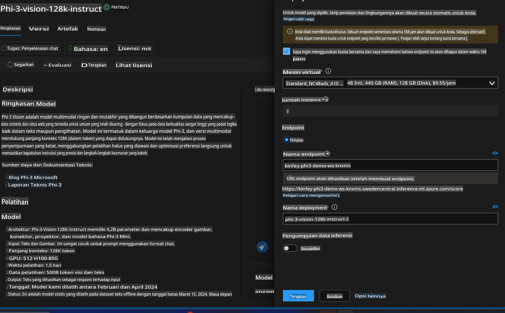
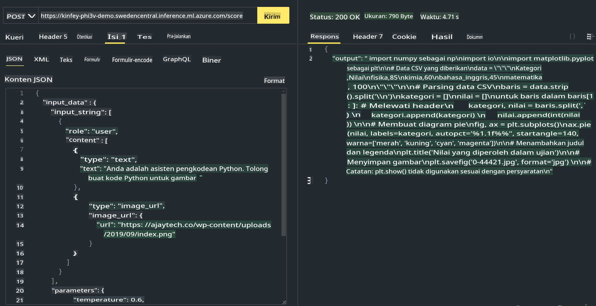

# **Lab 3 - Mendeploy Phi-3-Vision di Azure Machine Learning Service**

Kita menggunakan NPU untuk menyelesaikan deployment produksi dari kode lokal, lalu kita ingin memperkenalkan kemampuan PHI-3-VISION melalui itu untuk menghasilkan kode dari gambar.

Dalam pengenalan ini, kita dapat dengan cepat membangun layanan Model As Service Phi-3 Vision di Azure Machine Learning Service.

***Catatan***: Phi-3 Vision memerlukan daya komputasi untuk menghasilkan konten dengan kecepatan lebih tinggi. Kita memerlukan daya komputasi cloud untuk membantu mewujudkannya.

### **1. Buat Azure Machine Learning Service**

Kita perlu membuat Azure Machine Learning Service di Azure Portal. Jika Anda ingin mempelajari caranya, silakan kunjungi tautan ini [https://learn.microsoft.com/azure/machine-learning/quickstart-create-resources?view=azureml-api-2](https://learn.microsoft.com/azure/machine-learning/quickstart-create-resources?view=azureml-api-2)

### **2. Pilih Phi-3 Vision di Azure Machine Learning Service**



### **3. Deploy Phi-3-Vision di Azure**



### **4. Uji Endpoint di Postman**



***Catatan***

1. Parameter yang harus dikirimkan harus mencakup Authorization, azureml-model-deployment, dan Content-Type. Anda perlu memeriksa informasi deployment untuk mendapatkannya.

2. Untuk mengirimkan parameter, Phi-3-Vision memerlukan pengiriman tautan gambar. Silakan merujuk pada metode GPT-4-Vision untuk mengirimkan parameter, seperti

```json

{
  "input_data":{
    "input_string":[
      {
        "role":"user",
        "content":[ 
          {
            "type": "text",
            "text": "You are a Python coding assistant.Please create Python code for image "
          },
          {
              "type": "image_url",
              "image_url": {
                "url": "https://ajaytech.co/wp-content/uploads/2019/09/index.png"
              }
          }
        ]
      }
    ],
    "parameters":{
          "temperature": 0.6,
          "top_p": 0.9,
          "do_sample": false,
          "max_new_tokens": 2048
    }
  }
}

```

3. Panggil **/score** menggunakan metode Post

**Selamat**! Anda telah menyelesaikan deployment PHI-3-VISION dengan cepat dan mencoba cara menggunakan gambar untuk menghasilkan kode. Selanjutnya, kita dapat membangun aplikasi dengan menggabungkan NPU dan cloud.

**Penafian**:  
Dokumen ini telah diterjemahkan menggunakan layanan terjemahan berbasis AI. Meskipun kami berusaha untuk memberikan terjemahan yang akurat, harap diperhatikan bahwa terjemahan otomatis mungkin mengandung kesalahan atau ketidakakuratan. Dokumen asli dalam bahasa aslinya harus dianggap sebagai sumber yang berwenang. Untuk informasi yang bersifat kritis, disarankan menggunakan jasa terjemahan manusia profesional. Kami tidak bertanggung jawab atas kesalahpahaman atau salah tafsir yang timbul dari penggunaan terjemahan ini.