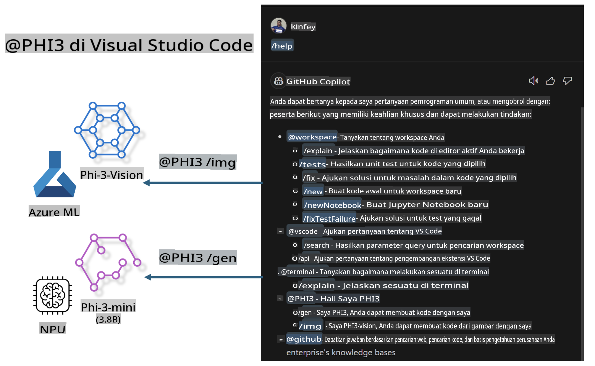

# **Bangun Visual Studio Code GitHub Copilot Chat Anda Sendiri dengan Microsoft Phi-3 Family**

Pernah menggunakan agen workspace di GitHub Copilot Chat? Apakah Anda ingin membuat agen kode untuk tim Anda sendiri? Lab praktis ini bertujuan untuk menggabungkan model open source guna membangun agen bisnis kode tingkat perusahaan.

## **Dasar**

### **Mengapa Memilih Microsoft Phi-3**

Phi-3 adalah seri keluarga, termasuk phi-3-mini, phi-3-small, dan phi-3-medium berdasarkan parameter pelatihan yang berbeda untuk pembuatan teks, penyelesaian dialog, dan pembuatan kode. Ada juga phi-3-vision yang berbasis Vision. Model ini cocok untuk perusahaan atau tim berbeda dalam menciptakan solusi AI generatif offline.

Disarankan membaca tautan ini [https://github.com/microsoft/PhiCookBook/blob/main/md/01.Introduction/01/01.PhiFamily.md](https://github.com/microsoft/PhiCookBook/blob/main/md/01.Introduction/01/01.PhiFamily.md)

### **Microsoft GitHub Copilot Chat**

Ekstensi GitHub Copilot Chat memberikan antarmuka obrolan yang memungkinkan Anda berinteraksi dengan GitHub Copilot dan menerima jawaban atas pertanyaan terkait pengkodean langsung di dalam VS Code, tanpa perlu mencari dokumentasi atau menjelajahi forum online.

Copilot Chat dapat menggunakan penyorotan sintaks, indentasi, dan fitur pemformatan lainnya untuk menambah kejelasan pada respons yang dihasilkan. Bergantung pada jenis pertanyaan dari pengguna, hasilnya dapat berisi tautan ke konteks yang digunakan Copilot untuk menghasilkan respons, seperti file kode sumber atau dokumentasi, atau tombol untuk mengakses fungsi VS Code.

- Copilot Chat terintegrasi dalam alur kerja pengembang Anda dan memberikan bantuan di tempat yang Anda butuhkan:

- Mulai percakapan obrolan langsung dari editor atau terminal untuk mendapatkan bantuan saat Anda sedang mengoding

- Gunakan tampilan Chat untuk memiliki asisten AI di sisi Anda kapan saja

- Luncurkan Quick Chat untuk mengajukan pertanyaan singkat dan kembali ke aktivitas Anda

Anda dapat menggunakan GitHub Copilot Chat dalam berbagai skenario, seperti:

- Menjawab pertanyaan pengkodean tentang cara terbaik menyelesaikan masalah

- Menjelaskan kode orang lain dan menyarankan perbaikan

- Mengusulkan perbaikan kode

- Membuat kasus uji unit

- Menghasilkan dokumentasi kode

Disarankan membaca tautan ini [https://code.visualstudio.com/docs/copilot/copilot-chat](https://code.visualstudio.com/docs/copilot/copilot-chat?WT.mc_id=aiml-137032-kinfeylo)

### **Microsoft GitHub Copilot Chat @workspace**

Referensi **@workspace** di Copilot Chat memungkinkan Anda mengajukan pertanyaan tentang seluruh basis kode Anda. Berdasarkan pertanyaan, Copilot secara cerdas mengambil file dan simbol yang relevan, yang kemudian dirujuk dalam jawabannya sebagai tautan dan contoh kode.

Untuk menjawab pertanyaan Anda, **@workspace** mencari melalui sumber yang sama yang akan digunakan pengembang saat menjelajahi basis kode di VS Code:

- Semua file di dalam workspace, kecuali file yang diabaikan oleh file .gitignore

- Struktur direktori dengan folder bersarang dan nama file

- Indeks pencarian kode GitHub, jika workspace adalah repositori GitHub dan diindeks oleh pencarian kode

- Simbol dan definisi dalam workspace

- Teks yang saat ini dipilih atau teks yang terlihat di editor aktif

Catatan: .gitignore akan dilewati jika Anda membuka file atau memilih teks dalam file yang diabaikan.

Disarankan membaca tautan ini [[https://code.visualstudio.com/docs/copilot/copilot-chat](https://code.visualstudio.com/docs/copilot/workspace-context?WT.mc_id=aiml-137032-kinfeylo)]

## **Pelajari Lebih Lanjut tentang Lab Ini**

GitHub Copilot telah meningkatkan efisiensi pemrograman perusahaan secara signifikan, dan setiap perusahaan berharap dapat menyesuaikan fungsi GitHub Copilot yang relevan. Banyak perusahaan telah menyesuaikan Ekstensi serupa dengan GitHub Copilot berdasarkan skenario bisnis mereka sendiri dan model open source. Bagi perusahaan, Ekstensi yang disesuaikan lebih mudah dikontrol, tetapi ini juga memengaruhi pengalaman pengguna. Bagaimanapun, GitHub Copilot memiliki fungsi yang lebih kuat dalam menangani skenario umum dan profesionalisme. Jika pengalaman dapat tetap konsisten, akan lebih baik untuk menyesuaikan Ekstensi perusahaan sendiri. GitHub Copilot Chat menyediakan API yang relevan bagi perusahaan untuk memperluas pengalaman Chat. Mempertahankan pengalaman yang konsisten dan memiliki fungsi yang disesuaikan memberikan pengalaman pengguna yang lebih baik.

Lab ini terutama menggunakan model Phi-3 yang dikombinasikan dengan NPU lokal dan Azure hybrid untuk membangun Agen khusus di GitHub Copilot Chat ***@PHI3*** untuk membantu pengembang perusahaan menyelesaikan pembuatan kode ***(@PHI3 /gen)*** dan menghasilkan kode berdasarkan gambar ***(@PHI3 /img)***.

### ***Catatan:*** 

Lab ini saat ini diimplementasikan di AIPC Intel CPU dan Apple Silicon. Kami akan terus memperbarui versi Qualcomm dari NPU.

## **Lab**

| Nama | Deskripsi | AIPC | Apple |
| ------------ | ----------- | -------- |-------- |
| Lab0 - Installations(✅) | Konfigurasi dan instalasi lingkungan terkait dan alat instalasi | [Go](./HOL/AIPC/01.Installations.md) |[Go](./HOL/Apple/01.Installations.md) |
| Lab1 - Jalankan Prompt flow dengan Phi-3-mini (✅) | Dikombinasikan dengan AIPC / Apple Silicon, menggunakan NPU lokal untuk membuat pembuatan kode melalui Phi-3-mini | [Go](./HOL/AIPC/02.PromptflowWithNPU.md) |  [Go](./HOL/Apple/02.PromptflowWithMLX.md) |
| Lab2 - Deploy Phi-3-vision di Azure Machine Learning Service(✅) | Menghasilkan kode dengan menerapkan Phi-3-vision image dari Model Catalog Azure Machine Learning Service | [Go](./HOL/AIPC/03.DeployPhi3VisionOnAzure.md) |[Go](./HOL/Apple/03.DeployPhi3VisionOnAzure.md) |
| Lab3 - Buat agen @phi-3 di GitHub Copilot Chat(✅)  | Buat agen Phi-3 khusus di GitHub Copilot Chat untuk menyelesaikan pembuatan kode, pembuatan kode grafik, RAG, dll. | [Go](./HOL/AIPC/04.CreatePhi3AgentInVSCode.md) | [Go](./HOL/Apple/04.CreatePhi3AgentInVSCode.md) |
| Kode Contoh (✅)  | Unduh kode contoh | [Go](../../../../../../../code/07.Lab/01/AIPC) | [Go](../../../../../../../code/07.Lab/01/Apple) |

## **Sumber Daya**

1. Phi-3 Cookbook [https://github.com/microsoft/Phi-3CookBook](https://github.com/microsoft/Phi-3CookBook)

2. Pelajari lebih lanjut tentang GitHub Copilot [https://learn.microsoft.com/training/paths/copilot/](https://learn.microsoft.com/training/paths/copilot/?WT.mc_id=aiml-137032-kinfeylo)

3. Pelajari lebih lanjut tentang GitHub Copilot Chat [https://learn.microsoft.com/training/paths/accelerate-app-development-using-github-copilot/](https://learn.microsoft.com/training/paths/accelerate-app-development-using-github-copilot/?WT.mc_id=aiml-137032-kinfeylo)

4. Pelajari lebih lanjut tentang API GitHub Copilot Chat [https://code.visualstudio.com/api/extension-guides/chat](https://code.visualstudio.com/api/extension-guides/chat?WT.mc_id=aiml-137032-kinfeylo)

5. Pelajari lebih lanjut tentang Azure AI Foundry [https://learn.microsoft.com/training/paths/create-custom-copilots-ai-studio/](https://learn.microsoft.com/training/paths/create-custom-copilots-ai-studio/?WT.mc_id=aiml-137032-kinfeylo)

6. Pelajari lebih lanjut tentang Model Catalog Azure AI Foundry [https://learn.microsoft.com/azure/ai-studio/how-to/model-catalog-overview](https://learn.microsoft.com/azure/ai-studio/how-to/model-catalog-overview)

**Penafian**:  
Dokumen ini telah diterjemahkan menggunakan layanan penerjemahan berbasis AI. Meskipun kami berusaha untuk memberikan hasil yang akurat, harap diperhatikan bahwa terjemahan otomatis mungkin mengandung kesalahan atau ketidakakuratan. Dokumen asli dalam bahasa aslinya harus dianggap sebagai sumber yang otoritatif. Untuk informasi yang bersifat krusial, disarankan menggunakan jasa penerjemah manusia profesional. Kami tidak bertanggung jawab atas kesalahpahaman atau salah tafsir yang timbul dari penggunaan terjemahan ini.