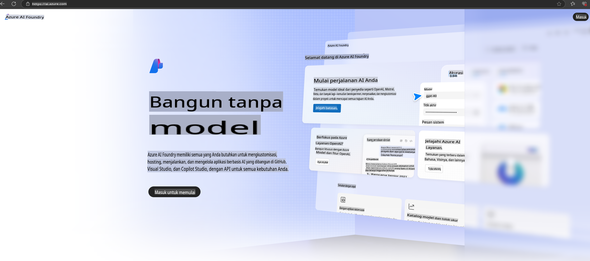

# **Menggunakan Phi-3 di Azure AI Foundry**

Dengan berkembangnya Generative AI, kami berharap dapat menggunakan platform terpadu untuk mengelola berbagai LLM dan SLM, integrasi data perusahaan, operasi fine-tuning/RAG, serta evaluasi berbagai bisnis perusahaan setelah mengintegrasikan LLM dan SLM, sehingga aplikasi Generative AI dapat diterapkan dengan lebih baik. [Azure AI Foundry](https://ai.azure.com) adalah platform aplikasi Generative AI tingkat perusahaan.

Dengan Azure AI Foundry, Anda dapat mengevaluasi respons model bahasa besar (LLM) dan mengorkestrasi komponen aplikasi prompt menggunakan prompt flow untuk kinerja yang lebih baik. Platform ini mempermudah skalabilitas untuk mengubah konsep awal menjadi produksi penuh. Pemantauan dan penyempurnaan berkelanjutan mendukung keberhasilan jangka panjang.

Kita dapat dengan cepat menerapkan model Phi-3 di Azure AI Foundry melalui langkah-langkah sederhana, kemudian menggunakan Azure AI Foundry untuk menyelesaikan Playground/Chat, Fine-tuning, evaluasi, dan pekerjaan terkait lainnya yang berhubungan dengan Phi-3.

## **1. Persiapan**

Jika Anda sudah memiliki [Azure Developer CLI](https://learn.microsoft.com/azure/developer/azure-developer-cli/overview?WT.mc_id=aiml-138114-kinfeylo) yang terinstal di perangkat Anda, menggunakan template ini semudah menjalankan perintah ini di direktori baru.

## Pembuatan Manual

Membuat proyek dan hub Microsoft Azure AI Foundry adalah cara yang bagus untuk mengatur dan mengelola pekerjaan AI Anda. Berikut adalah panduan langkah demi langkah untuk memulai:

### Membuat Proyek di Azure AI Foundry

1. **Buka Azure AI Foundry**: Masuk ke portal Azure AI Foundry.
2. **Buat Proyek**:
   - Jika Anda berada di dalam sebuah proyek, pilih "Azure AI Foundry" di kiri atas halaman untuk menuju ke halaman Beranda.
   - Pilih "+ Create project".
   - Masukkan nama untuk proyek tersebut.
   - Jika Anda memiliki hub, hub tersebut akan dipilih secara default. Jika Anda memiliki akses ke lebih dari satu hub, Anda dapat memilih hub lain dari dropdown. Jika Anda ingin membuat hub baru, pilih "Create new hub" dan masukkan nama.
   - Pilih "Create".

### Membuat Hub di Azure AI Foundry

1. **Buka Azure AI Foundry**: Masuk dengan akun Azure Anda.
2. **Buat Hub**:
   - Pilih Pusat manajemen dari menu sebelah kiri.
   - Pilih "All resources", lalu klik panah bawah di samping "+ New project" dan pilih "+ New hub".
   - Di dialog "Create a new hub", masukkan nama untuk hub Anda (misalnya, contoso-hub) dan sesuaikan bidang lainnya sesuai keinginan.
   - Pilih "Next", tinjau informasi, lalu pilih "Create".

Untuk petunjuk lebih rinci, Anda dapat merujuk ke [dokumentasi resmi Microsoft](https://learn.microsoft.com/azure/ai-studio/how-to/create-projects).

Setelah berhasil dibuat, Anda dapat mengakses studio yang Anda buat melalui [ai.azure.com](https://ai.azure.com/)

Dalam satu AI Foundry dapat terdapat beberapa proyek. Buat proyek di AI Foundry sebagai persiapan.

Buat Azure AI Foundry [QuickStarts](https://learn.microsoft.com/azure/ai-studio/quickstarts/get-started-code)

## **2. Menerapkan Model Phi di Azure AI Foundry**

Klik opsi Explore pada proyek untuk masuk ke Model Catalog dan pilih Phi-3.

Pilih Phi-3-mini-4k-instruct.

Klik 'Deploy' untuk menerapkan model Phi-3-mini-4k-instruct.

> [!NOTE]
>
> Anda dapat memilih daya komputasi saat menerapkan.

## **3. Playground Chat Phi di Azure AI Foundry**

Buka halaman deployment, pilih Playground, dan lakukan chat dengan Phi-3 di Azure AI Foundry.

## **4. Menerapkan Model dari Azure AI Foundry**

Untuk menerapkan model dari Azure Model Catalog, Anda dapat mengikuti langkah-langkah berikut:

- Masuk ke Azure AI Foundry.
- Pilih model yang ingin Anda terapkan dari katalog model Azure AI Foundry.
- Di halaman Detail model, pilih Deploy lalu pilih Serverless API dengan Azure AI Content Safety.
- Pilih proyek tempat Anda ingin menerapkan model Anda. Untuk menggunakan penawaran Serverless API, workspace Anda harus berada di wilayah East US 2 atau Sweden Central. Anda dapat menyesuaikan nama Deployment.
- Di wizard deployment, pilih Pricing and terms untuk mempelajari harga dan ketentuan penggunaan.
- Pilih Deploy. Tunggu hingga deployment siap dan Anda diarahkan ke halaman Deployments.
- Pilih Open in playground untuk mulai berinteraksi dengan model.
- Anda dapat kembali ke halaman Deployments, pilih deployment, dan catat Target URL serta Secret Key endpoint, yang dapat Anda gunakan untuk memanggil deployment dan menghasilkan keluaran.
- Anda selalu dapat menemukan detail endpoint, URL, dan kunci akses dengan menavigasi ke tab Build dan memilih Deployments dari bagian Components.

> [!NOTE]
> Perhatikan bahwa akun Anda harus memiliki izin peran Azure AI Developer pada Resource Group untuk melakukan langkah-langkah ini.

## **5. Menggunakan Phi API di Azure AI Foundry**

Anda dapat mengakses https://{Nama proyek Anda}.region.inference.ml.azure.com/swagger.json melalui Postman GET dan mengombinasikannya dengan Key untuk mempelajari antarmuka yang disediakan.

Anda dapat dengan mudah mendapatkan parameter permintaan, serta parameter respons.

**Penafian**:  
Dokumen ini telah diterjemahkan menggunakan layanan terjemahan berbasis AI. Meskipun kami berupaya untuk memberikan hasil yang akurat, harap diketahui bahwa terjemahan otomatis mungkin mengandung kesalahan atau ketidakakuratan. Dokumen asli dalam bahasa aslinya harus dianggap sebagai sumber yang berwenang. Untuk informasi yang bersifat kritis, disarankan menggunakan jasa terjemahan manusia profesional. Kami tidak bertanggung jawab atas kesalahpahaman atau salah penafsiran yang timbul dari penggunaan terjemahan ini.