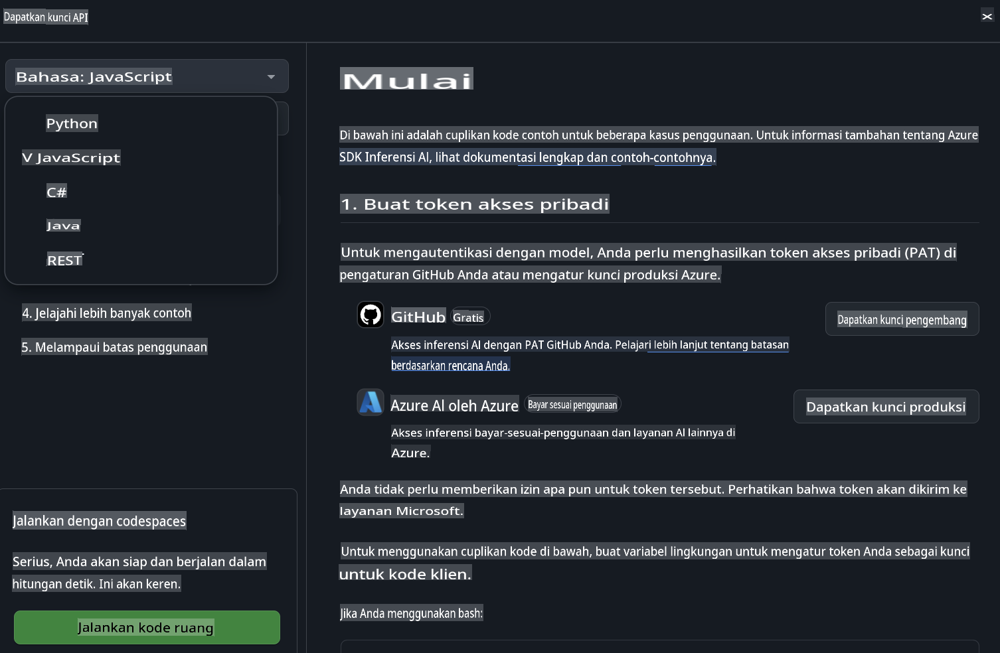
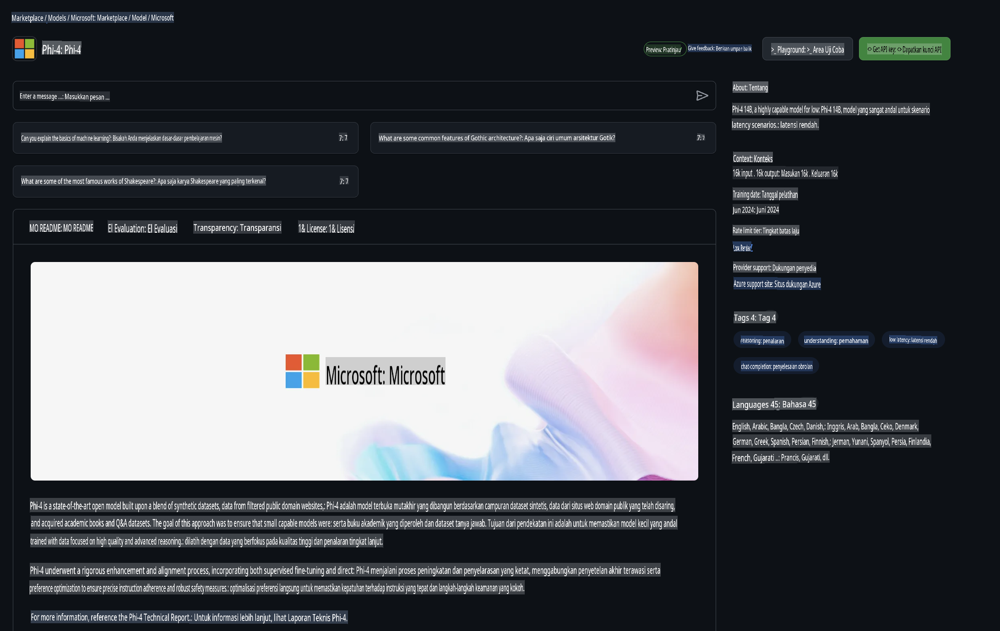

## Model GitHub - Beta Publik Terbatas

Selamat datang di [GitHub Models](https://github.com/marketplace/models)! Kami telah menyiapkan semuanya agar Anda dapat menjelajahi Model AI yang di-host di Azure AI.


Untuk informasi lebih lanjut tentang Model yang tersedia di GitHub Models, kunjungi [GitHub Model Marketplace](https://github.com/marketplace/models)

## Model yang Tersedia

Setiap model memiliki playground dan kode contoh khusus 


### Model Phi-3 dalam Katalog Model GitHub

[Phi-3-Medium-128k-Instruct](https://github.com/marketplace/models/azureml/Phi-3-medium-128k-instruct)

[Phi-3-medium-4k-instruct](https://github.com/marketplace/models/azureml/Phi-3-medium-4k-instruct)

[Phi-3-mini-128k-instruct](https://github.com/marketplace/models/azureml/Phi-3-mini-128k-instruct)

[Phi-3-mini-4k-instruct](https://github.com/marketplace/models/azureml/Phi-3-mini-4k-instruct)

[Phi-3-small-128k-instruct](https://github.com/marketplace/models/azureml/Phi-3-small-128k-instruct)

[Phi-3-small-8k-instruct](https://github.com/marketplace/models/azureml/Phi-3-small-8k-instruct)

## Memulai

Ada beberapa contoh dasar yang siap untuk dijalankan. Anda dapat menemukannya di direktori contoh. Jika Anda ingin langsung menggunakan bahasa favorit Anda, Anda dapat menemukan contohnya dalam bahasa berikut:

- Python
- JavaScript
- cURL

Terdapat juga Lingkungan Codespaces khusus untuk menjalankan contoh dan model. 




## Kode Contoh 

Berikut adalah cuplikan kode contoh untuk beberapa kasus penggunaan. Untuk informasi tambahan tentang Azure AI Inference SDK, lihat dokumentasi lengkap dan contoh-contohnya.

## Pengaturan 

1. Buat token akses pribadi
Anda tidak perlu memberikan izin apa pun pada token ini. Harap dicatat bahwa token akan dikirim ke layanan Microsoft.

Untuk menggunakan cuplikan kode di bawah ini, buat variabel lingkungan untuk mengatur token Anda sebagai kunci untuk kode klien.

Jika Anda menggunakan bash:
```
export GITHUB_TOKEN="<your-github-token-goes-here>"
```
Jika Anda menggunakan powershell:

```
$Env:GITHUB_TOKEN="<your-github-token-goes-here>"
```

Jika Anda menggunakan Windows command prompt:

```
set GITHUB_TOKEN=<your-github-token-goes-here>
```

## Contoh Python

### Instal dependensi
Instal Azure AI Inference SDK menggunakan pip (Membutuhkan: Python >=3.8):

```
pip install azure-ai-inference
```
### Jalankan contoh kode dasar

Contoh ini menunjukkan panggilan dasar ke API chat completion. Contoh ini memanfaatkan endpoint inferensi model AI GitHub dan token GitHub Anda. Panggilan ini bersifat sinkron.

```
import os
from azure.ai.inference import ChatCompletionsClient
from azure.ai.inference.models import SystemMessage, UserMessage
from azure.core.credentials import AzureKeyCredential

endpoint = "https://models.inference.ai.azure.com"
# Replace Model_Name 
model_name = "Phi-3-small-8k-instruct"
token = os.environ["GITHUB_TOKEN"]

client = ChatCompletionsClient(
    endpoint=endpoint,
    credential=AzureKeyCredential(token),
)

response = client.complete(
    messages=[
        SystemMessage(content="You are a helpful assistant."),
        UserMessage(content="What is the capital of France?"),
    ],
    model=model_name,
    temperature=1.,
    max_tokens=1000,
    top_p=1.
)

print(response.choices[0].message.content)
```

### Jalankan percakapan multi-langkah

Contoh ini menunjukkan percakapan multi-langkah dengan API chat completion. Saat menggunakan model untuk aplikasi chat, Anda perlu mengelola riwayat percakapan tersebut dan mengirimkan pesan terbaru ke model.

```
import os
from azure.ai.inference import ChatCompletionsClient
from azure.ai.inference.models import AssistantMessage, SystemMessage, UserMessage
from azure.core.credentials import AzureKeyCredential

token = os.environ["GITHUB_TOKEN"]
endpoint = "https://models.inference.ai.azure.com"
# Replace Model_Name
model_name = "Phi-3-small-8k-instruct"

client = ChatCompletionsClient(
    endpoint=endpoint,
    credential=AzureKeyCredential(token),
)

messages = [
    SystemMessage(content="You are a helpful assistant."),
    UserMessage(content="What is the capital of France?"),
    AssistantMessage(content="The capital of France is Paris."),
    UserMessage(content="What about Spain?"),
]

response = client.complete(messages=messages, model=model_name)

print(response.choices[0].message.content)
```

### Streaming output

Untuk pengalaman pengguna yang lebih baik, Anda ingin melakukan streaming respons dari model sehingga token pertama muncul lebih awal dan Anda menghindari menunggu respons yang panjang.

```
import os
from azure.ai.inference import ChatCompletionsClient
from azure.ai.inference.models import SystemMessage, UserMessage
from azure.core.credentials import AzureKeyCredential

token = os.environ["GITHUB_TOKEN"]
endpoint = "https://models.inference.ai.azure.com"
# Replace Model_Name
model_name = "Phi-3-small-8k-instruct"

client = ChatCompletionsClient(
    endpoint=endpoint,
    credential=AzureKeyCredential(token),
)

response = client.complete(
    stream=True,
    messages=[
        SystemMessage(content="You are a helpful assistant."),
        UserMessage(content="Give me 5 good reasons why I should exercise every day."),
    ],
    model=model_name,
)

for update in response:
    if update.choices:
        print(update.choices[0].delta.content or "", end="")

client.close()
```
## JavaScript 

### Instal dependensi

Instal Node.js.

Salin baris teks berikut dan simpan sebagai file package.json di dalam folder Anda.

```
{
  "type": "module",
  "dependencies": {
    "@azure-rest/ai-inference": "latest",
    "@azure/core-auth": "latest",
    "@azure/core-sse": "latest"
  }
}
```

Catatan: @azure/core-sse hanya diperlukan saat Anda melakukan streaming respons chat completions.

Buka jendela terminal di folder ini dan jalankan npm install.

Untuk setiap cuplikan kode di bawah ini, salin kontennya ke dalam file sample.js dan jalankan dengan node sample.js.

### Jalankan contoh kode dasar

Contoh ini menunjukkan panggilan dasar ke API chat completion. Contoh ini memanfaatkan endpoint inferensi model AI GitHub dan token GitHub Anda. Panggilan ini bersifat sinkron.

```
import ModelClient from "@azure-rest/ai-inference";
import { AzureKeyCredential } from "@azure/core-auth";

const token = process.env["GITHUB_TOKEN"];
const endpoint = "https://models.inference.ai.azure.com";
// Update your modelname
const modelName = "Phi-3-small-8k-instruct";

export async function main() {

  const client = new ModelClient(endpoint, new AzureKeyCredential(token));

  const response = await client.path("/chat/completions").post({
    body: {
      messages: [
        { role:"system", content: "You are a helpful assistant." },
        { role:"user", content: "What is the capital of France?" }
      ],
      model: modelName,
      temperature: 1.,
      max_tokens: 1000,
      top_p: 1.
    }
  });

  if (response.status !== "200") {
    throw response.body.error;
  }
  console.log(response.body.choices[0].message.content);
}

main().catch((err) => {
  console.error("The sample encountered an error:", err);
});
```

### Jalankan percakapan multi-langkah

Contoh ini menunjukkan percakapan multi-langkah dengan API chat completion. Saat menggunakan model untuk aplikasi chat, Anda perlu mengelola riwayat percakapan tersebut dan mengirimkan pesan terbaru ke model.

```
import ModelClient from "@azure-rest/ai-inference";
import { AzureKeyCredential } from "@azure/core-auth";

const token = process.env["GITHUB_TOKEN"];
const endpoint = "https://models.inference.ai.azure.com";
// Update your modelname
const modelName = "Phi-3-small-8k-instruct";

export async function main() {

  const client = new ModelClient(endpoint, new AzureKeyCredential(token));

  const response = await client.path("/chat/completions").post({
    body: {
      messages: [
        { role: "system", content: "You are a helpful assistant." },
        { role: "user", content: "What is the capital of France?" },
        { role: "assistant", content: "The capital of France is Paris." },
        { role: "user", content: "What about Spain?" },
      ],
      model: modelName,
    }
  });

  if (response.status !== "200") {
    throw response.body.error;
  }

  for (const choice of response.body.choices) {
    console.log(choice.message.content);
  }
}

main().catch((err) => {
  console.error("The sample encountered an error:", err);
});
```

### Streaming output
Untuk pengalaman pengguna yang lebih baik, Anda ingin melakukan streaming respons dari model sehingga token pertama muncul lebih awal dan Anda menghindari menunggu respons yang panjang.

```
import ModelClient from "@azure-rest/ai-inference";
import { AzureKeyCredential } from "@azure/core-auth";
import { createSseStream } from "@azure/core-sse";

const token = process.env["GITHUB_TOKEN"];
const endpoint = "https://models.inference.ai.azure.com";
// Update your modelname
const modelName = "Phi-3-small-8k-instruct";

export async function main() {

  const client = new ModelClient(endpoint, new AzureKeyCredential(token));

  const response = await client.path("/chat/completions").post({
    body: {
      messages: [
        { role: "system", content: "You are a helpful assistant." },
        { role: "user", content: "Give me 5 good reasons why I should exercise every day." },
      ],
      model: modelName,
      stream: true
    }
  }).asNodeStream();

  const stream = response.body;
  if (!stream) {
    throw new Error("The response stream is undefined");
  }

  if (response.status !== "200") {
    stream.destroy();
    throw new Error(`Failed to get chat completions, http operation failed with ${response.status} code`);
  }

  const sseStream = createSseStream(stream);

  for await (const event of sseStream) {
    if (event.data === "[DONE]") {
      return;
    }
    for (const choice of (JSON.parse(event.data)).choices) {
        process.stdout.write(choice.delta?.content ?? ``);
    }
  }
}

main().catch((err) => {
  console.error("The sample encountered an error:", err);
});
```

## REST 

### Jalankan contoh kode dasar

Tempelkan berikut ini ke shell:

```
curl -X POST "https://models.inference.ai.azure.com/chat/completions" \
    -H "Content-Type: application/json" \
    -H "Authorization: Bearer $GITHUB_TOKEN" \
    -d '{
        "messages": [
            {
                "role": "system",
                "content": "You are a helpful assistant."
            },
            {
                "role": "user",
                "content": "What is the capital of France?"
            }
        ],
        "model": "Phi-3-small-8k-instruct"
    }'
```
### Jalankan percakapan multi-langkah

Panggil API chat completion dan masukkan riwayat percakapan:

```
curl -X POST "https://models.inference.ai.azure.com/chat/completions" \
    -H "Content-Type: application/json" \
    -H "Authorization: Bearer $GITHUB_TOKEN" \
    -d '{
        "messages": [
            {
                "role": "system",
                "content": "You are a helpful assistant."
            },
            {
                "role": "user",
                "content": "What is the capital of France?"
            },
            {
                "role": "assistant",
                "content": "The capital of France is Paris."
            },
            {
                "role": "user",
                "content": "What about Spain?"
            }
        ],
        "model": "Phi-3-small-8k-instruct"
    }'
```
### Streaming output

Berikut adalah contoh pemanggilan endpoint dan streaming respons.

```
curl -X POST "https://models.inference.ai.azure.com/chat/completions" \
    -H "Content-Type: application/json" \
    -H "Authorization: Bearer $GITHUB_TOKEN" \
    -d '{
        "messages": [
            {
                "role": "system",
                "content": "You are a helpful assistant."
            },
            {
                "role": "user",
                "content": "Give me 5 good reasons why I should exercise every day."
            }
        ],
        "stream": true,
        "model": "Phi-3-small-8k-instruct"
    }'
```

## Penggunaan GRATIS dan Batasan untuk Model GitHub



[Batasan penggunaan gratis dan playground API](https://docs.github.com/en/github-models/prototyping-with-ai-models#rate-limits) dirancang untuk membantu Anda bereksperimen dengan model dan membuat prototipe aplikasi AI Anda. Untuk penggunaan di luar batas tersebut, dan untuk meningkatkan skala aplikasi Anda, Anda harus menyediakan sumber daya dari akun Azure, dan mengautentikasi dari sana alih-alih menggunakan token akses pribadi GitHub Anda. Anda tidak perlu mengubah apa pun dalam kode Anda. Gunakan tautan ini untuk mempelajari cara melampaui batas tingkat gratis di Azure AI.


### Pengungkapan

Ingatlah bahwa saat berinteraksi dengan model, Anda sedang bereksperimen dengan AI, sehingga kemungkinan terjadi kesalahan konten.

Fitur ini tunduk pada berbagai batasan (termasuk permintaan per menit, permintaan per hari, token per permintaan, dan permintaan bersamaan) dan tidak dirancang untuk penggunaan dalam kasus produksi.

GitHub Models menggunakan Azure AI Content Safety. Filter ini tidak dapat dimatikan sebagai bagian dari pengalaman GitHub Models. Jika Anda memutuskan untuk menggunakan model melalui layanan berbayar, harap konfigurasikan filter konten Anda agar sesuai dengan kebutuhan Anda.

Layanan ini berada di bawah Ketentuan Prarilis GitHub.

**Penafian**:  
Dokumen ini telah diterjemahkan menggunakan layanan penerjemahan berbasis AI. Meskipun kami berupaya untuk memastikan keakuratan, harap disadari bahwa terjemahan otomatis mungkin mengandung kesalahan atau ketidakakuratan. Dokumen asli dalam bahasa aslinya harus dianggap sebagai sumber yang berwenang. Untuk informasi yang bersifat kritis, disarankan untuk menggunakan jasa penerjemah manusia profesional. Kami tidak bertanggung jawab atas kesalahpahaman atau penafsiran yang salah yang timbul dari penggunaan terjemahan ini.