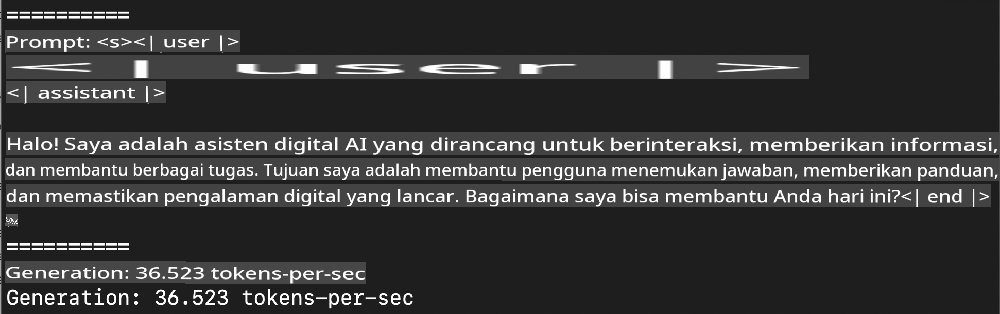
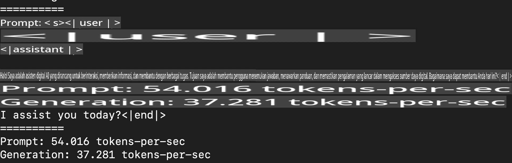
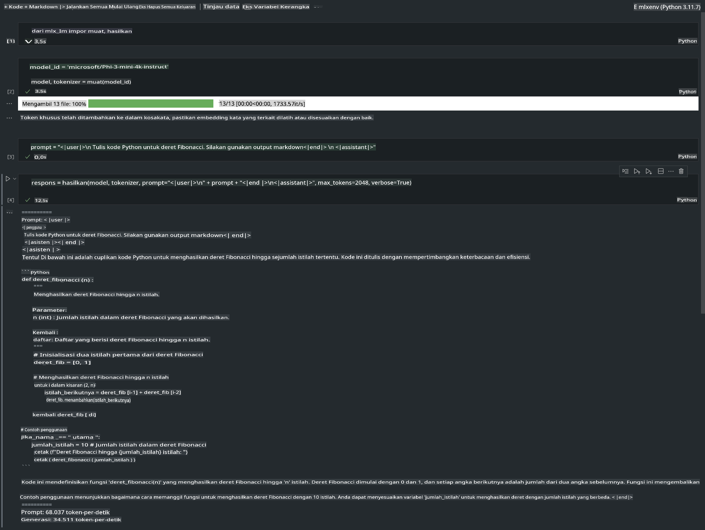

# **Inference Phi-3 dengan Kerangka Kerja Apple MLX**

## **Apa itu Kerangka Kerja MLX**

MLX adalah kerangka kerja array untuk penelitian pembelajaran mesin pada perangkat Apple silicon, dikembangkan oleh tim penelitian pembelajaran mesin Apple.

MLX dirancang oleh peneliti pembelajaran mesin untuk peneliti pembelajaran mesin. Kerangka kerja ini dimaksudkan untuk ramah pengguna, namun tetap efisien untuk melatih dan menerapkan model. Desain kerangka kerjanya juga secara konseptual sederhana. Kami bertujuan untuk memudahkan peneliti memperluas dan meningkatkan MLX dengan tujuan mengeksplorasi ide-ide baru dengan cepat.

LLM dapat dipercepat pada perangkat Apple Silicon melalui MLX, dan model dapat dijalankan secara lokal dengan sangat nyaman.

## **Menggunakan MLX untuk inference Phi-3-mini**

### **1. Siapkan lingkungan MLX Anda**

1. Python 3.11.x  
2. Instal Perpustakaan MLX  

```bash

pip install mlx-lm

```

### **2. Menjalankan Phi-3-mini di Terminal dengan MLX**

```bash

python -m mlx_lm.generate --model microsoft/Phi-3-mini-4k-instruct --max-token 2048 --prompt  "<|user|>\nCan you introduce yourself<|end|>\n<|assistant|>"

```

Hasilnya (lingkungan saya adalah Apple M1 Max, 64GB) adalah  



### **3. Mengkuantisasi Phi-3-mini dengan MLX di Terminal**

```bash

python -m mlx_lm.convert --hf-path microsoft/Phi-3-mini-4k-instruct

```

***Catatan:*** Model dapat dikuantisasi melalui mlx_lm.convert, dan kuantisasi default adalah INT4. Contoh ini mengkuantisasi Phi-3-mini menjadi INT4.  

Model dapat dikuantisasi melalui mlx_lm.convert, dan kuantisasi default adalah INT4. Contoh ini adalah mengkuantisasi Phi-3-mini menjadi INT4. Setelah dikuantisasi, model akan disimpan di direktori default ./mlx_model  

Kita dapat menguji model yang telah dikuantisasi dengan MLX dari terminal  

```bash

python -m mlx_lm.generate --model ./mlx_model/ --max-token 2048 --prompt  "<|user|>\nCan you introduce yourself<|end|>\n<|assistant|>"

```

Hasilnya adalah  



### **4. Menjalankan Phi-3-mini dengan MLX di Jupyter Notebook**



***Catatan:*** Silakan baca contoh ini [klik tautan ini](../../../../../code/03.Inference/MLX/MLX_DEMO.ipynb)

## **Sumber Daya**

1. Pelajari tentang Kerangka Kerja Apple MLX [https://ml-explore.github.io](https://ml-explore.github.io/mlx/build/html/index.html)  

2. Repositori GitHub Apple MLX [https://github.com/ml-explore](https://github.com/ml-explore)  

**Penafian**:  
Dokumen ini telah diterjemahkan menggunakan layanan terjemahan berbasis AI. Meskipun kami berupaya untuk memberikan hasil yang akurat, harap diketahui bahwa terjemahan otomatis mungkin mengandung kesalahan atau ketidakakuratan. Dokumen asli dalam bahasa aslinya harus dianggap sebagai sumber yang berwenang. Untuk informasi yang bersifat kritis, disarankan menggunakan jasa terjemahan manusia profesional. Kami tidak bertanggung jawab atas kesalahpahaman atau penafsiran yang salah yang timbul dari penggunaan terjemahan ini.