# Menyesuaikan Phi-3 dengan Azure AI Foundry

Mari kita pelajari cara menyesuaikan model bahasa Phi-3 Mini dari Microsoft menggunakan Azure AI Foundry. Penyesuaian memungkinkan Anda mengadaptasi Phi-3 Mini untuk tugas tertentu, menjadikannya lebih kuat dan memahami konteks dengan lebih baik.

## Pertimbangan

- **Kemampuan:** Model mana yang dapat disesuaikan? Apa yang dapat dilakukan oleh model dasar setelah disesuaikan?
- **Biaya:** Apa model harga untuk penyesuaian?
- **Kustomisasi:** Seberapa banyak saya dapat memodifikasi model dasar – dan dengan cara apa saja?
- **Kemudahan:** Bagaimana proses penyesuaian dilakukan – apakah saya perlu menulis kode khusus? Apakah saya perlu menyediakan komputasi sendiri?
- **Keamanan:** Model yang telah disesuaikan diketahui memiliki risiko keamanan – apakah ada langkah-langkah pengaman untuk melindungi dari dampak yang tidak diinginkan?

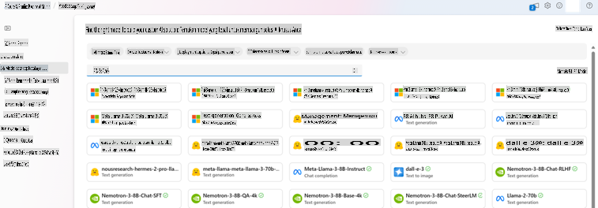

## Persiapan untuk Penyesuaian

### Prasyarat

> [!NOTE]
> Untuk model keluarga Phi-3, penawaran penyesuaian berbasis model bayar-sesuai-pemakaian hanya tersedia untuk hub yang dibuat di wilayah **East US 2**.

- Langganan Azure. Jika Anda belum memiliki langganan Azure, buat [akun Azure berbayar](https://azure.microsoft.com/pricing/purchase-options/pay-as-you-go) untuk memulai.

- Sebuah [proyek AI Foundry](https://ai.azure.com?WT.mc_id=aiml-138114-kinfeylo).
- Kontrol akses berbasis peran Azure (Azure RBAC) digunakan untuk memberikan akses ke operasi di Azure AI Foundry. Untuk melakukan langkah-langkah dalam artikel ini, akun pengguna Anda harus memiliki peran __Azure AI Developer__ pada grup sumber daya.

### Pendaftaran Penyedia Langganan

Pastikan langganan Anda terdaftar pada penyedia sumber daya `Microsoft.Network`.

1. Masuk ke [portal Azure](https://portal.azure.com).
1. Pilih **Subscriptions** dari menu sebelah kiri.
1. Pilih langganan yang ingin Anda gunakan.
1. Pilih **AI project settings** > **Resource providers** dari menu sebelah kiri.
1. Pastikan **Microsoft.Network** ada dalam daftar penyedia sumber daya. Jika tidak, tambahkan.

### Persiapan Data

Persiapkan data pelatihan dan validasi Anda untuk menyesuaikan model. Dataset pelatihan dan validasi Anda terdiri dari contoh input dan output untuk menunjukkan bagaimana Anda ingin model berperilaku.

Pastikan semua contoh pelatihan Anda mengikuti format yang diharapkan untuk inferensi. Untuk menyesuaikan model secara efektif, pastikan dataset Anda seimbang dan beragam.

Ini mencakup menjaga keseimbangan data, termasuk berbagai skenario, dan secara berkala memperbarui data pelatihan untuk mencerminkan ekspektasi dunia nyata, yang pada akhirnya menghasilkan respons model yang lebih akurat dan seimbang.

Jenis model yang berbeda memerlukan format data pelatihan yang berbeda.

### Chat Completion

Data pelatihan dan validasi yang Anda gunakan **harus** diformat sebagai dokumen JSON Lines (JSONL). Untuk `Phi-3-mini-128k-instruct`, dataset penyesuaian harus diformat dalam format percakapan yang digunakan oleh API Chat completions.

### Contoh Format File

```json
    {"messages": [{"role": "system", "content": "You are an Xbox customer support agent whose primary goal is to help users with issues they are experiencing with their Xbox devices. You are friendly and concise. You only provide factual answers to queries, and do not provide answers that are not related to Xbox."}, {"role": "user", "content": "Is Xbox better than PlayStation?"}, {"role": "assistant", "content": "I apologize, but I cannot provide personal opinions. My primary job is to assist you with any issues related to your Xbox device. Do you have any Xbox-related issues that need addressing?"}]}
    {"messages": [{"role": "system", "content": "You are an Xbox customer support agent whose primary goal is to help users with issues they are experiencing with their Xbox devices. You are friendly and concise. You only provide factual answers to queries, and do not provide answers that are not related to Xbox."}, {"role": "user", "content": "Can I play PC games on my Xbox?"}, {"role": "assistant", "content": "While Xbox consoles don't natively support PC games, they can play an array of Xbox games, many of which are also available on PC. Can I assist you with finding games compatible with your Xbox device?"}]}
    {"messages": [{"role": "system", "content": "You are an Xbox customer support agent whose primary goal is to help users with issues they are experiencing with their Xbox devices. You are friendly and concise. You only provide factual answers to queries, and do not provide answers that are not related to Xbox."}, {"role": "user", "content": "I'm having trouble connecting my Xbox to the Wi-Fi."}, {"role": "assistant", "content": "No worries, let's go through the network settings on your Xbox. Can you please tell me what happens when you try to connect it to the Wi-Fi?"}]}
```

Jenis file yang didukung adalah JSON Lines. File diunggah ke datastore default dan tersedia di proyek Anda.

## Menyesuaikan Phi-3 dengan Azure AI Foundry

Azure AI Foundry memungkinkan Anda menyesuaikan model bahasa besar dengan dataset pribadi Anda menggunakan proses yang dikenal sebagai penyesuaian. Penyesuaian memberikan nilai yang signifikan dengan memungkinkan kustomisasi dan optimisasi untuk tugas dan aplikasi tertentu. Ini menghasilkan peningkatan kinerja, efisiensi biaya, pengurangan latensi, dan output yang disesuaikan.

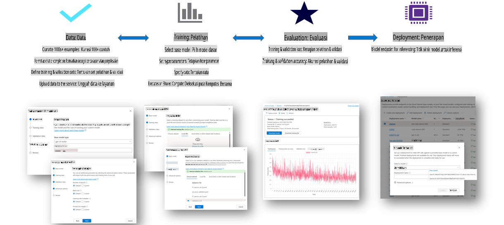

### Membuat Proyek Baru

1. Masuk ke [Azure AI Foundry](https://ai.azure.com).

1. Pilih **+New project** untuk membuat proyek baru di Azure AI Foundry.

    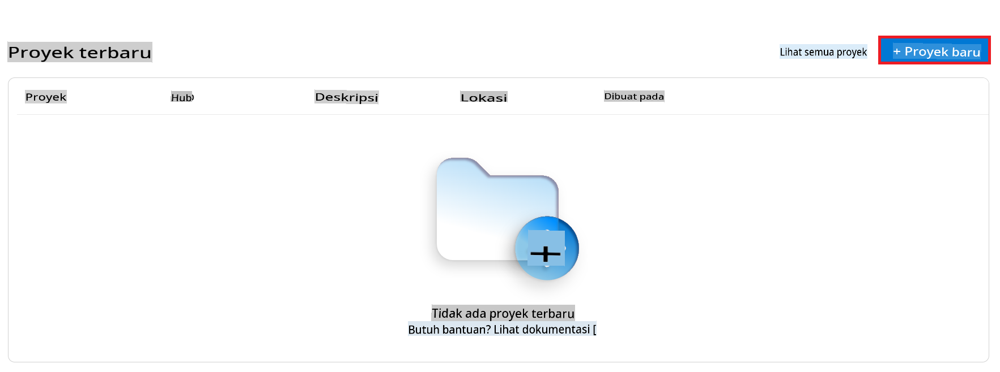

1. Lakukan tugas berikut:

    - Nama **Hub proyek**. Harus berupa nilai unik.
    - Pilih **Hub** yang ingin digunakan (buat baru jika diperlukan).

    

1. Lakukan tugas berikut untuk membuat hub baru:

    - Masukkan **Nama hub**. Harus berupa nilai unik.
    - Pilih **Langganan Azure** Anda.
    - Pilih **Grup sumber daya** yang ingin digunakan (buat baru jika diperlukan).
    - Pilih **Lokasi** yang ingin digunakan.
    - Pilih **Hubungkan Azure AI Services** yang ingin digunakan (buat baru jika diperlukan).
    - Pilih **Hubungkan Azure AI Search** ke **Lewati penghubungan**.

    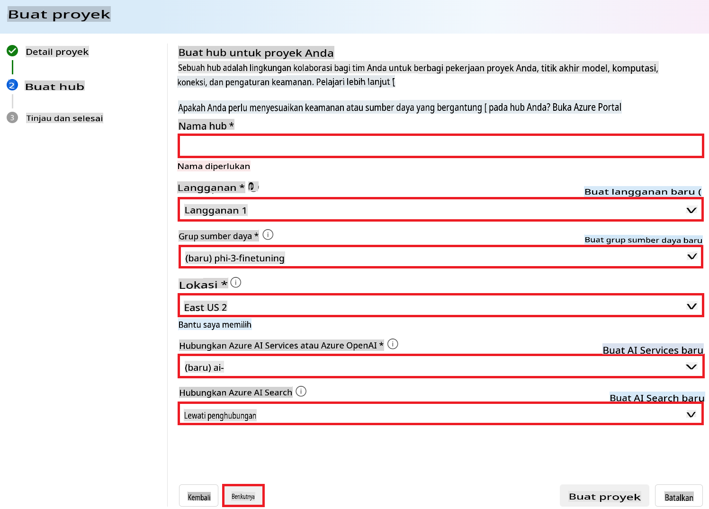

1. Pilih **Next**.
1. Pilih **Create a project**.

### Persiapan Data

Sebelum penyesuaian, kumpulkan atau buat dataset yang relevan dengan tugas Anda, seperti instruksi percakapan, pasangan pertanyaan-jawaban, atau data teks lain yang relevan. Bersihkan dan proses data ini dengan menghilangkan noise, menangani nilai yang hilang, dan melakukan tokenisasi teks.

### Menyesuaikan Model Phi-3 di Azure AI Foundry

> [!NOTE]
> Penyesuaian model Phi-3 saat ini didukung dalam proyek yang berlokasi di East US 2.

1. Pilih **Model catalog** dari tab sisi kiri.

1. Ketik *phi-3* di **bilah pencarian** dan pilih model phi-3 yang ingin Anda gunakan.

    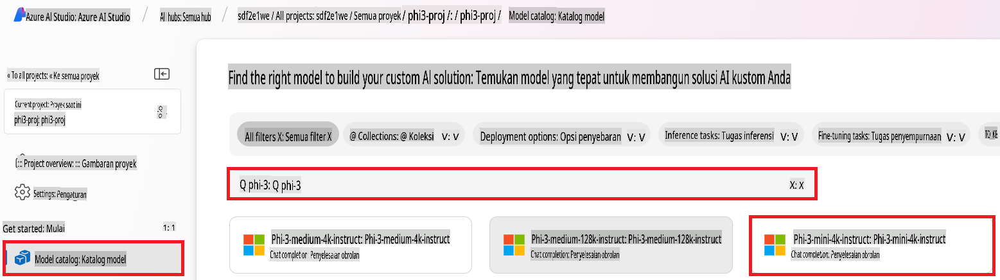

1. Pilih **Fine-tune**.

    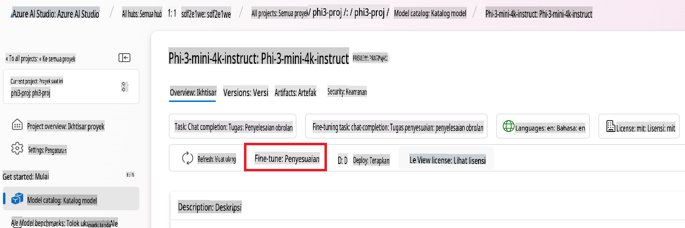

1. Masukkan **Nama model yang disesuaikan**.

    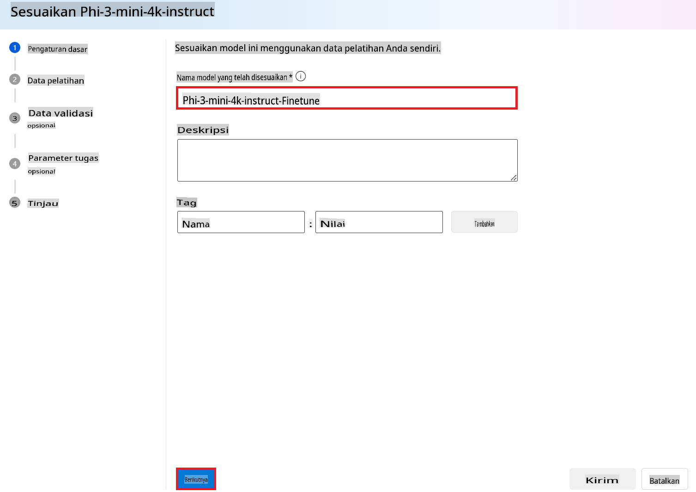

1. Pilih **Next**.

1. Lakukan tugas berikut:

    - Pilih **jenis tugas** ke **Chat completion**.
    - Pilih **Data pelatihan** yang ingin Anda gunakan. Anda dapat mengunggahnya melalui data Azure AI Foundry atau dari lingkungan lokal Anda.

    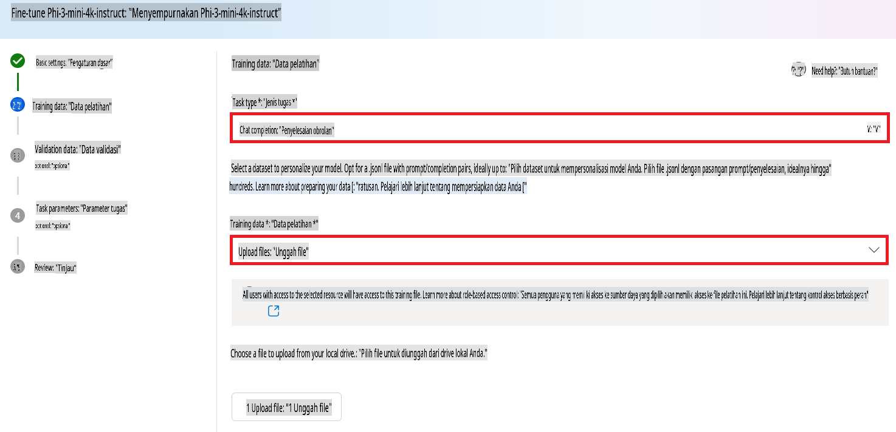

1. Pilih **Next**.

1. Unggah **Data validasi** yang ingin Anda gunakan atau pilih **Pembagian otomatis data pelatihan**.

    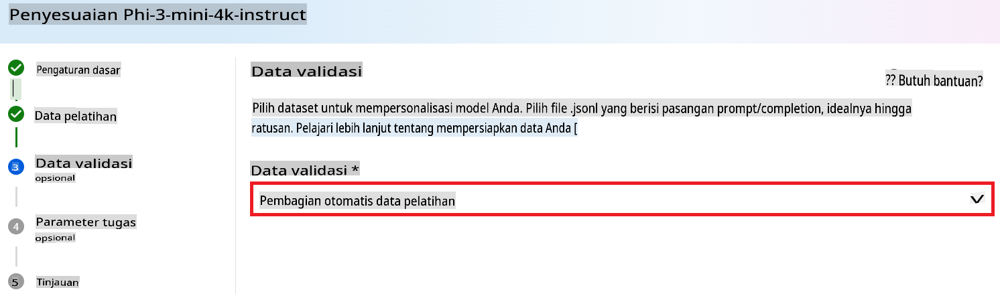

1. Pilih **Next**.

1. Lakukan tugas berikut:

    - Pilih **Pengali ukuran batch** yang ingin Anda gunakan.
    - Pilih **Tingkat pembelajaran** yang ingin Anda gunakan.
    - Pilih **Jumlah epoch** yang ingin Anda gunakan.

    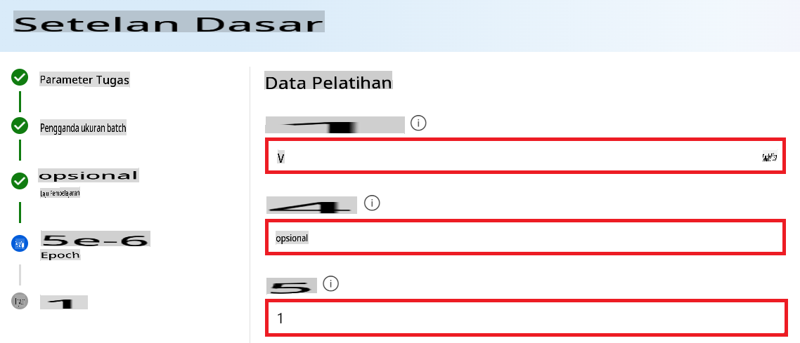

1. Pilih **Submit** untuk memulai proses penyesuaian.

    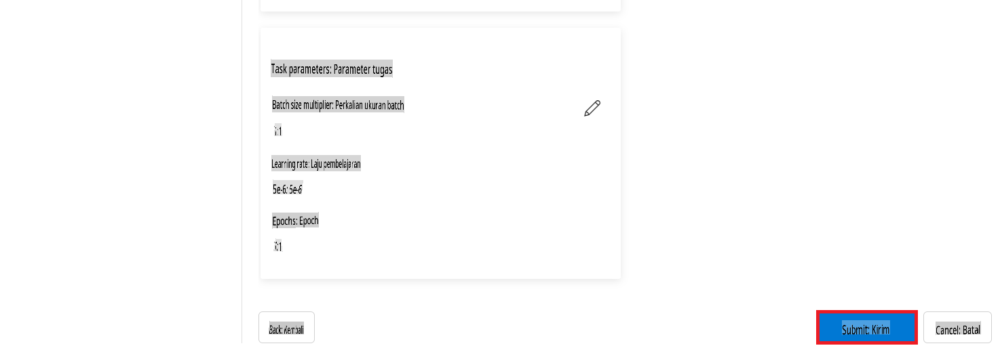

1. Setelah model Anda disesuaikan, statusnya akan ditampilkan sebagai **Completed**, seperti yang terlihat pada gambar di bawah ini. Sekarang Anda dapat menerapkan model tersebut dan menggunakannya di aplikasi Anda sendiri, di playground, atau di prompt flow. Untuk informasi lebih lanjut, lihat [Cara menerapkan keluarga model bahasa kecil Phi-3 dengan Azure AI Foundry](https://learn.microsoft.com/azure/ai-studio/how-to/deploy-models-phi-3?tabs=phi-3-5&pivots=programming-language-python).

    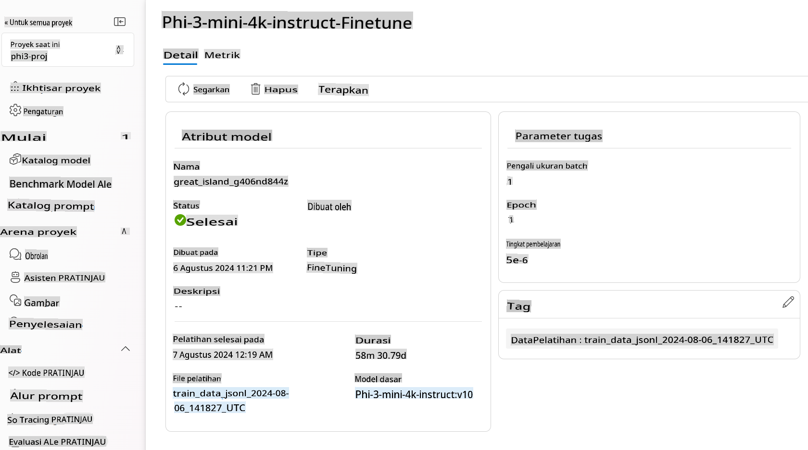

> [!NOTE]
> Untuk informasi lebih rinci tentang penyesuaian Phi-3, kunjungi [Fine-tune Phi-3 models in Azure AI Foundry](https://learn.microsoft.com/azure/ai-studio/how-to/fine-tune-phi-3?tabs=phi-3-mini).

## Membersihkan Model yang Telah Disesuaikan

Anda dapat menghapus model yang telah disesuaikan dari daftar model penyesuaian di [Azure AI Foundry](https://ai.azure.com) atau dari halaman detail model. Pilih model yang telah disesuaikan untuk dihapus dari halaman Fine-tuning, lalu pilih tombol Delete untuk menghapus model yang telah disesuaikan.

> [!NOTE]
> Anda tidak dapat menghapus model kustom jika model tersebut memiliki penerapan yang ada. Anda harus terlebih dahulu menghapus penerapan model Anda sebelum dapat menghapus model kustom Anda.

## Biaya dan Kuota

### Pertimbangan Biaya dan Kuota untuk Model Phi-3 yang Disesuaikan sebagai Layanan

Model Phi yang disesuaikan sebagai layanan ditawarkan oleh Microsoft dan terintegrasi dengan Azure AI Foundry untuk digunakan. Anda dapat menemukan informasi harga saat [menerapkan](https://learn.microsoft.com/azure/ai-studio/how-to/deploy-models-phi-3?tabs=phi-3-5&pivots=programming-language-python) atau menyesuaikan model di bawah tab Pricing and terms pada wizard penerapan.

## Penyaringan Konten

Model yang diterapkan sebagai layanan dengan bayar-sesuai-pemakaian dilindungi oleh Azure AI Content Safety. Ketika diterapkan ke endpoint real-time, Anda dapat memilih untuk menonaktifkan kemampuan ini. Dengan Azure AI content safety diaktifkan, baik prompt maupun completion melewati serangkaian model klasifikasi yang bertujuan mendeteksi dan mencegah keluaran konten berbahaya. Sistem penyaringan konten mendeteksi dan mengambil tindakan pada kategori tertentu dari konten yang berpotensi berbahaya di prompt input maupun completion output. Pelajari lebih lanjut tentang [Azure AI Content Safety](https://learn.microsoft.com/azure/ai-studio/concepts/content-filtering).

**Konfigurasi Penyesuaian**

Hyperparameter: Tentukan hyperparameter seperti tingkat pembelajaran, ukuran batch, dan jumlah epoch pelatihan.

**Fungsi Kehilangan**

Pilih fungsi kehilangan yang sesuai untuk tugas Anda (misalnya, cross-entropy).

**Optimizer**

Pilih optimizer (misalnya, Adam) untuk pembaruan gradien selama pelatihan.

**Proses Penyesuaian**

- Muat Model yang Telah Dilatih: Muat checkpoint Phi-3 Mini.
- Tambahkan Lapisan Kustom: Tambahkan lapisan spesifik tugas (misalnya, kepala klasifikasi untuk instruksi percakapan).

**Latih Model**
Sesuaikan model menggunakan dataset yang telah Anda siapkan. Pantau kemajuan pelatihan dan sesuaikan hyperparameter jika diperlukan.

**Evaluasi dan Validasi**

Set Validasi: Bagi data Anda menjadi set pelatihan dan validasi.

**Evaluasi Kinerja**

Gunakan metrik seperti akurasi, F1-score, atau perplexity untuk menilai kinerja model.

## Simpan Model yang Telah Disesuaikan

**Checkpoint**
Simpan checkpoint model yang telah disesuaikan untuk penggunaan di masa depan.

## Penerapan

- Terapkan sebagai Layanan Web: Terapkan model yang telah disesuaikan sebagai layanan web di Azure AI Foundry.
- Uji Endpoint: Kirim kueri uji ke endpoint yang diterapkan untuk memverifikasi fungsionalitasnya.

## Iterasi dan Peningkatan

Iterasi: Jika kinerjanya belum memuaskan, iterasikan dengan menyesuaikan hyperparameter, menambahkan lebih banyak data, atau menyesuaikan selama lebih banyak epoch.

## Pantau dan Perbaiki

Pantau terus perilaku model dan perbaiki sesuai kebutuhan.

## Kustomisasi dan Perluasan

Tugas Kustom: Phi-3 Mini dapat disesuaikan untuk berbagai tugas selain instruksi percakapan. Jelajahi kasus penggunaan lainnya!
Eksperimen: Coba arsitektur, kombinasi lapisan, dan teknik yang berbeda untuk meningkatkan kinerja.

> [!NOTE]
> Penyesuaian adalah proses iteratif. Bereksperimen, belajar, dan adaptasikan model Anda untuk mencapai hasil terbaik untuk tugas spesifik Anda!

**Penafian**:  
Dokumen ini telah diterjemahkan menggunakan layanan penerjemahan berbasis AI. Meskipun kami berupaya untuk mencapai akurasi, harap diketahui bahwa terjemahan otomatis mungkin mengandung kesalahan atau ketidakakuratan. Dokumen asli dalam bahasa aslinya harus dianggap sebagai sumber yang berwenang. Untuk informasi yang bersifat kritis, disarankan menggunakan penerjemahan manusia profesional. Kami tidak bertanggung jawab atas kesalahpahaman atau salah penafsiran yang timbul dari penggunaan terjemahan ini.