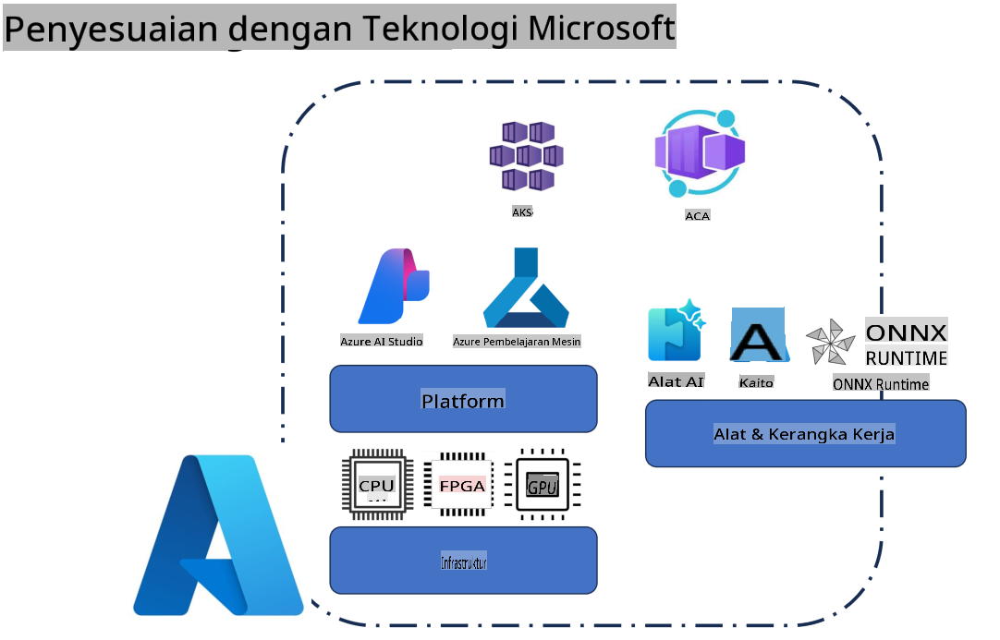
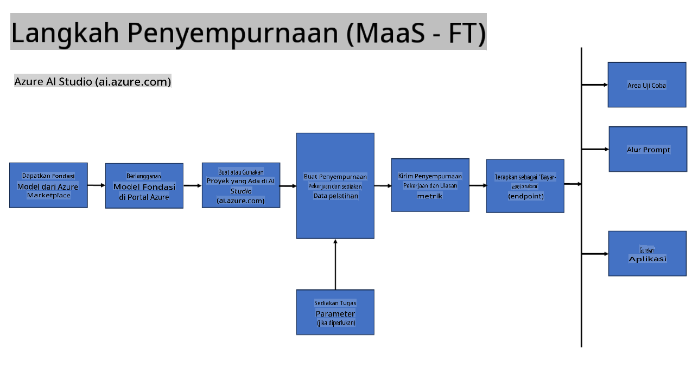
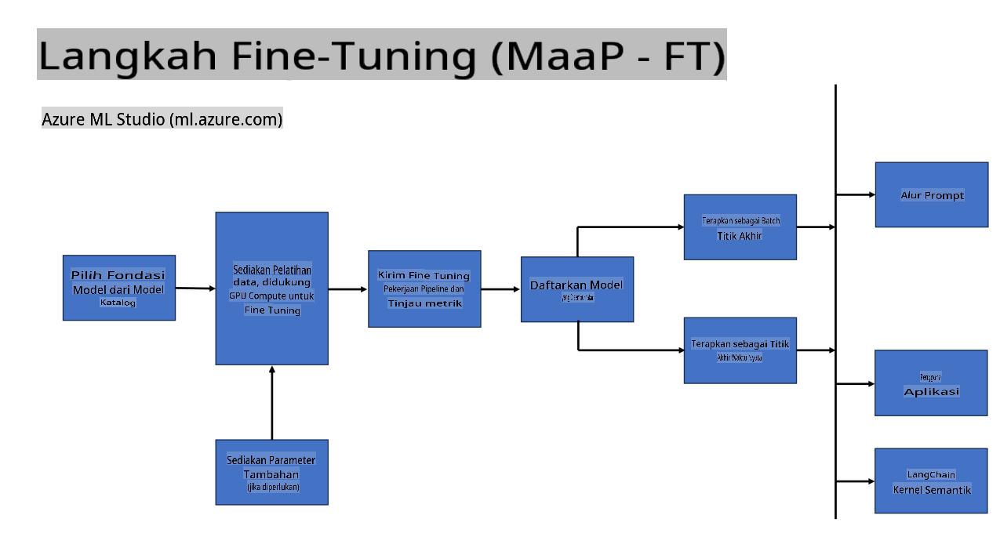
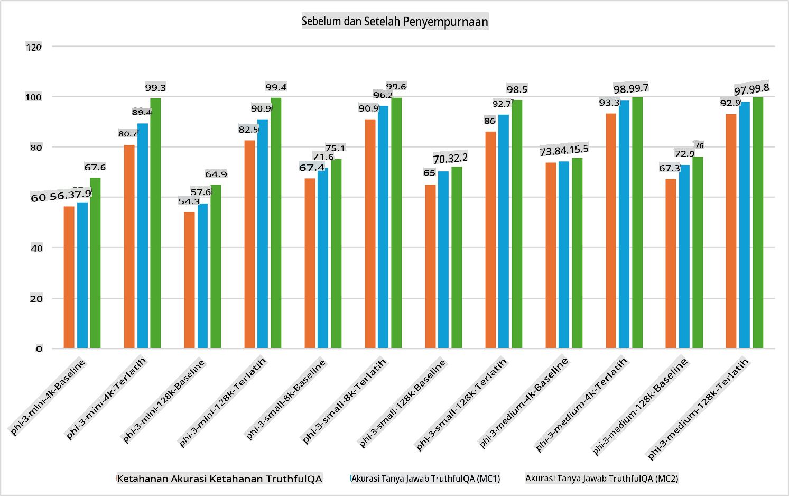

## Skenario Fine Tuning

**Platform** Ini mencakup berbagai teknologi seperti Azure AI Foundry, Azure Machine Learning, AI Tools, Kaito, dan ONNX Runtime.

**Infrastruktur** Ini mencakup CPU dan FPGA, yang penting dalam proses fine-tuning. Berikut adalah ikon untuk masing-masing teknologi ini.

**Alat & Kerangka Kerja** Ini mencakup ONNX Runtime dan ONNX Runtime. Berikut adalah ikon untuk masing-masing teknologi ini.  
[Tambahkan ikon untuk ONNX Runtime dan ONNX Runtime]

Proses fine-tuning dengan teknologi Microsoft melibatkan berbagai komponen dan alat. Dengan memahami dan memanfaatkan teknologi ini, kita dapat melakukan fine-tuning aplikasi secara efektif dan menciptakan solusi yang lebih baik.

## Model sebagai Layanan

Melakukan fine-tuning model menggunakan layanan hosted fine-tuning tanpa perlu membuat dan mengelola komputasi.

Serverless fine-tuning tersedia untuk model Phi-3-mini dan Phi-3-medium, memungkinkan pengembang untuk dengan cepat dan mudah menyesuaikan model untuk skenario cloud dan edge tanpa harus mengatur komputasi. Kami juga telah mengumumkan bahwa Phi-3-small sekarang tersedia melalui penawaran Models-as-a-Service kami sehingga pengembang dapat dengan cepat dan mudah memulai pengembangan AI tanpa harus mengelola infrastruktur dasar.

## Model sebagai Platform

Pengguna mengelola komputasi mereka sendiri untuk melakukan fine-tuning model mereka.

[Sampel Fine Tuning](https://github.com/Azure/azureml-examples/blob/main/sdk/python/foundation-models/system/finetune/chat-completion/chat-completion.ipynb)

## Skenario Fine Tuning

| | | | | | | |
|-|-|-|-|-|-|-|
|Skenario|LoRA|QLoRA|PEFT|DeepSpeed|ZeRO|DORA|
|Menyesuaikan LLM yang sudah dilatih untuk tugas atau domain tertentu|Ya|Ya|Ya|Ya|Ya|Ya|
|Fine-tuning untuk tugas NLP seperti klasifikasi teks, pengenalan entitas bernama, dan penerjemahan mesin|Ya|Ya|Ya|Ya|Ya|Ya|
|Fine-tuning untuk tugas QA|Ya|Ya|Ya|Ya|Ya|Ya|
|Fine-tuning untuk menghasilkan respons seperti manusia dalam chatbot|Ya|Ya|Ya|Ya|Ya|Ya|
|Fine-tuning untuk menghasilkan musik, seni, atau bentuk kreativitas lainnya|Ya|Ya|Ya|Ya|Ya|Ya|
|Mengurangi biaya komputasi dan finansial|Ya|Ya|Tidak|Ya|Ya|Tidak|
|Mengurangi penggunaan memori|Tidak|Ya|Tidak|Ya|Ya|Ya|
|Menggunakan lebih sedikit parameter untuk fine-tuning yang efisien|Tidak|Ya|Ya|Tidak|Tidak|Ya|
|Bentuk paralelisme data yang efisien memori yang memberikan akses ke memori GPU gabungan dari semua perangkat GPU yang tersedia|Tidak|Tidak|Tidak|Ya|Ya|Ya|

## Contoh Performa Fine Tuning

**Penafian**:  
Dokumen ini telah diterjemahkan menggunakan layanan terjemahan berbasis AI. Meskipun kami berupaya untuk memastikan akurasi, harap diketahui bahwa terjemahan otomatis mungkin mengandung kesalahan atau ketidakakuratan. Dokumen asli dalam bahasa aslinya harus dianggap sebagai sumber yang berwenang. Untuk informasi yang bersifat krusial, disarankan menggunakan layanan terjemahan manusia profesional. Kami tidak bertanggung jawab atas kesalahpahaman atau penafsiran yang keliru yang timbul dari penggunaan terjemahan ini.