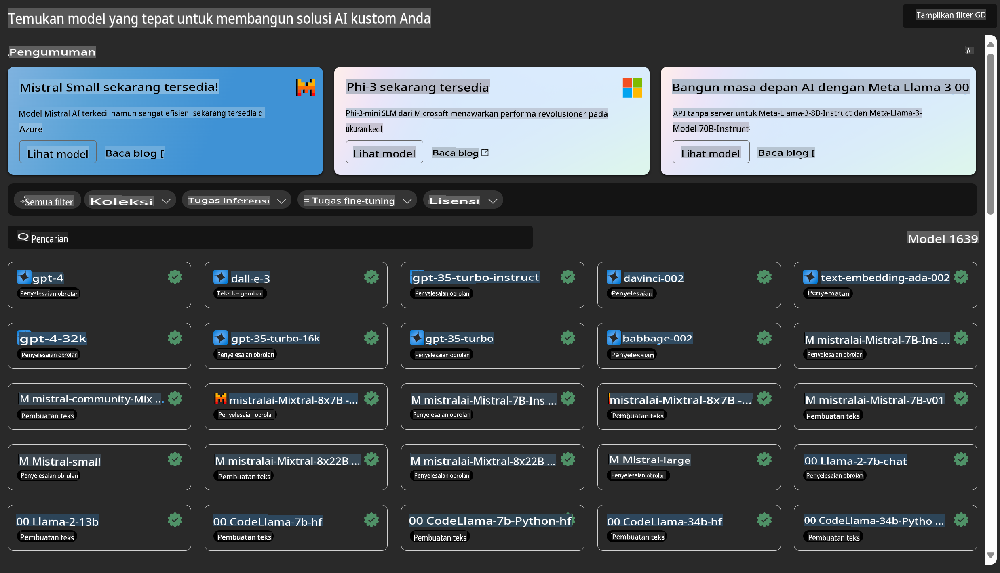

# **Memperkenalkan Azure Machine Learning Service**

[Azure Machine Learning](https://ml.azure.com?WT.mc_id=aiml-138114-kinfeylo) adalah layanan cloud untuk mempercepat dan mengelola siklus hidup proyek machine learning (ML).

Profesional ML, data scientist, dan engineer dapat menggunakannya dalam alur kerja harian mereka untuk:

- Melatih dan menerapkan model.
- Mengelola operasi machine learning (MLOps).
- Anda dapat membuat model di Azure Machine Learning atau menggunakan model yang dibuat dari platform open-source seperti PyTorch, TensorFlow, atau scikit-learn.
- Alat MLOps membantu Anda memantau, melatih ulang, dan menerapkan kembali model.

## Untuk Siapa Azure Machine Learning?

**Data Scientist dan ML Engineer**

Mereka dapat menggunakan alat untuk mempercepat dan mengotomatiskan alur kerja harian mereka.  
Azure ML menyediakan fitur untuk keadilan, keterjelasan, pelacakan, dan auditabilitas.

**Pengembang Aplikasi**

Mereka dapat mengintegrasikan model ke dalam aplikasi atau layanan dengan mudah.

**Pengembang Platform**

Mereka memiliki akses ke serangkaian alat yang kuat yang didukung oleh API Azure Resource Manager yang andal.  
Alat-alat ini memungkinkan pengembangan tooling ML yang canggih.

**Perusahaan**

Bekerja di cloud Microsoft Azure, perusahaan mendapat manfaat dari keamanan yang sudah dikenal dan kontrol akses berbasis peran.  
Siapkan proyek untuk mengontrol akses ke data yang dilindungi dan operasi tertentu.

## Produktivitas untuk Semua Anggota Tim
Proyek ML sering kali membutuhkan tim dengan berbagai keahlian untuk membangun dan memeliharanya.

Azure ML menyediakan alat yang memungkinkan Anda untuk:
- Berkolaborasi dengan tim Anda melalui notebook bersama, sumber daya komputasi, komputasi tanpa server, data, dan lingkungan.
- Mengembangkan model dengan keadilan, keterjelasan, pelacakan, dan auditabilitas untuk memenuhi persyaratan kepatuhan silsilah dan audit.
- Menerapkan model ML dengan cepat dan mudah dalam skala besar, serta mengelola dan mengawasinya secara efisien dengan MLOps.
- Menjalankan beban kerja machine learning di mana saja dengan tata kelola, keamanan, dan kepatuhan bawaan.

## Alat Platform yang Kompatibel Lintas Fungsi

Siapa pun dalam tim ML dapat menggunakan alat pilihan mereka untuk menyelesaikan pekerjaan.  
Baik Anda menjalankan eksperimen cepat, tuning hyperparameter, membangun pipeline, atau mengelola inferensi, Anda dapat menggunakan antarmuka yang sudah dikenal termasuk:
- Azure Machine Learning Studio
- Python SDK (v2)
- Azure CLI (v2)
- Azure Resource Manager REST APIs

Saat Anda menyempurnakan model dan berkolaborasi selama siklus pengembangan, Anda dapat berbagi dan menemukan aset, sumber daya, dan metrik dalam antarmuka Azure Machine Learning studio.

## **LLM/SLM di Azure ML**

Azure ML telah menambahkan banyak fungsi terkait LLM/SLM, menggabungkan LLMOps dan SLMOps untuk menciptakan platform teknologi kecerdasan buatan generatif untuk skala perusahaan.

### **Model Catalog**

Pengguna perusahaan dapat menerapkan berbagai model sesuai dengan skenario bisnis yang berbeda melalui Model Catalog, dan menyediakan layanan sebagai Model as Service untuk diakses oleh pengembang atau pengguna perusahaan.

Model Catalog di Azure Machine Learning studio adalah pusat untuk menemukan dan menggunakan berbagai model yang memungkinkan Anda membangun aplikasi Generative AI. Model Catalog menampilkan ratusan model dari penyedia model seperti Azure OpenAI service, Mistral, Meta, Cohere, Nvidia, Hugging Face, termasuk model yang dilatih oleh Microsoft. Model dari penyedia selain Microsoft adalah Produk Non-Microsoft, sebagaimana didefinisikan dalam Ketentuan Produk Microsoft, dan tunduk pada ketentuan yang disediakan bersama model tersebut.

### **Job Pipeline**

Inti dari pipeline machine learning adalah membagi tugas machine learning yang lengkap menjadi alur kerja multi-langkah. Setiap langkah adalah komponen yang dapat dikelola yang dapat dikembangkan, dioptimalkan, dikonfigurasi, dan diotomatisasi secara individual. Langkah-langkah tersebut dihubungkan melalui antarmuka yang terdefinisi dengan baik. Layanan pipeline Azure Machine Learning secara otomatis mengorkestrasi semua dependensi antar langkah pipeline.

Dalam fine-tuning SLM / LLM, kita dapat mengelola data, pelatihan, dan proses generasi kita melalui Pipeline.

### **Prompt flow**

**Manfaat menggunakan Azure Machine Learning prompt flow**  
Azure Machine Learning prompt flow menawarkan berbagai manfaat yang membantu pengguna beralih dari ideasi ke eksperimen, dan akhirnya ke aplikasi berbasis LLM yang siap produksi:

**Kelincahan dalam rekayasa prompt**

- Pengalaman penulisan interaktif: Azure Machine Learning prompt flow menyediakan representasi visual dari struktur alur, memungkinkan pengguna untuk dengan mudah memahami dan menavigasi proyek mereka. Ini juga menawarkan pengalaman coding seperti notebook untuk pengembangan dan debugging alur yang efisien.
- Variasi untuk tuning prompt: Pengguna dapat membuat dan membandingkan beberapa varian prompt, memfasilitasi proses penyempurnaan iteratif.
- Evaluasi: Alur evaluasi bawaan memungkinkan pengguna untuk menilai kualitas dan efektivitas prompt dan alur mereka.
- Sumber daya yang komprehensif: Azure Machine Learning prompt flow mencakup pustaka alat, sampel, dan template bawaan yang berfungsi sebagai titik awal untuk pengembangan, menginspirasi kreativitas, dan mempercepat proses.

**Kesiapan perusahaan untuk aplikasi berbasis LLM**

- Kolaborasi: Azure Machine Learning prompt flow mendukung kolaborasi tim, memungkinkan beberapa pengguna bekerja bersama dalam proyek rekayasa prompt, berbagi pengetahuan, dan menjaga kontrol versi.
- Platform all-in-one: Azure Machine Learning prompt flow menyederhanakan seluruh proses rekayasa prompt, mulai dari pengembangan dan evaluasi hingga penerapan dan pemantauan. Pengguna dapat dengan mudah menerapkan alur mereka sebagai endpoint Azure Machine Learning dan memantau kinerjanya secara real-time, memastikan operasi yang optimal dan peningkatan berkelanjutan.
- Solusi Kesiapan Perusahaan Azure Machine Learning: Prompt flow memanfaatkan solusi kesiapan perusahaan Azure Machine Learning yang kuat, menyediakan fondasi yang aman, skalabel, dan andal untuk pengembangan, eksperimen, dan penerapan alur.

Dengan Azure Machine Learning prompt flow, pengguna dapat memanfaatkan kelincahan rekayasa prompt mereka, berkolaborasi secara efektif, dan menggunakan solusi kelas perusahaan untuk pengembangan dan penerapan aplikasi berbasis LLM yang sukses.

Menggabungkan kekuatan komputasi, data, dan berbagai komponen Azure ML, pengembang perusahaan dapat dengan mudah membangun aplikasi kecerdasan buatan mereka sendiri.

**Penafian**:  
Dokumen ini telah diterjemahkan menggunakan layanan terjemahan berbasis AI. Meskipun kami berusaha untuk mencapai akurasi, harap diketahui bahwa terjemahan otomatis mungkin mengandung kesalahan atau ketidakakuratan. Dokumen asli dalam bahasa aslinya harus dianggap sebagai sumber yang berwenang. Untuk informasi yang bersifat krusial, disarankan untuk menggunakan layanan terjemahan manusia profesional. Kami tidak bertanggung jawab atas kesalahpahaman atau salah tafsir yang timbul dari penggunaan terjemahan ini.