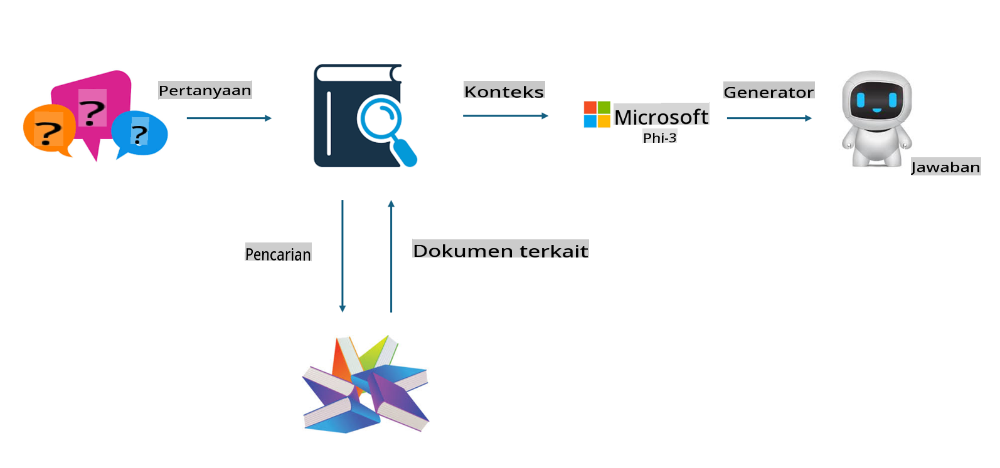
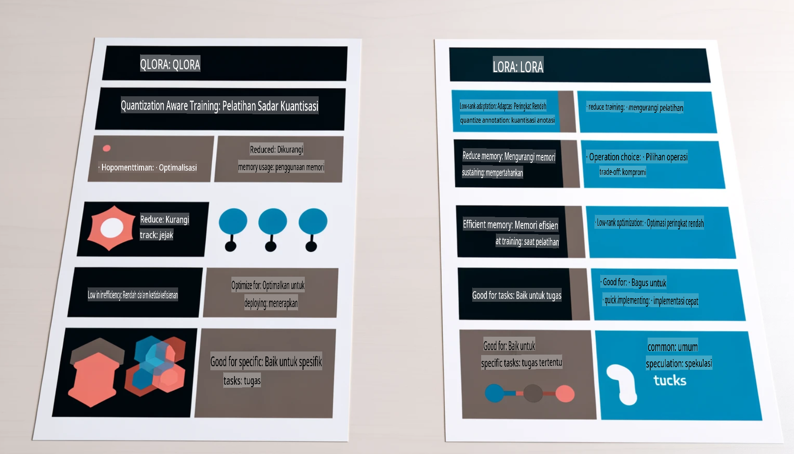

# **Biarkan Phi-3 Menjadi Ahli Industri**

Untuk menerapkan model Phi-3 ke dalam sebuah industri, Anda perlu menambahkan data bisnis industri ke dalam model Phi-3. Kami memiliki dua opsi berbeda, yaitu RAG (Retrieval Augmented Generation) dan Fine Tuning.

## **RAG vs Fine-Tuning**

### **Retrieval Augmented Generation**

RAG adalah pengambilan data + pembuatan teks. Data terstruktur dan tidak terstruktur dari perusahaan disimpan dalam basis data vektor. Saat mencari konten yang relevan, ringkasan dan konten terkait ditemukan untuk membentuk konteks, dan kemampuan penyelesaian teks dari LLM/SLM digabungkan untuk menghasilkan konten.

### **Fine-tuning**

Fine-tuning adalah peningkatan berdasarkan model tertentu. Anda tidak perlu memulai dari algoritma model, tetapi data perlu terus dikumpulkan. Jika Anda menginginkan terminologi yang lebih akurat dan ekspresi bahasa yang spesifik dalam aplikasi industri, fine-tuning adalah pilihan yang lebih baik. Namun, jika data Anda sering berubah, fine-tuning bisa menjadi rumit.

### **Cara Memilih**

1. Jika jawaban kita membutuhkan pengenalan data eksternal, RAG adalah pilihan terbaik.

2. Jika Anda perlu menghasilkan pengetahuan industri yang stabil dan akurat, fine-tuning akan menjadi pilihan yang baik. RAG lebih mengutamakan penarikan konten yang relevan tetapi mungkin tidak selalu tepat dalam menangkap nuansa khusus.

3. Fine-tuning membutuhkan kumpulan data berkualitas tinggi, dan jika hanya untuk data dalam cakupan kecil, hasilnya tidak akan terlalu signifikan. RAG lebih fleksibel.

4. Fine-tuning adalah kotak hitam, suatu metafisika, dan sulit untuk memahami mekanisme internalnya. Namun, RAG dapat mempermudah menemukan sumber data, sehingga efektif dalam mengatasi halusinasi atau kesalahan konten dan memberikan transparansi yang lebih baik.

### **Skenario**

1. Industri vertikal yang membutuhkan kosakata dan ekspresi profesional tertentu, ***Fine-tuning*** adalah pilihan terbaik.

2. Sistem QA, yang melibatkan sintesis berbagai poin pengetahuan, ***RAG*** adalah pilihan terbaik.

3. Kombinasi alur bisnis otomatis ***RAG + Fine-tuning*** adalah pilihan terbaik.

## **Cara Menggunakan RAG**

Basis data vektor adalah kumpulan data yang disimpan dalam bentuk matematika. Basis data vektor mempermudah model pembelajaran mesin untuk mengingat masukan sebelumnya, memungkinkan pembelajaran mesin digunakan untuk mendukung kasus penggunaan seperti pencarian, rekomendasi, dan pembuatan teks. Data dapat diidentifikasi berdasarkan metrik kesamaan daripada kecocokan persis, memungkinkan model komputer memahami konteks data.

Basis data vektor adalah kunci untuk mewujudkan RAG. Kita dapat mengonversi data menjadi penyimpanan vektor melalui model vektor seperti text-embedding-3, jina-ai-embedding, dll.

Pelajari lebih lanjut tentang membuat aplikasi RAG [https://github.com/microsoft/Phi-3CookBook](https://github.com/microsoft/Phi-3CookBook?WT.mc_id=aiml-138114-kinfeylo)

## **Cara Menggunakan Fine-tuning**

Algoritma yang umum digunakan dalam Fine-tuning adalah Lora dan QLora. Bagaimana cara memilih?
- [Pelajari Lebih Lanjut dengan notebook contoh ini](../../../../code/04.Finetuning/Phi_3_Inference_Finetuning.ipynb)
- [Contoh Python FineTuning Sample](../../../../code/04.Finetuning/FineTrainingScript.py)

### **Lora dan QLora**

LoRA (Low-Rank Adaptation) dan QLoRA (Quantized Low-Rank Adaptation) adalah teknik yang digunakan untuk fine-tuning model bahasa besar (LLMs) menggunakan Parameter Efficient Fine Tuning (PEFT). Teknik PEFT dirancang untuk melatih model lebih efisien dibandingkan metode tradisional.  
LoRA adalah teknik fine-tuning mandiri yang mengurangi penggunaan memori dengan menerapkan pendekatan peringkat rendah pada matriks pembaruan bobot. Teknik ini menawarkan waktu pelatihan yang cepat dan mempertahankan kinerja yang hampir setara dengan metode fine-tuning tradisional.

QLoRA adalah versi lanjutan dari LoRA yang menggabungkan teknik kuantisasi untuk lebih mengurangi penggunaan memori. QLoRA mengkuantisasi presisi parameter bobot dalam LLM yang telah dilatih sebelumnya ke presisi 4-bit, yang lebih hemat memori dibandingkan LoRA. Namun, pelatihan QLoRA sekitar 30% lebih lambat daripada pelatihan LoRA karena adanya langkah tambahan kuantisasi dan dekuantisasi.

QLoRA menggunakan LoRA sebagai pelengkap untuk memperbaiki kesalahan yang diperkenalkan selama proses kuantisasi. QLoRA memungkinkan fine-tuning model besar dengan miliaran parameter menggunakan GPU yang relatif kecil dan mudah diakses. Sebagai contoh, QLoRA dapat melakukan fine-tuning model dengan 70 miliar parameter yang biasanya membutuhkan 36 GPU hanya dengan 2 GPU.

**Penafian**:  
Dokumen ini telah diterjemahkan menggunakan layanan penerjemahan berbasis AI. Meskipun kami berupaya untuk memastikan akurasi, harap diketahui bahwa terjemahan otomatis mungkin mengandung kesalahan atau ketidakakuratan. Dokumen asli dalam bahasa aslinya harus dianggap sebagai sumber yang berwenang. Untuk informasi yang bersifat kritis, disarankan menggunakan penerjemahan manusia profesional. Kami tidak bertanggung jawab atas kesalahpahaman atau penafsiran yang keliru yang timbul dari penggunaan terjemahan ini.